# Brokenswap

_"people said i was broke so i funded Brokenswap"_

> Date: 10<sup>th</sup> May 2024 \
Challenge Author: <font color=#1E9F9A>perrythepwner</font> \
Difficulty: <font color=yellow>Easy/Medium</font> \
Category: <font color=orange> Blockchain</font>

# TL;DR

- The challenge consist in finding a way to steal funds from a Decentralized Exchange (DEX). The DEX relies con the *Constant Product Formula* to calculate prices of the assets and it's possible to cause an imbalance in the pool (and therefore make profitable trades) calling the `_moveAmountToFeesPool()` - incorrectly marked with the modifier `public` instead of `internal` - to move arbitrary tokens out of the liquidity pool.

# Description

- Legend has it that a long time ago, a mysterious tech-wizard from Vault 13 crafted this DEX to ensure that only those flush with WETH tokens could wield power in the wasteland's élite circles. Entry costs 15 WETH, and we're fresh out. All we have left are a few ETH salvaged from previous challenges, but no wastelander has ever managed to scavenge any WETH. It's been ages, and WETH is nowhere to be found except in the depths of this DEX, which seems unbreakable...

# Skills Required

- Smart contract interaction.
  
# Skills Learned

- DEXes fundamentals: Liquidity Pools, Trading Pairs, `x*y = k` formula.
- DEXes security: Liquidity Pools imbalance, Access Control vulnerabilities.

# Enumeration

## Challenge background

In the wild world of DeFi, with an ever-increasing number of users, protocols, circulating liquidity, security has become more important than ever.  
Sometimes, indeed often, people and developers tend to make trivial mistakes.  
It happens.
After all, we all are human.  
But for this reason it becomes essential to have the code audited several times and by different sources before deploying it.  
And if someone don't have sufficient funds, they can always resort to using well-known and well-audited external libraries.

This real-world challenge takes inspiration from the recent **LeetSwap hack** that occurred on August 1, 2023 causing a **loss of 340 ETH (approximately $624,000 at the time) due to an Access Control vulnerability** in the `_transferFeesSupportingTaxTokens()` function which was intended to be an `internal` function (note the trailing underscore) but was `public` modifier incorrectly assigned. Read more [here](https://medium.com/coinmonks/leetswap-hack-analysis-81323527b3f7).  
An oversight worth more than half a million dollars.  
Players in this challenge will go through all the basic concepts of the functioning of Smart contracts, ERC 20, DEXes, Constant Product Formula etc, thanks to the documentation provided in the frontend of the challenge.  
Then, once assimilated the concepts (considering that the target audience is beginner-level) and understood what an interesting attack vector could be - e.g. causing an imbalance in the liquidity pool - they'll solve the challenge by exploiting the public (rather than internal) function `_moveAmountToFeesPool()`.

## Challenge scenario

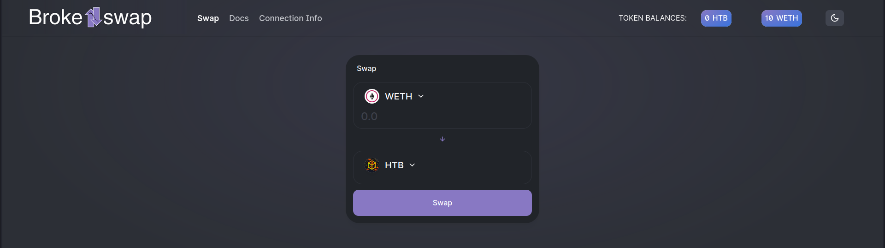

There are `swap`, `docs` and `connection` routes in the frontend. Players also have the Challenge Handler and the source code of the Smart Contracts available.

### Docs

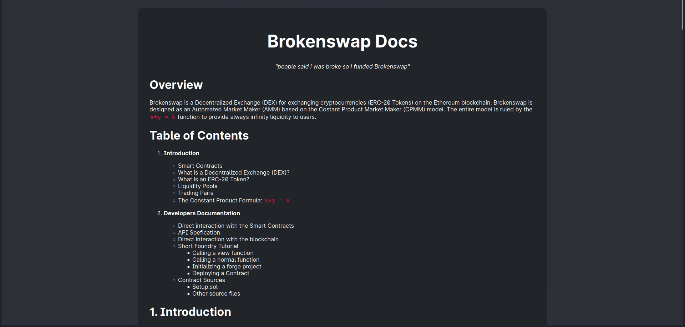
On this page players will have all the necessary information and concepts to solve the challenge, in case they don't know them.
This is done to provide a clear path to the player, without risking ending up in long searches or unnecessary rabbit holes.
Furthermore key aspects are highlighted, to give some hints:

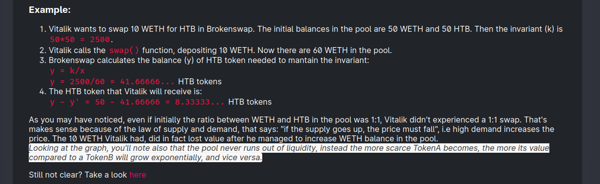

### Swap

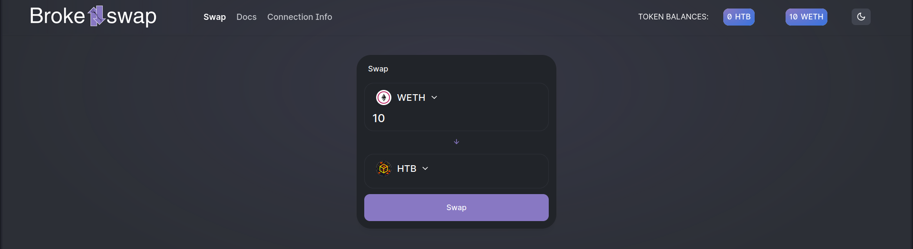
This is the page where you can swap and see the token balances.

> **_NOTE:_** 
> This UI is working and was made to make the challenge less abstract and/or insidious. However, with only frontend interaction it is not possible to solve the challenge. Players are thus forced to understand how to interact with the smart contract to use all the functions available and exploit the DEX.
### Connection

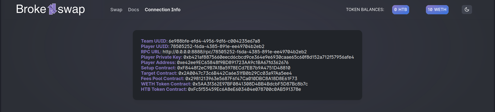
Connection info also accessible via the Challenge Handler.

### Challenge Handler
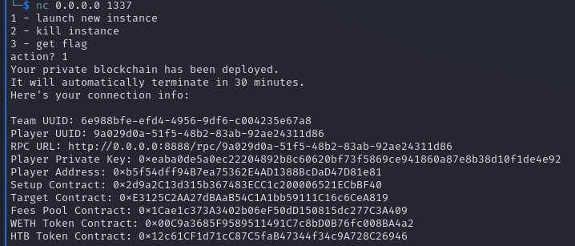

Since this challenge was built on top of the [Paradigm 2022 CTF infrastructure](https://github.com/paradigmxyz/paradigm-ctf-infrastructure), it's available to player the Challenge Handler to Start a new instance of the challenge, Kill it, or Get the flag if condition are satisfied.

### Setup.sol
This is the setup contract used to deploy challenge contracts and check if solution condition are satisfied.
Players starts with `10 WETH` and to solve the challenge they have to manage to steal some from the Brokenswap contract. 

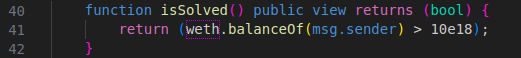
### Brokenswap.sol
This is the code where all the DEX logics happens.

```solidity
// SPDX-License-Identifier: UNLICENSED
pragma solidity ^0.8.20;

import "@openzeppelin/contracts/token/ERC20/IERC20.sol";
import "@openzeppelin/contracts/token/ERC20/ERC20.sol";
import "@openzeppelin/contracts/token/ERC20/utils/SafeERC20.sol";

/// @title Brokenswap, "people said i was broke so i funded Brokenswap".
/// @notice AMM decentralized exchange (DEX) for swapping supported tokens with a fee mechanism.
contract Brokenswap {
    using SafeERC20 for IERC20;

    uint256 public INVARIANT; // The product (k) of the two token balances (x and y), given by: x*y=k.
    uint256 public immutable FEERATE; // The fee rate, expressed as a percentage (e.g., 5 for 0.5%).
    address public immutable feesPool; // The address where fees are collected.
    mapping(address => bool) public supportedTokens; // Mapping of supported tokens.
    
    event Swap(
        uint256 indexed inputAmount,
        uint256 indexed outputAmount,
        uint256 indexed fees
    );

    /// @notice Constructor to initialize the Brokenswap contract.
    /// @param tokenA The address of the first supported token.
    /// @param tokenB The address of the second supported token.
    /// @param feeRate The fee rate, expressed as a percentage (e.g., 5 for 0.5%).
    /// @param feesPoolAddress The address where fees are collected.
    constructor (address tokenA, address tokenB, uint256 feeRate, address feesPoolAddress) payable {
        FEERATE = (feeRate > 5) ? feeRate : 5; // Ensure the fee rate is at least 0.5%.
        feesPool = feesPoolAddress;
        supportedTokens[tokenA] = true;
        supportedTokens[tokenB] = true;
    }

    /// @notice Swaps one supported token for another.
    /// @param inputToken The address of the token we're swapping from.
    /// @param outputToken The address of the output token we're swapping to.
    /// @param inputAmount The amount of input token to swap, in 18 decimals. e.g inputAmount=1e18 to swap 1 token.
    /// @return A boolean indicating the success of the swap.
    function swap(address inputToken, address outputToken, uint256 inputAmount) public returns (bool) {
        // Check if the tokens are supported.
        require(supportedTokens[inputToken] == true && supportedTokens[outputToken] == true, "Token not supported");
        IERC20 inToken = IERC20(inputToken);
        IERC20 outToken = IERC20(outputToken);
        
        // Calculate the invariant before any transaction.
        INVARIANT = inToken.balanceOf(address(this)) * outToken.balanceOf(address(this));
        
        // Check if the user has allowed the contract to transfer the input amount.
        require(inToken.allowance(msg.sender, address(this)) >= inputAmount, "You must approve transfer first");
        
        // Depositing the input token amount from user into the contract.
        inToken.safeTransferFrom(msg.sender, address(this), inputAmount);
        
        // Deduct fees on the input token.
        uint256 fees = (inputAmount * FEERATE) / 1000;
        
        // Move swap fee to the fees pool.
        _moveAmountToFeesPool(address(inToken), fees); 
        
        // Calculate the output token amount to send to the user.
        uint256 _outputAmount = calcOutputAmount(address(inToken), address(outToken));
        
        // Transfer the output amount from contract to the user.
        outToken.safeTransfer(msg.sender, _outputAmount);
        
        // Emit the Swap event to log the transaction.
        emit Swap(inputAmount, _outputAmount, fees);
        
        return true;
    }

    /// @notice Internal function to move a specified amount of token to the fees pool.
    /// @param payingToken The address of the token used to pay fees.
    /// @param amount The amount to move to the fees pool.
    /// @return A boolean indicating the success of the transfer.
    function _moveAmountToFeesPool(address payingToken, uint256 amount) public returns (bool) {
        require(supportedTokens[payingToken] == true, "Token not supported");
        IERC20(payingToken).safeTransfer(feesPool, amount);
        return true;
    }

    /// @notice Calculate the output amount for a given input and output token pair.
    /// @param inputToken The address of the input token.
    /// @param outputToken The address of the output token.
    /// @return The calculated output amount.
    function calcOutputAmount(address inputToken, address outputToken) public view returns (uint256) {
        require(supportedTokens[inputToken] == true && supportedTokens[outputToken] == true, "Token not supported");
        uint256 balanceInToken = IERC20(inputToken).balanceOf(address(this));
        uint256 balanceOutToken = IERC20(outputToken).balanceOf(address(this));
        
        // Calculate the new output amount based on the invariant.
        uint256 newBalanceOutToken = INVARIANT / balanceInToken;
        return (balanceOutToken - newBalanceOutToken);
    }

    /// @notice Get the balance of a supported token held by the contract.
    /// @param token The address of the supported token.
    /// @return The balance of the token held by the contract.
    function balanceOfToken(address token) public view returns (uint256) {
        require(supportedTokens[token] == true, "Token not supported");
        return IERC20(token).balanceOf(address(this));
    }
}

```

The code is richly commented on every line and functionality, with the integration of the documentation it's almost immediate to understand how it works.
### FeesPool.sol

```solidity
// SPDX-License-Identifier: UNLICENSED
pragma solidity ^0.8.20;

import "@openzeppelin/contracts/token/ERC20/IERC20.sol";
import "@openzeppelin/contracts/token/ERC20/utils/SafeERC20.sol";
import "@openzeppelin/contracts/access/Ownable.sol";

/// @title FeesPool, collect and withdraw fees of swaps.
/// @notice This contract allows the owner to manage and withdraw fees collected in supported tokens.
contract FeesPool is Ownable {
    using SafeERC20 for IERC20;

    IERC20 public immutable tokenA; // The first supported token.
    IERC20 public immutable tokenB; // The second supported token.

    event FeesCollected(IERC20 token, uint256 amount, address indexed collector);
    event FeesWithdrawn(IERC20 token, uint256 amount, address indexed recipient);

    /// @notice Constructor to initialize the FeesPool contract.
    /// @param _tokenA The address of the first supported token.
    /// @param _tokenB The address of the second supported token.
    constructor(address _tokenA, address _tokenB) Ownable(msg.sender) {
        tokenA = IERC20(_tokenA);
        tokenB = IERC20(_tokenB);
    }

    /// @notice Withdraw collected fees in tokenA.
    /// @param amount The amount of tokenA to withdraw.
    function withdrawFeesTokenA(uint256 amount) public onlyOwner {
        require(amount > 0, "Invalid withdrawal amount");
        tokenA.safeTransfer(msg.sender, amount);
        emit FeesWithdrawn(tokenA, amount, msg.sender);
    }

    /// @notice Withdraw collected fees in tokenB.
    /// @param amount The amount of tokenB to withdraw.
    function withdrawFeesTokenB(uint256 amount) public onlyOwner {
        require(amount > 0, "Invalid withdrawal amount");
        tokenB.safeTransfer(msg.sender, amount);
        emit FeesWithdrawn(tokenB, amount, msg.sender);
    }

    /// @notice Get the balance of tokenA held by the contract.
    /// @return The balance of tokenA held by the contract.
    function balanceTokenA() public view returns (uint256) {
        return tokenA.balanceOf(address(this));
    }

    /// @notice Get the balance of tokenB held by the contract.
    /// @return The balance of tokenB held by the contract.
    function balanceTokenB() public view returns (uint256) {
        return tokenB.balanceOf(address(this));
    }
}
```

The FeesPool contract is the responsibile pool which stores the fees collected from each swap on Brokenswap, where only the owner (the deployer of the contract i.e. the `Setup.sol` address) can withdraw the funds.
Players will be able to use the `balanceTokenA()` and `balanceTokenB()` functions to view the status of the pool during the resolution of the challenge. 
### Other Contracts
The `HTBtoken.sol`, `WETH9.sol` contracts, and libraries are not part of the challenge scope but were needed. 
The Openzeppelin libraries were used, probably the most secure and most used in the field. This gives players the opportunity to learn what Openzeppelin is and exclude any vulnerabilities within these smart contracts for the purposes of the challenge.

# Solution

Once we read the documentation we therefore understood that:
1) To allow the correct functioning of the DEX, according to the Constant Product Formula, the **INVARIANT**, i.e. the product of the quantity of tokens must remain, in fact, invariant.
2) The price of token B is simply given by `y = k/x` where:
   - `x` represents the amount of TokenA in the Liquidity Pool.
   - `y` represents the amount of TokenB in the Liquidity Pool.
   - `k` is the constant value determined when liquidity is initially added.
    And vice versa.
3) The curve representing this function allows us to visualize how the quantity of tokens in the pool will never end, providing infinite liquidity to the protocol. This is due to the fact that the curve never intersects with the axes that represent the balance of tokens in the pool.

> *For a quantity of Token A that approaches 0, the quantity of Token B **MUST** approach infinity. This "MUST" imperative consequently dictates the price at each swap. According to the law of demand and supply, the more an asset becomes scarce, the more its value increases.*

### So how can we exploit this logic to steal funds from the protocol?

**Answer**: By breaking rule number 1 which allows it to function entirely, i.e. when the **INVARIANT** *varies* (and as the name suggests, this should not happen).

How can we do it?
In the source code of `Brokenswap.sol` you can see how there is a function, with a naming convention different from the others. That is, the function `_moveAmountToFeesPool()`:

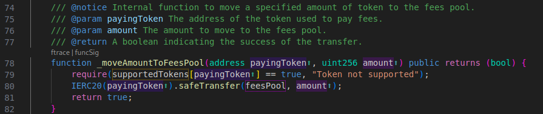

In fact, as the function's NatSpec describes, `_moveAmountToFeesPool()` is meant to be an **Internal** function. However, notice how it actually has the `public` modifier!

With this informations - having no other options - we can understand that:
>by moving an arbitrary number of tokens out of the Brokenswap Liquidity Pool and making a token that we already own more scarce it'll grow in value.
>***Note*** how the function accepts any quantity of any token, it is therefore not limited to the quantity of fees collected.
## Exploitation

0) Starting balance:
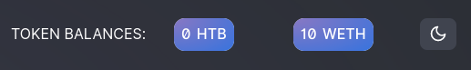

1) We need to gain WETH tokens. To make them gain value, firstly we need to swap some of them in HTB token.
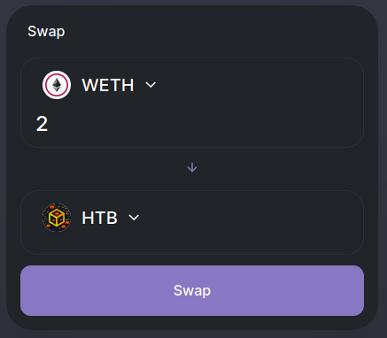
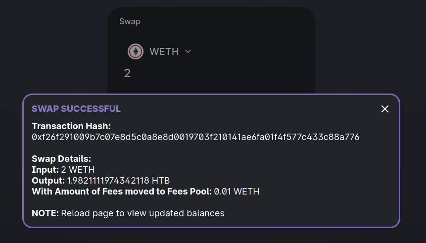
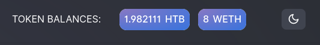

2) Exploiting the Liquidity Pool by calling the `_moveAmountToFeesPool()` with arbitrary amount of tokens to move to arbitrary location. For demonstration we'll get out of the Liquidity Pool 498 of the remaining HTB tokens, meaning that it'll become extremely scarce and our ~2 HTB token swapped previously extremely valuable.
```shell
cast send $BROKENSWAP_ADDRESS "_moveAmountToFeesPool(address,uint256)" $HTB_TOKEN_ADDRESS 498000000000000000000 --rpc-url $RPC_URL --private-key $PVK
```

3) Swap back the HTB tokens to drain the WETH tokens in the Liquidity Pool and become rich. 
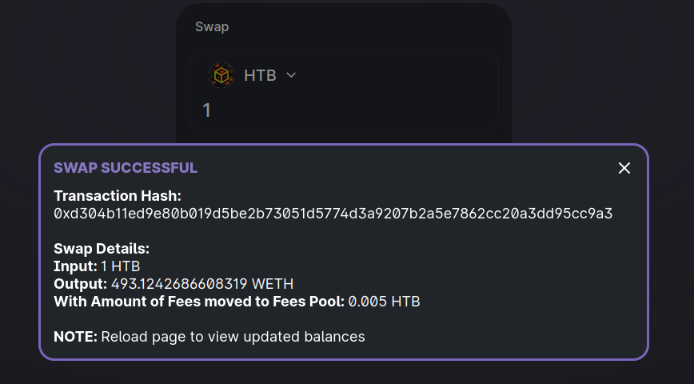

4) We now have (way) more WETH balance than before:
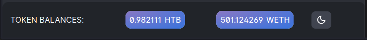

5) Get the flag (who cares of the WETHs)
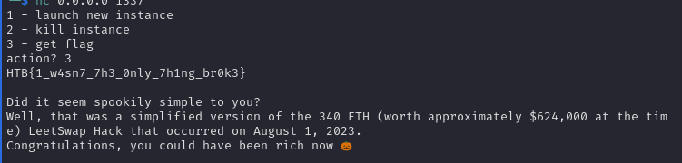

> HTB{1_w4sn7_7h3_0nly_7h1ng_br0k3}
