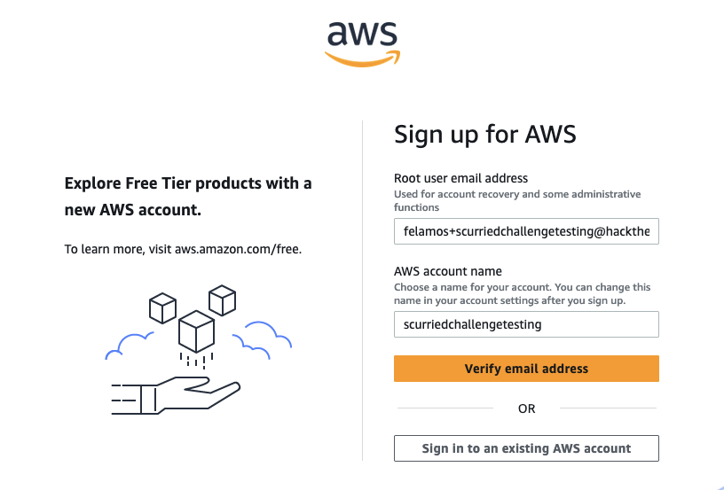
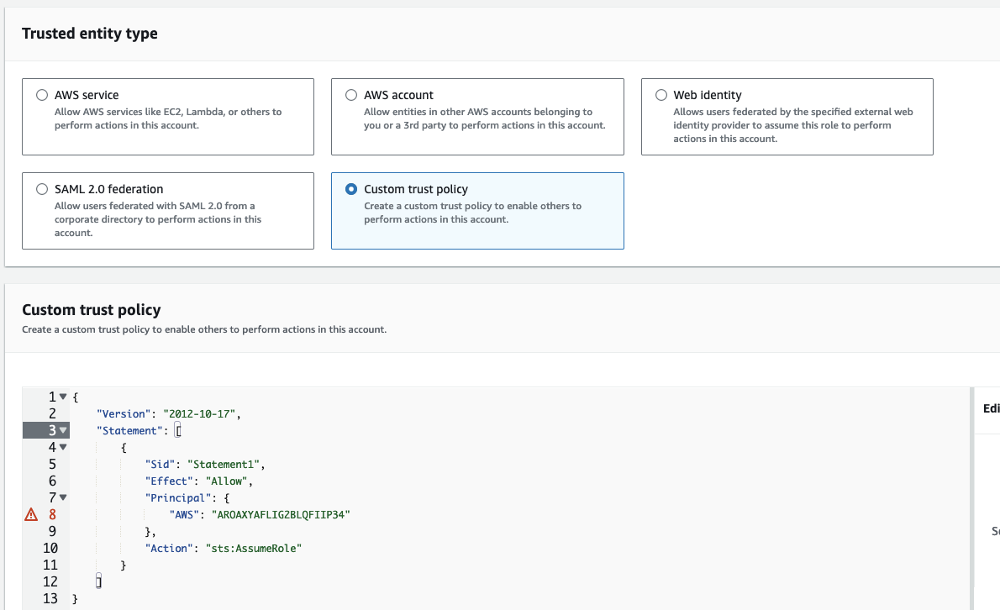
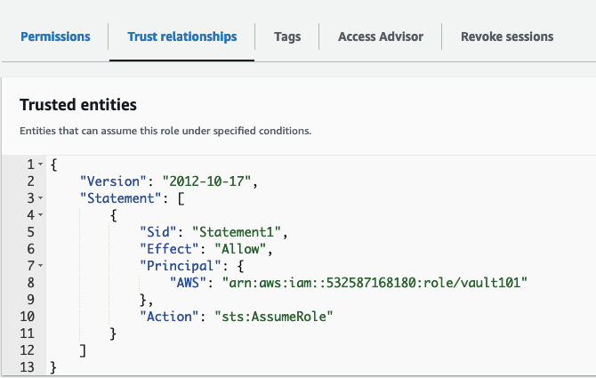

        <font size="10">Scurried</font>

​	2<sup>nd</sup> May 2024 / Document No D24.102.68

​	Prepared By: felamos

​	Challenge Author(s): felamos

​	Difficulty: <font color=lightgreen>Very Easy</font>

​	Classification: Confidential													

# Synopsis

Scurried represents a very easy level cloud challenge, designed to provide players with access to information enabling them to discern the type of resources available and their utility within the AWS cloud infrastructure.

# Description
We have obtained leaked data pertaining to Vault 101, with suspicion that it may be linked to one of the leaders group. Your task is to analyze and extract pertinent information from the provided data. The flag is arn.

- AROAXYAFLIG2BLQFIIP34

# Flag

`HTB{arn:aws:iam::532587168180:role/vault101}`

# Solution

We are given access to an interesting ID/Code which is `AROAXYAFLIG2BLQFIIP34`. At first glance it may seems random but its actually an AWS ARNs unique ID prefixes.

More information regard this can be found at https://docs.aws.amazon.com/IAM/latest/UserGuide/reference_identifiers.html#identifiers-unique-ids.

According to the aws user guide, AROA which is the first 4 letter of the provided ID is reserved only for Roles so we can be sure that is a role ARNs.

Same user guide shows AWS account principals which allows us to specify ARN instead of ARN names, eg:

```
"Principal": { 
  "AWS": [
    "arn:aws:iam::123456789012:root",
    "999999999999"
  ],
  "CanonicalUser": "79a59df900b949e55d96a1e698fbacedfd6e09d98eacf8f8d5218e7cd47ef2be"
}
```

In order to actually perform this we require an AWS account and luckily we can create one for free.

Visit https://aws.amazon.com/free and click on create a free account.



Note that this action require a proper account verification. Once we have successfully create an account we can navigate to IAM and then to roles which will contains default roles but we want to create a new role with custom trust policy.

```
{
	"Version": "2012-10-17",
	"Statement": [
		{
			"Sid": "Statement1",
			"Effect": "Allow",
			"Principal": {
				"AWS": "AROAXYAFLIG2BLQFIIP34"
			},
			"Action": "sts:AssumeRole"
		}
	]
}
```

The given policy is using principal inside statement with AWS set to the provided unique ID. AWS will show "invalid" ID since this ID do not exist inside your aws console; we can ignore it and continue.



Once we have created the role; we can again navigate to IAM and roles to list all roles and choose the newly create one. Once selected the said role, simply navigate to "Trust relationships" which will show our saved custom policy.



```
{
    "Version": "2012-10-17",
    "Statement": [
        {
            "Sid": "Statement1",
            "Effect": "Allow",
            "Principal": {
                "AWS": "arn:aws:iam::532587168180:role/vault101"
            },
            "Action": "sts:AssumeRole"
        }
    ]
}
```

AWS has automatically resolved the ARNs which is the flag.