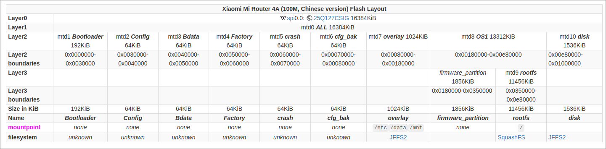

 <font size='10'>Silicon Data Sleuthing</font>

30<sup>th</sup> April 2024 / Document No. D24.102.XX

Prepared By: c4n0pus

Challenge Author(s): c4n0pus

Difficulty: <font color=Green>Easy</font>

Classification: Official

# Synopsis

* An easy forensic challenge that delves into OpenWRT firmware analysis

## Description

* In the dust and sand surrounding the vault, you unearth a rusty PCB... You try to read the etched print, it says Open..W...RT, a router! You hand it over to the hardware gurus and to their surprise the ROM Chip is intact! They manage to read the data off the tarnished silicon and they give you back a firmware image. It's now your job to examine the firmware and maybe recover some useful information that will be important for unlocking and bypassing some of the vault's countermeasures!

## Skills Required

* Basic binary extraction (`binwalk`)

## Skills Learned

* OpenWRT
  * Architecture
  * Bootup Process
  * Configuration Structure
* IoT filesystems + analysis
* Networking
* Router Backdoor

# Enumeration

Based on the description, we can assume that we are given an OpenWRT firmware image. For us to be able to examine such an image we need a couple of tools `sasquatch` and `jefferson`. These are tools for working with `SquashFS` and `JFFS2` filesystems, which we are going to find in such a firmware. (Running `binwalk -e` on the image will identify those filesystems and try to unpack them, failing if it doesn't find the correct tools mentioned previously)

Having now extracted the firmware let's take a look at the file structure:

```bash
$ tree .
.
├── jffs2-root 
├── squashfs-root
└── squashfs-root-0
```

Before moving on let's take a look at the partition layout for a [Xiaomi 4A 100M router](https://openwrt.org/inbox/toh/xiaomi/xiaomi_mi_router_4a_gigabit_edition#flash_layout):



As you can see we have one continuous data section that comes from the ROM Chip. Said section is split into address spaces, each with its own purpose and usage.

The `rootfs` partition which is mounted under `/` contains the bare minimum for the system to be operatable and being `SquashFS` is read-only and highly compressed which makes sense as you'd want it to take up as little space as possible.

On the other hand, the `overlay` partition contains the user's configuration data and it's mounted on top of the `SquashFS` partition (hence the name) giving the user a transparent, writeable, configurable filesystem.

For more differences and information on the filesystem take a look at [Filesystems](https://openwrt.org/docs/techref/filesystems) and [Boot Sequence](https://openwrt.org/docs/techref/preinit_mount)

# Solution

Now that we know that `jffs2-root` holds the user config and `squashfs-root` the base config we can look into answering the questions:

### Q1: What version of OpenWRT runs on the router
### A1: 23.05.0

This is under `squashfs-root/etc/openwrt_release`:

```txt
DISTRIB_ID='OpenWrt'
DISTRIB_RELEASE='23.05.0'
DISTRIB_REVISION='r23497-6637af95aa'
DISTRIB_TARGET='ramips/mt7621'
DISTRIB_ARCH='mipsel_24kc'
DISTRIB_DESCRIPTION='OpenWrt 23.05.0 r23497-6637af95aa'
DISTRIB_TAINTS=''
```

### Q2: What is the Linux kernel version
### Q2: 5.15.134

The kernel version can be found in `/proc/version` however, `squashfs-root/proc` is empty, so we need to get creative.

There are numerous ways to determine the kernel version, ie: from packages' kernel requirements. But the easiest is looking in the `/lib/modules` (remember that `squashfs-root` is our `/`) directory. There exists a folder for each kernel version on the system to house the plugins and build tools.

### Q3: What's the hash of the root account's password
### A3: `root:$1$YfuRJudo$cXCiIJXn9fWLIt8WY2Okp1:19804:0:99999:7:::`

Now things start to get a little tricky. If we check the `squashfs-root/etc/shadow` file we find a hash but when submitted it's the wrong one. 

Remember that `squashfs-root` is read-only, which means that hash can never change, but that would mean that the user cannot change password. But that's false. This means our answer is in the `jffs2-root` partition which is, partly, an overlay on top of `/etc`. Let's browse that directory:

```sh
$ /bin/ls -lha
total 16K
drwxr-xr-x 4 user user 4.0K Apr 30 15:40 .
drwxr-xr-x 5 user user 4.0K Apr 30 15:40 ..
lrwxrwxrwx 1 user user    1 Apr 30 15:40 1 -> 2
lrwxrwxrwx 1 user user    1 Apr 30 15:40 .fs_state -> 1
drwxr-xr-x 2 user user 4.0K Apr 30 15:40 upper
drwxr-xr-x 3 user user 4.0K Apr 30 15:40 work
```

The `uppser` folder contains a `sysupgrade.tgz` file, which will come back to it in the end.

The `work/work` folder contains a lot of `#X` files/folders.

If we do `strings *` to get a feel of what are we looking at, we see a lot of config files and the contents of what appears to be `/etc/shadow` `/etc/passwod` `/etc/profile` and other files. From here we can conclude that we are in the `/etc` directory on the `overlay` partition which houses our config. To get the hash of the user we can repeat our `strings` command and `grep` for `root`.

By modifying the hash and recreating the flash image, someone could backdoor an ISP's router without `JTAG` and enable services that normally would be disabled like `ssh` or even `telnet` to get `shell` access, as shown [here](https://github.com/logon84/Hacking_Huawei_HG8012H_ONT)

### Q4: What is the PPPoE username
### A4: `yohZ5ah`

### Q5: What is the PPPoE password
### A5: `ae-h+i$i^Ngohroorie!bieng6kee7oh`

Since the questions now appear to be based on the configuration, that means we need to explore the `jffs2-root` more.

A `PPPoE` connection stands for `Point-to-Point Protocol over Ethernet` and is used to create an upstream connection to your ISP ie: when using your own router/modem. More on `PPPoE` [here](https://en.wikipedia.org/wiki/Point-to-Point_Protocol_over_Ethernet)

After some research online, we find that the configuration for the `PPPoE` protocol happens for the `wan` interface under `/etc/config/network`. Since the `jffs2-root/work/work` corresponds roughly to `/etc` under operation, we can search for files called `network`

```bash
$ fd network .
./#4/network
```

Only one match under the `#4` directory let's read it:

```txt
config interface 'loopback'
	option device 'lo'
	option proto 'static'
	option ipaddr '127.0.0.1'
	option netmask '255.0.0.0'

config globals 'globals'
	option ula_prefix 'fd54:d441:6c4a::/48'
	option packet_steering '1'

config device
	option name 'br-lan'
	option type 'bridge'
	list ports 'lan1'
	list ports 'lan2'

config interface 'lan'
	option device 'br-lan'
	option proto 'static'
	option ipaddr '192.168.1.1'
	option netmask '255.255.255.0'
	option ip6assign '60'

config interface 'wan'
	option device 'wan'
	option proto 'pppoe'
	option username 'yohZ5ah'
	option password 'ae-h+i$i^Ngohroorie!bieng6kee7oh'
	option ipv6 'auto'

config interface 'wan6'
	option device 'wan'
	option proto 'dhcpv6'
```

This is the interface configuration file that defines the interfaces and their configurations:

We have the `wan` interface that uses the `wan` device and the `pppoe` protocol to facilitate communication and also the `lan` interface which bridges `lan1` and `lan2` together with a static IP configuration.

### Q6: What is the WiFi SSID
### A6: VLT-AP01

### Q7: What is the WiFi Password
### A7: french-halves-vehicular-favorable

From the last two questions we can now deduce that `#4` corresponds to the `config` folder under `/etc` and the WiFi/radio configuration is under `/etc/config/wireless` so let's read the `wireless` file:

```txt
config wifi-device 'radio0'
	option type 'mac80211'
	option path '1e140000.pcie/pci0000:00/0000:00:01.0/0000:02:00.0'
	option channel 'auto'
	option band '2g'
	option htmode 'HT20'
	option txpower '20'
	option cell_density '0'

config wifi-iface 'default_radio0'
	option device 'radio0'
	option network 'lan'
	option mode 'ap'
	option ssid 'VLT-AP01'
	option encryption 'sae-mixed'
	option key 'french-halves-vehicular-favorable'
	option ieee80211r '1'
	option ft_over_ds '0'
	option wpa_disable_eapol_key_retries '1'

config wifi-device 'radio1'
	option type 'mac80211'
	option path '1e140000.pcie/pci0000:00/0000:00:00.0/0000:01:00.0'
	option channel 'auto'
	option band '5g'
	option htmode 'VHT80'
	option txpower '20'
	option cell_density '0'

config wifi-iface 'default_radio1'
	option device 'radio1'
	option network 'lan'
	option mode 'ap'
	option ssid 'VLT-AP01'
	option encryption 'sae-mixed'
	option key 'french-halves-vehicular-favorable'
	option ieee80211r '1'
	option ft_over_ds '0'
	option wpa_disable_eapol_key_retries '1'
```

As previously, this file contains the configuration for the wifi interfaces along with their underlying radio configs (band, type, Tx power)

Their config values are pretty much self-explanatory (SSID, encryption, key, etc)

### Q8: What are the 3 **WAN** ports that **redirect** traffic from WAN -> LAN
### A8: 1778,2289,8088

We are looking for 3 `WAN` ports whose traffic is being redirected into `LAN`. For this, we need to take a look into the Firewall configuration. But there is no `firewall` file under `#4`. Hmm... Our first assumption may not have been as concrete as we hoped so...

It turns out that "#4" is not a 1:1 representation of `/etc/config` and by extension, `jffs2-root/work/work` is not a 1:1 presentation of `/etc`. We can confirm that by running again `strings *` inside `jffs2-root/work/work`. We find a lot of configuration data that we normally should find under `config`. `JFFS2` must be using additional meta-data to determine the overlay for each file/folder.

In any case, one file is the `firewall` config as we can see from the keywords `config, zone, rule, ACCEPT, REJECT, etc`:

```txt
[...]
config forwarding
	option src 'lan'
	option dest 'wan'
config rule
	option name 'Allow-Ping'
	option src 'wan'
	option proto 'icmp'
	option icmp_type 'echo-request'
	option family 'ipv4'
	option target 'ACCEPT'
[...]
config redirect
	option dest 'lan'
	option target 'DNAT'
	option name 'DB'
	option src 'wan'
	option src_dport '1778'
	option dest_ip '192.168.1.184'
	option dest_port '5881'
config redirect
	option dest 'lan'
	option target 'DNAT'
	option name 'WEB'
	option src 'wan'
	option src_dport '2289'
	option dest_ip '192.168.1.119'
	option dest_port '9889'
config redirect
	option dest 'lan'
	option target 'DNAT'
	option name 'NAS'
	option src 'wan'
	option src_dport '8088'
	option dest_ip '192.168.1.166'
	option dest_port '4431'
```

Towards the end, we find the 3 redirect rules from (`src`) `wan` to (`dst`) `lan` and the source ports are (in order): 1778, 2289, 8088

## The easier way

Remember that `sysupgrade.tgz` file that exists in `jffs2-root/upper`? That is the backup configuration that is [automatically*](https://openwrt.org/docs/techref/sysupgrade#how_it_works) created when a system upgrade takes place.

If we decompress it we can find the entire configuration with named files and folders.
