 <font size='10'>Tangled Heist</font>

18<sup>th</sup> March 2024

Prepared By: Nauten, thewildspirit

Challenge Author(s): Nauten

Difficulty: <font color='green'>Easy</font>

<br><br>

# Synopsis

- Tangled Heist is an easy forensics challenge involving extracting information from a PCAP file and reading the LDAP traffic to answer questions and complete the investigation in order to obtain the flag.

## Description

- The survivors' group has meticulously planned the mission 'Tangled Heist' for months. In the desolate wasteland, what appears to be an abandoned facility is, in reality, the headquarters of a rebel faction. This faction guards valuable data that could be useful in reaching the vault. Kaila, acting as an undercover agent, successfully infiltrates the facility using a rebel faction member's account and gains access to a critical asset containing invaluable information. This data holds the key to both understanding the rebel faction's organization and advancing the survivors' mission to reach the vault. Can you help her with this task?

## Skills Required

- Familiarity with network protocol analyzers
- Familiarity with Windows Active Directory structure

## Skills Learned

- Network analysis
- Analyzing LDAP protocol
- Analyzing KRB5 protocol
- Analyzing Active Directory structure extracting relevant data

# Enumeration

Players are provided with the following file:

- capture.pcap

The provided file contains network traffic from different protocols, more specifically: 

- LDAP traffic of a Windows Active Directory environment (port 389)
- KRB5 (port 88)

The user can parse it with the appropriate tools and extract relevant data needed to reply to questions.

Wireshark has a built-in dissector for LDAP protocol: https://wiki.wireshark.org/LDAP

It's really important to understand fully how an Active Directory environment is structured and in which format data is saved in every specific attribute to extract relevant data and reply to questions.

One useful resource is [LDAPWiki](https://ldapwiki.com/wiki/Wiki.jsp?page=Microsoft%20Active%20Directory)

Multiple ways of resolutions are possible, one is to analyze the dump using the Wireshark GUI, alternatively, it's possible to convert the entire dump into a  text file using:

```tshark -r capture.pcap -Y "ldap" -O ldap > ldap_output.txt```

In this way, the entire dump is readable and can also be parsed.

It's important to notice that multiple streams are available in the pcap file.

# Solution

### [1/11] Which is the username of the compromised user used to conduct the attack?
We can answer this question by looking at who is authenticated to the LDAP server and sends the rest of the queries. 

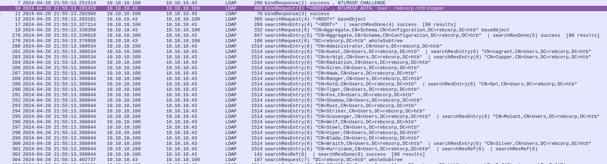

As we can see, the IP `10.10.10.43` authenticates as `Copper`. By navigating to `Statistics`-> `Conversations`, we notice that there are only two IPs, `10.10.10.43` which is `Copper`, and `10.10.10.100` which is probably the Domain Controller.

* Answer: `Copper`


### [2/11] What is the Distinguished Name (DN) of the Domain Controller?
For this question, we will use a custom filer, which is `ldap contains "OU=Domain Controllers"`. Wireshark will only display LDAP packets that contain the string `OU=Domain Controllers`.
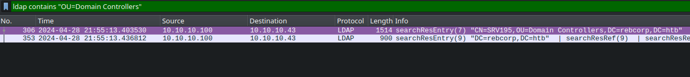

* Answer: `CN=SRV195,OU=Domain Controllers,DC=rebcorp,DC=htb`

### [3/11] Which is the Domain managed by the Domain Controller?

There are many ways to find this answer. One of them is to inspect the `NTLMSSP_AUTH` packet and click the `Domain name` attribute.
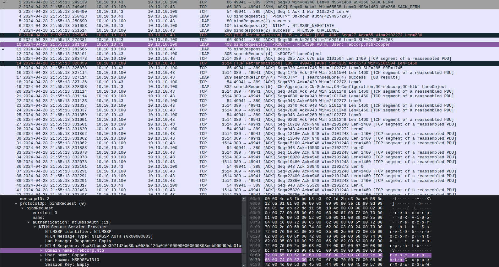

* Asnwer: `rebcorp.htb`


### [4/11] How many failed login attempts are recorded on the user account named 'Ranger'?

To answer this question we first need to know where such information is stored. After searching on Google, we came across this [attribute](https://learn.microsoft.com/en-us/windows/win32/adschema/a-badpwdcount). As described in Microsoft's official documentation, this attribute indicates the number of times the user tried to log on to the account using an incorrect password. A value of 0 indicates that the value is unknown.

To locate it we will use the following filter: `ldap contains "badPwdCount" and ldap contains "Ranger"`. Wireshark will display the packets that include the `badPwdCount` attribute and the username `Ranger`.
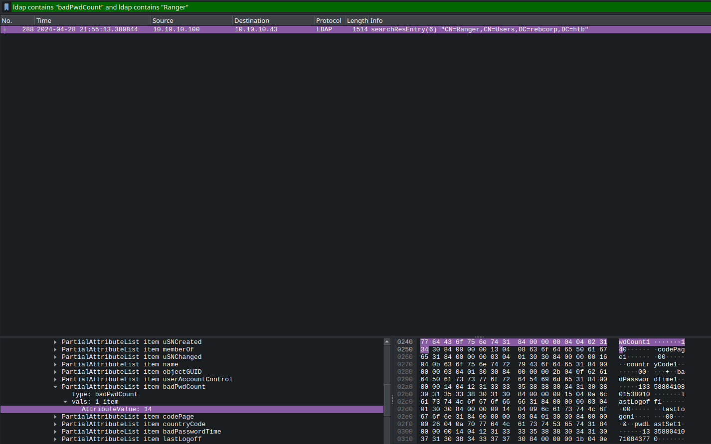
* Answer: `14`

### [5/11] Which LDAP query was executed to find all groups?
Since we know the attacker's IP, we will create a filter that only returns packets sent by the IP `10.10.10.43` and contains the `group` keyword.

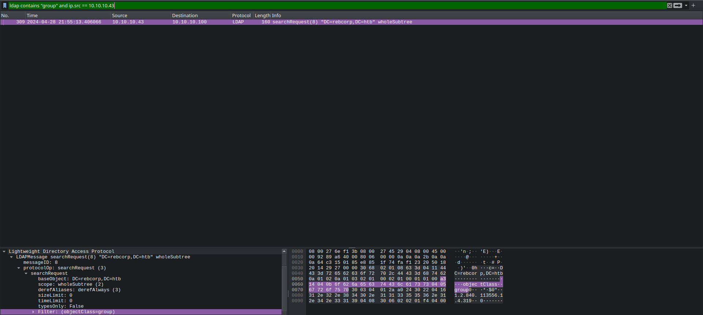


* Answer: `(objectClass=group)`


### [6/11] How many non-standard groups exist?

We will filter the packets using the "groups" keyword.
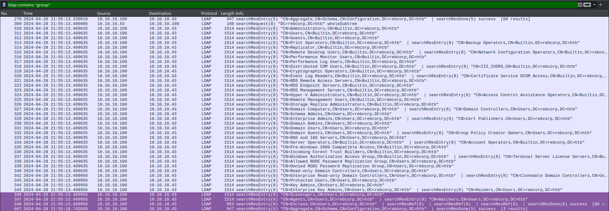

We can see all standard groups, and, at the end of the list, all non-standard groups. Note that on packet `347` groups `Agents` and `Watchers` are both on the same response.

* Answer: `5`

### [7/11] One of the non-standard users is flagged as 'disabled', which is it?

`Radiation`

To find this information we need to inspect the `userAccountControl` attribute. The value that is assigned to the attribute tells Windows which options have been enabled.

> More details can be found [here](https://learn.microsoft.com/en-us/windows/win32/api/iads/ne-iads-ads_user_flag_enum) and [here](https://ldapwiki.com/wiki/Wiki.jsp?page=User-Account-Control%20Attribute%20Values).

This field is calculated with the sum of all values. There is also a useful [decoder](https://www.techjutsu.ca/uac-decoder).

In our case, we want: "**NORMAL_ACCOUNT**" (512) + "**ACCOUNTDISABLE**" (2) = **514**
We can confirm this by using the uac decoder.
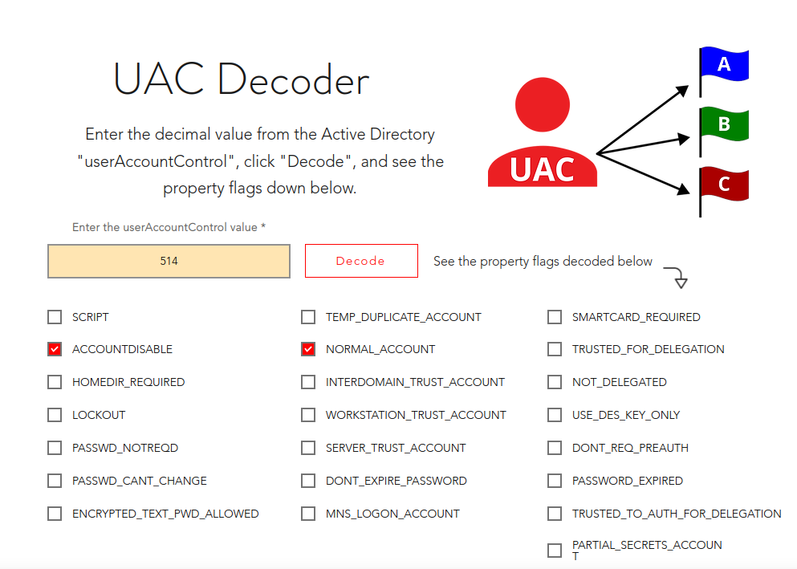

Searching for the value `514` we find `Radiation` user as disabled:
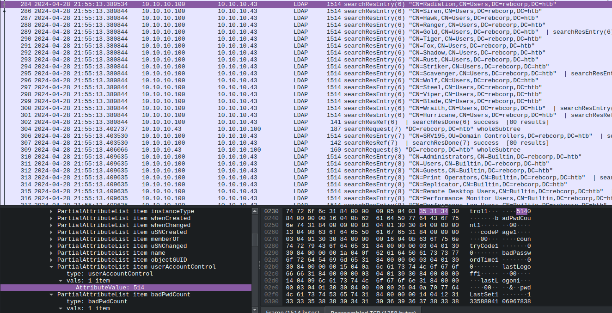
* Answer: `Radiation`

### [8/11] The attacker targeted one user writing some data inside a specific field. What is the field name?

We can notice a `modify` request in the LDAP traffic. If we inspect its attributes we can see that the attacker requested to modify the `wWWHomePage`.

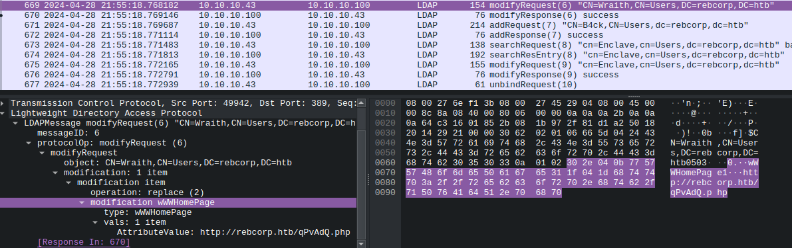


* Answer: `wWWHomePage`


### [9/11] Which is the new value written in it?

From the previous screenshot, we can also find the new value of the modified attribute.

* Answer: `http://rebcorp.htb/qPvAdQ.php`


### [10/11] The attacker created a new user for persistence. What is the username and the assigned group?

From the traffic, we can notice an `add user` request.

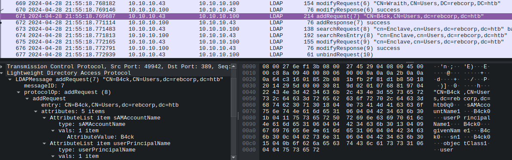

The user is `B4ck`, and then, we notice a `modify` request regarding the group `Enclave`. If we inspect the packet's attributes we can see that the attacker added `B4ck` in the `Enclave` group.


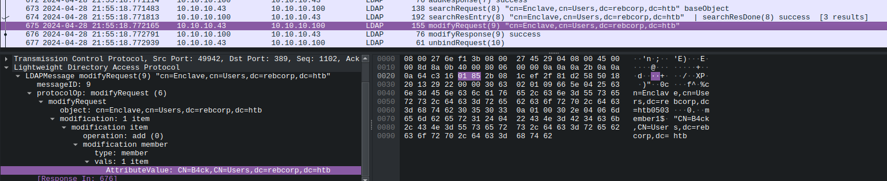

* Answer: `B4ck,Enclave`


### [11/11] The attacker obtained a hash for the user 'Hurricane' that has the UF_DONT_REQUIRE_PREAUTH flag set. Which is the correspondent plaintext for that hash?

* Answer: `april18`

For this question, we will extract the hash, convert it in the proper format, and resolve it to plaintext doing the following:

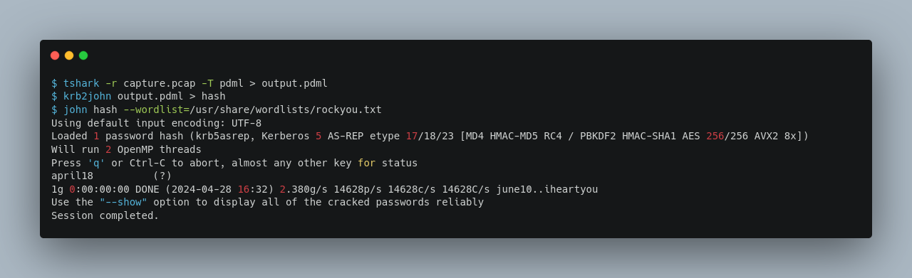
