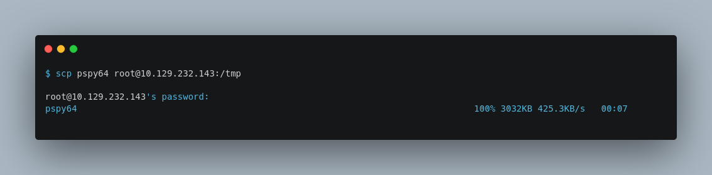
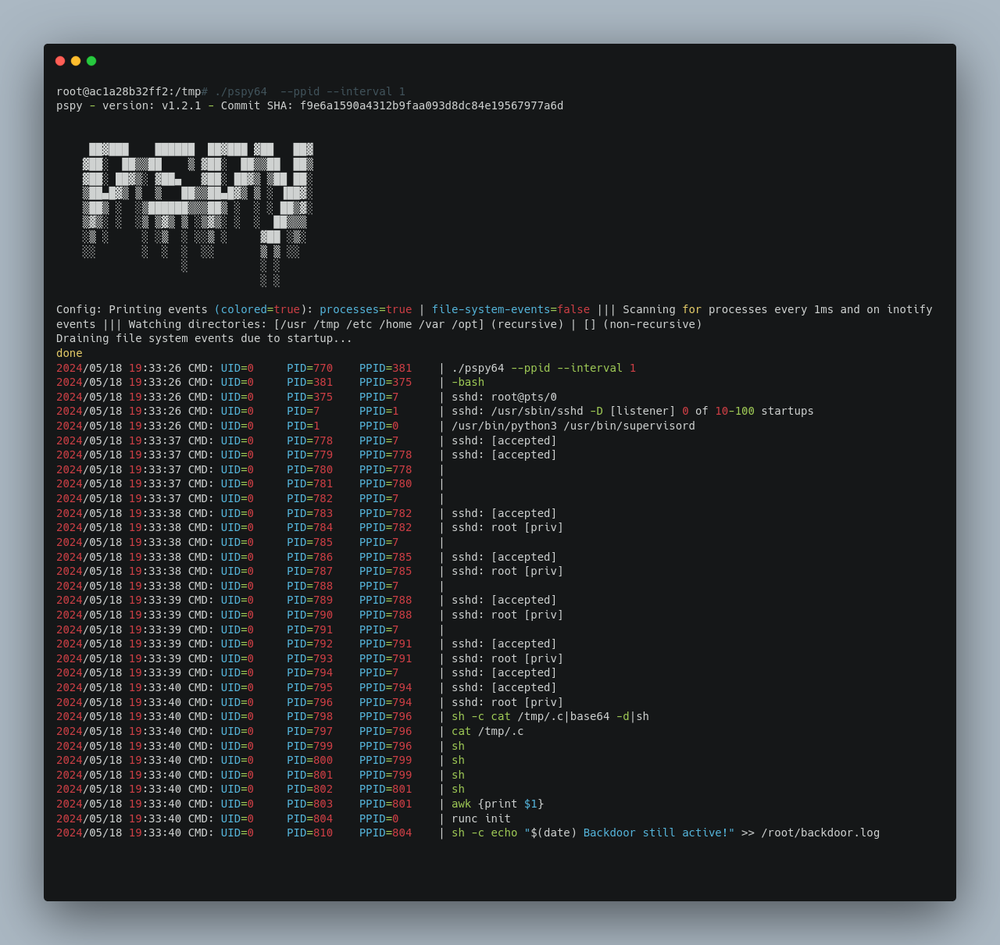
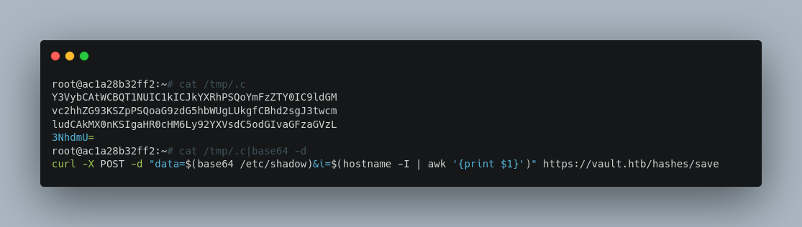
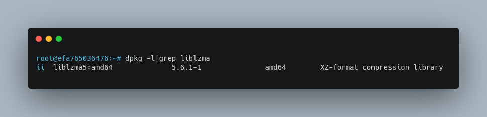
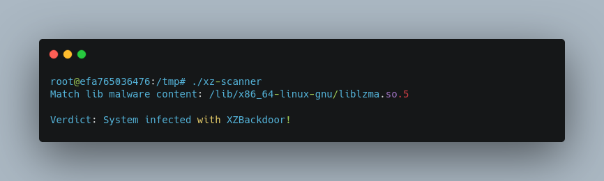
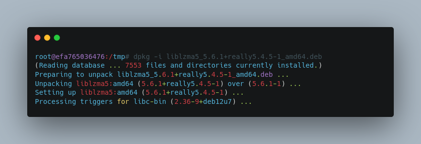
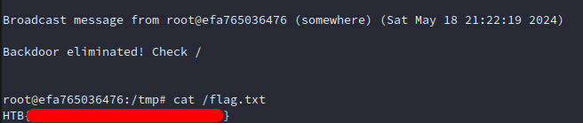

 Mitigation

17th May 2024 / Document No. D24.102.XX

Prepared By: thewildspirit

Challenge Author(s): thewildspirit, ir0nstone, c4n0pus

Difficulty: Medium

Classification: Official

# Synopsis

* Mitigation is a medium forensics challenge that involves analyzing a live Linux system, detecting the active XZ backdoor, and mitigating it.

## Description

* Having now gathered all the intelligence, you are now making the final preparations to attack the vault! You connect back to your server to review some important evidence one last time! However, as soon as you connect you discover things are in complete disorder. You check the root directory and you find `/root/backdoor.log`, clearly evidence of an active backdoor, set in place to hinder your assault on the Vault! Eliminate the backdoor in order to continue with your plans! Note: A new line is added in the logfile approximately every minute indicating the status of the backdoor. Note 2: Connect to the server using SSH and `root:toor` as credentials. Note 3: You need to be connected to the CTF VPN in order to reach the server.

## Skills Required

* Linux operating system knowledge
* Common Linux backdoor techniques & usage
* Live Linux analysis

## Skills Learned

* XZ backdoor detection
* XZ backdoor mitigation
* Live Linux forensics analysis

# Enumeration

For this challenge players are supposed to connect to a Linux live instance using the credentials `root:toor`. Since we are aware that the backdoor is still active, let's use [pspy64](https://github.com/DominicBreuker/pspy) to see if we can detect any suspicious movement.

To transfer our tool to the server, we will use `scp`:

Then, we will use `pspy64` with the following arguments:
* `--ppid`: records process ppids
* `--interval`: scan every 'interval' milliseconds for new processes

We can see that almost every minute some processes are created. Let's analyze the previous output.

1. New `SSH` connections are initiated repeatedly.
2. There are multiple `sh` processes executing commands.
3. In some of those commands, the arguments are not visible. On those that are visible, the file `/tmp/.c` is involved.
4. If we follow the chain, we can see that every `sh` process is a child process of `SSH`.

Before continuing, we need to see the content of the suspicious file.
The command `cat /tmp/.c|base64 -d|sh`:
* prints the content of the file
* Base64 decodes it
* executes it using `sh`

Let's see its content.

Sends the content of the file `/etc/shadow` which contains the hash of the root user, and the IP of the server to the `https://vault.htb/hashes/save` endpoint. The domain is not up so we cannot continue our analysis.

Let's come back to our number 4. SSH spawning a `sh` child process might seem normal, but first, let's inspect what a real `SSH` login attempt and command execution looks like. Having PSPY running, we will connect to the instance again using SSH.

As we can see, when we are trying to connect using SSH, the OS handles the connection differently. Initiates the `PATH` variable, executes run-paths, etc. So, something different is happening in our case. If we use Google to search for SSH vulnerabilities, we can find [CVE-2024-3094](https://nvd.nist.gov/vuln/detail/CVE-2024-3094). Due to the recent XZ supply chain incident, some versions of `liblzma` contain a backdoor, and as a result, the same applies to SSH. It is worth investigating further.

To do so we can either search manually or use a published xz-backdoor scanner. For this write-up, we will use both. To locate it manually, we need to find what libraries are installed on the server.

According to the recent CVE, the vulnerable version is `.5.6.0` and `5.6.1`.

To locate it using a scanner, we will use this [scanner](https://github.com/bitdefender/malware-ioc).

Now that we know that the system is infected with the XZ backdoor, we need to mitigate it.

# Solution

To mitigate the backdoor, we need to update the library. To do so, we will download the latest `liblzma` version from the [Debian packages](https://snapshot.debian.org/package/xz-utils/), and install it on the server.

We will use scp again to transfer the library to our machine, and then, `dpkg` to install it.

After, almost one minute we can see the following message, and finally, get the flag.

