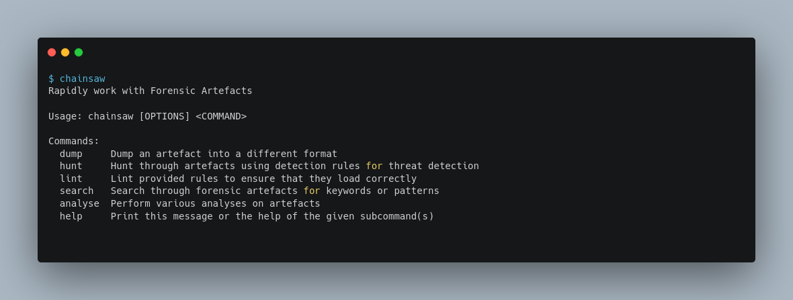
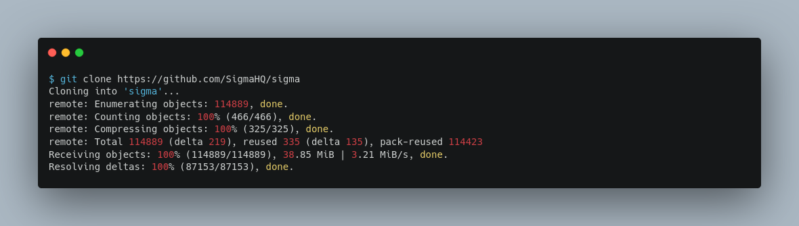
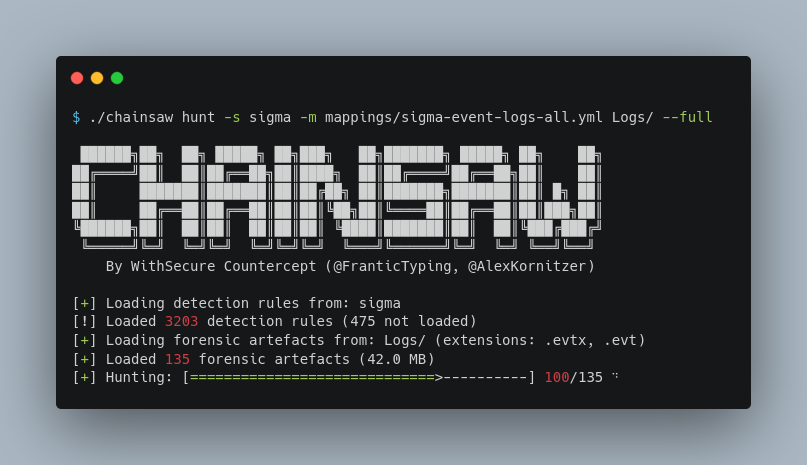
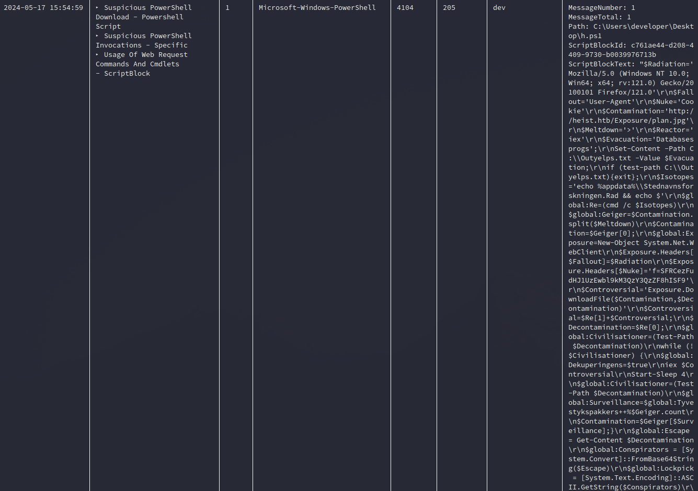
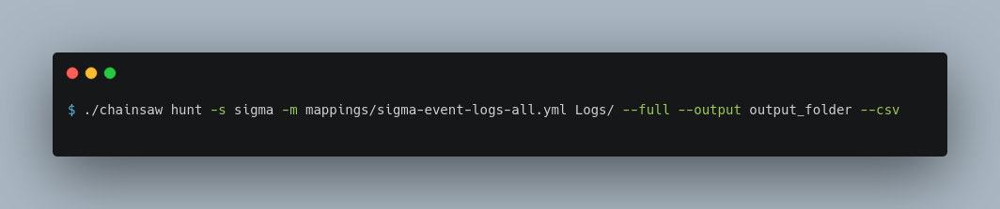
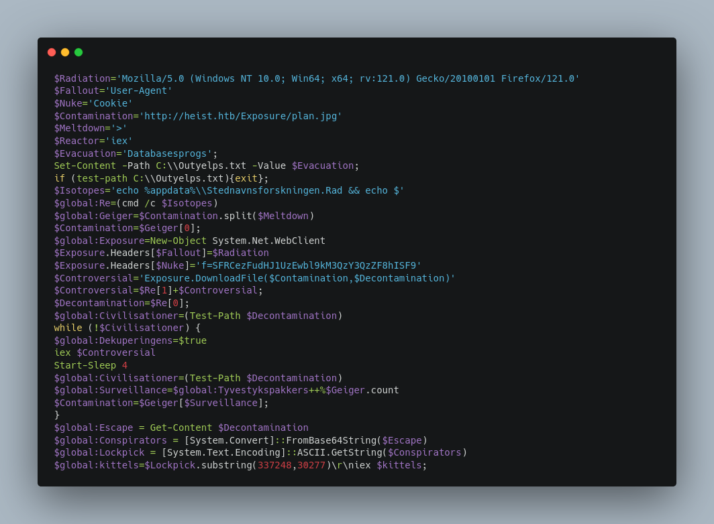
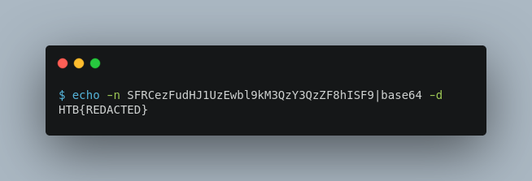

 Caving

18th May 2024

Prepared By: thewildspirit

Challenge Author(s): thewildspirit

Difficulty: Very Easy

Classification: Official

# Synopsis

A very easy forensics challenge that involves analyzing event logs of a compromised Windows workstation.

## Description

* In the shadow of the apocalypse, your team discovers an operational workstation hidden within an abandoned outpost. It holds event logs from the days leading up to the nuclear catastrophe, containing encrypted clues about the origins of the disaster. Rumors suggest that a malicious domain, heist.htb, played a crucial role in the catastrophic events. Analyze the logs to uncover connections and decode the sequence that triggered the fallout. Try to understand the full scope of the disaster and secure the knowledge needed to prevent future calamities as you journey towards the vault.

## Skills Required

* Basic Windows OS knowledge

## Skills Learned

* Event log analysis
* PowerShell script analysis

# Enumeration

For this challenge players are given the event log folder of the compromised Windows workstation. To analyze them we will use the tool of our choice, [chainsaw](https://github.com/WithSecureLabs/chainsaw). Chainsaw is a command-line tool that we can use to search through and analyze Windows event logs.

This tool has many modes, but for this write-up, we will use `hunt`. This mode allows us to hunt through artifacts using detection rules for threat detection. To make the most out of it, we will download sigma rules from the following [repository](https://github.com/SigmaHQ/sigma).

And we will use chainsaw as follows:

* `hunt`: Hunt through artefacts using detection rules
* `-s`: A path containing Sigma rules to hunt with
* `-m`: A mapping file to tell Chainsaw how to use third-party rules
* `Logs`: The path of the evidence
* `--full`: To print the full content of each finding

# Solution

By inspecting the output we can notice the following finding.

The alerts are:
* Suspicious PowerShell Download
* Suspicious PowerShell Invocations
* Usage Of Web Requests Commands And Cmdlets - ScriptBlock

Let's further inspect the PowerShell script. To parse the output we will execute the chainsaw command again but now we will add two more parameters.

* `--output`: The name of the output file
* `--csv`: To export the results in the CSV format

The script can be seen below:

After analyzing the script we can identify that when downloading the next stage from `http://heist.htb/Exposure/plan.jpg`, the attacker adds two headers. The first is the user-agent and the second one is a custom cookie which looks like this `f=SFRCezFudHJ1UzEwbl9kM3QzY3QzZF8hISF9`. Let's decode it.

