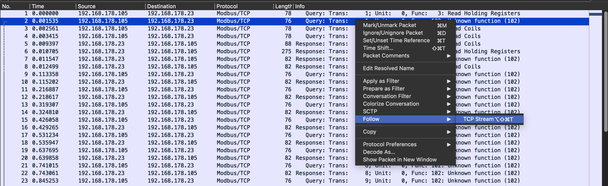
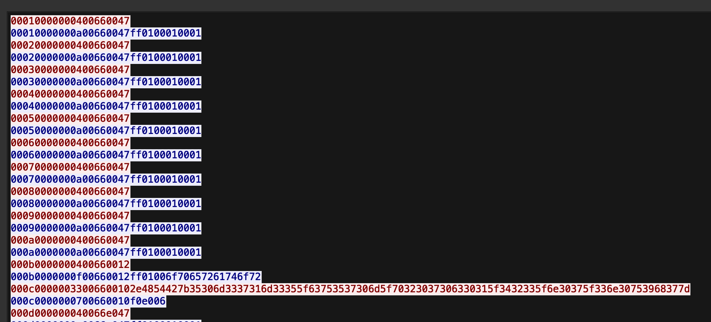
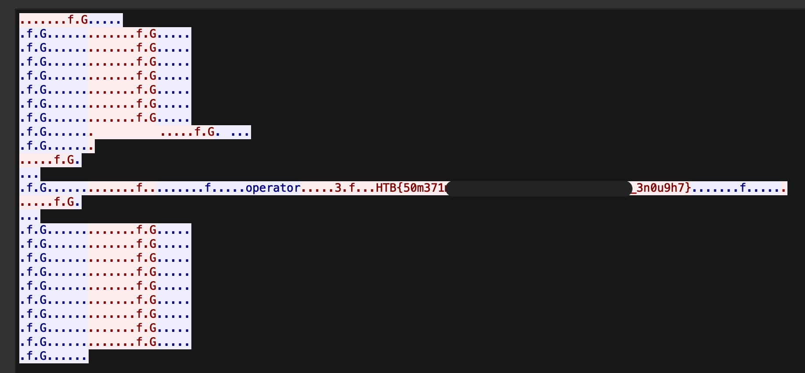

 Shush Protocol

20th May 2024

Prepared By: diogt

Challenge Author(s): diogt

Difficulty: Very Easy

Classification: Official

# Synopsis

- Analyze Modbus/TCP network traffic of custom Function Code

## Description

- The crew sets their sights on an abandoned fertilizer plant, a desolate structure rumored to hold a cache of ammonium nitrate—crucial for their makeshift explosives. Navigating through the plant’s crumbling corridors, they reach the main control room where a dusty, outdated PLC still hums faintly with power. The crew's hackers spring into action, connecting their equipment to the network of the PLC and starting the process of extracting data. They know that finding the password the control device uses to connect to the PLC is key to gaining full access to it. The hackers deploy network enumeration tools to scan for active devices on the plant's internal network. They meticulously sift through IP addresses, looking for clues that might reveal the password. After several tense hours, they pinpoint the device—a ruggedized industrial computer buried under layers of dust, still linked to the PLC that performs certain diagnostic operations under a custom protocol on a specific interval. Having captured the traffic from that connection the only thing that remains is to locate the packet that contains the secret information.

## Skills Required

- Basic use of Wireshark

## Skills Learned

- Examine Modbus/TCP packets

# Enumeration

## Analyzing the files

The challenge provides us with only one downloadable PCAP file. Upon opening the file using Wireshark it appears that it contains network traffic from a Modbus network.

The objective is to identify the password written using a custom protocol. By inspecting the Modbus/TCP packets, we can see several packets with an unknown function (102). This could indicate a proprietary protocol that uses a function code not recognized by the standard Modbus protocol configuration. We can follow the tcp stream of these packets to observe the full transmission of data.

And to make the view more clear change the display of the data to Hex Dump. Finally we can observe the flag bytes in the place of the bytes written into the registers.

# Solution: 

## Getting the Flag

Only one packet appears to contain a lot of data. Changing the view format to ASCII reveals the user (operator) and password (flag)

