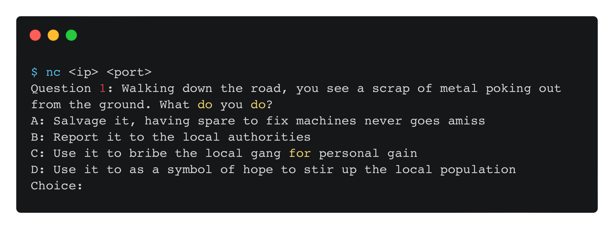
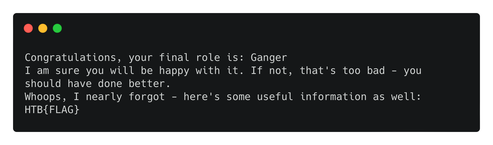

    	Aptitude Test

​		17th April 2024

​		Prepared By: ir0nstone

​		Challenge Author(s): ir0nstone

​		Difficulty: Very Easy

​		Classification: Official

 

# Synopsis

Aptitude Test is a Very Easy misc challenge that simply requires a user to connect to a terminal via `nc` and answer a series of questions to receive the flag.

# Description

Before the team sets off, it's time to take the Aptitude Test. The test is designed to assign members their most 
"natural" role, providing the hierarchy and power dynamic required to run such a dangerous mission successfully. 
Mistakes are costly. Tread wisely.

## Skills Required

- Basic Linux Command Line knowledge

## Skills Learned

- Interactive with sockets using `nc`

# Enumeration
We can connect to the socket using `nc`:

We are given a scenario and a series of choices.

# Solution
Inputting one of `A`, `B`, `C` or `D` (or their lowercase variants) answers the question and brings up another. An initial idea may be to script it, but there are only 10 questions. Once we answer them all (we can send `A` for every single one), we get back our role - as well as the flag:

