 <font size='10'>Blueprint Heist</font>

XX<sup>th</sup> April 2024

Prepared By: `lordrukie`

Challenge Author(s): `lordrukie`

Difficulty: <font color='green'>Easy</font>

<br><br>

# Synopsis

- Exploiting outdated pdf generation (wkhtmltopdf v0.12.5) to perform local file read via http redirect. SQL Injection within graphql with regex bypass. Code execution via error handling using template file creation.

## Description

- Amidst the chaos of their digital onslaught, they manage to extract the blueprints by inflitrating the ministry of internal affair's urban planning commission office detailing the rock and soil layout crucial for their underground tunnel schematics.

## Skills Required

- Basic Knowledge of NodeJS
- Identification of Vulnerable Software
- Basic Knowledge of SQL
- Basic Knowledge of Graphql

## Skills Learned

- Weak Regex Bypass
- Source Code Analysis
- File Write using SQL Injection
- EJS Code Execution

# Enumeration

## Web Application Overview

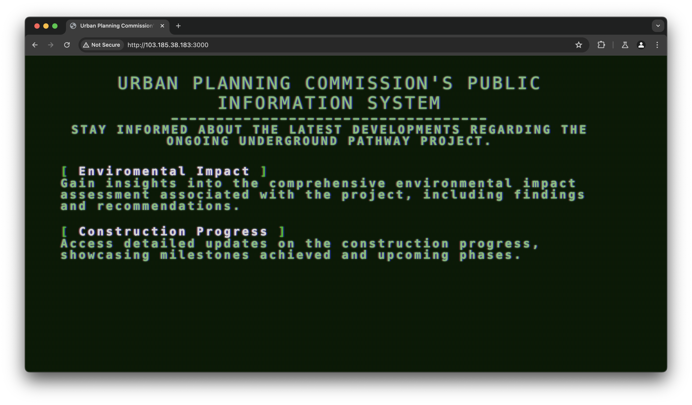
The web page provide two clickable elements (whit text). Once clicked, it will try to download file with pdf format which contains public report.
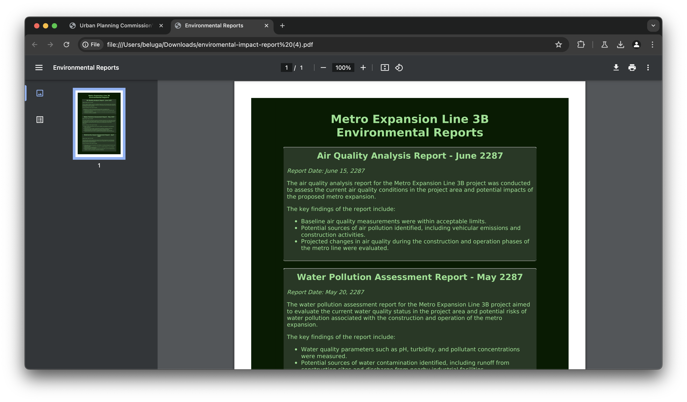

## Initial Vulnerability

A request was sent into `/download` with following requests.
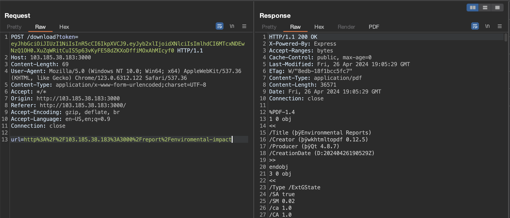

Here we can see the application uses wkhtmltopdf version 0.12.5 (latest version is 0.12.6). The application get the `url` data and convert it into pdf.
 
Searching into specific vulnerability for the software and found this page
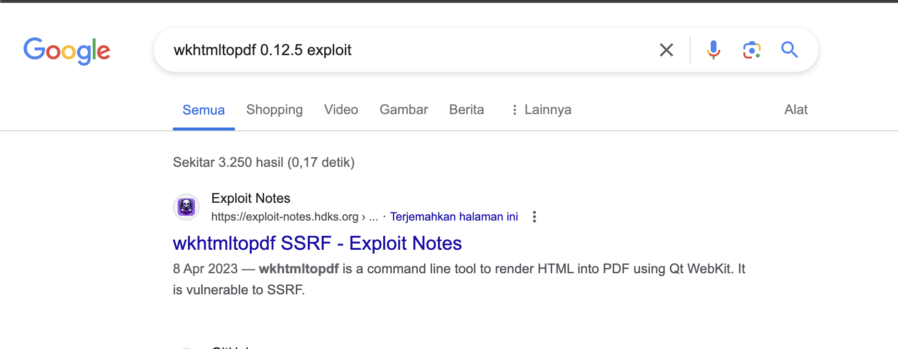

It says that wkhtmltopdf are vulnerable to local file read by using redirect
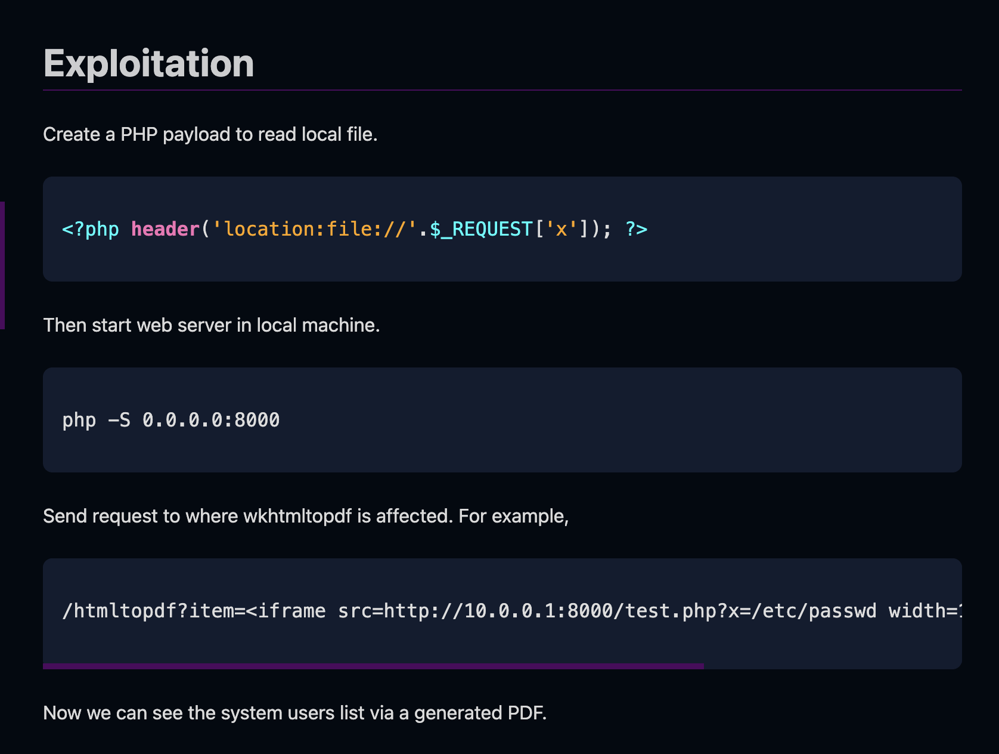

Replicating the technique will allow us to read local file within the target apps.
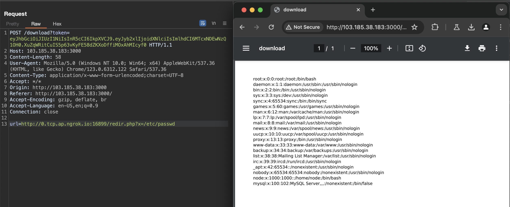

Application path also can be obtained when error occured upon generating pdf file. Here we able to found that application are located within `/app/` directory.
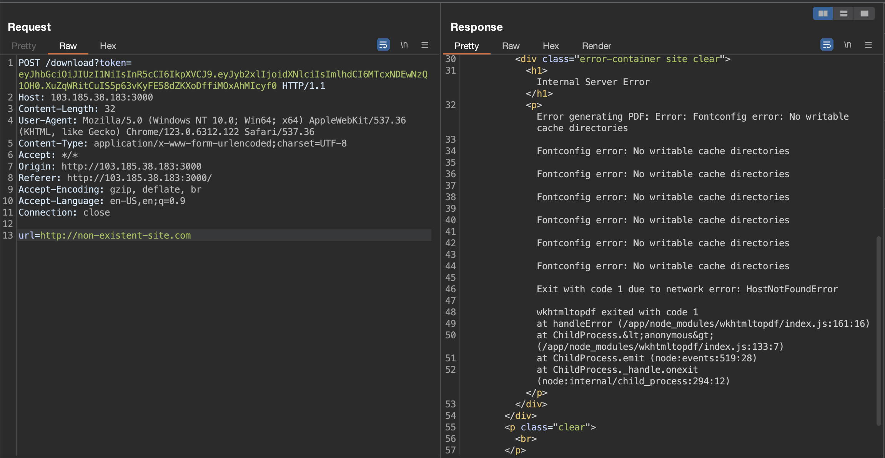

This way, we can download application source code starting from `/app/index.js` (common nodejs root file).

## Analyzing the web source code

Once all source code downloaded, we can try to analyze the code to find another entrypoint.

Here on `index.js` we can see that it use two routes from `routes/public` and `routes/internal`. It also uses custom error handling from `controllers/errorController`

```js
const express = require("express");
const bodyParser = require("body-parser");
const path = require("path");
const { renderError, generateError } = require("./controllers/errorController");
const publicRoutes = require("./routes/public")
const internalRoutes = require("./routes/internal")

const app = express();
app.use(bodyParser.urlencoded({ extended: true }));
app.use(bodyParser.json());
app.set("view engine", "ejs");
app.use('/static', express.static(path.join(__dirname, 'static')));

app.use(internalRoutes)
app.use(publicRoutes)

app.use((res, req, next) => {
  const err = generateError(404, "Not Found")
  return next(err);
});

app.use((err, req, res, next) => {
  renderError(err, req, res);
});
```

### Public Routes
We can skip the public routes since we know that it being used to generate pdf based on user url input. We also know that it uses wkhtmltopdf v0.12.5 which can be abused to obtain local file read. Nothing much inside.

```js
const express = require("express");
const router = express.Router();

const { authMiddleware, generateGuestToken } = require("../controllers/authController")
const { convertPdf } = require("../controllers/downloadController")

router.get("/", (req, res) => {
    res.render("index");
})

router.get("/report/progress", (req, res) => {
    res.render("reports/progress-report")
})

router.get("/report/enviromental-impact", (req, res) => {
    res.render("reports/enviromental-report")
})

router.get("/getToken", (req, res, next) => {
    generateGuestToken(req, res, next)
});

router.post("/download", authMiddleware("guest"), (req, res, next) => {
    convertPdf(req, res, next)
})

module.exports = router;
```

### Internal Routes

In other hand, internal route have some interesting functionality. It only had two routes, `admin` for rendering admin page and `graphql`. Both routes are protected by middleware.
```js
const express = require("express");
const router = express.Router();

const { authMiddleware } = require("../controllers/authController")

const schema = require("../schemas/schema");
const pool = require("../utils/database")
const { createHandler } = require("graphql-http/lib/use/express");


router.get("/admin", authMiddleware("admin"), (req, res) => {
    res.render("admin")
})

router.all("/graphql", authMiddleware("admin"), (req, res, next) => {
    createHandler({ schema, context: { pool } })(req, res, next); 
});

module.exports = router;
```

Let's take a look at the middleware from `controllers/authController`. It searching for token in http query and then try to validate it based on requested role from routes.

```js
const authMiddleware = (requiredRole) => {
    return (req, res, next) => {
        const token = req.query.token;

        if (!token) {
            return next(generateError(401, "Access denied. Token is required."));
        }

        const role = verifyToken(token);

        if (!role) {
            return next(generateError(401, "Invalid or expired token."));
        }

        if (requiredRole === "admin" && role !== "admin") {
            return next(generateError(401, "Unauthorized."));
        } else if (requiredRole === "admin" && role === "admin") {
            if (!checkInternal(req)) {
                return next(generateError(403, "Only available for internal users!"));
            }
        }

        next();
    };
};
```

There are several protection:
1. user role should be "admin". The verification came from `verifyToken` function. The secret are obtained trough `.env` file.

    ```js
    const secret = process.env.secret

    function verifyToken(token) {
        try {
            const decoded = jwt.verify(token, secret);
            return decoded.role;
        } catch (error) {
            return null
        }
    }
    ```
2. request should be made from localhost. This are validated using `checkInternal()` function from `utils/security`
   
    ```js
    function checkInternal(req) {
        const address = req.socket.remoteAddress.replace(/^.*:/, '')
        return address === "127.0.0.1"
    }
    ```
   

So in order to reach internal routes, we should obtain JWT Token with `role=admin` and access the site from localhost. This can be done by using pdf generator from `/download`.

Now let's take a look for each internal routes

#### /admin
This routes will render admin pages. Nothing much here.


#### /graphql

This route allow us to communicate with graphql. It was defined with `router.all` which mean it can be accessed by both POST and GET requests. It defined schema from `schemas/schema` and uses mysql `pool` as a argument. 

Here's the schema.
```js
const { GraphQLObjectType, GraphQLSchema, GraphQLString, GraphQLList } = require('graphql');
const UserType = require("../models/users")
const { detectSqli } = require("../utils/security")
const { generateError } = require('../controllers/errorController');

const RootQueryType = new GraphQLObjectType({
  name: 'Query',
  fields: {
    getAllData: {
      type: new GraphQLList(UserType),
      resolve: async(parent, args, { pool }) => {
        let data;
        const connection = await pool.getConnection();
        try {
            data = await connection.query("SELECT * FROM users").then(rows => rows[0]);
        } catch (error) {
            generateError(500, error)
        } finally {
            connection.release()
        }
        return data;
      }
    },
    getDataByName: {
      type: new GraphQLList(UserType),
      args: {
        name: { type: GraphQLString }
      },
      resolve: async(parent, args, { pool }) => {
        let data;
        const connection = await pool.getConnection();
        console.log(args.name)
        if (detectSqli(args.name)) {
          return generateError(400, "Username must only contain letters, numbers, and spaces.")
        }
        try {
            data = await connection.query(`SELECT * FROM users WHERE name like '%${args.name}%'`).then(rows => rows[0]);
        } catch (error) {
            return generateError(500, error)
        } finally {
            connection.release()
        }
        return data;
      }
    }
  }
});

const schema = new GraphQLSchema({
  query: RootQueryType
});

module.exports = schema;
```

It have two query, `getAllData` and `getDataByName`.

`getAllData` are being used to retrieve all users information within database and return them as a response. 

`getDataByName` are being used to perform query into database. It require one parameter named `name` which will be concatented with the sql query directly. However it uses `detectSqli` function from `utils/security` before the query being performed.

There's regex inside of `detectSqlli` function that checks for dangerous input. This function will prevent sql injection. Or they?
```js
function detectSqli (query) {
    const pattern = /^.*[!#$%^&*()\-_=+{}\[\]\\|;:'\",.<>\/?]/
    return pattern.test(query)
}
```

### Custom Functionality

As we found earlier, the application uses custom error handling. Let's analyze the function located on `controllers/errorController`.

```js
const fs = require('fs');
const path = require('path');

function generateError(status, message) {
    const err = new Error(message);
    err.status = status;
    return err;
};

const renderError = (err, req, res) => {
    res.status(err.status);
    const templateDir = __dirname + '/../views/errors';
    const errorTemplate = (err.status >= 400 && err.status < 600) ? err.status : "error"
    let templatePath = path.join(templateDir, `${errorTemplate}.ejs`);

    if (!fs.existsSync(templatePath)) {
        templatePath = path.join(templateDir, `error.ejs`);
    }
    console.log(templatePath)
    res.render(templatePath, { error: err.message }, (renderErr, html) => {
        res.send(html);
    });
};

module.exports = { generateError, renderError }
```

Interesting! When error occured, it will search for appropriate template within `views/errors/` directory based on server error code. If the error code template are missing, it will uses `error.ejs` as replacement.

If we search on the source code, we can easily found error code that being used to generate error. The error are `400`, `401`, `403`, `404`, and `500`
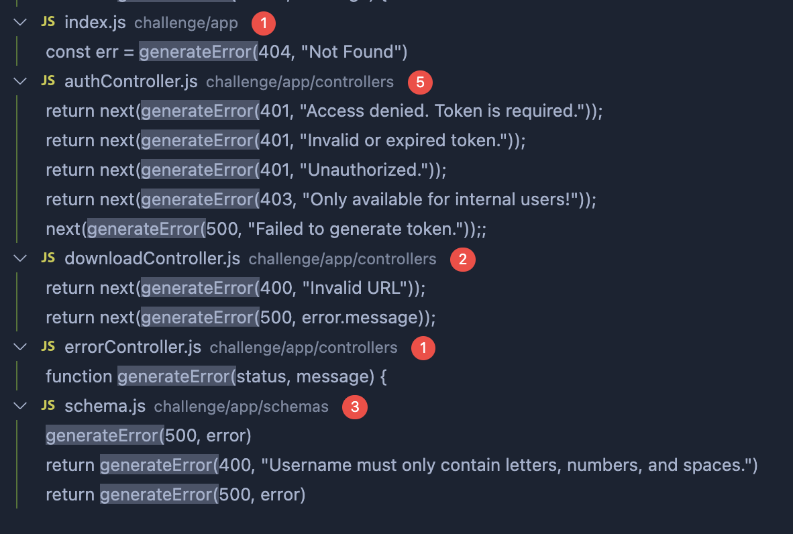

# Solution

## Finding the vulnerability

As we review the source code, we can found several vulnerability.
- Local File Read from PDF Generation
- JWT Token Forge Using `.env`
- SSRF from PDF Generation
- Potential SQL Injection from graphql `getDataByName`
- Potential Command Execution via Arbitrary Error Template Creation

If we can somehow bypass regex protection and perform sql injection, then we can write file into error template. However SQL Injection can only be used to write into "non-existent" file. This way we need to find for "non-existent" error template using LFR from PDF Generation. If we manage to write into non-existing template view, then we can perform code execution by using ssti-like payload.

If we try to enumerate for existing error template, we can found that template for `404` are missing.

Trying to get `400.ejs`, server respond with PDF file
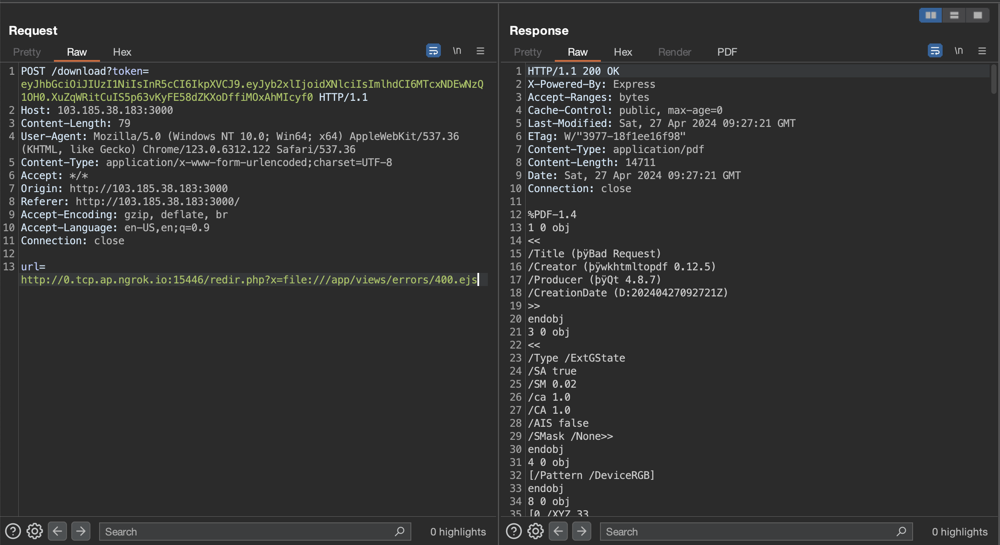

Trying to get `404.ejs`, server respond with `ContentNotFoundError`
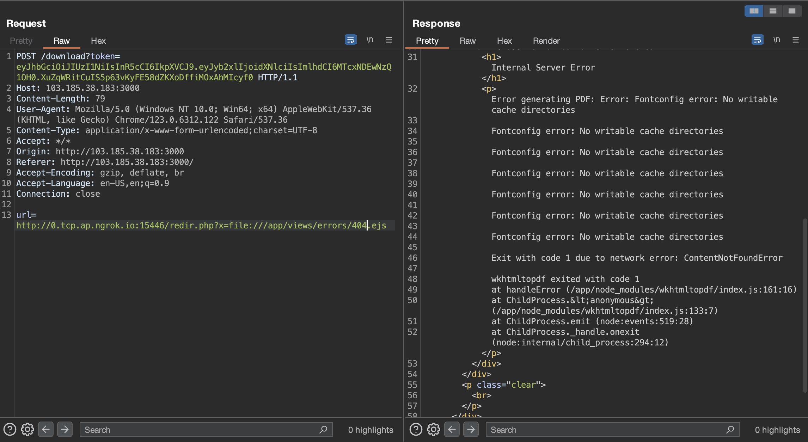

Now how can we obtain SQL Injection to write file into `404.ejs`? 

If we try to analyze the regex, we can found that it will search for the character provided "except" for line termination. So any character after line termination "\n" are ignored.
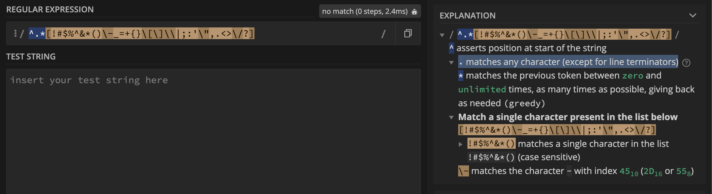

Basic payload
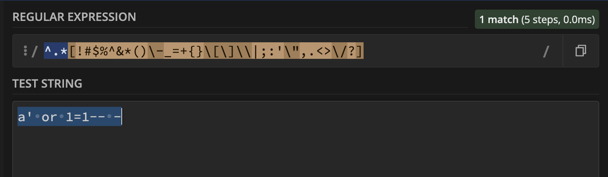

Payload with newline character
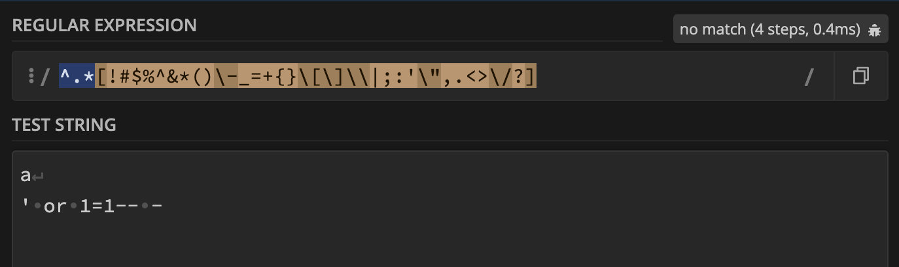

Now we need to create admin token to accessing /graphql endpoint. This can be done by getting secret key from `/app/.env` and change `role` value into `admin` using any tools.

For example, here's the way if using jwt.io site
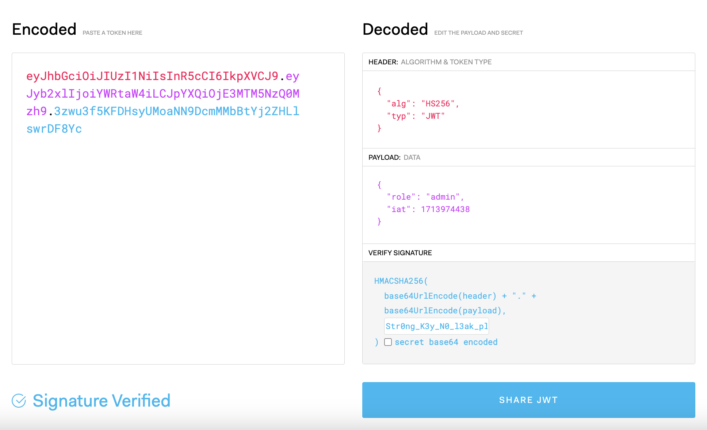

Now after we found all required exploit, we can chain them together to gaining code execution on the system.

## Exploitation

### Attack Chain

To obtain code execution on the server, we need the following step:
- Forge admin JWT Token
- SQL Injection -> File Write
- Write into `/app/views/errors/404.ejs`
- Access non-existent routes
- Got code execution!
