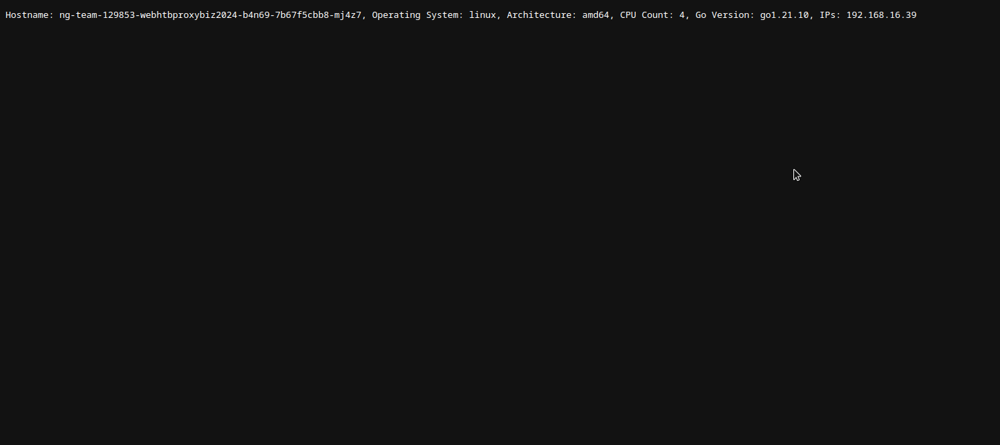
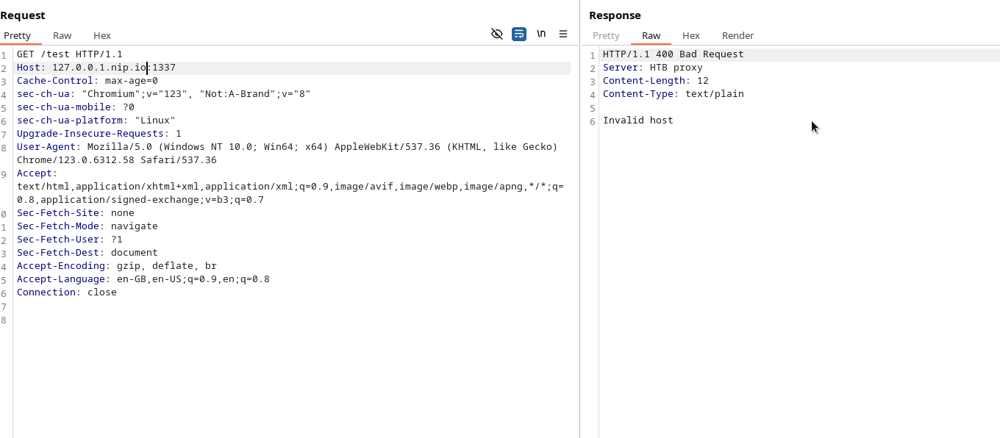
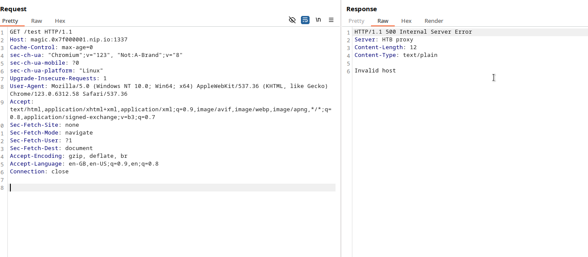
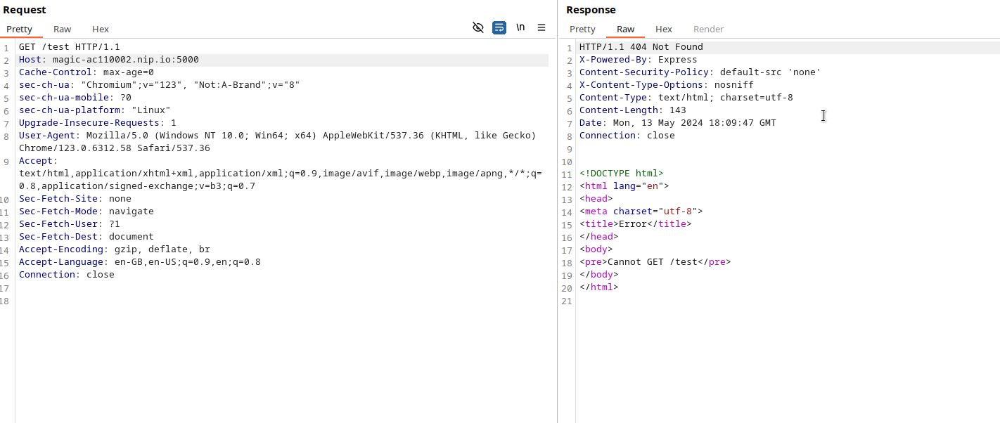
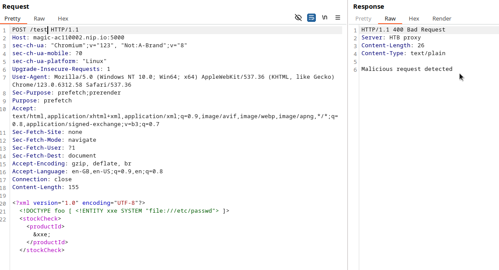
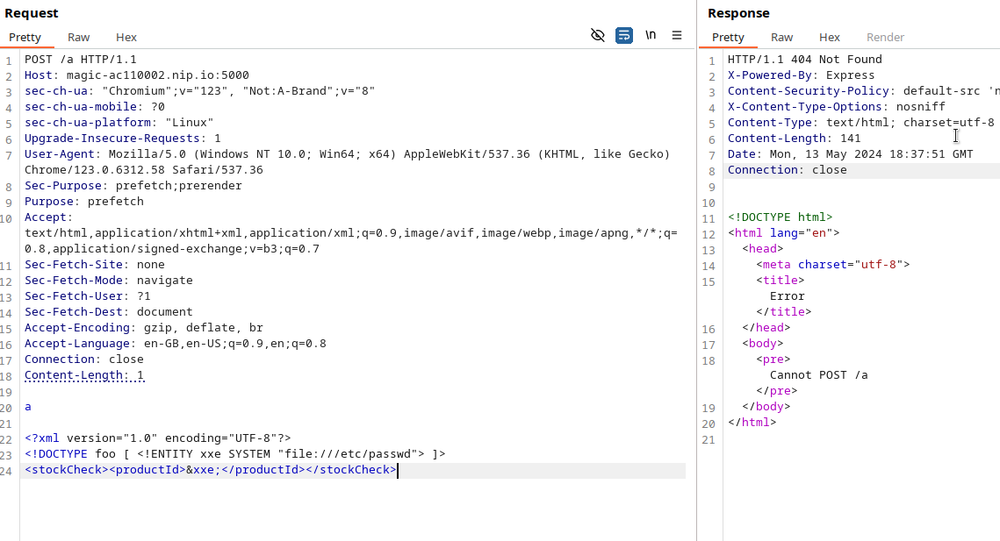
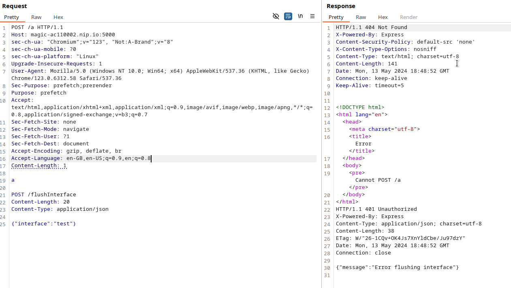
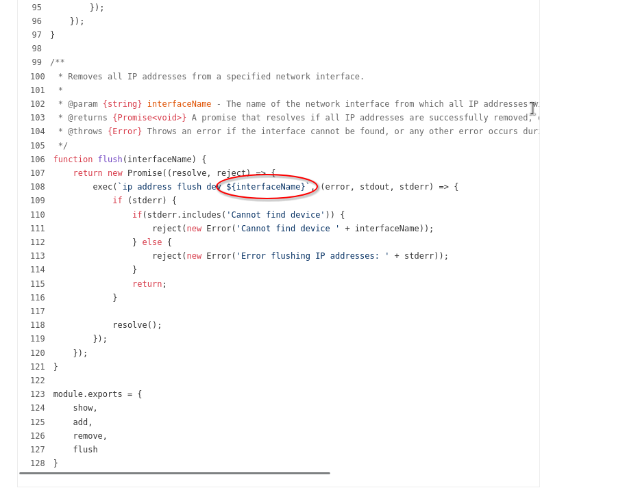
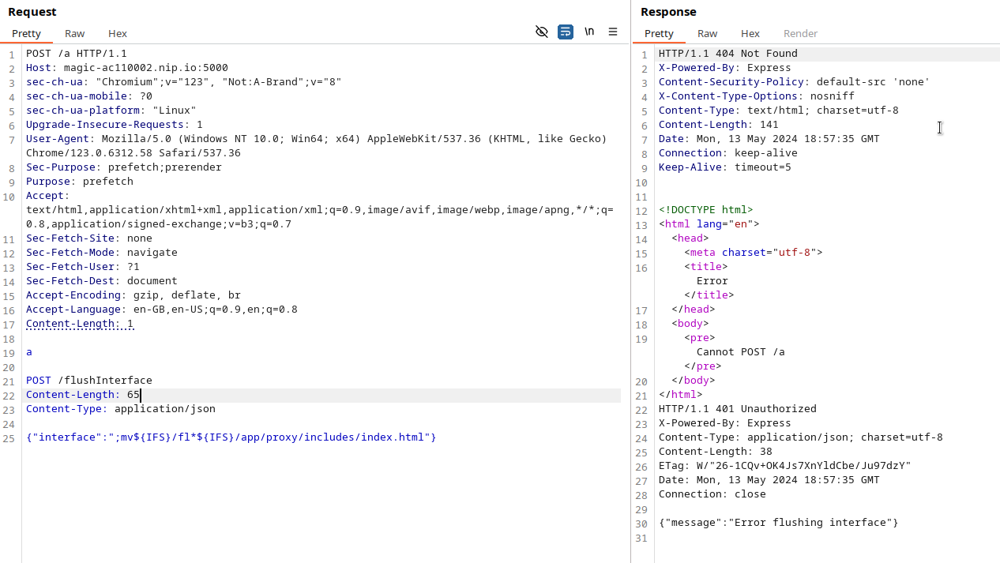

        <font size="10">HTB Proxy</font>

15<sup>th</sup> April 2024 / D24.xx.xx

​Prepared By: Lean

​Challenge Author(s): Lean

​Difficulty: <font color="green">Easy</font>

​Classification: Official

# [Synopsis](#synopsis)

- DNS re-binding => HTTP smuggling on custom HTTP reverse-proxy => command injection 0day on ip-wrapper library.

## Description

* Your team is tasked to penetrate the internal networks of an abandoned army base where raiders have settled in, with goal to acquire nitroglycerin. Scanning their ip ranges revealed only one alive host running their own custom implementation of an HTTP proxy, have you got enough wit to get the job done?

## Skills Required

- Good understanding of HTTP and TCP.
- Understanding of DNS.
- Understanding of reverse proxies.
- Unbderstanding of command injections.

## Skills Learned

- Abusing DNS re-binding to bypass localhost checks.
- Causing HTTP smuggling by abusing flawed http parsers.
- Discorvering and exploiting space ommited command injections. 

## Application Overview


By visting `/` we see a message informing us that a reverse proxy is running.



Visiting `/server-stats`, gives us some basic info about the machine.

### Code audit

Let's have a look at the `Dockerfile`.

```Dockerfile
# Start from the base Alpine image
FROM alpine:3.19.1

# Install Golang, Node.js, and Supervisor
RUN apk add --no-cache \
    go \
    nodejs \
    npm \
    supervisor \
    && npm install -g npm@latest

COPY flag.txt /flag.txt

# Set a working directory 
WORKDIR /app/proxy

COPY challenge /app

# Compile proxy
RUN go build -o htbproxy main.go

WORKDIR /app/backend

# Install npm dependencies
RUN npm install

# Setup supervisor
COPY config/supervisord.conf /etc/supervisord.conf

# Expose port the server is reachable on
EXPOSE 1337

# Create database and start supervisord
COPY --chown=root entrypoint.sh /entrypoint.sh
RUN chmod +x /entrypoint.sh
ENTRYPOINT ["/entrypoint.sh"]
```

An alpine image is used, `golang`, `nodejs`, `npm` and `supervisor` are installed. Then the flag is copied to the root and the golang app is compiled. Nodejs dependencies are installed and `entrypoint.sh` is called.

```sh
#!/bin/sh

# Change flag name
mv /flag.txt /flag$(cat /dev/urandom | tr -cd "a-f0-9" | head -c 10).txt

# Secure entrypoint
chmod 600 /entrypoint.sh

# Start application
/usr/bin/supervisord -c /etc/supervisord.conf
```

There random characters are added to the flag filename, the entrypoint is secured and supervisor is started.

```
[supervisord]
user=root
nodaemon=true
logfile=/dev/null
logfile_maxbytes=0
pidfile=/run/supervisord.pid

[program:proxy]
command=/app/proxy/htbproxy
stdout_logfile=/dev/stdout
stdout_logfile_maxbytes=0
stderr_logfile=/dev/stderr
stderr_logfile_maxbytes=0

[program:backend]
command=node /app/backend/index.js
stdout_logfile=/dev/stdout
stdout_logfile_maxbytes=0
stderr_logfile=/dev/stderr
stderr_logfile_maxbytes=0
```

On `config/supervisord.conf` we can see that both of the challenge's apps are started.

Lte's have a look at the `golang` app first (`challenge/proxy/main.go`), we start from the `main` function and keep going up.

```go
func main() {
	var serverPort string = "1337"
	var version string = "1.0.0"
	logHeader(version)

	ln, err := net.Listen("tcp", ":"+serverPort)
	if err != nil {
		prettyLog(2, "Error listening: "+err.Error())
		return
	}

	defer ln.Close()
	prettyLog(1, "HTB proxy listening on :"+serverPort)

	for {
		conn, err := ln.Accept()
		if err != nil {
			prettyLog(2, "Error accepting: "+err.Error())
			continue
		}

		go handleRequest(conn)
	}
}
```

It serves as the main entry point of the program. It initializes the server, starts listening for incoming connections on port 1337, and delegates connection handling to concurrent calls of the `handleRequest` function. Let's examine it.

```go
func handleRequest(frontendConn net.Conn) {
	buffer := make([]byte, 1024)

	length, err := frontendConn.Read(buffer)
	var remoteAddr string = frontendConn.RemoteAddr().String()

	prettyLog(1, "Connection from: "+remoteAddr)

	if err != nil {
		prettyLog(2, "Error reading: "+err.Error())
		frontendConn.Close()
		return
	}
```

A buffer is allocated for reading data from the client connection.

```go
request, err := requestParser(buffer[:length], frontendConn.RemoteAddr().String())
if err != nil {
	responseText := badReqResponse(err.Error())
	frontendConn.Write([]byte(responseText))
	frontendConn.Close()
	return
}
```

Attempts to parse the request from the read bytes.

```go
if request.Protocol != HTTPVersions.HTTP1_1 {
	responseText := notSupportedResponse("Protocol version not supported")
	frontendConn.Write([]byte(responseText))
	frontendConn.Close()
	return
}
```

Checks if the protocol version (HTTP/1.1) is supported.

```go
if request.URL == string([]byte{47}) {
    var responseText string = htmlResponse("/app/proxy/includes/index.html")
    frontendConn.Write([]byte(responseText))
    frontendConn.Close()
    return
}

if request.URL == string([]byte{47, 115, 101, 114, 118, 101, 114, 45, 115, 116, 97, 116, 117, 115}) {
    var serverInfo string = GetServerInfo()
    var responseText string = okResponse(serverInfo)
    frontendConn.Write([]byte(responseText))
    frontendConn.Close()
    return
}
```

Handles special URL endpoints `/` and `/server-status`.

```go
hostArray := strings.Split(host, ":")
if len(hostArray) != 2 || hostArray[1] == "" {
	responseText := badReqResponse("Invalid host")
	frontendConn.Write([]byte(responseText))
	frontendConn.Close()
	return
}

hostPort := hostArray[1]
inRange, err := isDigitInRange(hostPort, 1, 65535)
if err != nil || !inRange {
	responseText := badReqResponse("Invalid port")
	frontendConn.Write([]byte(responseText))
	frontendConn.Close()
	return
}
```

Validation of host header and port number.

```go
isLocal, err := checkIfLocalhost(hostAddress)
if err != nil || isLocal {
	responseText := movedPermResponse("/")
	frontendConn.Write([]byte(responseText))
	frontendConn.Close()
	return
}
```

Verifies if the host address is local.

```go
isMalicious, err := checkMaliciousBody(request.Body)
if err != nil || isMalicious {
	responseText := badReqResponse("Malicious request detected")
	prettyLog(1, "Malicious request detected")
	frontendConn.Write([]byte(responseText))
	frontendConn.Close()
	return
}
```

Checks request body for malicious content.

```go
backendConn, err := net.Dial("tcp", host)
if err != nil {
	responseText := errorResponse("Could not connect to backend server")
	frontendConn.Write([]byte(responseText))
	frontendConn.Close()
	return
}

_, err = backendConn.Write(requestBytes)
if err != nil {
	responseText := errorResponse("Error sending request to backend")
	frontendConn.Write([]byte(responseText))
	frontendConn.Close()
	backendConn.Close()
	return
}

var backendResponse strings.Builder
scanner := bufio.NewScanner(backendConn)
while scanner.Scan() {
	line := scanner.Text()
	backendResponse.WriteString(line + "\n")
}

if err := scanner.Err(); err != nil {
	responseText := errorResponse("Error reading backend response")
	frontendConn.Write([]byte(responseText))
	frontendConn.Close()
	backendConn.Close()
	return
}

prettyLog(1, "Forwarding request to: "+host)
var responseStr string = backendResponse.String()
frontendConn.Write([]byte(responseStr))
```

Establishes a connection to the backend server and forwards the original request bytes to the backend provided in the host header, then the response from the backend is read and returned.

```go
frontendConn.Close()
backendConn.Close()
```

Closing of both the frontend and backend connections.

```go
func GetServerInfo() string {
	hostname, err := os.Hostname()
	if err != nil {
		hostname = "unknown"
	}

	info := fmt.Sprintf("Hostname: %s, Operating System: %s, Architecture: %s, CPU Count: %d, Go Version: %s",
		hostname, runtime.GOOS, runtime.GOARCH, runtime.NumCPU(), runtime.Version())

	return info
}
```

Gathers and formats system and runtime information. The contents of this function are returned when accessing `/server-status`.

```go
func checkMaliciousBody(body string) (bool, error) {
	patterns := []string{
		"[`;&|]",
		`\$\([^)]+\)`,
		`(?i)(union)(.*)(select)`,
		`<script.*?>.*?</script>`,
		`\r\n|\r|\n`,
		`<!DOCTYPE.*?\[.*?<!ENTITY.*?>.*?>`,
	}

	for _, pattern := range patterns {
		match, _ := regexp.MatchString(pattern, body)
		if match {
			return true, nil
		}
	}
	return false, nil
}
```

Inspects the body of a request for patterns that might indicate an attack, such as SQL injection or XSS.

```go
func checkIfLocalhost(address string) (bool, error) {
	IPs, err := net.LookupIP(address)
	if err != nil {
		return false, err
	}

	for _, ip := range IPs {
		if ip.IsLoopback() {
			return true, nil
		}
	}

	return false, nil
}
```

Resolves a hostname to determine if it points to a loopback address.

```go
func isDigitInRange(s string, min int, max int) (bool, error) {
	num, err := strconv.Atoi(s)
	if err != nil {
		return false, err
	}
	return num >= min && num <= max, nil
}
```

Checks if a numeric string falls within a specified range.

```go
func isDomain(input string) bool {
	var domainPattern string = `^[a-zA-Z0-9-]+(\.[a-zA-Z0-9-]+)*(\.[a-zA-Z]{2,})$`
	match, _ := regexp.MatchString(domainPattern, input)
	return match && !blacklistCheck(input)
}
```

Confirms if a string qualifies as a valid domain name, not included in the blacklist. It ensures that hostnames are appropriately formatted.

```go
func isIPv4(input string) bool {
	if strings.Contains(input, string([]byte{48, 120})) {
		return false
	}
	var ipv4Pattern string = `^(?:25[0-5]|2[0-4][0-9]|[01]?[0-9][0-9]?)\.(?:25[0-5]|2[0-4][0-9]|[01]?[0-9][0-9]?)\.(?:25[0-5]|2[0-4][0-9]|[01]?[0-9][0-9]?)\.(?:25[0-5]|2[0-4][0-9]|[01]?[0-9][0-9]?)$`
	match, _ := regexp.MatchString(ipv4Pattern, input)
	return match && !blacklistCheck(input)
}
```

Validates whether a string represents a valid IPv4 address, excluding those that are part of a predefined blacklist.

```go
func blacklistCheck(input string) bool {
	var match bool = strings.Contains(input, string([]byte{108, 111, 99, 97, 108, 104, 111, 115, 116})) || // localhost
		strings.Contains(input, string([]byte{48, 46, 48, 46, 48, 46, 48})) || // 0.0.0.0
		strings.Contains(input, string([]byte{49, 50, 55, 46})) || // 127.
		strings.Contains(input, string([]byte{49, 55, 50, 46})) || // 172.
		strings.Contains(input, string([]byte{49, 57, 50, 46})) || // 192.
		strings.Contains(input, string([]byte{49, 48, 46})) // 10.

	return match
}
```

Checks if the input string contains any substrings that are typically associated with internal network resources.

```go
func errorResponse(statusMessage string) string {
	var response HTTPResponse = HTTPResponse{
		Protocol:      HTTPVersions.HTTP1_1,
		StatusCode:    HTTPStatusCodes.InternalServerError,
		StatusMessage: "Internal Server Error",
		Headers: map[string]string{
			"Content-Type": ContentTypes.TextPlain,
		},
		Body: statusMessage,
	}

	return responseBuilder(response)
}
```

Forms a HTTP 500 Internal Server Error response.

```go
func notSupportedResponse(statusMessage string) string {
	var response HTTPResponse = HTTPResponse{
		Protocol:      HTTPVersions.HTTP1_1,
		StatusCode:    HTTPStatusCodes.NotImplemented,
		StatusMessage: "Not Implemented",
		Headers: map[string]string{
			"Content-Type": ContentTypes.TextPlain,
		},
		Body: statusMessage,
	}

	return responseBuilder(response)
}
```

Produces a HTTP 501 Not Implemented response.

```go
func badReqResponse(statusMessage string) string {
	var response HTTPResponse = HTTPResponse{
		Protocol:      HTTPVersions.HTTP1_1,
		StatusCode:    HTTPStatusCodes.BadRequest,
		StatusMessage: "Bad Request",
		Headers: map[string]string{
			"Content-Type": ContentTypes.TextPlain,
		},
		Body: statusMessage,
	}

	return responseBuilder(response)
}
```

Creates a HTTP 400 Bad Request response.

```go
func movedPermResponse(redirectLocation string) string {
	var response HTTPResponse = HTTPResponse{
		Protocol:      HTTPVersions.HTTP1_1,
		StatusCode:    HTTPStatusCodes.MovedPermanently,
		StatusMessage: "Moved Permanently",
		Headers: map[string]string{
			"Location": redirectLocation,
		},
	}

	return responseBuilder(response)
}
```

Generates a HTTP 301 Moved Permanently response.

```go
func htmlResponse(filename string) string {
	var body string
	content, err := readFile(filename)

	if err != nil {
		body = "Error reading file"
	} else {
		body = content
	}

	var response HTTPResponse = HTTPResponse{
		Protocol:      HTTPVersions.HTTP1_1,
		StatusCode:    HTTPStatusCodes.OK,
		StatusMessage: "OK",
		Headers: map[string]string{
			"Content-Type": ContentTypes.TextHTML,
		},
		Body: body,
	}

	return responseBuilder(response)
}
```

Specifically tailored for serving HTML content, this function reads HTML from a specified file and wraps it in a standard HTTP response. If the file cannot be read, it returns an error message within the HTTP response.

```go
func okResponse(statusMessage string) string {
	var response HTTPResponse = HTTPResponse{
		Protocol:      HTTPVersions.HTTP1_1,
		StatusCode:    HTTPStatusCodes.OK,
		StatusMessage: "OK",
		Headers: map[string]string{
			"Content-Type": ContentTypes.TextPlain,
		},
		Body: statusMessage,
	}

	return responseBuilder(response)
}
```

Quickly generates a standard HTTP 200 OK response using a provided message as the body.

```go
func responseBuilder(response HTTPResponse) string {
	var statusLine string = fmt.Sprintf("%s %d %s\r\n", response.Protocol, response.StatusCode, response.StatusMessage)
	var headers string

	headers += "Server: HTB proxy\r\n"
	headers += fmt.Sprintf("Content-Length: %d\r\n", len(response.Body))
	for key, value := range response.Headers {
		headers += fmt.Sprintf("%s: %s\r\n", key, value)
	}

	return fmt.Sprintf("%s%s\r\n%s", statusLine, headers, response.Body)
}
```

Constructs a full HTTP response string from an HTTPResponse struct. This includes forming the status line, appending all headers, and finally attaching the body.

```go
func requestParser(requestBytes []byte, remoteAddr string) (*HTTPRequest, error) {
	var requestLines []string = strings.Split(string(requestBytes), "\r\n")
	var bodySplit []string = strings.Split(string(requestBytes), "\r\n\r\n")
```

These lines convert the byte array requestBytes into a string and splits them into lines using `\r\n` as the delimiter. Each line represents a part of the HTTP request, such as the start line, headers, and potentially the beginning of the body.
The bodySplit var splits the HTTP request into headers and body by looking for the `\r\n\r\n` sequence, which separates the headers from the body in HTTP requests.

```go
if len(requestLines) < 1 {
    return nil, fmt.Errorf("invalid request format")
}
```

The function checks if there are any lines in the request at all. If there are none, it returns an error indicating an invalid request format.

```go
var requestLine []string = strings.Fields(requestLines[0])
if len(requestLine) != 3 {
    return nil, fmt.Errorf("invalid request line")
}
```

The first line of the request is expected to be the request line, which should contain three parts: the method, URL, and protocol, separated by spaces. This line parses those fields. If there are not exactly three parts, an error is returned.

```go
var request *HTTPRequest = &HTTPRequest{
    RemoteAddr: remoteAddr,
    Method:     requestLine[0],
    URL:        requestLine[1],
    Protocol:   requestLine[2],
    Headers:    make(map[string]string),
}
```

Initializes a new HTTPRequest struct, setting the method, URL, protocol, and remote address. It also initializes an empty map to store header fields.

```go
for _, line := range requestLines[1:] {
    if line == "" {
        break
    }

    headerParts := strings.SplitN(line, ": ", 2)
    if len(headerParts) != 2 {
        continue
    }

    request.Headers[headerParts[0]] = headerParts[1]
}
```

This loop goes through each line after the request line, assuming these lines are headers until an empty line is encountered, signaling the end of headers. Each header line is split into a key and a value, which are then added to the Headers map of the HTTPRequest struct.

```go
if request.Method == HTTPMethods.POST {
	contentLength, contentLengthExists := request.Headers["Content-Length"]
	if !contentLengthExists {
		return nil, fmt.Errorf("unknown content length for body")
	}

	contentLengthInt, err := strconv.Atoi(contentLength)
	if err != nil {
		return nil, fmt.Errorf("invalid content length")
	}

	if len(bodySplit) <= 1 {
		return nil, fmt.Errorf("invalid content length")
	}

	var bodyContent string = bodySplit[1]
	if len(bodyContent) != contentLengthInt {
		return nil, fmt.Errorf("invalid content length")
	}

	request.Body = bodyContent[0:contentLengthInt]
	return request, nil
}

if len(bodySplit) > 1 && bodySplit[1] != "" {
	return nil, fmt.Errorf("can't include body for non-POST requests")
}

return request, nil
```

If the method is POST, the function checks for a Content-Length header, parses its value, and validates that the body's length matches the declared content length. The body is then set in the HTTPRequest struct.

If the method is not POST and there is a body present, the function returns an error stating that a body is not allowed for non-POST requests.

If all checks and parsing succeed, the function returns the populated HTTPRequest object.

These are all functions that are relevant to the functionality of the proxy. Now let's have a look at the backend.

```js
const ipWrapper = require("ip-wrapper");
const express = require("express");

const app = express();
app.use(express.json());

const validateInput = (req, res, next) => {
    const { interface } = req.body;

    if (
        !interface || 
        typeof interface !== "string" || 
        interface.trim() === "" || 
        interface.includes(" ")
    ) {
        return res.status(400).json({message: "A valid interface is required"});
    }

    next();
}

app.post("/getAddresses", async (req, res) => {
    try {
        const addr = await ipWrapper.addr.show();
        res.json(addr);
    } catch (err) {
        res.status(401).json({message: "Error getting addresses"});
    }
});

app.post("/flushInterface", validateInput, async (req, res) => {
    const { interface } = req.body;

    try {
        const addr = await ipWrapper.addr.flush(interface);
        res.json(addr);
    } catch (err) {
        res.status(401).json({message: "Error flushing interface"});
    }
});

app.listen(5000, () => {
    console.log("Network utils API is up on :5000");
});
```

It is a relatively simple express.js application with only 2 routes, `/getAddresses` and `/flushInterface`.

`/getAddresses` uses the `ip-wrapper` library to return results from the `ip` command and show the current address the server holds.

`/flushInterface` simply calls the `flush` function from `ip-wrapper`.

### Summary 

The challenge is composed of 2 applications inside the container, an HTTP proxy written in `golang` that acts as a reverse proxy and one written in `nodejs` that sits on the internal network without being exposed that acts as a network utils API.

The proxy takes all HTTP requests and forwards them to a backend specified on the `Host` header, and then returns the response. But it has strong protection to prevent users from reaching local addresses, it also features 2 predefined routes `/` and `/server-status`. 

### Exploitation

There is no initial hint at what must be done for the solution so we can assume that the first goal is to bypass the local address protections in order to reach the internal docker network.

```go
var hostAddress string = hostArray[0]
var isIPv4Addr bool = isIPv4(hostAddress)
var isDomainAddr bool = isDomain(hostAddress)

if !isIPv4Addr && !isDomainAddr {
	var responseText string = badReqResponse("Invalid host")
	frontendConn.Write([]byte(responseText))
	frontendConn.Close()
	return
}

isLocal, err := checkIfLocalhost(hostAddress)
if err != nil {
	var responseText string = errorResponse("Invalid host")
	frontendConn.Write([]byte(responseText))
	frontendConn.Close()
	return
}

if isLocal {
	var responseText string = movedPermResponse("/")
	frontendConn.Write([]byte(responseText))
	frontendConn.Close()
	return
}

isMalicious, err := checkMaliciousBody(request.Body)
if err != nil || isMalicious {
	var responseText string = badReqResponse("Malicious request detected")
	prettyLog(1, "Malicious request detected")
	frontendConn.Write([]byte(responseText))
	frontendConn.Close()
	return
}
```

This is where the address validation happens, first we check if the address is an ipv4 or a domain using the `isIPv4` and `isDomain` functions.

```go
func isIPv4(input string) bool {
	if strings.Contains(input, string([]byte{48, 120})) {
		return false
	}
	var ipv4Pattern string = `^(?:25[0-5]|2[0-4][0-9]|[01]?[0-9][0-9]?)\.(?:25[0-5]|2[0-4][0-9]|[01]?[0-9][0-9]?)\.(?:25[0-5]|2[0-4][0-9]|[01]?[0-9][0-9]?)\.(?:25[0-5]|2[0-4][0-9]|[01]?[0-9][0-9]?)$`
	match, _ := regexp.MatchString(ipv4Pattern, input)
	return match && !blacklistCheck(input)
}
```

For ipv4 a strong regex is used, also the string `0x` (48, 120) is checked in order to avoid hexadecimal addresses even though this is bypassable, the following regex wouldn't allow an address containing these chars anyways.

```go
func isDomain(input string) bool {
	var domainPattern string = `^[a-zA-Z0-9-]+(\.[a-zA-Z0-9-]+)*(\.[a-zA-Z]{2,})$`
	match, _ := regexp.MatchString(domainPattern, input)
	return match && !blacklistCheck(input)
}
```

For the domain check again a strong regex is used. Also at the end of both of these functions `!blacklistCheck(input)` must be false.

```go
func blacklistCheck(input string) bool {
	var match bool = strings.Contains(input, string([]byte{108, 111, 99, 97, 108, 104, 111, 115, 116})) || // localhost
		strings.Contains(input, string([]byte{48, 46, 48, 46, 48, 46, 48})) || // 0.0.0.0
		strings.Contains(input, string([]byte{49, 50, 55, 46})) || // 127.
		strings.Contains(input, string([]byte{49, 55, 50, 46})) || // 172.
		strings.Contains(input, string([]byte{49, 57, 50, 46})) || // 192.
		strings.Contains(input, string([]byte{49, 48, 46})) // 10.

	return match
}
```

This function checks if the provided string contains private ip ranges.

After these checks we validate if the ip is local using `checkIfLocalhost`.

```go
func checkIfLocalhost(address string) (bool, error) {
	IPs, err := net.LookupIP(address)
	if err != nil {
		return false, err
	}

	for _, ip := range IPs {
		if ip.IsLoopback() {
			return true, nil
		}
	}

	return false, nil
}
```

This function resolves a domain using DNS and checks if the resolved ip belongs to the loopback ranges. If the provided ip is local then we get redirected to `/`, otherwise the `checkMaliciousBody` is called on it.

```go
func checkMaliciousBody(body string) (bool, error) {
	patterns := []string{
		"[`;&|]",
		`\$\([^)]+\)`,
		`(?i)(union)(.*)(select)`,
		`<script.*?>.*?</script>`,
		`\r\n|\r|\n`,
		`<!DOCTYPE.*?\[.*?<!ENTITY.*?>.*?>`,
	}

	for _, pattern := range patterns {
		match, _ := regexp.MatchString(pattern, body)
		if match {
			return true, nil
		}
	}
	return false, nil
}
```

This function uses regex patterns to detect an array of vlunerabilities including crlf injection.

### Beating the localhost check with dns rebinding and docker internal ip's

At first sight there is a huge variety of ip format bypasses we can try out but these will not work due to the ipv4 regex.

Next technique that comes to mind is [DNS rebinding](https://unit42.paloaltonetworks.com/dns-rebinding/), but remember the `checkIfLocalhost` function?



Here we used [nip.io](https://nip.io/) to resolve back to localhost but since `127.0.0.1` is within the range `IsLoopback` checks for, our request is declined.

Actually we got `400` - `Invalid host`, so this means that our request was declined because our domain included `127.` tracing to the `blacklistCheck` function.



But even when encoding our ip within the rebinding domain our request is still declined due to `checkIfLocalhost`.

So we have to think of an address that points back to localhost without being part of the loopback range.


Looking at the stats page could give us a bit of inspiration, one of the infos being provided is the containers hostname, trying it out by itself will not work due to the ipv4 regex but what if we could resolve the same ip it does from the IPs field?

By playing a bit with [isLoopback](https://pkg.go.dev/net#IP.IsLoopback) we figure out that the subnet docker uses is not part of the loopback range.



Using the encoded domain `magic-ac110002.nip.io` to resolve back to `172.17.0.2` at port 5000 we get a response from express.js thus confriming our bypass.

### Smuggling malicious content

Now that we have access to the internal backend we can start pentesting the net utils API. But `checkMaliciousBody` is preventing us from sending payload characters.



Also we are not able to access `/flushInterface` on the backend due to a static check in `handleRequest`.

```go
if strings.Contains(strings.ToLower(request.URL), string([]byte{102, 108, 117, 115, 104, 105, 110, 116, 101, 114, 102, 97, 99, 101}) /* flushinterface */ ) {
	var responseText string = badReqResponse("Not Allowed")
	frontendConn.Write([]byte(responseText))
	frontendConn.Close()
	return
}
```

So we must somehow smuggle our request in a way that bypasses the checks.

### Error in request forwarding

There is a major error in the way requests are forwarded that someone might miss, there are multiple checks within `requestParser` that for POST requests check if the body is valid and reject requests with invalid body.

```go
if request.Method == HTTPMethods.POST {
	contentLength, contentLengthExists := request.Headers["Content-Length"]
	if !contentLengthExists {
		return nil, fmt.Errorf("unknown content length for body")
	}

	contentLengthInt, err := strconv.Atoi(contentLength)
	if err != nil {
		return nil, fmt.Errorf("invalid content length")
	}

	if len(bodySplit) <= 1 {
		return nil, fmt.Errorf("invalid content length")
	}

	var bodyContent string = bodySplit[1]
	if len(bodyContent) != contentLengthInt {
		return nil, fmt.Errorf("invalid content length")
	}

	request.Body = bodyContent[0:contentLengthInt]
	return request, nil
}
```

The part of the "body" that is checked is derived from the user-controlled `Content-Length` header.

```go
_, err = backendConn.Write(requestBytes)
if err != nil {
	var responseText string = errorResponse("Error sending request to backend")
	frontendConn.Write([]byte(responseText))
	frontendConn.Close()
	backendConn.Close()
	return
}
```

Back on `handleRequest` we can see that `requestBytes` after all the checks, but `requestBytes` is the original request sent, not the one that was parsed. So we send a request, it gets parsed and validated but then the original data is forwarded, not the parsed data.

This leaves room for an exploit abusing the `Content-Length` header, by providing `Content-Length` and setting it to `1` and then actually having only 1 byte in our body and then adding another double crlf `\r\n\r\n` request parser only takes the first byte as the request body, this means that `checkMaliciousBody` also checks only this part thus allowing us to smuggle malcious content into our request.



### Abusing express.js default keep-alive

Since express.js supports keep-alive requests by default we can include a whole request into our smuggled content.



### Command injection in ip-wrapper

Now we are able to test the one and only input for the backend service.

```js
app.post("/flushInterface", validateInput, async (req, res) => {
    const { interface } = req.body;

    try {
        const addr = await ipWrapper.addr.flush(interface);
        res.json(addr);
    } catch (err) {
        res.status(401).json({message: "Error flushing interface"});
    }
});
```

This endpoint is supposed to flush the interface provided if it exists, let's have a closer look at the library's source code.



We can clearly see it features an unsanitized call to the `ip` binary. We can abuse this by getting the contents of the flag and outputting them to `/app/proxy/includes/index.html` where the proxy's html file is stored, in order to read it. We use `${IFS}` because spaces are not allowed.



Now making a request to `/` will reveal the flag.